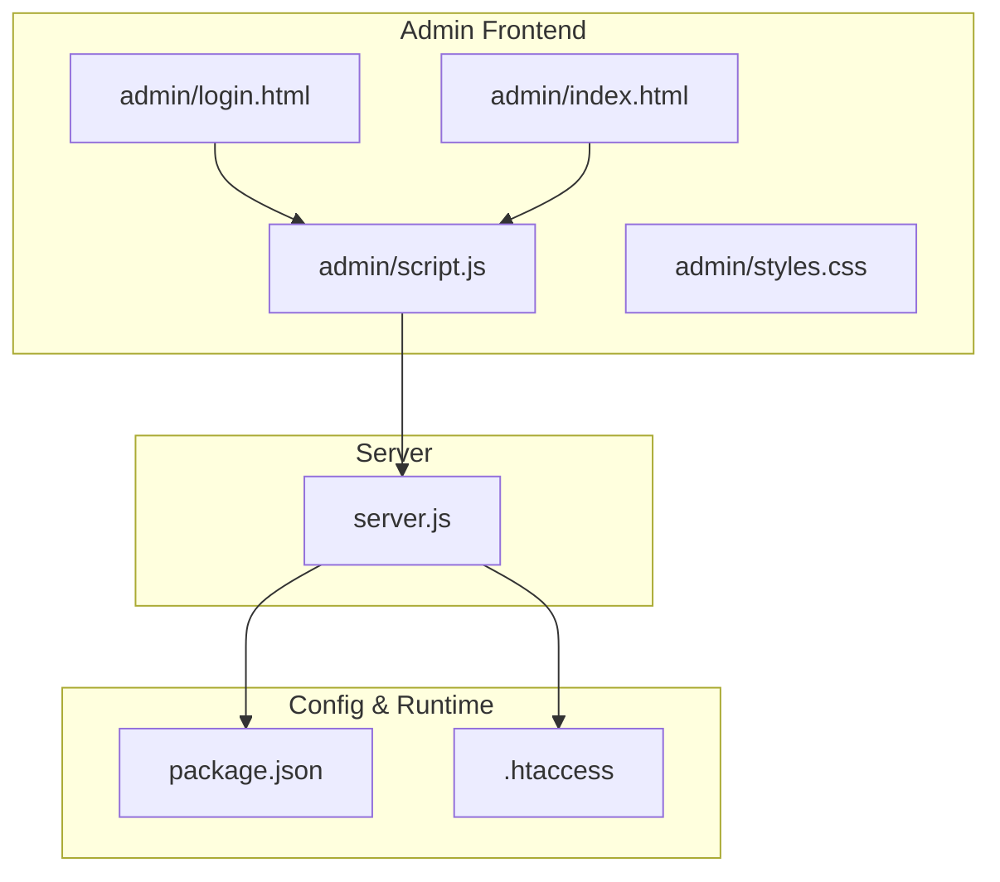
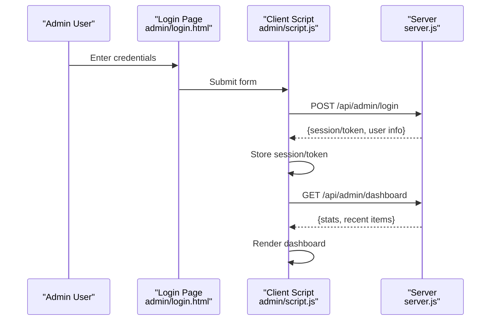
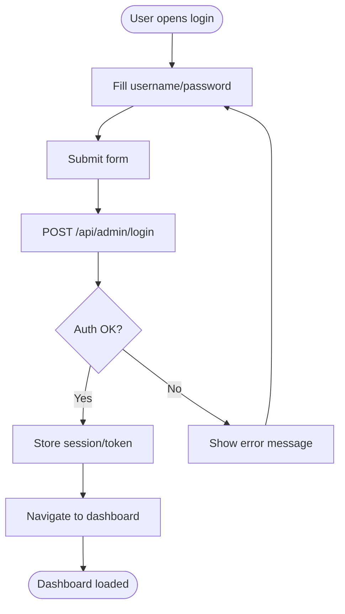
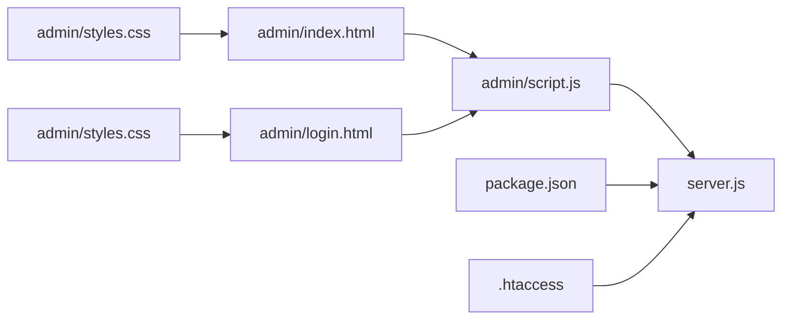

# Administrative Interface

<cite>
**Referenced Files in This Document**
- [admin/index.html](file://admin/index.html)
- [admin/login.html](file://admin/login.html)
- [admin/script.js](file://admin/script.js)
- [admin/styles.css](file://admin/styles.css)
- [server.js](file://server.js)
- [package.json](file://package.json)
- [.htaccess](file://.htaccess)
</cite>

## Table of Contents
1. [Introduction](#introduction)
2. [Project Structure](#project-structure)
3. [Core Components](#core-components)
4. [Architecture Overview](#architecture-overview)
5. [Detailed Component Analysis](#detailed-component-analysis)
6. [Dependency Analysis](#dependency-analysis)
7. [Performance Considerations](#performance-considerations)
8. [Troubleshooting Guide](#troubleshooting-guide)
9. [Conclusion](#conclusion)
10. [Appendices](#appendices)

## Introduction
This document describes the administrative dashboard and content management system, focusing on:
- Admin authentication flow and session handling
- Role-based access control (RBAC) concepts and permission enforcement
- Security practices for admin endpoints and client-side assets
- Content management features: course administration, user management tools, and dashboard analytics
- Admin interface components, form handling, data validation, and real-time updates
- User workflows, permission management, and best practices for content moderation

The documentation is designed to be accessible to both technical and non-technical readers while providing code-level traceability where applicable.

## Project Structure
The administrative interface is implemented as a static frontend under the admin directory with server-side logic in the root server file. Key files include:
- Admin UI pages: login and dashboard entry points
- Client-side script for UI interactions and API calls
- Styles for the admin layout
- Server-side routes and middleware for authentication and content operations
- Configuration and security directives

**Diagram sources**
- [admin/login.html](file://admin/login.html)
- [admin/index.html](file://admin/index.html)
- [admin/script.js](file://admin/script.js)
- [admin/styles.css](file://admin/styles.css)
- [server.js](file://server.js)
- [package.json](file://package.json)
- [.htaccess](file://.htaccess)

**Section sources**
- [admin/index.html](file://admin/index.html)
- [admin/login.html](file://admin/login.html)
- [admin/script.js](file://admin/script.js)
- [admin/styles.css](file://admin/styles.css)
- [server.js](file://server.js)
- [package.json](file://package.json)
- [.htaccess](file://.htaccess)

## Core Components
- Admin Login Page: Presents credentials input and triggers authentication via the server.
- Admin Dashboard Entry: Protected page that renders after successful authentication.
- Client Script: Handles form submission, error display, navigation guards, and API calls for content and user management.
- Server Routes: Implements authentication, authorization, CRUD endpoints for courses and users, and analytics aggregation.
- Security Directives: HTTP headers and access controls configured at the server or web server layer.

Key responsibilities:
- Authentication: Validate credentials and establish a session or token.
- Authorization: Enforce role-based permissions for protected actions.
- Content Management: Create, update, delete, and list courses and users.
- Analytics: Aggregate and present usage metrics and performance indicators.

**Section sources**
- [admin/login.html](file://admin/login.html)
- [admin/index.html](file://admin/index.html)
- [admin/script.js](file://admin/script.js)
- [server.js](file://server.js)

## Architecture Overview
The admin system follows a client-server architecture:
- The browser loads admin HTML/CSS/JS.
- The client script sends authenticated requests to server endpoints.
- The server validates sessions/tokens, enforces roles, and returns JSON responses.
- The dashboard dynamically updates based on server responses.

**Diagram sources**
- [admin/login.html](file://admin/login.html)
- [admin/script.js](file://admin/script.js)
- [server.js](file://server.js)

## Detailed Component Analysis

### Admin Authentication Flow
- Credential submission occurs from the login page.
- The client script posts credentials to the server’s admin login endpoint.
- On success, the server issues a session or token; the client stores it securely.
- Subsequent requests include the session/token for authorization checks.
- The dashboard route is guarded; unauthenticated users are redirected to login.

**Diagram sources**
- [admin/login.html](file://admin/login.html)
- [admin/script.js](file://admin/script.js)
- [server.js](file://server.js)

**Section sources**
- [admin/login.html](file://admin/login.html)
- [admin/script.js](file://admin/script.js)
- [server.js](file://server.js)

### Role-Based Access Control (RBAC)
- Roles define what an admin can do (e.g., view-only vs. full editor).
- Middleware checks the current user’s role before allowing access to protected endpoints.
- UI elements can be conditionally shown/hidden based on the user’s role.
- Permission checks should occur both on the client (for UX) and server (for security).

Best practices:
- Centralize role definitions and policy checks on the server.
- Use least privilege by default.
- Log authorization decisions for auditability.

**Section sources**
- [server.js](file://server.js)
- [admin/script.js](file://admin/script.js)

### Session Management
- Sessions or tokens are issued upon successful login.
- Secure storage strategies include httpOnly cookies or secure storage mechanisms.
- Tokens should have short lifetimes and refresh flows if needed.
- Logout clears stored credentials and invalidates server-side sessions.

Security considerations:
- Prevent XSS by sanitizing outputs and avoiding storing sensitive data in localStorage.
- Use HTTPS everywhere.
- Set appropriate cookie flags (secure, sameSite) when using cookies.

**Section sources**
- [admin/script.js](file://admin/script.js)
- [server.js](file://server.js)

### Security Practices
- Input validation and output encoding on both client and server.
- CSRF protection for state-changing requests.
- Rate limiting on authentication endpoints.
- Strong password policies and account lockout after repeated failures.
- Restrict admin paths via server configuration or web server rules.

Configuration hints:
- Use .htaccess or server middleware to enforce HTTPS and restrict access to admin directories.
- Configure CORS only for trusted origins.

**Section sources**
- [.htaccess](file://.htaccess)
- [server.js](file://server.js)

### Content Management Features

#### Course Administration
- Create, edit, publish/unpublish, and delete courses.
- Manage metadata such as title, description, level, tags, and media.
- Versioning or draft states can help moderate changes before publishing.

Typical workflow:
- Open course editor from dashboard.
- Save drafts periodically.
- Publish after review.

**Section sources**
- [admin/index.html](file://admin/index.html)
- [admin/script.js](file://admin/script.js)
- [server.js](file://server.js)

#### User Management Tools
- View, search, and filter users.
- Update roles and status (active, suspended).
- Reset passwords and manage preferences.
- Audit logs for user actions.

**Section sources**
- [admin/index.html](file://admin/index.html)
- [admin/script.js](file://admin/script.js)
- [server.js](file://server.js)

#### Dashboard Analytics
- Display key metrics: active users, course enrollments, engagement trends.
- Provide filters by date range and category.
- Export reports when necessary.

**Section sources**
- [admin/index.html](file://admin/index.html)
- [admin/script.js](file://admin/script.js)
- [server.js](file://server.js)

### Admin Interface Components
- Layout and navigation: sidebar, top bar, breadcrumbs.
- Data tables: sortable, searchable, paginated lists for courses and users.
- Forms: create/edit dialogs with inline validation and feedback.
- Notifications: success/error toasts and alerts.
- Media manager: upload, preview, and replace images/videos.

Styling and responsiveness are handled via the admin stylesheet.

**Section sources**
- [admin/index.html](file://admin/index.html)
- [admin/styles.css](file://admin/styles.css)

### Form Handling and Data Validation
- Client-side validation provides immediate feedback.
- Server-side validation ensures integrity and security.
- Normalize inputs and sanitize outputs to prevent injection.
- Debounce heavy operations like search and save.

Error handling patterns:
- Show user-friendly messages.
- Persist partial progress safely.
- Retry transient network errors.

**Section sources**
- [admin/script.js](file://admin/script.js)
- [server.js](file://server.js)

### Real-Time Updates
- Optional polling or WebSocket integration to reflect changes without reloads.
- Optimistic UI updates with rollback on failure.
- Conflict resolution strategies for concurrent edits.

Implementation guidance:
- Use event-driven updates for critical actions (publish, role change).
- Throttle notifications to avoid UI spam.

**Section sources**
- [admin/script.js](file://admin/script.js)
- [server.js](file://server.js)

### User Workflow Examples
- New admin onboarding:
  - Receive invite link.
  - Set strong password.
  - Complete profile and accept terms.
- Moderating content:
  - Review flagged items.
  - Approve/reject with comments.
  - Notify creators of decisions.
- Publishing a course:
  - Draft creation.
  - Internal review.
  - Publish and notify subscribers.

[No sources needed since this section doesn't analyze specific files]

### Permission Management
- Define roles and permissions centrally.
- Apply policies at route and resource levels.
- Surface permissions in the UI to hide/disable unauthorized actions.
- Maintain an audit trail for all permission changes.

**Section sources**
- [server.js](file://server.js)
- [admin/script.js](file://admin/script.js)

### Best Practices for Content Moderation
- Require dual approval for high-impact changes.
- Maintain version history and revert capabilities.
- Tag and queue suspicious content for review.
- Provide clear guidelines and templates for editors.
- Regularly rotate access and review permissions.

[No sources needed since this section doesn't analyze specific files]

## Dependency Analysis
The admin frontend depends on the server for all stateful operations. The server relies on runtime dependencies declared in the package manifest and may use web server directives for security hardening.

**Diagram sources**
- [admin/script.js](file://admin/script.js)
- [admin/index.html](file://admin/index.html)
- [admin/login.html](file://admin/login.html)
- [admin/styles.css](file://admin/styles.css)
- [server.js](file://server.js)
- [package.json](file://package.json)
- [.htaccess](file://.htaccess)

**Section sources**
- [package.json](file://package.json)
- [server.js](file://server.js)
- [.htaccess](file://.htaccess)

## Performance Considerations
- Minimize payload sizes for dashboard data; paginate and filter aggressively.
- Cache read-heavy endpoints with appropriate cache-control headers.
- Defer non-critical scripts and styles.
- Use efficient selectors and virtualization for large tables.
- Monitor server response times and optimize database queries.

[No sources needed since this section provides general guidance]

## Troubleshooting Guide
Common issues and resolutions:
- Authentication failures:
  - Verify credentials and account status.
  - Check rate limiting and lockout policies.
  - Inspect network logs for 401/403 responses.
- Session expiration:
  - Ensure token refresh or re-login flow works.
  - Confirm secure cookie settings and domain/path scoping.
- Unauthorized access:
  - Validate RBAC middleware and role assignments.
  - Review CORS and CSRF configurations.
- Form validation errors:
  - Compare client and server validation rules.
  - Normalize inputs consistently.
- Real-time not updating:
  - Check WebSocket connections or polling intervals.
  - Inspect error boundaries and retry logic.

**Section sources**
- [admin/script.js](file://admin/script.js)
- [server.js](file://server.js)

## Conclusion
The administrative interface provides a secure, role-aware platform for managing courses, users, and analytics. By enforcing robust authentication, RBAC, and security practices, and by implementing responsive forms with reliable validation and optional real-time updates, the system supports efficient content moderation and operational oversight. Continuous monitoring, auditing, and adherence to least-privilege principles will further strengthen the platform’s reliability and safety.

[No sources needed since this section summarizes without analyzing specific files]

## Appendices

### API Reference Summary
- Authentication
  - POST /api/admin/login: Authenticate admin and return session/token.
- Dashboard
  - GET /api/admin/dashboard: Return aggregated stats and recent activity.
- Courses
  - GET /api/admin/courses: List courses with filters.
  - POST /api/admin/courses: Create a new course.
  - PUT /api/admin/courses/:id: Update an existing course.
  - DELETE /api/admin/courses/:id: Delete a course.
- Users
  - GET /api/admin/users: List users with filters.
  - PUT /api/admin/users/:id: Update user profile or role.
  - PATCH /api/admin/users/:id/status: Change user status.
- Analytics
  - GET /api/admin/analytics: Retrieve time-series metrics.

Notes:
- All protected endpoints require valid session/token and appropriate role.
- Responses follow consistent JSON structures with error codes and messages.

**Section sources**
- [server.js](file://server.js)