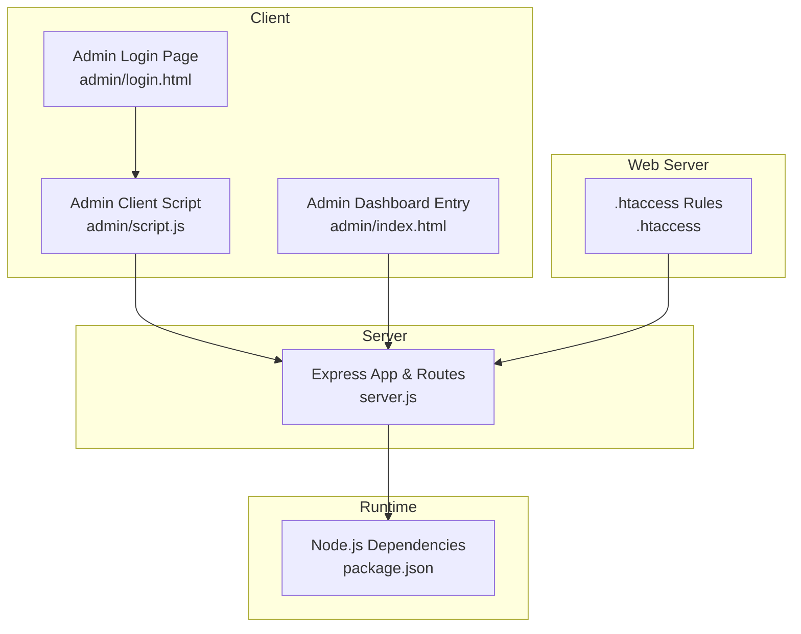
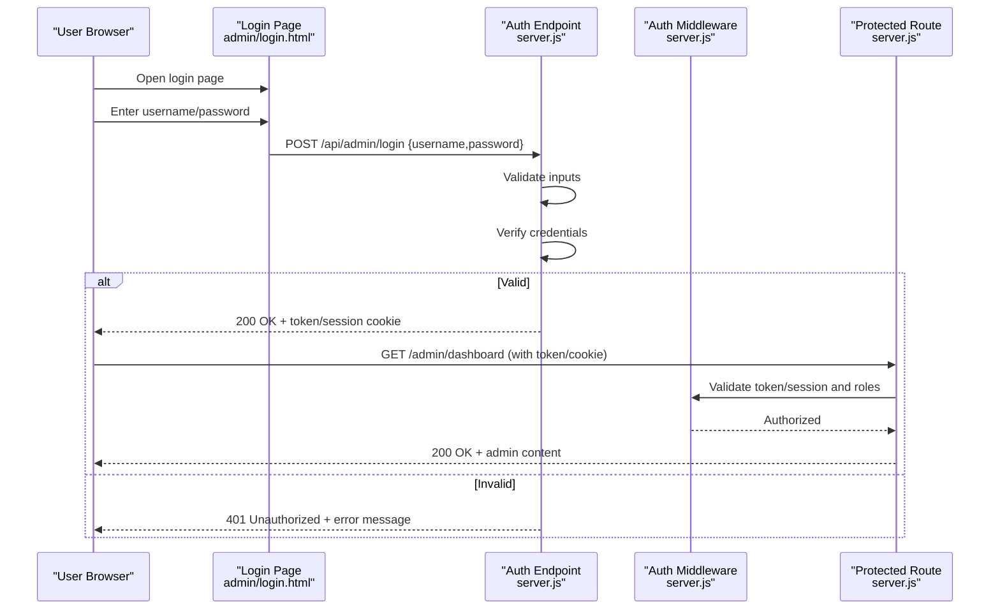
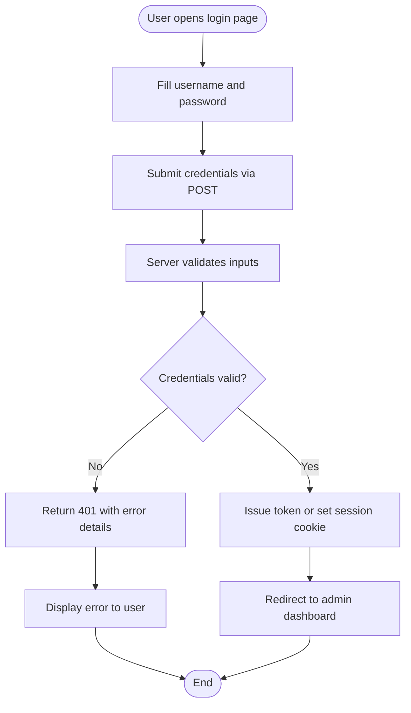
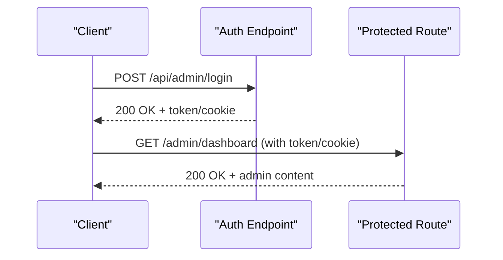
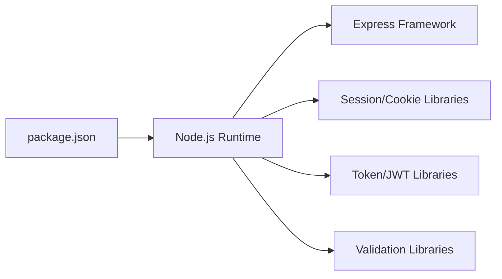

# Authentication & Security

<cite>
**Referenced Files in This Document**
- [server.js](file://server.js)
- [admin/login.html](file://admin/login.html)
- [admin/script.js](file://admin/script.js)
- [admin/index.html](file://admin/index.html)
- [.htaccess](file://.htaccess)
- [package.json](file://package.json)
</cite>

## Table of Contents
1. [Introduction](#introduction)
2. [Project Structure](#project-structure)
3. [Core Components](#core-components)
4. [Architecture Overview](#architecture-overview)
5. [Detailed Component Analysis](#detailed-component-analysis)
6. [Dependency Analysis](#dependency-analysis)
7. [Performance Considerations](#performance-considerations)
8. [Troubleshooting Guide](#troubleshooting-guide)
9. [Conclusion](#conclusion)

## Introduction
This document explains the admin authentication system, focusing on login flow, session management, password security practices, role-based access control (RBAC), middleware and token handling, input validation, CSRF protection, error handling for failed attempts, and best practices for admin user management. It is intended to help developers implement secure admin access patterns consistently across the application.

## Project Structure
The admin area consists of a small set of client-side assets and a server entry point that exposes endpoints for authentication and protected resources. The key files involved in authentication are:
- Server entry point with routes and middleware
- Admin login page and its client script
- Admin dashboard entry page
- Web server configuration for security headers and routing
- Package manifest listing runtime dependencies

**Diagram sources**
- [server.js](file://server.js)
- [admin/login.html](file://admin/login.html)
- [admin/script.js](file://admin/script.js)
- [admin/index.html](file://admin/index.html)
- [.htaccess](file://.htaccess)
- [package.json](file://package.json)

**Section sources**
- [server.js](file://server.js)
- [admin/login.html](file://admin/login.html)
- [admin/script.js](file://admin/script.js)
- [admin/index.html](file://admin/index.html)
- [.htaccess](file://.htaccess)
- [package.json](file://package.json)

## Core Components
- Authentication endpoint(s): Handles credential submission, validates inputs, verifies credentials, and issues an auth token or sets a session cookie.
- Protected route(s): Require valid credentials via middleware before serving admin content.
- Admin UI: Login form and client-side logic to submit credentials and handle responses.
- Middleware: Validates tokens/sessions, enforces RBAC, and applies security headers.
- Configuration: Environment variables for secrets, token expiry, and feature flags.

Security responsibilities include:
- Input validation and sanitization
- Secure password storage and verification
- Token issuance and rotation
- Session lifecycle management
- CSRF protection for state-changing requests
- Rate limiting and lockout policies
- Security headers and HTTPS enforcement

[No sources needed since this section provides general guidance]

## Architecture Overview
The admin authentication architecture follows a standard pattern:
- The browser submits credentials to a server endpoint.
- The server validates inputs, checks credentials, and returns a token or sets a session cookie.
- Subsequent requests include the token/cookie; middleware validates them and enforces roles.
- Protected admin pages are served only when authenticated and authorized.

**Diagram sources**
- [admin/login.html](file://admin/login.html)
- [admin/script.js](file://admin/script.js)
- [server.js](file://server.js)

## Detailed Component Analysis

### Login Flow Implementation
- The login page presents a form for username and password.
- The client script sends a POST request to the authentication endpoint with the credentials.
- The server validates inputs, checks credentials, and responds with either success (token/cookie) or failure (error).
- On success, the client stores the token securely (e.g., httpOnly cookie or memory-scoped variable) and redirects to the admin dashboard.

**Diagram sources**
- [admin/login.html](file://admin/login.html)
- [admin/script.js](file://admin/script.js)
- [server.js](file://server.js)

**Section sources**
- [admin/login.html](file://admin/login.html)
- [admin/script.js](file://admin/script.js)
- [server.js](file://server.js)

### Session Management
- Prefer httpOnly, Secure, SameSite cookies for sessions to prevent XSS and CSRF exposure.
- Set appropriate expiration and regeneration policies.
- Invalidate sessions on logout and after privilege changes.
- Store minimal session data server-side; avoid sensitive payloads in client storage.

Best practices:
- Use short-lived tokens with refresh mechanisms if using JWTs.
- Bind sessions to IP/User-Agent cautiously and log suspicious changes.
- Implement centralized session store for horizontal scaling.

[No sources needed since this section provides general guidance]

### Password Security Practices
- Enforce strong password policies at registration/update time.
- Hash passwords with a modern algorithm (e.g., Argon2 or bcrypt) with unique salts per user.
- Never log or return password hashes.
- Compare passwords using constant-time comparison functions provided by libraries.

Operational tips:
- Rotate hashing parameters periodically.
- Provide migration paths for legacy hashes.
- Monitor for known weak or breached passwords during signup.

[No sources needed since this section provides general guidance]

### Role-Based Access Control (RBAC)
- Maintain a roles attribute on users (e.g., admin, editor).
- After authentication, attach role claims to the token or session.
- Protect routes by checking required roles in middleware.
- Deny access explicitly and log unauthorized attempts.

Implementation notes:
- Keep role definitions centralized and versioned.
- Avoid hardcoding roles in multiple places; use a single policy module.
- Audit role changes and enforce least privilege.

[No sources needed since this section provides general guidance]

### Authentication Middleware and Token Handling
- Middleware should validate tokens or sessions early in the request pipeline.
- Reject invalid/expired tokens with clear 401/403 responses.
- Attach user identity and roles to the request context for downstream handlers.
- Apply CORS and rate-limiting where applicable.

Token handling guidelines:
- For cookies: mark httpOnly, Secure, SameSite=Strict/Lax.
- For Authorization header: require Bearer scheme and validate signature/claims.
- Refresh tokens should be short-lived and stored securely.

[No sources needed since this section provides general guidance]

### Input Validation and CSRF Protection
- Validate all inputs on the server; never trust client-side validation alone.
- Sanitize inputs to prevent injection attacks.
- For state-changing requests, enforce CSRF tokens or rely on same-site cookies with strict SameSite settings.
- Return consistent error formats without leaking internal details.

Recommended measures:
- Use a validation library with schema definitions.
- Whitelist allowed characters/patterns for usernames and emails.
- Log validation failures for observability.

[No sources needed since this section provides general guidance]

### Security Headers and Web Server Hardening
- Enforce HTTPS and HSTS.
- Set Content-Security-Policy, X-Frame-Options, Referrer-Policy, Permissions-Policy.
- Disable unnecessary HTTP methods and ensure proper caching rules.

Configuration example references:
- Review web server directives for headers and routing behavior.

**Section sources**
- [.htaccess](file://.htaccess)

### Example: Secure Login Implementation
- Client sends credentials over HTTPS to a dedicated endpoint.
- Server validates inputs, verifies credentials, and returns a token or sets a secure cookie.
- Client stores the token securely and includes it in subsequent requests.
- Protected routes check the token/cookie and roles before serving content.

**Diagram sources**
- [admin/script.js](file://admin/script.js)
- [server.js](file://server.js)

**Section sources**
- [admin/script.js](file://admin/script.js)
- [server.js](file://server.js)

### Error Handling for Failed Attempts
- Return generic messages to clients (avoid revealing whether username exists).
- Include structured error codes for client-side UX.
- Track failed attempts and apply temporary lockouts or CAPTCHA challenges.
- Log failures with minimal sensitive data.

Operational guidance:
- Differentiate between 401 (unauthenticated) and 403 (forbidden) responses.
- Surface actionable errors to users while preserving security.

[No sources needed since this section provides general guidance]

### Best Practices for Admin User Management
- Enforce multi-factor authentication (MFA) for admin accounts.
- Limit admin account creation to trusted processes.
- Regularly audit admin activity and rotate credentials.
- Provide self-service password reset with secure flows.
- Separate development/staging/admin environments.

[No sources needed since this section provides general guidance]

## Dependency Analysis
The authentication system depends on Node.js packages declared in the project manifest. Ensure that dependencies related to authentication, sessions, and security are up to date and audited regularly.

**Diagram sources**
- [package.json](file://package.json)

**Section sources**
- [package.json](file://package.json)

## Performance Considerations
- Minimize payload sizes for auth responses.
- Cache non-sensitive metadata where appropriate.
- Use connection pooling and efficient hashing algorithms tuned for your environment.
- Profile hot paths in login and authorization middleware under load.

[No sources needed since this section provides general guidance]

## Troubleshooting Guide
Common issues and resolutions:
- 401 Unauthorized: Missing or invalid token/cookie; verify issuance and inclusion in requests.
- 403 Forbidden: Valid credentials but insufficient roles; review RBAC policies.
- CSRF errors: Ensure CSRF tokens are present or configure SameSite cookies appropriately.
- CORS failures: Configure allowed origins and methods for admin endpoints.
- Header misconfiguration: Inspect .htaccess for missing security headers or incorrect routing.

Diagnostic steps:
- Enable detailed logging for auth endpoints (without sensitive data).
- Validate cookie attributes (httpOnly, Secure, SameSite).
- Test with a clean browser profile to rule out local cache issues.

**Section sources**
- [.htaccess](file://.htaccess)
- [server.js](file://server.js)

## Conclusion
A robust admin authentication system combines secure credential handling, strong session/token management, strict RBAC, comprehensive input validation, and proactive CSRF protection. By following the patterns and best practices outlined here—and aligning implementation with the referenced files—you can build a resilient, maintainable, and secure admin experience.