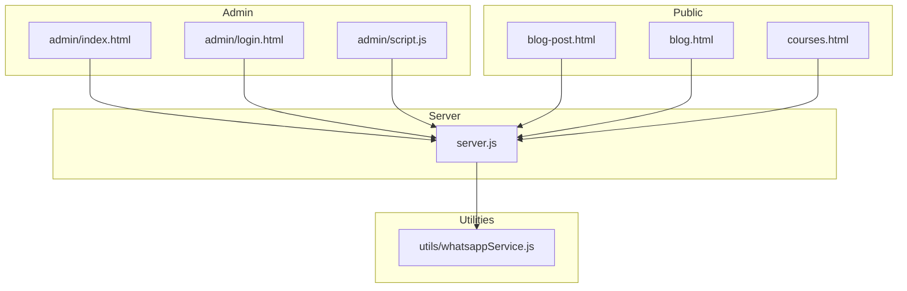
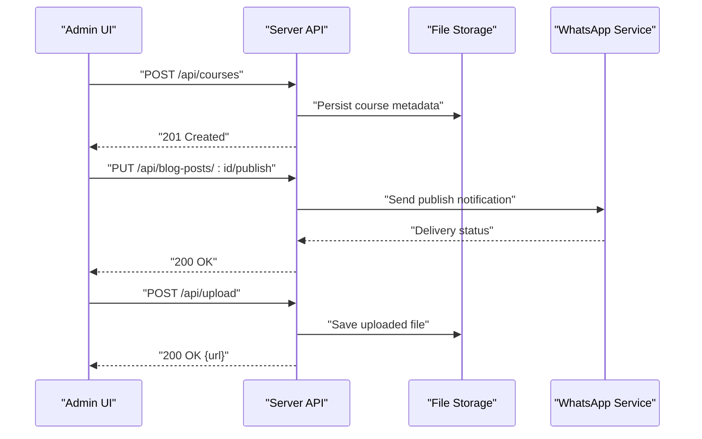
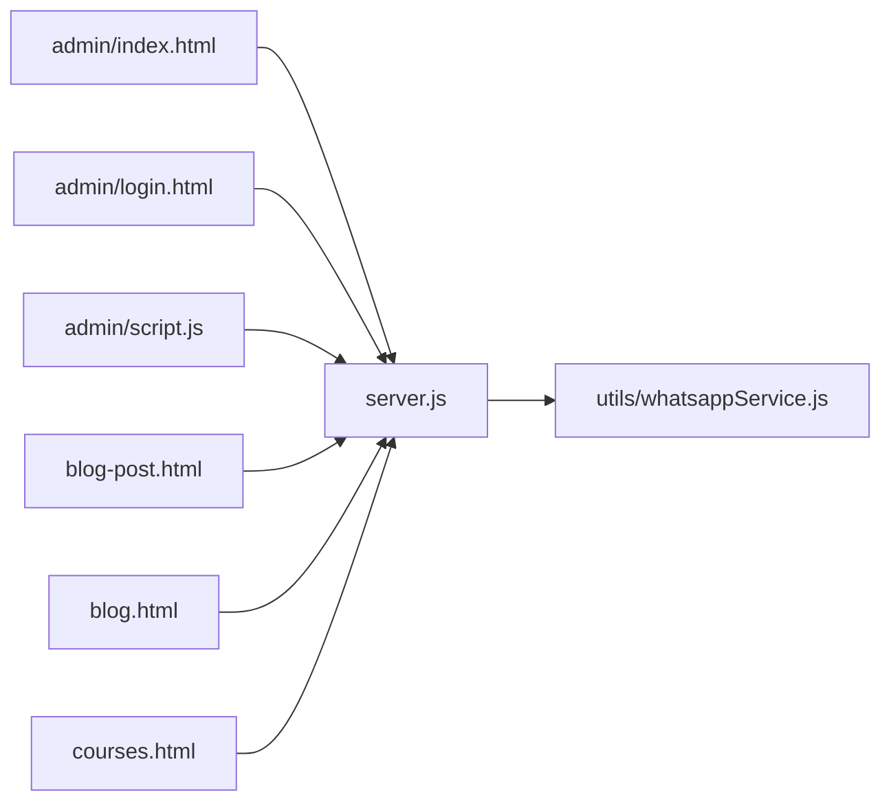

# Content Management Features

<cite>
**Referenced Files in This Document**
- [server.js](file://server.js)
- [admin/index.html](file://admin/index.html)
- [admin/login.html](file://admin/login.html)
- [admin/script.js](file://admin/script.js)
- [blog-post.html](file://blog-post.html)
- [blog.html](file://blog.html)
- [courses.html](file://courses.html)
- [utils/whatsappService.js](file://utils/whatsappService.js)
- [package.json](file://package.json)
</cite>

## Table of Contents
1. [Introduction](#introduction)
2. [Project Structure](#project-structure)
3. [Core Components](#core-components)
4. [Architecture Overview](#architecture-overview)
5. [Detailed Component Analysis](#detailed-component-analysis)
6. [Dependency Analysis](#dependency-analysis)
7. [Performance Considerations](#performance-considerations)
8. [Troubleshooting Guide](#troubleshooting-guide)
9. [Conclusion](#conclusion)

## Introduction
This document describes the content management system (CMS) features implemented in the project, focusing on:
- Course administration tools
- Blog post editing interfaces
- User management capabilities
- Media asset handling
- CRUD operations and form validation
- File upload processing
- Content publishing workflows
- Bulk operations and content versioning patterns
- Integration with external services such as WhatsApp notifications

The goal is to provide both a high-level overview and detailed technical guidance for developers and administrators working with the CMS.

## Project Structure
The CMS spans server-side logic, admin UI, public-facing pages, and utility integrations. Key areas include:
- Server entry point and API routes
- Admin dashboard and login screens
- Public blog and course pages
- Utility service for WhatsApp notifications
- Package configuration for dependencies

**Diagram sources**
- [server.js](file://server.js)
- [admin/index.html](file://admin/index.html)
- [admin/login.html](file://admin/login.html)
- [admin/script.js](file://admin/script.js)
- [blog-post.html](file://blog-post.html)
- [blog.html](file://blog.html)
- [courses.html](file://courses.html)
- [utils/whatsappService.js](file://utils/whatsappService.js)

**Section sources**
- [server.js](file://server.js)
- [admin/index.html](file://admin/index.html)
- [admin/login.html](file://admin/login.html)
- [admin/script.js](file://admin/script.js)
- [blog-post.html](file://blog-post.html)
- [blog.html](file://blog.html)
- [courses.html](file://courses.html)
- [utils/whatsappService.js](file://utils/whatsappService.js)

## Core Components
- Server API layer: Centralizes HTTP endpoints for content CRUD, authentication, file uploads, and notifications.
- Admin UI: Provides dashboards for managing courses, blog posts, users, and media assets.
- Public pages: Render published content and expose forms for user interactions.
- WhatsApp integration: Utility module for sending notifications via an external messaging service.

Key responsibilities:
- Authentication and authorization for admin actions
- Validation and sanitization of inputs
- File upload handling and storage metadata management
- Publishing workflow orchestration
- Notification dispatch to external services

**Section sources**
- [server.js](file://server.js)
- [admin/index.html](file://admin/index.html)
- [admin/script.js](file://admin/script.js)
- [utils/whatsappService.js](file://utils/whatsappService.js)

## Architecture Overview
The CMS follows a client-server architecture where the admin and public clients interact with a Node.js server that exposes RESTful endpoints. The server coordinates data persistence, file handling, and third-party integrations.

**Diagram sources**
- [server.js](file://server.js)
- [utils/whatsappService.js](file://utils/whatsappService.js)

## Detailed Component Analysis

### Course Administration Tools
Purpose:
- Create, read, update, and delete (CRUD) course records
- Manage course metadata, enrollment settings, and associated media
- Support bulk operations for mass updates or deletions

Key flows:
- Create course: Validate inputs, persist metadata, return created resource
- Update course: Fetch existing record, apply changes, validate again, save
- Delete course: Confirm ownership/permissions, remove references, soft-delete if applicable
- Bulk operations: Accept arrays of IDs, process transactions, report results

Validation highlights:
- Required fields (title, description, level, duration)
- Data types and ranges (e.g., numeric duration)
- Unique constraints (e.g., slug or code)
- Media reference integrity

Bulk operation pattern:
- Input: Array of identifiers and action
- Processing: Iterate with transactional boundaries
- Output: Summary of successes and failures

Versioning considerations:
- Maintain revision history for auditability
- Store diffs or snapshots for rollback capability

**Section sources**
- [server.js](file://server.js)
- [admin/index.html](file://admin/index.html)
- [admin/script.js](file://admin/script.js)

### Blog Post Editing Interfaces
Purpose:
- Author and manage blog posts with rich text support
- Draft, review, and publish lifecycle
- Attach media and tags

Key flows:
- Create draft: Save partial content, mark as draft
- Publish: Validate final content, set published timestamp, notify subscribers
- Unpublish: Toggle visibility without deleting content
- Versioning: Track revisions and allow restore

Form validation:
- Title length and uniqueness
- Body content presence and safe HTML handling
- Tag normalization and deduplication

Publishing workflow:
- Transition states: draft -> review -> published
- Side effects: indexing, cache invalidation, notifications

**Section sources**
- [blog-post.html](file://blog-post.html)
- [blog.html](file://blog.html)
- [server.js](file://server.js)

### User Management Capabilities
Purpose:
- Manage admin users and roles
- Enforce permissions for content operations
- Provide secure login and session/token management

Key flows:
- Login: Authenticate credentials, issue token/session
- Role assignment: Update role-based access control
- Deactivation: Soft-disable accounts while preserving audit trail

Security considerations:
- Password hashing and secure storage
- Rate limiting and brute-force protection
- CSRF and XSS protections

**Section sources**
- [admin/login.html](file://admin/login.html)
- [admin/script.js](file://admin/script.js)
- [server.js](file://server.js)

### Media Asset Handling
Purpose:
- Upload images, documents, and other media
- Generate thumbnails and optimize files
- Store metadata and serve via CDN or local storage

Key flows:
- Upload: Validate file type and size, sanitize filename, store file, record metadata
- Retrieve: Serve by ID or URL, enforce access controls
- Delete: Remove file and metadata, handle orphaned references

Validation and safety:
- MIME type verification
- Size limits and quota enforcement
- Virus scanning hooks (optional)

**Section sources**
- [server.js](file://server.js)
- [admin/index.html](file://admin/index.html)

### Content Publishing Workflows
Purpose:
- Orchestrate transitions between content states
- Ensure consistency across related resources
- Trigger side effects like notifications and indexing

Workflow stages:
- Draft: Initial creation and edits
- Review: Peer or automated checks
- Published: Visible to end users
- Archived: Retired but retained for history

Side effects:
- Cache refresh
- Search index updates
- Notifications via WhatsApp or email

**Section sources**
- [server.js](file://server.js)
- [utils/whatsappService.js](file://utils/whatsappService.js)

### External Integrations: WhatsApp Notifications
Purpose:
- Send notifications for key events (publish, errors, approvals)
- Decouple messaging from core business logic

Integration points:
- Event-driven triggers from server handlers
- Retry and error reporting mechanisms
- Configuration via environment variables

**Section sources**
- [utils/whatsappService.js](file://utils/whatsappService.js)
- [server.js](file://server.js)

## Dependency Analysis
High-level dependency relationships among components:

**Diagram sources**
- [admin/index.html](file://admin/index.html)
- [admin/login.html](file://admin/login.html)
- [admin/script.js](file://admin/script.js)
- [blog-post.html](file://blog-post.html)
- [blog.html](file://blog.html)
- [courses.html](file://courses.html)
- [server.js](file://server.js)
- [utils/whatsappService.js](file://utils/whatsappService.js)

**Section sources**
- [package.json](file://package.json)
- [server.js](file://server.js)

## Performance Considerations
- Use pagination and filtering for large datasets (courses, blog posts)
- Implement caching for frequently accessed content
- Optimize image uploads with compression and resizing
- Batch database operations for bulk actions
- Stream large file uploads to reduce memory pressure
- Leverage CDN for static assets and media delivery

[No sources needed since this section provides general guidance]

## Troubleshooting Guide
Common issues and resolutions:
- Authentication failures: Verify credentials, check rate limits, inspect token expiration
- Upload errors: Validate file size/type, ensure storage permissions, confirm endpoint availability
- Publishing delays: Check background job queues, verify notification service health
- WhatsApp delivery failures: Inspect logs, retry policies, and configuration keys

Operational tips:
- Enable verbose logging for critical paths
- Monitor error rates and response times
- Validate environment variables and secrets rotation

**Section sources**
- [server.js](file://server.js)
- [utils/whatsappService.js](file://utils/whatsappService.js)

## Conclusion
The CMS provides a robust foundation for managing courses, blog content, users, and media assets. It emphasizes secure authentication, comprehensive validation, structured publishing workflows, and extensibility through integrations like WhatsApp notifications. By following the patterns outlined here—especially around validation, transactional bulk operations, and versioning—you can extend and maintain the system effectively.

[No sources needed since this section summarizes without analyzing specific files]