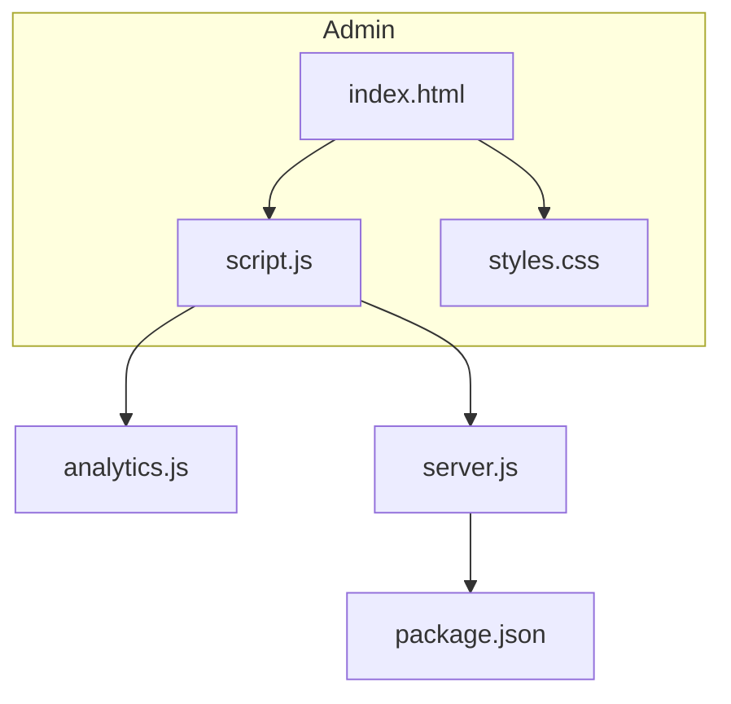
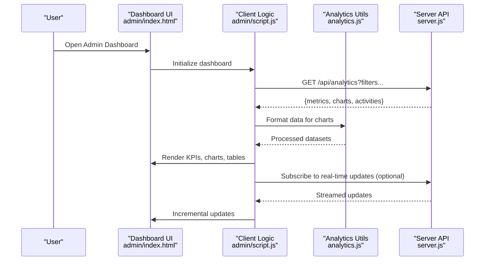
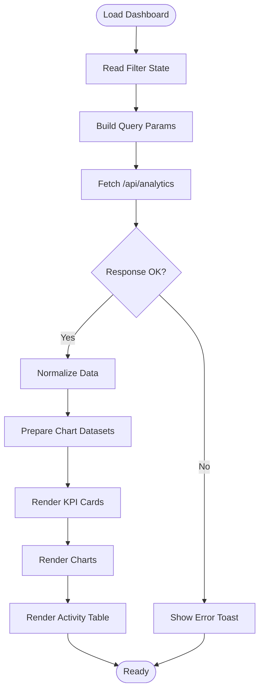
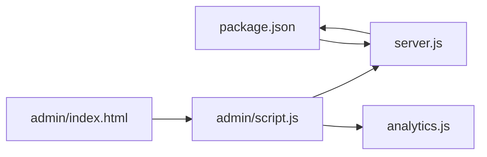

# Dashboard & Analytics

<cite>
**Referenced Files in This Document**
- [admin/index.html](file://admin/index.html)
- [admin/script.js](file://admin/script.js)
- [admin/styles.css](file://admin/styles.css)
- [analytics.js](file://analytics.js)
- [server.js](file://server.js)
- [package.json](file://package.json)
</cite>

## Table of Contents
1. [Introduction](#introduction)
2. [Project Structure](#project-structure)
3. [Core Components](#core-components)
4. [Architecture Overview](#architecture-overview)
5. [Detailed Component Analysis](#detailed-component-analysis)
6. [Dependency Analysis](#dependency-analysis)
7. [Performance Considerations](#performance-considerations)
8. [Troubleshooting Guide](#troubleshooting-guide)
9. [Conclusion](#conclusion)
10. [Appendices](#appendices)

## Introduction
This document explains the admin dashboard interface and analytics display, focusing on layout, data visualization components, real-time metrics, user activity monitoring, widgets, charts, filtering, responsive design, custom components, API integration, and performance optimization for large datasets. It is intended for both technical and non-technical readers to understand how the dashboard works and how to extend it safely.

## Project Structure
The dashboard resides under the admin directory with a clear separation of concerns:
- HTML structure defines the layout and widget containers
- JavaScript handles data fetching, rendering, filtering, and interactivity
- CSS provides responsive styling and theme support

**Diagram sources**
- [admin/index.html](file://admin/index.html)
- [admin/script.js](file://admin/script.js)
- [admin/styles.css](file://admin/styles.css)
- [analytics.js](file://analytics.js)
- [server.js](file://server.js)
- [package.json](file://package.json)

**Section sources**
- [admin/index.html](file://admin/index.html)
- [admin/script.js](file://admin/script.js)
- [admin/styles.css](file://admin/styles.css)
- [analytics.js](file://analytics.js)
- [server.js](file://server.js)
- [package.json](file://package.json)

## Core Components
- Dashboard Layout
  - Header with navigation and filters
  - KPI summary cards (e.g., total users, active sessions, revenue)
  - Charts area for time-series and categorical visualizations
  - Activity feed or table for recent events
  - Footer with controls and status indicators

- Data Visualization Components
  - Line/area charts for trends
  - Bar charts for comparisons
  - Pie/donut charts for proportions
  - Real-time counters and sparklines

- Filtering and Controls
  - Date range picker
  - Category/type selectors
  - Search input with debounced queries
  - Export options (CSV/PDF)

- Responsive Design Patterns
  - CSS Grid/Flexbox-based layout
  - Breakpoints for mobile/tablet/desktop
  - Collapsible sidebar and stacked cards on small screens

**Section sources**
- [admin/index.html](file://admin/index.html)
- [admin/styles.css](file://admin/styles.css)

## Architecture Overview
The dashboard follows a client-server architecture:
- The browser loads the admin page and initializes UI components
- The client requests analytics data from the server endpoints
- The server aggregates and returns JSON responses
- The client renders charts and updates widgets accordingly

**Diagram sources**
- [admin/index.html](file://admin/index.html)
- [admin/script.js](file://admin/script.js)
- [analytics.js](file://analytics.js)
- [server.js](file://server.js)

## Detailed Component Analysis

### Dashboard Layout and Widgets
- Layout
  - Top bar with title, global filters, and export actions
  - Main grid containing KPI cards and chart panels
  - Bottom section for detailed tables and activity logs
- Widgets
  - KPI Cards: show totals, deltas, and mini sparklines
  - Chart Panels: line/bar/pie with tooltips and legends
  - Activity Feed: paginated list with timestamps and actions
  - Filters Panel: date range, categories, search, and reset

Implementation notes:
- Use semantic HTML elements for accessibility
- Assign IDs/classes to container nodes for targeted updates
- Ensure keyboard navigation and ARIA attributes where applicable

**Section sources**
- [admin/index.html](file://admin/index.html)
- [admin/styles.css](file://admin/styles.css)

### Data Fetching and Rendering Pipeline
- Client-side orchestration
  - Collect filter state from UI
  - Build query parameters
  - Request data from server endpoints
  - Handle success/error states and loading indicators
- Data processing
  - Normalize response shapes
  - Aggregate by time buckets or categories
  - Prepare datasets for chart libraries
- Rendering
  - Update KPIs and charts incrementally
  - Debounce heavy operations
  - Re-render only changed sections

**Diagram sources**
- [admin/script.js](file://admin/script.js)
- [analytics.js](file://analytics.js)
- [server.js](file://server.js)

**Section sources**
- [admin/script.js](file://admin/script.js)
- [analytics.js](file://analytics.js)
- [server.js](file://server.js)

### Real-Time Metrics Display
- Polling or WebSocket approach
  - Periodic polling for lightweight updates
  - WebSockets for low-latency streams
- Delta updates
  - Apply incremental changes to existing datasets
  - Avoid full re-renders when possible
- Backpressure handling
  - Throttle incoming messages
  - Queue and process in batches

Best practices:
- Use requestAnimationFrame for smooth UI updates
- Debounce rapid metric changes
- Provide manual refresh fallback

**Section sources**
- [admin/script.js](file://admin/script.js)
- [server.js](file://server.js)

### User Activity Monitoring
- Event ingestion
  - Capture key actions (login, course start, quiz submit)
  - Attach metadata (user ID, timestamp, device)
- Aggregation
  - Group by time windows (minute/hour/day)
  - Compute counts and unique users
- Display
  - Timeline view and tabular log
  - Filtering by action type and user segment

**Section sources**
- [server.js](file://server.js)
- [admin/script.js](file://admin/script.js)

### Filtering Capabilities
- Supported filters
  - Date range (start/end)
  - Category/tags
  - Search keywords
  - Segments (new vs returning users)
- Behavior
  - Debounced search input
  - Reset to defaults
  - Persist last used filters in session storage

**Section sources**
- [admin/index.html](file://admin/index.html)
- [admin/script.js](file://admin/script.js)

### Responsive Design Patterns
- Grid and flex layouts adapt across breakpoints
- Cards stack vertically on narrow screens
- Charts resize via container listeners
- Touch-friendly controls and larger tap targets

**Section sources**
- [admin/styles.css](file://admin/styles.css)

### Custom Dashboard Components
- Example patterns
  - MetricCard: displays value, change %, and sparkline
  - ChartPanel: wraps chart library with loading and error states
  - ActivityRow: formats timestamp and action details
- Composition
  - Compose complex views from reusable components
  - Pass props for labels, datasets, and callbacks

**Section sources**
- [admin/script.js](file://admin/script.js)
- [admin/index.html](file://admin/index.html)

### API Integration Examples
- Typical endpoints
  - GET /api/analytics?from=&to=&category=
  - GET /api/activities?limit=&offset=&q=
- Response shape
  - metrics: {totalUsers, activeSessions, revenue}
  - charts: {timeSeries, categoryBreakdown}
  - activities: [{id, action, userId, timestamp}]
- Error handling
  - Network errors, timeouts, and invalid payloads
  - Graceful degradation with cached or partial data

**Section sources**
- [admin/script.js](file://admin/script.js)
- [server.js](file://server.js)

## Dependency Analysis
- Client dependencies
  - DOM manipulation and event handling in script.js
  - Analytics utilities in analytics.js for data shaping
- Server dependencies
  - Express or similar framework defined in package.json
  - Database or cache layer accessed via server.js routes
- External libraries
  - Charting library (e.g., Chart.js or similar) referenced in scripts
  - Optional WebSocket server for real-time features

**Diagram sources**
- [package.json](file://package.json)
- [server.js](file://server.js)
- [admin/index.html](file://admin/index.html)
- [admin/script.js](file://admin/script.js)
- [analytics.js](file://analytics.js)

**Section sources**
- [package.json](file://package.json)
- [server.js](file://server.js)
- [admin/script.js](file://admin/script.js)
- [analytics.js](file://analytics.js)

## Performance Considerations
- Data volume
  - Paginate and limit results for activity tables
  - Summarize time-series into appropriate intervals
- Rendering efficiency
  - Batch DOM updates
  - Use virtualization for long lists
  - Debounce/throttle user inputs and resize handlers
- Network optimization
  - Cache responses with short TTLs
  - Use conditional requests (ETag/Last-Modified)
  - Prefer streaming for real-time updates
- Memory management
  - Dispose of chart instances before re-rendering
  - Clear timers and event listeners on unload

[No sources needed since this section provides general guidance]

## Troubleshooting Guide
- Common issues
  - Empty charts due to missing or malformed data
  - Stale filters causing incorrect results
  - Real-time updates not appearing due to connection drops
- Diagnostics
  - Check network tab for failed requests
  - Validate response schema against expected types
  - Inspect console for errors and warnings
- Recovery steps
  - Retry with exponential backoff
  - Fall back to cached data
  - Prompt user to refresh or adjust filters

**Section sources**
- [admin/script.js](file://admin/script.js)
- [server.js](file://server.js)

## Conclusion
The admin dashboard combines a clean layout, robust data pipelines, and interactive visualizations to deliver actionable insights. By following the patterns outlined here—modular components, efficient data handling, and responsive design—you can extend the dashboard with new widgets, integrate additional data sources, and maintain high performance at scale.

## Appendices

### Quick Start Checklist
- Verify server endpoints are reachable
- Confirm filter defaults render initial data
- Test responsiveness on mobile devices
- Validate real-time updates if enabled

[No sources needed since this section provides general guidance]