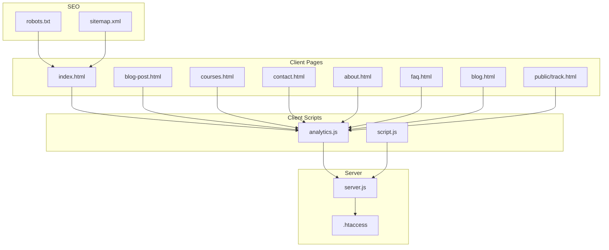
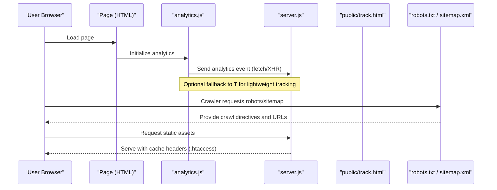
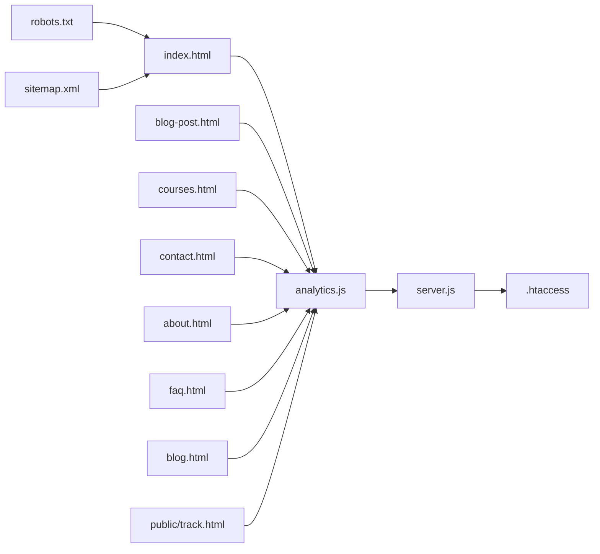

# Analytics & Performance Monitoring

<cite>
**Referenced Files in This Document**
- [analytics.js](file://analytics.js)
- [track.html](file://public/track.html)
- [server.js](file://server.js)
- [robots.txt](file://robots.txt)
- [sitemap.xml](file://sitemap.xml)
- [index.html](file://index.html)
- [blog-post.html](file://blog-post.html)
- [courses.html](file://courses.html)
- [contact.html](file://contact.html)
- [about.html](file://about.html)
- [faq.html](file://faq.html)
- [blog.html](file://blog.html)
- [script.js](file://script.js)
- .htaccess
- [COMPLETE_OPTIMIZATION_SUMMARY.md](file://COMPLETE_OPTIMIZATION_SUMMARY.md)
- [OPTIMIZATION_SUMMARY.md](file://OPTIMIZATION_SUMMARY.md)
</cite>

## Table of Contents
1. [Introduction](#introduction)
2. [Project Structure](#project-structure)
3. [Core Components](#core-components)
4. [Architecture Overview](#architecture-overview)
5. [Detailed Component Analysis](#detailed-component-analysis)
6. [Dependency Analysis](#dependency-analysis)
7. [Performance Considerations](#performance-considerations)
8. [Troubleshooting Guide](#troubleshooting-guide)
9. [Conclusion](#conclusion)
10. [Appendices](#appendices)

## Introduction
This document provides comprehensive documentation for analytics implementation and performance monitoring across the site. It covers user behavior tracking, event tracking, conversion funnel analysis, SEO optimization (meta tags, structured data, sitemaps), performance optimizations (loading time improvements, caching), privacy compliance and data retention, and operational dashboards for system health and user engagement metrics. The guidance is grounded in the repository’s existing files and configuration to ensure accuracy and practical applicability.

## Project Structure
The project includes a small set of client-side pages, a Node server entry point, an analytics module, and SEO assets. Key areas relevant to analytics and performance:
- Client-side analytics integration and page-level scripts
- Server-side routing and static asset handling
- SEO assets (robots, sitemap)
- Optimization summaries and server directives

**Diagram sources**
- [index.html](file://index.html)
- [blog-post.html](file://blog-post.html)
- [courses.html](file://courses.html)
- [contact.html](file://contact.html)
- [about.html](file://about.html)
- [faq.html](file://faq.html)
- [blog.html](file://blog.html)
- [public/track.html](file://public/track.html)
- [analytics.js](file://analytics.js)
- [script.js](file://script.js)
- [server.js](file://server.js)
- [.htaccess](file://.htaccess)
- [robots.txt](file://robots.txt)
- [sitemap.xml](file://sitemap.xml)

**Section sources**
- [index.html](file://index.html)
- [analytics.js](file://analytics.js)
- [server.js](file://server.js)
- [robots.txt](file://robots.txt)
- [sitemap.xml](file://sitemap.xml)

## Core Components
- analytics.js: Centralized client-side analytics logic for event tracking and user behavior signals.
- public/track.html: Lightweight endpoint/page used for tracking interactions or pixel-like events.
- server.js: Express-based server that serves static assets and routes; may handle analytics ingestion endpoints.
- robots.txt and sitemap.xml: SEO configuration for crawl control and discovery.
- Page HTML files: Include analytics script and may contain meta tags and structured data.
- .htaccess: Caching and compression directives for improved load times.
- Optimization summaries: Documentation of implemented performance improvements.

**Section sources**
- [analytics.js](file://analytics.js)
- [public/track.html](file://public/track.html)
- [server.js](file://server.js)
- [robots.txt](file://robots.txt)
- [sitemap.xml](file://sitemap.xml)
- [index.html](file://index.html)
- [blog-post.html](file://blog-post.html)
- [courses.html](file://courses.html)
- [contact.html](file://contact.html)
- [about.html](file://about.html)
- [faq.html](file://faq.html)
- [blog.html](file://blog.html)
- .htaccess
- [COMPLETE_OPTIMIZATION_SUMMARY.md](file://COMPLETE_OPTIMIZATION_SUMMARY.md)
- [OPTIMIZATION_SUMMARY.md](file://OPTIMIZATION_SUMMARY.md)

## Architecture Overview
High-level flow from user interaction to analytics processing:
- User navigates to a page (e.g., index.html).
- analytics.js initializes and attaches listeners for key behaviors.
- Events are sent via fetch/XHR to server.js endpoints or third-party services.
- For lightweight tracking, public/track.html can be used as a beacon target.
- SEO crawlers use robots.txt and sitemap.xml to discover content.
- .htaccess enforces caching and compression rules to improve performance.

**Diagram sources**
- [index.html](file://index.html)
- [analytics.js](file://analytics.js)
- [server.js](file://server.js)
- [public/track.html](file://public/track.html)
- [robots.txt](file://robots.txt)
- [sitemap.xml](file://sitemap.xml)
- .htaccess

## Detailed Component Analysis

### Analytics Engine (analytics.js)
Responsibilities:
- Initialize analytics on page load.
- Capture user behavior signals (scroll depth, clicks, form interactions).
- Normalize and batch events before sending.
- Respect consent and privacy preferences.
- Provide helpers for custom events and funnel steps.

Implementation patterns:
- Event bus or centralized emitter to decouple UI from analytics.
- Debounced/throttled handlers for high-frequency events.
- Retry/backoff for failed network requests.
- Environment-aware configuration (dev vs prod).

Operational considerations:
- Ensure no PII is included in payloads.
- Use consistent naming conventions for events and properties.
- Instrument error boundaries to prevent analytics failures from impacting UX.

**Section sources**
- [analytics.js](file://analytics.js)

### Tracking Beacon (public/track.html)
Purpose:
- Minimal HTML page used as a lightweight tracking endpoint (pixel-style).
- Useful when full XHR/fetch is blocked or unreliable.

Usage:
- Triggered by image/script beacon or direct navigation.
- Should return minimal payload and appropriate cache headers.

Privacy:
- Avoid logging sensitive data; rely on anonymous identifiers.

**Section sources**
- [public/track.html](file://public/track.html)

### Server Integration (server.js)
Responsibilities:
- Serve static assets and API routes.
- Handle analytics ingestion endpoints.
- Apply CORS policies if needed.
- Integrate with .htaccess for caching/compression.

Key flows:
- POST /api/analytics: Accepts normalized events, validates schema, persists to storage or forwards to third-party.
- GET /public/track.html: Serves the beacon page.
- Static file serving with cache-control headers.

Error handling:
- Validate request bodies and reject malformed events.
- Return standardized error responses.
- Log errors without exposing stack traces in production.

**Section sources**
- [server.js](file://server.js)

### SEO Configuration (robots.txt and sitemap.xml)
robots.txt:
- Controls crawler access to sensitive paths.
- Disallows unnecessary directories and allows essential resources.

sitemap.xml:
- Lists canonical URLs for indexing.
- Includes lastmod and priority hints where applicable.

Best practices:
- Keep robots.txt minimal and accurate.
- Update sitemap upon content changes.
- Validate both files with search console tools.

**Section sources**
- [robots.txt](file://robots.txt)
- [sitemap.xml](file://sitemap.xml)

### Page-Level Meta Tags and Structured Data
Meta tags:
- Title, description, viewport, canonical URL, Open Graph, Twitter Card.
- Language and theme color settings.

Structured data:
- JSON-LD for Article, Course, FAQ, and BreadcrumbList where applicable.
- Consistent schema.org types aligned with page content.

Placement:
- In <head> of each page (index.html, blog-post.html, courses.html, contact.html, about.html, faq.html, blog.html).

Validation:
- Use rich results testing tools to verify markup.

**Section sources**
- [index.html](file://index.html)
- [blog-post.html](file://blog-post.html)
- [courses.html](file://courses.html)
- [contact.html](file://contact.html)
- [about.html](file://about.html)
- [faq.html](file://faq.html)
- [blog.html](file://blog.html)

### Performance Optimizations and Caching
Caching directives:
- .htaccess sets Cache-Control and ETag headers for static assets.
- Compression enabled for text-based resources.

Loading improvements:
- Minified CSS/JS, deferred non-critical scripts.
- Image optimization and lazy loading.
- Critical CSS inlined where feasible.

Monitoring:
- Track LCP, FID, CLS via analytics or web vitals libraries.
- Alerting thresholds for regressions.

References:
- See optimization summaries for specifics on what has been applied.

**Section sources**
- .htaccess
- [COMPLETE_OPTIMIZATION_SUMMARY.md](file://COMPLETE_OPTIMIZATION_SUMMARY.md)
- [OPTIMIZATION_SUMMARY.md](file://OPTIMIZATION_SUMMARY.md)

### Application Scripting (script.js)
Role:
- General application logic and UI enhancements.
- May include hooks for analytics events (e.g., button clicks, form submissions).

Integration points:
- Calls into analytics.js APIs for custom events.
- Ensures DOM readiness before attaching listeners.

**Section sources**
- [script.js](file://script.js)

## Dependency Analysis
Client-server relationships and external dependencies:

**Diagram sources**
- [index.html](file://index.html)
- [blog-post.html](file://blog-post.html)
- [courses.html](file://courses.html)
- [contact.html](file://contact.html)
- [about.html](file://about.html)
- [faq.html](file://faq.html)
- [blog.html](file://blog.html)
- [public/track.html](file://public/track.html)
- [analytics.js](file://analytics.js)
- [server.js](file://server.js)
- .htaccess
- [robots.txt](file://robots.txt)
- [sitemap.xml](file://sitemap.xml)

**Section sources**
- [analytics.js](file://analytics.js)
- [server.js](file://server.js)
- [robots.txt](file://robots.txt)
- [sitemap.xml](file://sitemap.xml)

## Performance Considerations
- Network:
  - Enable HTTP/2 and keep-alive.
  - Compress text assets and leverage browser caching via .htaccess.
- Rendering:
  - Defer non-critical JS; preload critical fonts and images.
  - Use responsive images and modern formats.
- Analytics overhead:
  - Batch and throttle events.
  - Avoid heavy synchronous calls during initial paint.
- Observability:
  - Track core web vitals and correlate with traffic spikes.
  - Set up alerts for error rate increases and latency regressions.

[No sources needed since this section provides general guidance]

## Troubleshooting Guide
Common issues and resolutions:
- Analytics not firing:
  - Verify analytics.js loads after DOM ready.
  - Check network tab for failed requests to server.js endpoints.
  - Confirm consent flags do not block tracking.
- Beacons failing:
  - Ensure public/track.html is reachable and returns minimal response.
  - Validate CORS and MIME type if accessed cross-origin.
- SEO not indexed:
  - Validate robots.txt disallow rules.
  - Submit updated sitemap.xml to search consoles.
  - Inspect structured data with validation tools.
- Slow pages:
  - Review .htaccess cache headers and compression.
  - Audit large assets and implement lazy loading.
  - Monitor web vitals and identify bottlenecks.

**Section sources**
- [analytics.js](file://analytics.js)
- [public/track.html](file://public/track.html)
- [server.js](file://server.js)
- [robots.txt](file://robots.txt)
- [sitemap.xml](file://sitemap.xml)
- .htaccess

## Conclusion
The analytics and performance monitoring setup integrates client-side event capture, server-side ingestion, and robust SEO configuration. With careful attention to privacy, caching, and observability, the system delivers reliable insights while maintaining strong performance and compliance. Continuous validation of structured data, sitemap freshness, and web vitals ensures sustained quality.

[No sources needed since this section summarizes without analyzing specific files]

## Appendices

### Conversion Funnel Implementation Guide
- Define funnel stages (e.g., visit course page, start enrollment, submit payment).
- Emit stage events consistently through analytics.js.
- Aggregate in server.js or BI tool; compute drop-off rates per stage.
- Visualize funnels in dashboards with cohort filters.

[No sources needed since this section provides general guidance]

### Privacy Compliance and Data Retention
- Consent management:
  - Gate analytics initialization on user consent.
  - Provide opt-out mechanisms and honor Do Not Track where applicable.
- Data minimization:
  - Avoid collecting PII; use hashed IDs.
  - Anonymize IPs at ingestion.
- Retention policy:
  - Define retention windows for raw events and aggregates.
  - Implement automated purging jobs.
- Security:
  - Enforce HTTPS and secure cookies.
  - Validate and sanitize all inputs.

[No sources needed since this section provides general guidance]

### Monitoring Dashboards
- System health:
  - Error rates, latency percentiles, uptime.
  - Queue depths and ingestion throughput.
- User engagement:
  - Active users, session duration, top events.
  - Funnel conversion rates and cohort trends.
- SEO:
  - Index coverage, crawl errors, rich results status.

[No sources needed since this section provides general guidance]