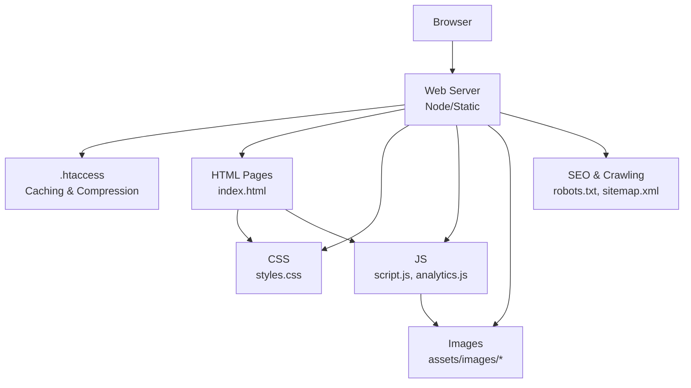
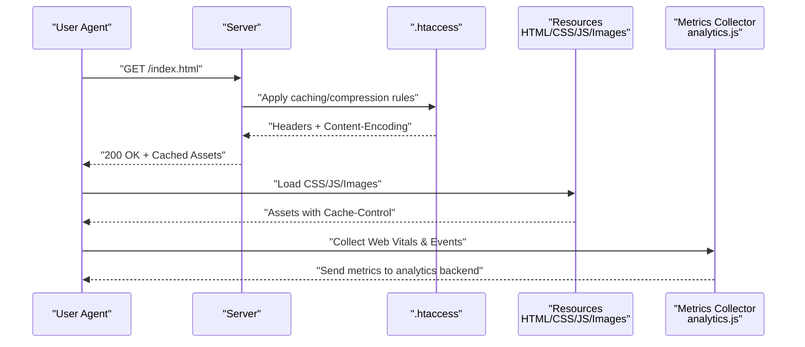
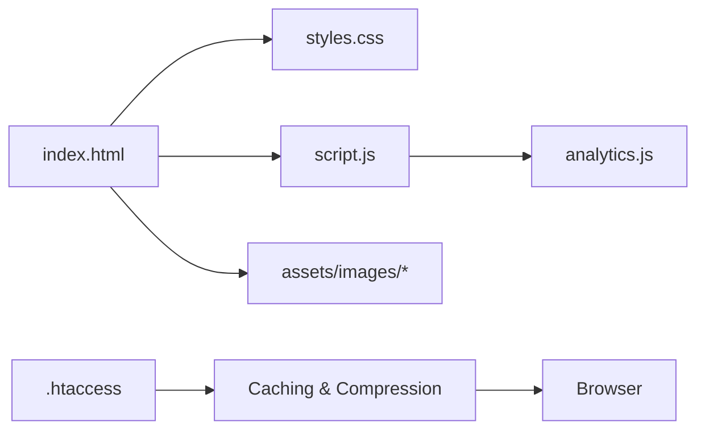

# Performance Monitoring

<cite>
**Referenced Files in This Document**
- [index.html](file://index.html)
- [script.js](file://script.js)
- [styles.css](file://styles.css)
- [.htaccess](file://.htaccess)
- [analytics.js](file://analytics.js)
- [server.js](file://server.js)
- [robots.txt](file://robots.txt)
- [sitemap.xml](file://sitemap.xml)
- [COMPLETE_OPTIMIZATION_SUMMARY.md](file://COMPLETE_OPTIMIZATION_SUMMARY.md)
- [MOBILE_FIX_SUMMARY.md](file://MOBILE_FIX_SUMMARY.md)
- [MOBILE_TESTING_GUIDE.md](file://MOBILE_TESTING_GUIDE.md)
- [OPTIMIZATION_SUMMARY.md](file://OPTIMIZATION_SUMMARY.md)
</cite>

## Table of Contents
1. [Introduction](#introduction)
2. [Project Structure](#project-structure)
3. [Core Components](#core-components)
4. [Architecture Overview](#architecture-overview)
5. [Detailed Component Analysis](#detailed-component-analysis)
6. [Dependency Analysis](#dependency-analysis)
7. [Performance Considerations](#performance-considerations)
8. [Troubleshooting Guide](#troubleshooting-guide)
9. [Conclusion](#conclusion)
10. [Appendices](#appendices)

## Introduction
This document provides a comprehensive guide to performance monitoring and optimization for the project. It covers loading time optimization, image and asset optimization, caching mechanisms, metrics collection, bottleneck identification, browser caching strategies, CDN considerations, lazy loading techniques, monitoring tool integration, performance budgeting, continuous performance testing, mobile performance optimization, and progressive web app (PWA) considerations. The guidance is grounded in the repository’s existing files and summaries while offering actionable recommendations to improve end-user experience across devices and networks.

## Project Structure
The project is a static site with minimal server-side logic. Key areas relevant to performance include:
- Frontend assets: HTML pages, CSS, JavaScript, images
- Server configuration: .htaccess for HTTP headers and compression
- Analytics and tracking: analytics.js
- Documentation and summaries: optimization and mobile guides

**Diagram sources**
- [.htaccess](file://.htaccess)
- [index.html](file://index.html)
- [styles.css](file://styles.css)
- [script.js](file://script.js)
- [analytics.js](file://analytics.js)
- [robots.txt](file://robots.txt)
- [sitemap.xml](file://sitemap.xml)

**Section sources**
- [index.html](file://index.html)
- [script.js](file://script.js)
- [styles.css](file://styles.css)
- [.htaccess](file://.htaccess)
- [analytics.js](file://analytics.js)
- [robots.txt](file://robots.txt)
- [sitemap.xml](file://sitemap.xml)

## Core Components
- Static HTML entry points: index.html and other pages define resource references and structure.
- Client-side scripts: script.js and analytics.js handle interactivity and performance metrics collection.
- Styles: styles.css contains global styles; consider critical CSS extraction and minification.
- Server configuration: .htaccess controls caching headers and compression.
- SEO and crawling: robots.txt and sitemap.xml influence discoverability and crawl efficiency.
- Optimization documentation: OPTIMIZATION_SUMMARY.md, COMPLETE_OPTIMIZATION_SUMMARY.md, MOBILE_FIX_SUMMARY.md, MOBILE_TESTING_GUIDE.md provide context on prior work and mobile-specific fixes.

**Section sources**
- [index.html](file://index.html)
- [script.js](file://script.js)
- [styles.css](file://styles.css)
- [.htaccess](file://.htaccess)
- [analytics.js](file://analytics.js)
- [robots.txt](file://robots.txt)
- [sitemap.xml](file://sitemap.xml)
- [OPTIMIZATION_SUMMARY.md](file://OPTIMIZATION_SUMMARY.md)
- [COMPLETE_OPTIMIZATION_SUMMARY.md](file://COMPLETE_OPTIMIZATION_SUMMARY.md)
- [MOBILE_FIX_SUMMARY.md](file://MOBILE_FIX_SUMMARY.md)
- [MOBILE_TESTING_GUIDE.md](file://MOBILE_TESTING_GUIDE.md)

## Architecture Overview
The performance architecture centers around efficient delivery of static assets, proper caching via HTTP headers, and client-side measurement using analytics.js. The server can be configured to serve compressed assets and enforce cache policies.

**Diagram sources**
- [.htaccess](file://.htaccess)
- [index.html](file://index.html)
- [analytics.js](file://analytics.js)

## Detailed Component Analysis

### Loading Time Optimization
- Minimize render-blocking resources by deferring non-critical JS and inlining critical CSS where appropriate.
- Use preload/prefetch strategically for above-the-fold content and next navigation targets.
- Ensure HTML documents are small and well-structured to reduce TTFB and first paint delays.
- Leverage HTTP/2 or HTTP/3 multiplexing to reduce connection overhead.

Implementation anchors:
- Resource ordering and defer attributes in HTML
- Critical CSS extraction and inlining strategy
- Preload hints for key fonts and hero images

**Section sources**
- [index.html](file://index.html)
- [styles.css](file://styles.css)
- [script.js](file://script.js)

### Image and Asset Optimization
- Serve modern formats (WebP/AVIF) with fallbacks.
- Implement responsive images using srcset/sizes and picture elements.
- Compress images and remove metadata; use lazy loading for offscreen images.
- Optimize fonts: subset, preconnect, font-display swap, and load only needed weights/styles.

Implementation anchors:
- Responsive image markup in HTML
- Lazy loading attributes for images and iframes
- Font loading strategies and display behavior

**Section sources**
- [index.html](file://index.html)
- [assets/images](file://assets/images)

### Caching Mechanisms
- Configure strong cache policies for static assets with immutable versions (content hashing).
- Set Cache-Control and ETag/Last-Modified appropriately for HTML vs. assets.
- Enable gzip/br compression for text-based assets.
- Use service workers for advanced caching strategies (optional PWA path).

Implementation anchors:
- .htaccess directives for Cache-Control, Expires, compression
- Versioned filenames for long-term caching

**Section sources**
- [.htaccess](file://.htaccess)

### Performance Metrics Collection
- Collect core web vitals (LCP, INP/FID, CLS) and custom events.
- Send metrics to an analytics endpoint or beacon API.
- Instrument user interactions and network timing where necessary.

Implementation anchors:
- analytics.js initialization and metric sending
- Event listeners for key interactions

**Section sources**
- [analytics.js](file://analytics.js)
- [script.js](file://script.js)

### Bottleneck Identification
- Use browser DevTools Network panel to identify large payloads, slow requests, and blocking resources.
- Analyze Lighthouse reports for prioritized issues.
- Track server response times and compression effectiveness.

Practical steps:
- Audit bundle sizes and third-party scripts
- Identify layout shifts caused by late-loading assets
- Measure impact of fonts and images on LCP

[No sources needed since this section provides general guidance]

### Browser Caching Strategies
- Long-lived caching for versioned static assets (e.g., 1 year with immutable).
- Shorter TTL for HTML to ensure updates propagate quickly.
- Validate cache with conditional requests (ETag/If-None-Match).

Implementation anchors:
- .htaccess rules for different file types
- Cache busting via filename changes

**Section sources**
- [.htaccess](file://.htaccess)

### CDN Implementation Considerations
- Place static assets behind a CDN to reduce latency and improve cache hit ratios.
- Configure CDN caching policies aligned with origin headers.
- Use preloading and prefetching to prime CDN caches for anticipated resources.

[No sources needed since this section provides general guidance]

### Lazy Loading Techniques
- Defer offscreen images and iframes until near viewport.
- Use IntersectionObserver for custom lazy behaviors (e.g., videos, charts).
- Avoid lazy-loading critical above-the-fold content.

Implementation anchors:
- Native lazy loading attributes
- Custom lazy loaders in script.js

**Section sources**
- [index.html](file://index.html)
- [script.js](file://script.js)

### Monitoring Tools Integration
- Integrate analytics.js to collect and report performance data.
- Optionally integrate RUM tools or error tracking for deeper insights.
- Establish dashboards for trends and alerts on regressions.

Implementation anchors:
- analytics.js initialization and event reporting

**Section sources**
- [analytics.js](file://analytics.js)

### Performance Budgeting
- Define budgets for total page weight, number of requests, and specific metrics (LCP < 2.5s, CLS < 0.1, INP < 200ms).
- Enforce budgets in CI using Lighthouse CI or similar tools.
- Review PRs for performance regressions before merging.

[No sources needed since this section provides general guidance]

### Continuous Performance Testing
- Run automated audits in CI pipelines on each commit.
- Compare results against baselines and fail builds on threshold breaches.
- Include mobile device emulation and throttled network conditions.

[No sources needed since this section provides general guidance]

### Mobile Performance Optimization
- Prioritize mobile-first design and responsive images.
- Reduce payload size and avoid heavy animations on low-end devices.
- Test on real devices and emulate CPU/network constraints.

Implementation anchors:
- Mobile-specific fixes documented in MOBILE_FIX_SUMMARY.md
- Testing procedures in MOBILE_TESTING_GUIDE.md

**Section sources**
- [MOBILE_FIX_SUMMARY.md](file://MOBILE_FIX_SUMMARY.md)
- [MOBILE_TESTING_GUIDE.md](file://MOBILE_TESTING_GUIDE.md)

### Progressive Web App Considerations
- Add a manifest and service worker for offline support and background sync.
- Implement install prompts and update strategies.
- Ensure secure contexts and HTTPS-only delivery.

[No sources needed since this section provides general guidance]

## Dependency Analysis
The frontend depends on HTML structure, CSS, and JS modules. The server configuration (.htaccess) influences how assets are cached and compressed. Analytics.js adds runtime telemetry without impacting initial load significantly when implemented correctly.

**Diagram sources**
- [index.html](file://index.html)
- [styles.css](file://styles.css)
- [script.js](file://script.js)
- [analytics.js](file://analytics.js)
- [.htaccess](file://.htaccess)

**Section sources**
- [index.html](file://index.html)
- [styles.css](file://styles.css)
- [script.js](file://script.js)
- [analytics.js](file://analytics.js)
- [.htaccess](file://.htaccess)

## Performance Considerations
- Keep HTML lean and avoid unnecessary DOM nodes.
- Minify and compress CSS/JS; tree-shake unused code.
- Prefer system fonts or self-hosted subsets with font-display swap.
- Use HTTP/2 and enable brotli/gzip compression.
- Monitor and cap third-party script impact.

[No sources needed since this section provides general guidance]

## Troubleshooting Guide
Common issues and resolutions:
- Slow TTFB: Check server response times, database queries (if any), and application logic.
- Large payloads: Inspect Network waterfall; prioritize critical resources and defer others.
- Layout shifts: Stabilize image/video dimensions and reserve space for dynamic content.
- Cache misses: Verify Cache-Control headers and ensure versioned filenames.
- Mobile regressions: Re-test under throttled conditions and on real devices.

Operational checks:
- Validate .htaccess rules for correct header values and compression flags.
- Confirm analytics.js does not block rendering or add excessive overhead.
- Review robots.txt and sitemap.xml for crawl efficiency.

**Section sources**
- [.htaccess](file://.htaccess)
- [analytics.js](file://analytics.js)
- [robots.txt](file://robots.txt)
- [sitemap.xml](file://sitemap.xml)

## Conclusion
By combining robust caching, asset optimization, careful resource loading, and continuous performance monitoring, the project can achieve fast, reliable experiences across devices. Aligning these practices with performance budgets and CI checks ensures sustained improvements and early detection of regressions.

[No sources needed since this section summarizes without analyzing specific files]

## Appendices

### Appendix A: Optimization Summaries
- OPTIMIZATION_SUMMARY.md: Consolidated optimization actions and outcomes.
- COMPLETE_OPTIMIZATION_SUMMARY.md: End-to-end optimization overview.
- MOBILE_FIX_SUMMARY.md: Mobile-specific fixes applied.
- MOBILE_TESTING_GUIDE.md: Procedures for validating mobile performance.

**Section sources**
- [OPTIMIZATION_SUMMARY.md](file://OPTIMIZATION_SUMMARY.md)
- [COMPLETE_OPTIMIZATION_SUMMARY.md](file://COMPLETE_OPTIMIZATION_SUMMARY.md)
- [MOBILE_FIX_SUMMARY.md](file://MOBILE_FIX_SUMMARY.md)
- [MOBILE_TESTING_GUIDE.md](file://MOBILE_TESTING_GUIDE.md)