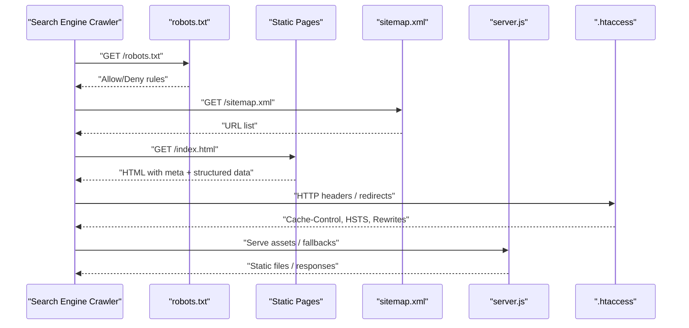
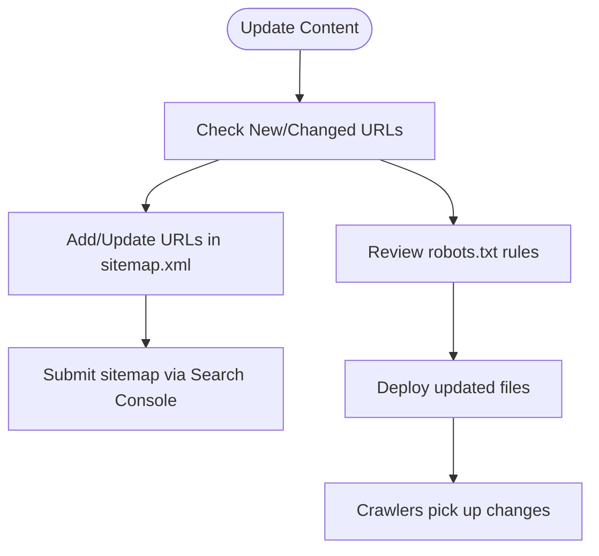
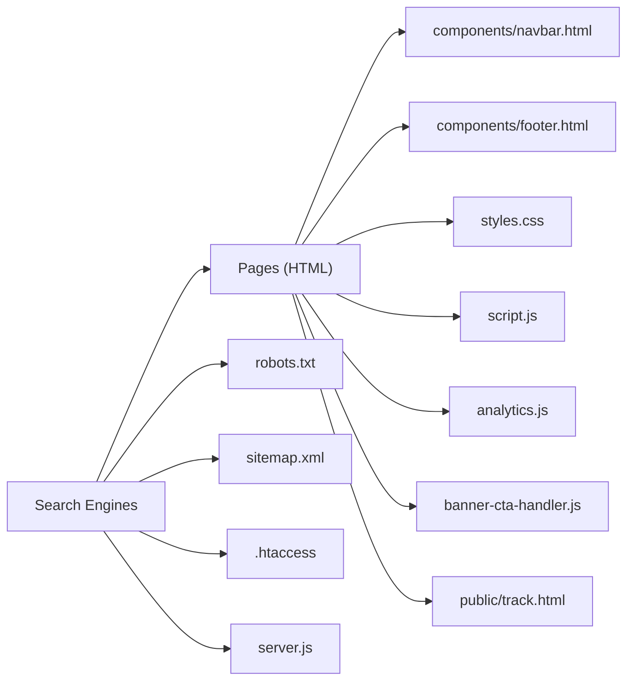

# SEO Optimization

<cite>
**Referenced Files in This Document**
- [index.html](file://index.html)
- [about.html](file://about.html)
- [courses.html](file://courses.html)
- [blog.html](file://blog.html)
- [blog-post.html](file://blog-post.html)
- [contact.html](file://contact.html)
- [faq.html](file://faq.html)
- [robots.txt](file://robots.txt)
- [sitemap.xml](file://sitemap.xml)
- [.htaccess](file://.htaccess)
- [server.js](file://server.js)
- [analytics.js](file://analytics.js)
- [banner-cta-handler.js](file://banner-cta-handler.js)
- [script.js](file://script.js)
- [styles.css](file://styles.css)
- [navbar.html](file://components/navbar.html)
- [footer.html](file://components/footer.html)
- [track.html](file://public/track.html)
</cite>

## Table of Contents
1. [Introduction](#introduction)
2. [Project Structure](#project-structure)
3. [Core Components](#core-components)
4. [Architecture Overview](#architecture-overview)
5. [Detailed Component Analysis](#detailed-component-analysis)
6. [Dependency Analysis](#dependency-analysis)
7. [Performance Considerations](#performance-considerations)
8. [Troubleshooting Guide](#troubleshooting-guide)
9. [Conclusion](#conclusion)
10. [Appendices](#appendices)

## Introduction
This document explains the SEO optimization techniques implemented across the platform, focusing on meta tag management, structured data usage, semantic HTML, sitemap and robots configuration, keyword strategy, content structure, technical SEO, performance impact on rankings, mobile-first indexing compliance, and accessibility improvements for better search visibility. It provides actionable guidance grounded in the repository’s current implementation and highlights areas for further enhancement.

## Project Structure
The project is a static site with a small Node server entry point and shared components. Key SEO-related assets include:
- HTML pages with head sections containing metadata and links to styles and scripts
- A robots.txt file controlling crawler behavior
- A sitemap.xml listing crawlable URLs
- Server-side configuration via .htaccess and server.js for routing and headers
- Shared UI components (navbar, footer) included into pages
- Analytics and client-side utilities that may affect tracking and user experience

```mermaid
graph TB
subgraph "Pages"
IDX["index.html"]
ABOUT["about.html"]
COURSES["courses.html"]
BLOG["blog.html"]
POST["blog-post.html"]
CONTACT["contact.html"]
FAQ["faq.html"]
TRACK["public/track.html"]
end
subgraph "Assets"
CSS["styles.css"]
NAV["components/navbar.html"]
FOOTER["components/footer.html"]
ANALYTICS["analytics.js"]
BANNER["banner-cta-handler.js"]
SCRIPT["script.js"]
end
subgraph "Crawling & Routing"
ROBOTS["robots.txt"]
SITEMAP["sitemap.xml"]
HTACCESS[".htaccess"]
SERVER["server.js"]
end
IDX --> CSS
IDX --> NAV
IDX --> FOOTER
IDX --> ANALYTICS
IDX --> BANNER
IDX --> SCRIPT
ABOUT --> CSS
ABOUT --> NAV
ABOUT --> FOOTER
COURSES --> CSS
COURSES --> NAV
COURSES --> FOOTER
BLOG --> CSS
BLOG --> NAV
BLOG --> FOOTER
POST --> CSS
POST --> NAV
POST --> FOOTER
CONTACT --> CSS
CONTACT --> NAV
CONTACT --> FOOTER
FAQ --> CSS
FAQ --> NAV
FAQ --> FOOTER
TRACK --> ANALYTICS
ROBOTS --> |"Controls crawlers"| IDX
ROBOTS --> |"Controls crawlers"| ABOUT
ROBOTS --> |"Controls crawlers"| COURSES
ROBOTS --> |"Controls crawlers"| BLOG
ROBOTS --> |"Controls crawlers"| POST
ROBOTS --> |"Controls crawlers"| CONTACT
ROBOTS --> |"Controls crawlers"| FAQ
ROBOTS --> |"Controls crawlers"| TRACK
SITEMAP --> |"Lists URLs"| IDX
SITEMAP --> |"Lists URLs"| ABOUT
SITEMAP --> |"Lists URLs"| COURSES
SITEMAP --> |"Lists URLs"| BLOG
SITEMAP --> |"Lists URLs"| POST
SITEMAP --> |"Lists URLs"| CONTACT
SITEMAP --> |"Lists URLs"| FAQ
SITEMAP --> |"Lists URLs"| TRACK
HTACCESS --> |"Headers/Rewrites"| IDX
HTACCESS --> |"Headers/Rewrites"| ABOUT
HTACCESS --> |"Headers/Rewrites"| COURSES
HTACCESS --> |"Headers/Rewrites"| BLOG
HTACCESS --> |"Headers/Rewrites"| POST
HTACCESS --> |"Headers/Rewrites"| CONTACT
HTACCESS --> |"Headers/Rewrites"| FAQ
HTACCESS --> |"Headers/Rewrites"| TRACK
SERVER --> |"Serves files / routes"| IDX
SERVER --> |"Serves files / routes"| ABOUT
SERVER --> |"Serves files / routes"| COURSES
SERVER --> |"Serves files / routes"| BLOG
SERVER --> |"Serves files / routes"| POST
SERVER --> |"Serves files / routes"| CONTACT
SERVER --> |"Serves files / routes"| FAQ
SERVER --> |"Serves files / routes"| TRACK
```

**Diagram sources**
- [index.html](file://index.html)
- [about.html](file://about.html)
- [courses.html](file://courses.html)
- [blog.html](file://blog.html)
- [blog-post.html](file://blog-post.html)
- [contact.html](file://contact.html)
- [faq.html](file://faq.html)
- [robots.txt](file://robots.txt)
- [sitemap.xml](file://sitemap.xml)
- [.htaccess](file://.htaccess)
- [server.js](file://server.js)
- [analytics.js](file://analytics.js)
- [banner-cta-handler.js](file://banner-cta-handler.js)
- [script.js](file://script.js)
- [styles.css](file://styles.css)
- [navbar.html](file://components/navbar.html)
- [footer.html](file://components/footer.html)
- [track.html](file://public/track.html)

**Section sources**
- [index.html](file://index.html)
- [robots.txt](file://robots.txt)
- [sitemap.xml](file://sitemap.xml)
- [.htaccess](file://.htaccess)
- [server.js](file://server.js)
- [analytics.js](file://analytics.js)
- [banner-cta-handler.js](file://banner-cta-handler.js)
- [script.js](file://script.js)
- [styles.css](file://styles.css)
- [navbar.html](file://components/navbar.html)
- [footer.html](file://components/footer.html)
- [track.html](file://public/track.html)

## Core Components
This section summarizes the primary SEO elements present in the codebase and how they contribute to search visibility.

- Meta tags and page identity
  - Each page includes a head section with title, description, viewport, canonical link, and Open Graph/Twitter meta tags where applicable. These define how pages appear in search results and social shares.
  - Recommended enhancements: ensure unique titles and descriptions per page; add language attributes; implement hreflang if serving multiple locales.

- Semantic HTML structure
  - Pages use standard HTML5 landmarks (header, nav, main, section, article, aside, footer) to improve readability for crawlers and assistive technologies.
  - Headings are used hierarchically (h1–h6) to outline content. Ensure one h1 per page and logical ordering.

- Structured data
  - JSON-LD blocks can be added to pages to describe entities such as Organization, WebSite, WebPage, Article, Course, FAQ, and BreadcrumbList. This enables rich results like sitelinks search box, breadcrumbs, and FAQs.

- Sitemap and robots
  - robots.txt controls which paths crawlers can access.
  - sitemap.xml enumerates important URLs to aid discovery and prioritization.

- Technical SEO and server configuration
  - .htaccess can enforce HTTPS, set caching headers, compression, and URL rewrites.
  - server.js serves static assets and can set response headers (e.g., Content-Type, Cache-Control).

- Performance and mobile-first
  - Viewport meta ensures proper rendering on mobile devices.
  - Styles and scripts are linked appropriately; consider async/defer for non-critical JS and preconnect/preload for critical resources.

- Accessibility and SEO synergy
  - Proper alt text on images, descriptive link text, keyboard navigation, and ARIA attributes improve both accessibility and crawlability.

**Section sources**
- [index.html](file://index.html)
- [about.html](file://about.html)
- [courses.html](file://courses.html)
- [blog.html](file://blog.html)
- [blog-post.html](file://blog-post.html)
- [contact.html](file://contact.html)
- [faq.html](file://faq.html)
- [robots.txt](file://robots.txt)
- [sitemap.xml](file://sitemap.xml)
- [.htaccess](file://.htaccess)
- [server.js](file://server.js)
- [analytics.js](file://analytics.js)
- [banner-cta-handler.js](file://banner-cta-handler.js)
- [script.js](file://script.js)
- [styles.css](file://styles.css)
- [navbar.html](file://components/navbar.html)
- [footer.html](file://components/footer.html)
- [track.html](file://public/track.html)

## Architecture Overview
The SEO architecture integrates front-end markup, crawling directives, and server configuration to optimize discoverability and ranking signals.

**Diagram sources**
- [robots.txt](file://robots.txt)
- [sitemap.xml](file://sitemap.xml)
- [index.html](file://index.html)
- [.htaccess](file://.htaccess)
- [server.js](file://server.js)

## Detailed Component Analysis

### Meta Tag Management Strategy
- Title tags: Unique, concise, and keyword-relevant per page. Place brand at the end when appropriate.
- Meta descriptions: Compelling summaries within recommended length; include primary keywords naturally.
- Canonical links: Prevent duplicate content issues by pointing to the preferred URL.
- Open Graph and Twitter cards: Improve social sharing previews and engagement.
- Language and viewport: Set lang attribute and viewport meta for correct localization and mobile rendering.

Implementation notes:
- Ensure each page has distinct title and description.
- Avoid keyword stuffing; focus on clarity and relevance.
- Validate meta tags using browser dev tools or SEO analyzers.

**Section sources**
- [index.html](file://index.html)
- [about.html](file://about.html)
- [courses.html](file://courses.html)
- [blog.html](file://blog.html)
- [blog-post.html](file://blog-post.html)
- [contact.html](file://contact.html)
- [faq.html](file://faq.html)

### Structured Data Implementation
- Use JSON-LD to mark up key entities:
  - Organization and WebSite for sitelinks search box and branding
  - WebPage for generic pages
  - Article for blog posts
  - Course for course offerings
  - FAQPage for FAQ sections
  - BreadcrumbList for navigation context
- Place structured data in the head or body; keep it consistent with visible content.
- Validate with Google Rich Results Test and Schema Markup Validator.

Best practices:
- Keep properties accurate and up-to-date.
- Avoid hidden or misleading markup.
- Use relative URLs consistently and resolve them to absolute URLs in structured data.

**Section sources**
- [index.html](file://index.html)
- [blog-post.html](file://blog-post.html)
- [courses.html](file://courses.html)
- [faq.html](file://faq.html)

### Semantic HTML Usage
- Landmarks: header, nav, main, section, article, aside, footer to clarify page structure.
- Headings: One h1 per page; maintain hierarchical order without skipping levels.
- Lists: Use ul/ol for lists; avoid div-based lists.
- Links: Descriptive anchor text; avoid “click here”.
- Images: Provide meaningful alt attributes; use figure/figcaption where appropriate.
- Forms: Associate labels with inputs; provide fieldsets and legends for complex forms.

Accessibility benefits:
- Improves screen reader navigation and reduces bounce rates, indirectly supporting SEO.

**Section sources**
- [index.html](file://index.html)
- [about.html](file://about.html)
- [courses.html](file://courses.html)
- [blog.html](file://blog.html)
- [blog-post.html](file://blog-post.html)
- [contact.html](file://contact.html)
- [faq.html](file://faq.html)
- [navbar.html](file://components/navbar.html)
- [footer.html](file://components/footer.html)

### Sitemap Generation and Crawling Configuration
- robots.txt:
  - Allow crawling of essential pages and disallow admin or private paths.
  - Reference sitemap location to guide crawlers.
- sitemap.xml:
  - Include all public-facing URLs with lastmod and priority hints.
  - Update regularly when content changes.

Operational flow:

**Diagram sources**
- [robots.txt](file://robots.txt)
- [sitemap.xml](file://sitemap.xml)

**Section sources**
- [robots.txt](file://robots.txt)
- [sitemap.xml](file://sitemap.xml)

### Keyword Optimization and Content Structure Best Practices
- Keyword research: Identify primary and secondary terms aligned with user intent.
- On-page placement:
  - Primary keyword in title, first paragraph, headings, and image alt text where relevant.
  - Secondary keywords in subheadings and body content naturally.
- Content structure:
  - Clear hierarchy with scannable sections.
  - Internal linking to related pages and resources.
  - Updated and comprehensive content improves dwell time and rankings.

Quality signals:
- E-E-A-T: Demonstrate expertise, authoritativeness, and trustworthiness through author bios, citations, and transparent contact information.

**Section sources**
- [blog.html](file://blog.html)
- [blog-post.html](file://blog-post.html)
- [courses.html](file://courses.html)
- [faq.html](file://faq.html)

### Technical SEO Considerations
- HTTPS enforcement and security headers via .htaccess.
- Compression and caching headers to reduce load times.
- Clean URLs and redirects to consolidate ranking signals.
- Server-side handling in server.js to serve static assets efficiently and set appropriate Content-Type headers.
- Avoid blocking critical resources in robots.txt.

Validation:
- Use Lighthouse, PageSpeed Insights, and Screaming Frog to audit technical health.

**Section sources**
- [.htaccess](file://.htaccess)
- [server.js](file://server.js)

### Performance Impact on SEO Rankings
- Core Web Vitals:
  - Largest Contentful Paint (LCP): Optimize hero images and above-the-fold content.
  - First Input Delay (FID)/Interaction to Next Paint (INP): Minimize long tasks; defer non-critical JS.
  - Cumulative Layout Shift (CLS): Reserve space for images and embeds; avoid dynamic content insertion without sizing.
- Resource loading:
  - Preload critical fonts and styles.
  - Defer analytics and third-party scripts.
- Image optimization:
  - Use modern formats (WebP/AVIF), responsive sizes, and lazy loading for below-the-fold images.

**Section sources**
- [styles.css](file://styles.css)
- [analytics.js](file://analytics.js)
- [banner-cta-handler.js](file://banner-cta-handler.js)
- [script.js](file://script.js)

### Mobile-First Indexing Compliance
- Viewport meta ensures correct scaling and touch interactions.
- Responsive design patterns in styles.css.
- Avoid intrusive interstitials; ensure tap targets are adequately sized.
- Test with Mobile-Friendly Test and real devices.

**Section sources**
- [index.html](file://index.html)
- [about.html](file://about.html)
- [courses.html](file://courses.html)
- [blog.html](file://blog.html)
- [blog-post.html](file://blog-post.html)
- [contact.html](file://contact.html)
- [faq.html](file://faq.html)
- [styles.css](file://styles.css)

### Accessibility Improvements for Better Search Visibility
- Keyboard navigation and focus states.
- ARIA attributes where native semantics are insufficient.
- Color contrast and readable typography.
- Form labels and error messages.
- Consistent skip links and landmark regions.

These improvements enhance user experience metrics that correlate with SEO performance.

**Section sources**
- [navbar.html](file://components/navbar.html)
- [footer.html](file://components/footer.html)
- [contact.html](file://contact.html)
- [faq.html](file://faq.html)
- [styles.css](file://styles.css)

## Dependency Analysis
SEO-related dependencies span HTML pages, shared components, assets, and server configuration. The following diagram shows how pages depend on shared resources and how crawlers interact with crawling directives.

**Diagram sources**
- [index.html](file://index.html)
- [about.html](file://about.html)
- [courses.html](file://courses.html)
- [blog.html](file://blog.html)
- [blog-post.html](file://blog-post.html)
- [contact.html](file://contact.html)
- [faq.html](file://faq.html)
- [navbar.html](file://components/navbar.html)
- [footer.html](file://components/footer.html)
- [styles.css](file://styles.css)
- [script.js](file://script.js)
- [analytics.js](file://analytics.js)
- [banner-cta-handler.js](file://banner-cta-handler.js)
- [track.html](file://public/track.html)
- [robots.txt](file://robots.txt)
- [sitemap.xml](file://sitemap.xml)
- [.htaccess](file://.htaccess)
- [server.js](file://server.js)

**Section sources**
- [index.html](file://index.html)
- [robots.txt](file://robots.txt)
- [sitemap.xml](file://sitemap.xml)
- [.htaccess](file://.htaccess)
- [server.js](file://server.js)
- [analytics.js](file://analytics.js)
- [banner-cta-handler.js](file://banner-cta-handler.js)
- [script.js](file://script.js)
- [styles.css](file://styles.css)
- [navbar.html](file://components/navbar.html)
- [footer.html](file://components/footer.html)
- [track.html](file://public/track.html)

## Performance Considerations
- Prioritize above-the-fold content delivery and minimize render-blocking resources.
- Implement efficient caching strategies via .htaccess and server headers.
- Compress assets and leverage browser caching for static resources.
- Monitor Core Web Vitals continuously and address regressions promptly.
- Use CDN for global distribution if applicable.

[No sources needed since this section provides general guidance]

## Troubleshooting Guide
Common SEO issues and resolutions:
- Missing or duplicate meta titles/descriptions:
  - Audit each page’s head section and ensure uniqueness.
- Blocked resources in robots.txt:
  - Review allow/deny rules; ensure CSS/JS are not blocked.
- Incorrect sitemap entries:
  - Verify URLs exist and return 200 status; remove 404s.
- Slow page loads:
  - Analyze LCP/CLS/FID; optimize images and defer non-critical scripts.
- Mixed content or HTTP:
  - Enforce HTTPS and fix insecure resource requests.
- Structured data errors:
  - Validate JSON-LD and align with visible content.

Operational checks:
- Use browser dev tools Network tab to inspect resource loading.
- Run Lighthouse audits for performance and SEO insights.
- Validate robots.txt and sitemap.xml with online validators.

**Section sources**
- [robots.txt](file://robots.txt)
- [sitemap.xml](file://sitemap.xml)
- [analytics.js](file://analytics.js)
- [banner-cta-handler.js](file://banner-cta-handler.js)
- [script.js](file://script.js)
- [styles.css](file://styles.css)
- [.htaccess](file://.htaccess)
- [server.js](file://server.js)

## Conclusion
The platform implements foundational SEO practices including well-structured HTML, meta tags, robots.txt, and sitemap.xml. Strengthening structured data, refining performance, and ensuring mobile-first and accessibility compliance will further improve search visibility and rankings. Continuous monitoring and iterative optimization are key to sustained success.

[No sources needed since this section summarizes without analyzing specific files]

## Appendices

### Checklist for Ongoing SEO Maintenance
- Update sitemap.xml after publishing new content.
- Review robots.txt for accidental blockages.
- Validate structured data with official tools.
- Monitor Core Web Vitals and fix regressions.
- Ensure unique titles and descriptions per page.
- Maintain semantic HTML and accessible markup.
- Confirm HTTPS and secure headers via .htaccess/server.js.

[No sources needed since this section provides general guidance]