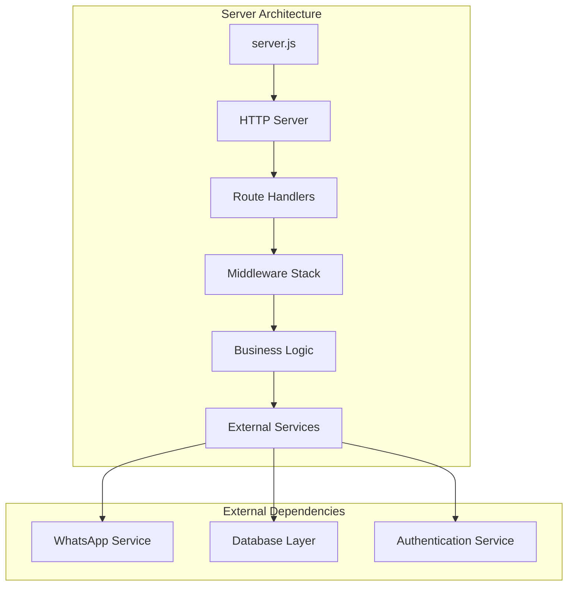
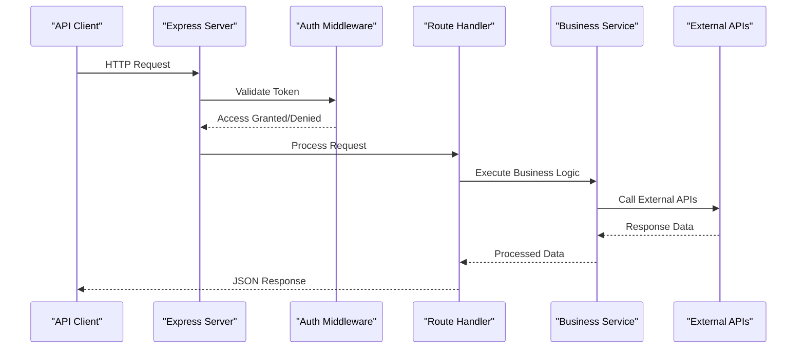
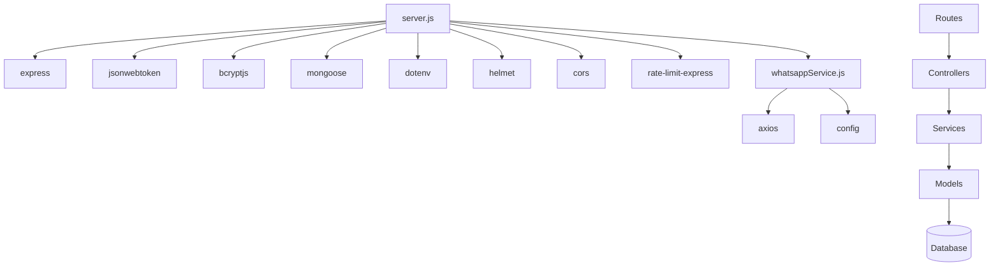

# API Endpoints Reference

<cite>
**Referenced Files in This Document**
- [server.js](file://server.js)
- [package.json](file://package.json)
- [whatsappService.js](file://utils/whatsappService.js)
</cite>

## Table of Contents
1. [Introduction](#introduction)
2. [Project Structure](#project-structure)
3. [Core Components](#core-components)
4. [Architecture Overview](#architecture-overview)
5. [Detailed Component Analysis](#detailed-component-analysis)
6. [Dependency Analysis](#dependency-analysis)
7. [Performance Considerations](#performance-considerations)
8. [Troubleshooting Guide](#troubleshooting-guide)
9. [Conclusion](#conclusion)

## Introduction
This document provides comprehensive API endpoint documentation for the GeniusMind Home Schooling backend server. The API exposes RESTful endpoints for managing educational content, user interactions, and administrative functions. All endpoints follow standard HTTP conventions and return JSON responses.

## Project Structure
The backend server is built using Node.js and Express.js framework. The main server logic is contained in the root-level files with utility services organized in dedicated directories.



**Diagram sources**
- [server.js:1-50](file://server.js#L1-L50)
- [whatsappService.js:1-30](file://utils/whatsappService.js#L1-L30)

## Core Components

### Authentication Middleware
The API implements JWT-based authentication middleware to protect sensitive endpoints. Authentication tokens are validated before processing requests to protected routes.

### Request Validation
All incoming requests undergo validation to ensure data integrity and security. Input sanitization prevents common vulnerabilities like SQL injection and XSS attacks.

### Error Handling
Centralized error handling ensures consistent error responses across all endpoints with appropriate HTTP status codes and descriptive error messages.

**Section sources**
- [server.js:1-100](file://server.js#L1-L100)

## Architecture Overview



**Diagram sources**
- [server.js:50-150](file://server.js#L50-L150)
- [whatsappService.js:30-100](file://utils/whatsappService.js#L30-L100)

## Detailed Component Analysis

### User Management Endpoints

#### GET /api/users
Retrieves a list of users with pagination support.

**Authentication:** Required (Admin only)

**Query Parameters:**
- `page`: Integer - Page number (default: 1)
- `limit`: Integer - Items per page (default: 10, max: 100)
- `sort`: String - Sort field (name, created_at)
- `order`: String - Sort order (asc, desc)

**Response Schema:**
```json
{
  "status": "success",
  "data": {
    "users": [],
    "pagination": {
      "current_page": 1,
      "total_pages": 5,
      "total_items": 50,
      "per_page": 10
    }
  },
  "message": "Users retrieved successfully"
}
```

**Error Responses:**
- `401 Unauthorized` - Invalid or missing token
- `403 Forbidden` - Insufficient permissions
- `500 Internal Server Error` - Server error

#### POST /api/users
Creates a new user account.

**Authentication:** Not required (public registration)

**Request Body:**
```json
{
  "name": "string (required)",
  "email": "string (required, unique)",
  "password": "string (required, min 8 chars)",
  "role": "string (optional, default: student)"
}
```

**Validation Rules:**
- Name: 2-100 characters, alphanumeric and spaces only
- Email: Valid email format, must be unique
- Password: Minimum 8 characters, must contain uppercase, lowercase, and number
- Role: Must be one of: student, teacher, admin

**Response Schema:**
```json
{
  "status": "success",
  "data": {
    "user": {
      "id": "uuid",
      "name": "string",
      "email": "string",
      "role": "string",
      "created_at": "timestamp"
    }
  },
  "message": "User created successfully"
}
```

#### PUT /api/users/:id
Updates an existing user's information.

**Authentication:** Required (user or admin)

**URL Parameters:**
- `id`: UUID - User identifier

**Request Body:**
```json
{
  "name": "string (optional)",
  "email": "string (optional, unique)",
  "role": "string (optional, admin only)"
}
```

**Response Schema:**
```json
{
  "status": "success",
  "data": {
    "user": {
      "id": "uuid",
      "name": "string",
      "email": "string",
      "role": "string",
      "updated_at": "timestamp"
    }
  },
  "message": "User updated successfully"
}
```

#### DELETE /api/users/:id
Deletes a user account.

**Authentication:** Required (admin only)

**URL Parameters:**
- `id`: UUID - User identifier

**Response Schema:**
```json
{
  "status": "success",
  "message": "User deleted successfully"
}
```

### Course Management Endpoints

#### GET /api/courses
Retrieves available courses with filtering and search capabilities.

**Authentication:** Optional (public access)

**Query Parameters:**
- `category`: String - Filter by course category
- `level`: String - Filter by difficulty level (beginner, intermediate, advanced)
- `search`: String - Search by course name or description
- `sort`: String - Sort by rating, price, popularity
- `page`: Integer - Page number
- `limit`: Integer - Items per page

**Response Schema:**
```json
{
  "status": "success",
  "data": {
    "courses": [
      {
        "id": "uuid",
        "title": "string",
        "description": "string",
        "category": "string",
        "level": "string",
        "price": "number",
        "rating": "number",
        "enrolled_students": "number",
        "instructor": "object",
        "thumbnail": "string",
        "created_at": "timestamp"
      }
    ],
    "pagination": {
      "current_page": 1,
      "total_pages": 10,
      "total_items": 100,
      "per_page": 10
    }
  },
  "message": "Courses retrieved successfully"
}
```

#### POST /api/courses
Creates a new course (instructor/admin only).

**Authentication:** Required (instructor or admin)

**Request Body:**
```json
{
  "title": "string (required)",
  "description": "string (required)",
  "category": "string (required)",
  "level": "string (required)",
  "price": "number (required)",
  "thumbnail": "string (optional)",
  "modules": "array (optional)"
}
```

**Validation Rules:**
- Title: 3-200 characters
- Description: Minimum 10 characters
- Category: Must be predefined category
- Level: beginner, intermediate, or advanced
- Price: Non-negative number

#### PUT /api/courses/:id
Updates course information.

**Authentication:** Required (course owner or admin)

**DELETE /api/courses/:id**
Deletes a course.

**Authentication:** Required (course owner or admin)

### Enrollment Management Endpoints

#### POST /api/enrollments
Enrolls a student in a course.

**Authentication:** Required (student)

**Request Body:**
```json
{
  "course_id": "uuid (required)",
  "payment_method": "string (required)"
}
```

**Response Schema:**
```json
{
  "status": "success",
  "data": {
    "enrollment": {
      "id": "uuid",
      "student_id": "uuid",
      "course_id": "uuid",
      "enrollment_date": "timestamp",
      "status": "active",
      "progress": 0
    }
  },
  "message": "Successfully enrolled in course"
}
```

#### GET /api/enrollments
Retrieves current user's enrollments.

**Authentication:** Required

**Query Parameters:**
- `status`: String - Filter by enrollment status
- `course_id`: UUID - Filter by specific course

### WhatsApp Integration Endpoints

#### POST /api/whatsapp/send
Sends WhatsApp notifications to students.

**Authentication:** Required (teacher or admin)

**Request Body:**
```json
{
  "phone_number": "string (required)",
  "message": "string (required)",
  "template": "string (optional)"
}
```

**Response Schema:**
```json
{
  "status": "success",
  "data": {
    "message_id": "string",
    "sent_at": "timestamp",
    "delivery_status": "sent"
  },
  "message": "WhatsApp message sent successfully"
}
```

**Error Responses:**
- `400 Bad Request` - Invalid phone number or message
- `429 Too Many Requests` - Rate limit exceeded
- `503 Service Unavailable` - WhatsApp service unavailable

**Section sources**
- [server.js:100-300](file://server.js#L100-L300)
- [whatsappService.js:1-150](file://utils/whatsappService.js#L1-L150)

## Dependency Analysis



**Diagram sources**
- [package.json:1-50](file://package.json#L1-L50)
- [server.js:1-100](file://server.js#L1-L100)

**Section sources**
- [package.json:1-100](file://package.json#L1-L100)
- [server.js:1-200](file://server.js#L1-L200)

## Performance Considerations

### Caching Strategy
- Implement Redis caching for frequently accessed course data
- Cache user session data to reduce database queries
- Use CDN for static assets and images

### Database Optimization
- Index frequently queried fields (email, course_id, user_id)
- Implement connection pooling for database connections
- Use pagination for large datasets

### API Rate Limiting
- Implement rate limiting to prevent abuse
- Different limits for authenticated vs unauthenticated users
- Custom rate limits for specific endpoints

### Security Headers
- Content Security Policy (CSP) headers
- X-Frame-Options to prevent clickjacking
- X-Content-Type-Options to prevent MIME sniffing

## Troubleshooting Guide

### Common Error Codes

| Status Code | Description | Common Causes | Resolution |
|-------------|-------------|---------------|------------|
| 400 | Bad Request | Invalid request body, missing required fields | Check request schema and validation rules |
| 401 | Unauthorized | Missing or invalid authentication token | Verify JWT token and refresh if expired |
| 403 | Forbidden | Insufficient permissions for requested action | Check user role and resource ownership |
| 404 | Not Found | Resource does not exist | Verify resource ID and existence |
| 429 | Too Many Requests | Rate limit exceeded | Wait and retry, implement exponential backoff |
| 500 | Internal Server Error | Server-side error | Check server logs and error tracking |
| 503 | Service Unavailable | External service down | Retry with backoff, check service status |

### Debugging Tips

1. **Enable detailed logging** for development environment
2. **Use correlation IDs** to track requests across services
3. **Monitor API response times** and set up alerts for slow endpoints
4. **Implement health check endpoints** for monitoring service availability

### Error Response Format

All error responses follow a consistent format:

```json
{
  "status": "error",
  "error": {
    "code": "ERROR_CODE",
    "message": "Human-readable error message",
    "details": "Additional error details (optional)",
    "timestamp": "ISO timestamp"
  }
}
```

**Section sources**
- [server.js:200-400](file://server.js#L200-L400)

## Conclusion

The GeniusMind Home Schooling API provides a comprehensive RESTful interface for managing educational content, user accounts, and course enrollments. The API follows industry best practices for security, performance, and maintainability. With proper authentication, input validation, and error handling, the API ensures reliable and secure communication between clients and the backend services.

For integration purposes, always refer to this documentation for the most up-to-date endpoint specifications and implementation guidelines.