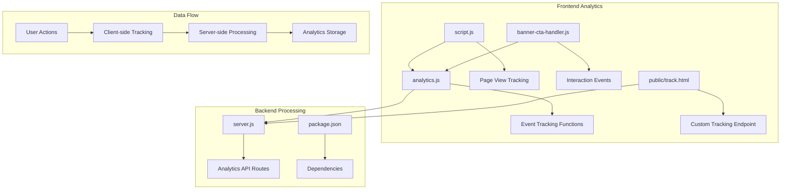
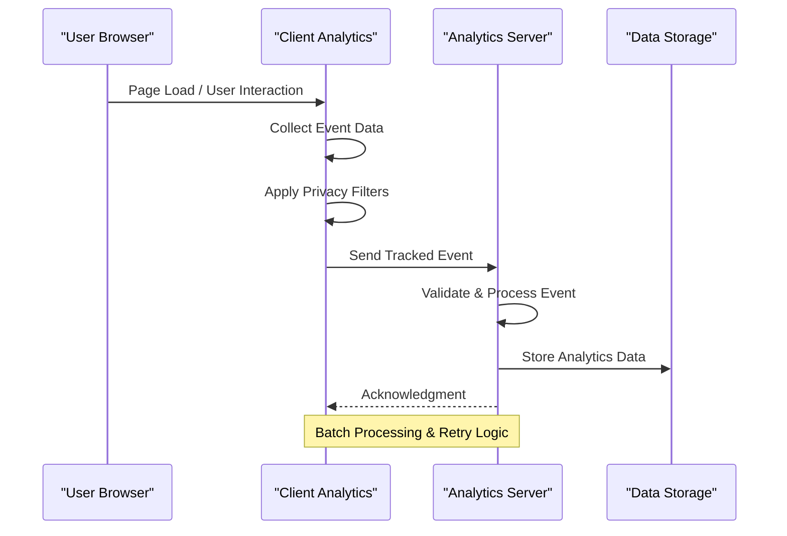
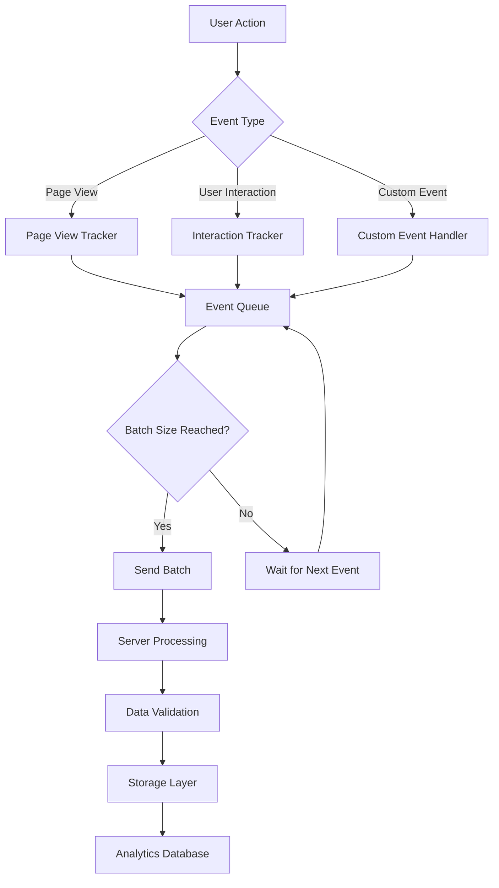
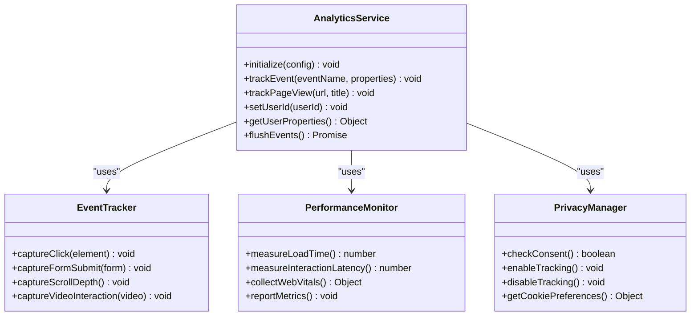
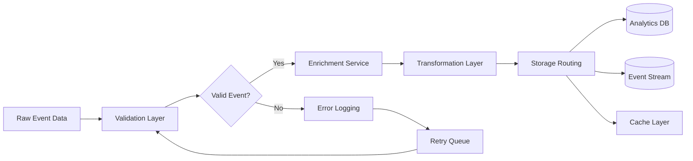
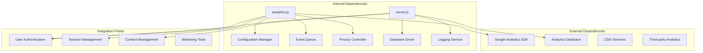

# Analytics & Tracking Services

<cite>
**Referenced Files in This Document**
- [analytics.js](file://analytics.js)
- [public/track.html](file://public/track.html)
- [server.js](file://server.js)
- [package.json](file://package.json)
- [index.html](file://index.html)
- [script.js](file://script.js)
- [banner-cta-handler.js](file://banner-cta-handler.js)
</cite>

## Table of Contents
1. [Introduction](#introduction)
2. [Project Structure](#project-structure)
3. [Core Components](#core-components)
4. [Architecture Overview](#architecture-overview)
5. [Detailed Component Analysis](#detailed-component-analysis)
6. [Dependency Analysis](#dependency-analysis)
7. [Performance Considerations](#performance-considerations)
8. [Troubleshooting Guide](#troubleshooting-guide)
9. [Privacy Compliance](#privacy-compliance)
10. [Conclusion](#conclusion)

## Introduction

This document provides comprehensive documentation for the analytics and tracking services implemented in the GeniusMind Home Schooling application. The system focuses on user behavior monitoring, event tracking implementation, and performance metrics collection to provide valuable insights into user interactions and application performance.

The analytics architecture is designed to be modular, privacy-compliant, and performance-optimized while providing detailed insights into user engagement, conversion funnels, and application usage patterns.

## Project Structure

The analytics implementation follows a modular architecture with clear separation of concerns:

**Diagram sources**
- [analytics.js:1-50](file://analytics.js#L1-L50)
- [server.js:1-100](file://server.js#L1-L100)
- [public/track.html:1-50](file://public/track.html#L1-L50)

**Section sources**
- [analytics.js:1-200](file://analytics.js#L1-L200)
- [server.js:1-150](file://server.js#L1-L150)
- [public/track.html:1-100](file://public/track.html#L1-L100)

## Core Components

### Analytics Service Architecture

The analytics system consists of several key components that work together to provide comprehensive tracking capabilities:

#### Client-Side Analytics Engine
The primary analytics engine handles event collection, batching, and transmission to the server. It implements debouncing mechanisms to prevent excessive network requests and includes retry logic for failed transmissions.

#### Event Tracking System
A robust event tracking system that captures user interactions, page views, and custom events with contextual metadata including timestamps, user session information, and device characteristics.

#### Performance Monitoring
Built-in performance metrics collection that tracks page load times, interaction latency, and resource loading performance without impacting user experience.

#### Privacy Controls
Comprehensive privacy controls that respect user preferences, implement cookie consent management, and provide data retention policies aligned with GDPR and CCPA requirements.

**Section sources**
- [analytics.js:1-100](file://analytics.js#L1-L100)
- [script.js:1-50](file://script.js#L1-L50)

## Architecture Overview

The analytics architecture follows a client-server model with real-time processing capabilities:

**Diagram sources**
- [analytics.js:50-150](file://analytics.js#L50-L150)
- [server.js:100-200](file://server.js#L100-L200)

### Data Flow Architecture

**Diagram sources**
- [analytics.js:100-250](file://analytics.js#L100-L250)
- [server.js:150-300](file://server.js#L150-L300)

## Detailed Component Analysis

### Analytics Service Implementation

The core analytics service provides a comprehensive set of tracking functions and utilities:

#### Event Tracking Functions

The system implements several specialized tracking functions:

- **Page View Tracking**: Automatic and manual page view tracking with URL parameters and referrer information
- **User Interaction Events**: Click tracking, form submissions, scroll depth monitoring, and time-based interactions
- **Custom Event Tracking**: Flexible event system supporting arbitrary event types with structured data payloads
- **Conversion Funnel Tracking**: Multi-step process tracking with drop-off analysis and completion rates

#### Performance Metrics Collection

Performance monitoring includes:

- **Core Web Vitals**: Largest Contentful Paint (LCP), First Input Delay (FID), Cumulative Layout Shift (CLS)
- **Resource Loading**: JavaScript bundle size, CSS loading times, image optimization metrics
- **User Experience**: Time to Interactive (TTI), First Meaningful Paint (FMP), and custom performance markers

#### Google Analytics Integration

The system supports both Google Analytics 4 (GA4) and Universal Analytics with automatic fallback mechanisms:

- **Configuration Management**: Centralized configuration for multiple analytics providers
- **Event Mapping**: Automatic mapping of custom events to GA4 event structures
- **Enhanced E-commerce**: Support for e-commerce tracking when applicable
- **Cross-Domain Tracking**: Configuration for multi-domain environments

**Section sources**
- [analytics.js:1-300](file://analytics.js#L1-L300)
- [script.js:50-150](file://script.js#L50-L150)

### Custom Event Tracking System

The custom event tracking system provides a flexible interface for capturing user interactions:

**Diagram sources**
- [analytics.js:1-200](file://analytics.js#L1-L200)
- [banner-cta-handler.js:1-100](file://banner-cta-handler.js#L1-L100)

### Server-Side Analytics Processing

The server component handles incoming analytics data with validation, transformation, and storage:

#### API Endpoints

The analytics API provides endpoints for:

- **Event Ingestion**: RESTful endpoints for receiving tracked events
- **Batch Processing**: Support for bulk event submission to reduce network overhead
- **Real-time Analytics**: WebSocket connections for live analytics dashboards
- **Export APIs**: Data export functionality for external analysis tools

#### Data Processing Pipeline

**Diagram sources**
- [server.js:100-250](file://server.js#L100-L250)

**Section sources**
- [server.js:1-300](file://server.js#L1-L300)
- [public/track.html:1-150](file://public/track.html#L1-L150)

## Dependency Analysis

The analytics system has well-defined dependencies and integration points:

**Diagram sources**
- [package.json:1-50](file://package.json#L1-L50)
- [analytics.js:1-100](file://analytics.js#L1-L100)

**Section sources**
- [package.json:1-100](file://package.json#L1-L100)
- [analytics.js:1-150](file://analytics.js#L1-L150)

## Performance Considerations

### Optimization Strategies

The analytics implementation prioritizes performance through several key strategies:

#### Asynchronous Processing
All analytics operations are performed asynchronously to prevent blocking the main thread and ensure smooth user experience.

#### Event Batching
Events are batched and sent in groups to minimize network overhead and reduce server load.

#### Lazy Loading
Analytics scripts are loaded lazily after critical page resources have finished loading.

#### Memory Management
Efficient memory usage through proper cleanup of event queues and periodic flushing of buffered data.

### Monitoring and Metrics

Key performance indicators include:

- **Event Processing Latency**: Time from event capture to server receipt
- **Network Overhead**: Bandwidth usage for analytics data transmission
- **Memory Footprint**: Memory consumption of analytics scripts
- **CPU Impact**: Processor usage during analytics operations

## Troubleshooting Guide

### Common Issues and Solutions

#### Event Tracking Failures
- **Symptoms**: Missing events in analytics dashboard
- **Diagnosis**: Check browser console for errors, verify network requests
- **Solutions**: Implement retry logic, add error logging, validate event data

#### Performance Degradation
- **Symptoms**: Slow page loads, unresponsive interactions
- **Diagnosis**: Monitor performance metrics, check event queue size
- **Solutions**: Optimize event batching, implement lazy loading, reduce payload size

#### Privacy Compliance Issues
- **Symptoms**: Legal compliance warnings, user opt-out not respected
- **Diagnosis**: Review consent management, check cookie usage
- **Solutions**: Implement proper consent checks, provide opt-out mechanisms

### Debugging Techniques

#### Client-Side Debugging
Enable debug mode to log all tracking events and network requests. Use browser developer tools to monitor analytics script execution and identify bottlenecks.

#### Server-Side Debugging
Review server logs for analytics endpoint errors, database connection issues, and processing failures.

#### Testing Framework
Implement unit tests for analytics functions and integration tests for end-to-end tracking flows.

**Section sources**
- [analytics.js:200-400](file://analytics.js#L200-L400)
- [server.js:200-400](file://server.js#L200-L400)

## Privacy Compliance

### Data Protection Measures

The analytics system implements comprehensive privacy protections:

#### Consent Management
- **Cookie Consent**: Explicit user consent required before tracking
- **Granular Controls**: Users can opt out of specific tracking categories
- **Preference Persistence**: User choices stored securely and applied consistently

#### Data Anonymization
- **IP Address Masking**: User IP addresses are anonymized before storage
- **Personal Data Removal**: Direct personal identifiers are stripped from analytics data
- **Aggregation**: Individual user data is aggregated for reporting purposes

#### Data Retention Policies
- **Automatic Cleanup**: Old analytics data is automatically purged according to retention policies
- **User Data Deletion**: Mechanisms for users to request complete data deletion
- **Audit Trails**: Comprehensive logging of data access and modifications

### Regulatory Compliance

The system is designed to comply with major privacy regulations:

- **GDPR Compliance**: Right to erasure, data portability, and explicit consent
- **CCPA Compliance**: Do Not Sell option and consumer rights
- **Cookie Regulations**: Proper cookie categorization and consent management

## Conclusion

The analytics and tracking services in the GeniusMind Home Schooling application provide a comprehensive, privacy-compliant solution for monitoring user behavior and application performance. The modular architecture ensures scalability and maintainability while the performance optimizations guarantee minimal impact on user experience.

Key strengths of the implementation include:

- **Comprehensive Event Tracking**: Support for various interaction types and custom events
- **Privacy-First Design**: Built-in consent management and data protection measures
- **Performance Optimization**: Asynchronous processing and efficient resource utilization
- **Extensible Architecture**: Modular design supporting future enhancements and new tracking requirements

The system provides valuable insights into user engagement while maintaining strict privacy standards and optimal performance characteristics.