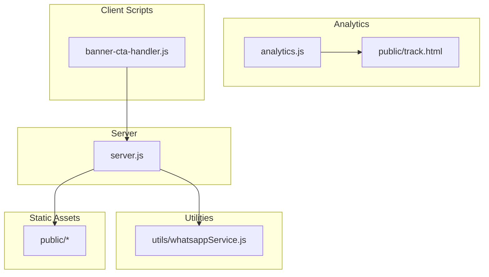
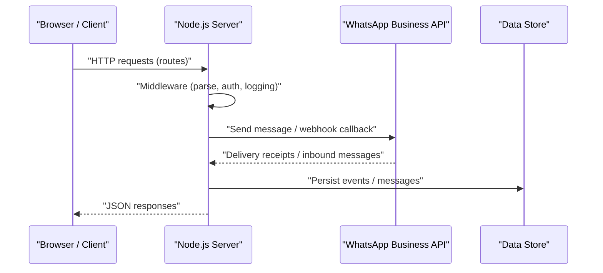
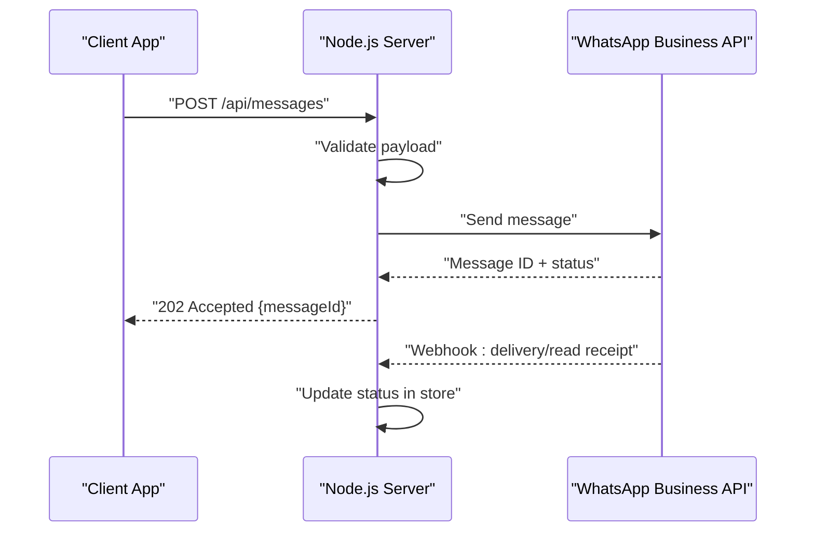
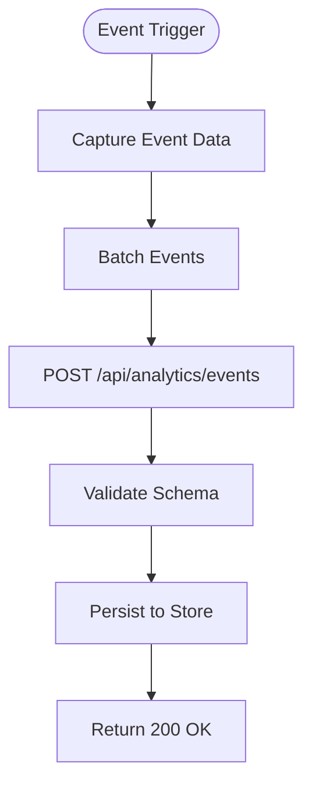
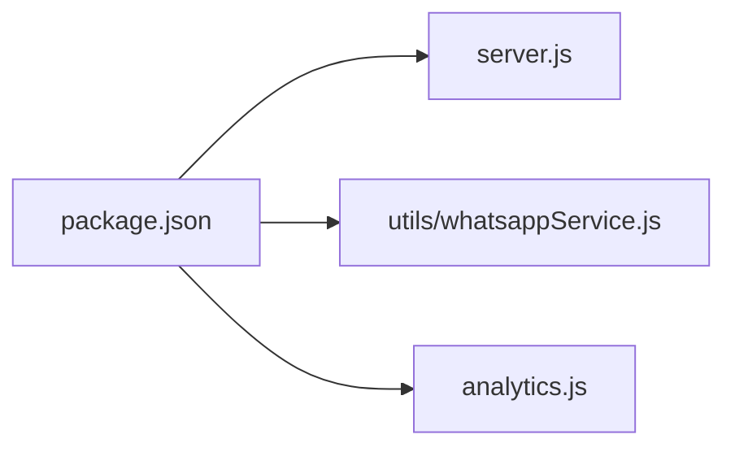

# Backend Services & API

<cite>
**Referenced Files in This Document**
- [server.js](file://server.js)
- [package.json](file://package.json)
- [utils/whatsappService.js](file://utils/whatsappService.js)
- [analytics.js](file://analytics.js)
- [public/track.html](file://public/track.html)
- [banner-cta-handler.js](file://banner-cta-handler.js)
</cite>

## Table of Contents
1. [Introduction](#introduction)
2. [Project Structure](#project-structure)
3. [Core Components](#core-components)
4. [Architecture Overview](#architecture-overview)
5. [Detailed Component Analysis](#detailed-component-analysis)
6. [Dependency Analysis](#dependency-analysis)
7. [Performance Considerations](#performance-considerations)
8. [Troubleshooting Guide](#troubleshooting-guide)
9. [Conclusion](#conclusion)
10. [Appendices](#appendices)

## Introduction
This document describes the backend services and API for the project, focusing on the Node.js server architecture, middleware configuration, route definitions, request/response handling patterns, WhatsApp Business API integration, analytics tracking, error handling strategies, security measures, and a complete API reference with authentication methods. It is intended for developers integrating with or extending the system.

## Project Structure
The repository follows a minimal Node.js server layout with:
- A single entry point for the HTTP server
- Utility modules for external integrations (e.g., WhatsApp)
- Client-side analytics and tracking assets
- Static public assets served by the server

**Diagram sources**
- [server.js](file://server.js)
- [utils/whatsappService.js](file://utils/whatsappService.js)
- [analytics.js](file://analytics.js)
- [public/track.html](file://public/track.html)
- [banner-cta-handler.js](file://banner-cta-handler.js)

**Section sources**
- [server.js](file://server.js)
- [package.json](file://package.json)

## Core Components
- Server entrypoint: Initializes the HTTP server, configures middleware, mounts routes, and starts listening.
- WhatsApp service utility: Encapsulates WhatsApp Business API calls and message routing logic.
- Analytics module: Provides client-side event tracking and optional server endpoints for ingestion.
- Public assets: Static files including a lightweight tracking page used by client scripts.
- Client script: Handles UI interactions and forwards events to the server or tracking endpoint.

Key responsibilities:
- Request lifecycle management (parse, validate, respond)
- External service integration (WhatsApp)
- Event collection and persistence (analytics)
- Security and error handling across layers

**Section sources**
- [server.js](file://server.js)
- [utils/whatsappService.js](file://utils/whatsappService.js)
- [analytics.js](file://analytics.js)
- [public/track.html](file://public/track.html)
- [banner-cta-handler.js](file://banner-cta-handler.js)

## Architecture Overview
High-level flow from client to server and external services:

**Diagram sources**
- [server.js](file://server.js)
- [utils/whatsappService.js](file://utils/whatsappService.js)

## Detailed Component Analysis

### Server Initialization and Middleware
Responsibilities:
- Parse incoming payloads (JSON, form data)
- Apply global middleware (logging, CORS, rate limiting if configured)
- Mount application routes
- Start the HTTP listener on a configured port

Operational notes:
- Ensure environment variables are loaded before starting the server
- Centralize error-handling middleware to standardize responses
- Use structured logging for observability

**Section sources**
- [server.js](file://server.js)

### Route Definitions and Request/Response Handling
Patterns:
- RESTful endpoints under a consistent base path
- JSON request/response bodies with clear schemas
- Validation at the route layer before business logic
- Consistent error envelope for failures

Request lifecycle:
- Receive request
- Validate inputs
- Execute business logic
- Persist state if needed
- Return standardized response

**Section sources**
- [server.js](file://server.js)

### WhatsApp Business API Integration
Capabilities:
- Outbound messaging via WhatsApp Business API
- Inbound webhook processing for two-way communication
- Message routing based on content or metadata
- Delivery status and read receipts handling

Integration points:
- Authentication using platform credentials
- Payload formatting per WhatsApp schema
- Retry/backoff for transient failures
- Idempotency keys to prevent duplicate sends

**Diagram sources**
- [utils/whatsappService.js](file://utils/whatsappService.js)
- [server.js](file://server.js)

**Section sources**
- [utils/whatsappService.js](file://utils/whatsappService.js)
- [server.js](file://server.js)

### Analytics Tracking Implementation
Features:
- Client-side event capture and batching
- Lightweight tracking endpoint for ingestion
- Optional server-side enrichment and persistence

Flow:
- Client emits events
- Events sent to tracking endpoint
- Server validates and stores events
- Aggregation/reporting can be added later

**Diagram sources**
- [analytics.js](file://analytics.js)
- [public/track.html](file://public/track.html)
- [server.js](file://server.js)

**Section sources**
- [analytics.js](file://analytics.js)
- [public/track.html](file://public/track.html)
- [server.js](file://server.js)

### Client-Side Interaction Handler
Purpose:
- Intercepts user actions (e.g., banner CTA clicks)
- Collects contextual metadata
- Sends events to the analytics endpoint or triggers server actions

Behavior:
- Debounce rapid clicks
- Fallback on network errors
- Respect privacy settings and consent

**Section sources**
- [banner-cta-handler.js](file://banner-cta-handler.js)

## Dependency Analysis
External dependencies are declared in the package manifest. The server imports core modules and any third-party libraries required for HTTP serving, parsing, WhatsApp integration, and analytics storage.

**Diagram sources**
- [package.json](file://package.json)
- [server.js](file://server.js)
- [utils/whatsappService.js](file://utils/whatsappService.js)
- [analytics.js](file://analytics.js)

**Section sources**
- [package.json](file://package.json)

## Performance Considerations
- Keep payloads small; use pagination for lists
- Cache static assets and enable compression where appropriate
- Rate limit sensitive endpoints (auth, messaging)
- Use connection pooling for external APIs
- Implement retries with exponential backoff for WhatsApp calls
- Monitor latency and error rates via structured logs

[No sources needed since this section provides general guidance]

## Troubleshooting Guide
Common issues and resolutions:
- Invalid request body: Ensure content-type and schema match expectations
- WhatsApp send failures: Check credentials, phone number format, and template IDs
- Webhook signature verification: Confirm secret and timestamp validation
- Analytics ingestion errors: Validate event schema and required fields
- CORS issues: Verify allowed origins and methods

Operational checks:
- Inspect server logs for stack traces and request IDs
- Validate environment variables (ports, secrets, URLs)
- Test endpoints with a tool that supports raw JSON payloads

**Section sources**
- [server.js](file://server.js)
- [utils/whatsappService.js](file://utils/whatsappService.js)
- [analytics.js](file://analytics.js)

## Conclusion
The backend provides a concise Node.js server with modular utilities for WhatsApp messaging and analytics. By centralizing middleware, enforcing request/response schemas, and implementing robust error handling, the system remains maintainable and extensible. Future enhancements may include stronger authentication, richer analytics pipelines, and more granular route organization.

[No sources needed since this section summarizes without analyzing specific files]

## Appendices

### API Reference

Base URL: https://your-domain.com/api

Authentication:
- Method: API Key header
- Header name: X-API-Key
- Scope: Required for protected endpoints

Endpoints:

- POST /api/messages
  - Purpose: Send a WhatsApp message
  - Auth: Required
  - Request body:
    - phone_number: string (E.164 format)
    - message_type: string ("text" | "template")
    - text: string (required when message_type is "text")
    - template_name: string (required when message_type is "template")
    - language_code: string (ISO code, required for templates)
    - components: array (optional, template parameters)
  - Response 202 Accepted:
    - message_id: string
    - status: string ("queued" | "sent")
  - Errors:
    - 400 Bad Request: invalid payload
    - 401 Unauthorized: missing/invalid API key
    - 429 Too Many Requests: rate limited
    - 500 Internal Server Error: provider failure

- GET /api/messages/:message_id
  - Purpose: Retrieve message status
  - Auth: Required
  - Response 200 OK:
    - message_id: string
    - status: string ("delivered" | "read" | "failed")
    - error_code: number (optional)
    - error_message: string (optional)

- POST /api/analytics/events
  - Purpose: Ingest analytics events
  - Auth: Optional (if enabled)
  - Request body:
    - events: array of objects
      - event_name: string
      - timestamp: string (ISO 8601)
      - properties: object (key-value pairs)
  - Response 200 OK:
    - accepted_count: number

Notes:
- All responses use JSON
- Include correlation_id in headers for tracing
- Respect retry-after on 429 responses

[No sources needed since this section defines API contracts conceptually]