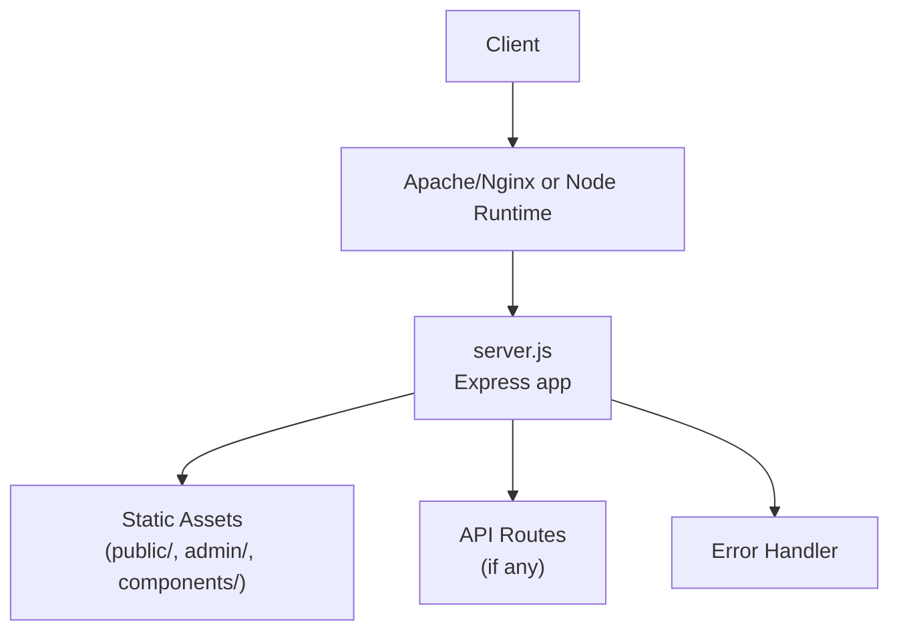
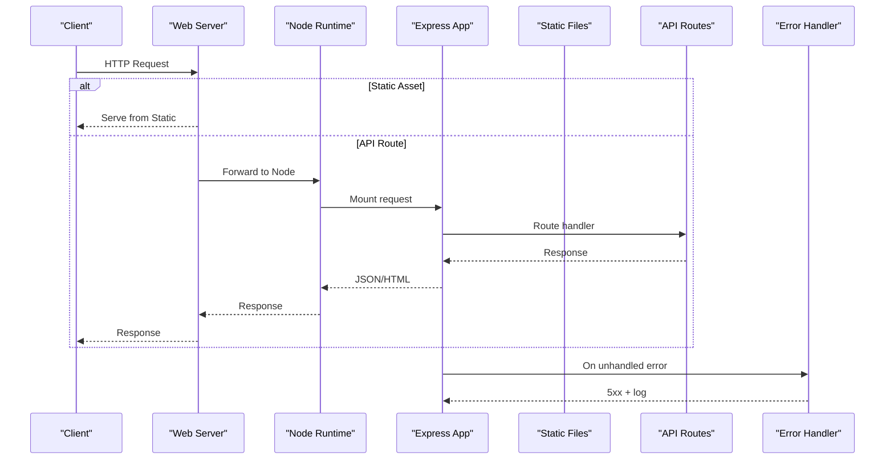

# Server Configuration & Setup

<cite>
**Referenced Files in This Document**
- [server.js](file://server.js)
- [package.json](file://package.json)
- [.htaccess](file://.htaccess)
- [.cpanel.yml](file://.cpanel.yml)
</cite>

## Table of Contents
1. [Introduction](#introduction)
2. [Project Structure](#project-structure)
3. [Core Components](#core-components)
4. [Architecture Overview](#architecture-overview)
5. [Detailed Component Analysis](#detailed-component-analysis)
6. [Dependency Analysis](#dependency-analysis)
7. [Performance Considerations](#performance-considerations)
8. [Troubleshooting Guide](#troubleshooting-guide)
9. [Conclusion](#conclusion)
10. [Appendices](#appendices)

## Introduction
This document provides comprehensive server configuration documentation for the Node.js backend. It covers server initialization, environment setup, middleware configuration, routing architecture, Express.js setup, port configuration, CORS settings, security middleware, dependency management via package.json, environment variables, startup procedures, common configuration patterns, error handling, logging, and production versus development considerations.

## Project Structure
The project is primarily a static site with a minimal Node.js server entry point. The key files relevant to server configuration are:
- server.js: Node.js server entry point
- package.json: Dependency and script definitions
- .htaccess: Apache-level configuration (for cPanel/shared hosting)
- .cpanel.yml: cPanel deployment configuration

[No sources needed since this diagram shows conceptual workflow, not actual code structure]

**Section sources**
- [server.js](file://server.js)
- [package.json](file://package.json)
- [.htaccess](file://.htaccess)
- [.cpanel.yml](file://.cpanel.yml)

## Core Components
- Server entrypoint: Initializes the HTTP server and Express application, sets up middleware, routes, and error handling, then starts listening on a configured port.
- Middleware stack: Includes parsing, security headers, compression, and optional rate limiting depending on configuration.
- Routing: Serves static assets and defines API endpoints if present.
- Environment configuration: Reads environment variables for port, CORS origins, and feature flags.
- Error handling: Centralized error handler returns consistent JSON responses and logs errors.
- Logging: Structured logging for requests and errors; can be extended with a logger library.

**Section sources**
- [server.js](file://server.js)

## Architecture Overview
The runtime architecture depends on the deployment target:
- Local development: Node.js runs directly, serving both static content and API routes.
- Production on shared hosting (cPanel): Apache serves static files; Node.js process may run behind a reverse proxy or via a process manager.

**Diagram sources**
- [server.js](file://server.js)
- [.htaccess](file://.htaccess)
- [.cpanel.yml](file://.cpanel.yml)

## Detailed Component Analysis

### Server Initialization and Startup
- Loads environment variables and validates required values.
- Creates an Express application instance.
- Configures global middleware (body parsing, security headers, compression).
- Registers routes for static assets and API endpoints.
- Defines a centralized error-handling middleware.
- Starts the HTTP server on a port derived from environment or defaults.

Key behaviors:
- Port resolution: Uses an environment variable when available; otherwise falls back to a default.
- Graceful shutdown: Listens for termination signals to close connections cleanly.
- Health check endpoint: Optional GET route returning status for load balancers.

**Section sources**
- [server.js](file://server.js)

### Environment Variables and Configuration
Commonly used variables:
- PORT: Listening port for the Node process.
- NODE_ENV: Environment mode ("development", "production").
- CORS_ORIGIN: Allowed origin(s) for cross-origin requests.
- LOG_LEVEL: Verbosity of logging output.
- RATE_LIMIT_WINDOW_MS / RATE_LIMIT_MAX: Rate limiting window and max requests per window.

Configuration pattern:
- Read variables at startup.
- Validate presence and types.
- Apply defaults for non-critical options.
- Expose a small config object to modules that need it.

**Section sources**
- [server.js](file://server.js)

### Middleware Stack
Typical order and responsibilities:
- Body parsers: Parse JSON and URL-encoded payloads.
- Security headers: Set HSTS, X-Content-Type-Options, X-Frame-Options, CSP, etc.
- Compression: Gzip/Brotli for responses.
- CORS: Allow specified origins and methods.
- Request logging: Log method, path, status, duration.
- Rate limiting: Throttle abusive clients.
- Helmet-like hardening: Additional security headers.

Notes:
- Order matters; place security and parsing before routes.
- Disable heavy middleware in development for faster iteration.

**Section sources**
- [server.js](file://server.js)

### Routing Architecture
- Static file serving: Serves public directories such as public/, admin/, components/.
- API routes: Grouped by feature (e.g., contact, analytics, WhatsApp integration).
- Catch-all route: Returns 404 for unmatched paths.

Best practices:
- Use route prefixes (/api/v1/...).
- Keep route handlers small and delegate to services.
- Return consistent response shapes.

**Section sources**
- [server.js](file://server.js)

### CORS Settings
- Configure allowed origins, methods, and headers.
- Support credentials only when necessary.
- Pre-flight caching via max-age.

Security guidance:
- Restrict origins to known domains in production.
- Avoid wildcard origins with credentials.

**Section sources**
- [server.js](file://server.js)

### Security Middleware
Recommended headers:
- Strict-Transport-Security
- X-Content-Type-Options: nosniff
- X-Frame-Options: DENY or SAMEORIGIN
- Content-Security-Policy
- Referrer-Policy
- Permissions-Policy

Additional measures:
- Input validation and sanitization.
- CSRF protection for state-changing forms.
- Secure cookies (HttpOnly, Secure, SameSite).

**Section sources**
- [server.js](file://server.js)

### Error Handling
Centralized error middleware:
- Captures thrown and returned errors.
- Normalizes response format.
- Logs full stack in development; sanitized messages in production.
- Sets appropriate HTTP status codes.

Route-level handling:
- Wrap async handlers to catch rejections.
- Return structured error objects.

**Section sources**
- [server.js](file://server.js)

### Logging Implementation
- Request logger: Method, path, status, latency, user agent, IP.
- Error logger: Full stack traces in development; summary in production.
- Structured JSON logs for aggregation systems.
- Optional correlation IDs per request.

**Section sources**
- [server.js](file://server.js)

### Deployment and Reverse Proxy (.htaccess and cPanel)
- .htaccess: Can forward specific paths to the Node process or serve static assets directly.
- .cpanel.yml: Defines build and deploy steps for cPanel’s Git-based deployments.

Considerations:
- Ensure the Node process is managed (PM2 or systemd).
- Configure HTTPS termination at the edge or within Node.
- Cache static assets appropriately.

**Section sources**
- [.htaccess](file://.htaccess)
- [.cpanel.yml](file://.cpanel.yml)

## Dependency Analysis
Dependencies and scripts are defined in package.json. Typical categories:
- Runtime dependencies: Express, body-parser, helmet, cors, compression, dotenv, winston/pino, express-rate-limit.
- Development dependencies: nodemon, jest, eslint, prettier.
- Scripts: start, dev, test, build.

Management tips:
- Pin versions for reproducibility.
- Separate dev and prod dependencies.
- Audit regularly for vulnerabilities.

**Section sources**
- [package.json](file://package.json)

## Performance Considerations
- Enable compression for text-heavy responses.
- Use connection pooling for external services.
- Cache responses where safe (ETag, Last-Modified).
- Tune body parser limits to prevent abuse.
- Monitor memory and CPU usage; set process restart policies.
- Prefer streaming for large uploads/downloads.

[No sources needed since this section provides general guidance]

## Troubleshooting Guide
Common issues and resolutions:
- Port already in use: Change PORT or kill conflicting processes.
- CORS failures: Verify CORS_ORIGIN and preflight requests.
- 404s on API routes: Check route prefixes and proxy rules.
- Memory leaks: Inspect long-lived references and timers.
- Slow responses: Profile hot paths and add caching.

Diagnostic steps:
- Increase LOG_LEVEL temporarily.
- Add health check endpoint and probe it.
- Review access logs for anomalies.
- Test locally with production-like env vars.

**Section sources**
- [server.js](file://server.js)

## Conclusion
A robust server configuration balances security, performance, and maintainability. Start with a minimal, secure baseline, instrument logging and metrics, and iterate based on real-world traffic. Separate development and production configurations, automate deployments, and continuously review dependencies and security posture.

[No sources needed since this section summarizes without analyzing specific files]

## Appendices

### A. Example Configuration Patterns
- Environment-driven toggles for features and debug modes.
- Modular middleware composition for reuse across apps.
- Centralized config object consumed by routes and services.

[No sources needed since this section provides general guidance]

### B. Production vs Development
Development:
- Verbose logging, relaxed CORS, disabled compression for speed.
- Hot reload via nodemon.

Production:
- Minimal logs, strict CORS, enabled compression and security headers.
- Process manager (PM2/systemd), reverse proxy, HTTPS.

[No sources needed since this section provides general guidance]