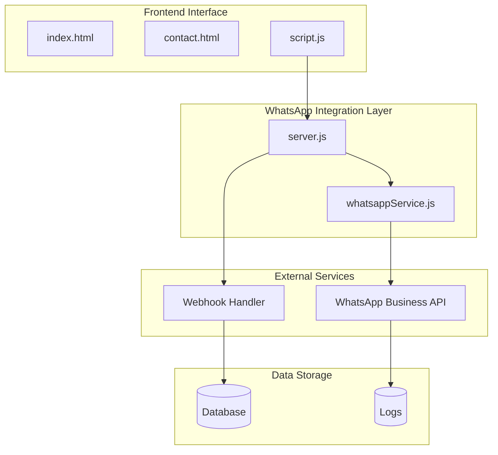
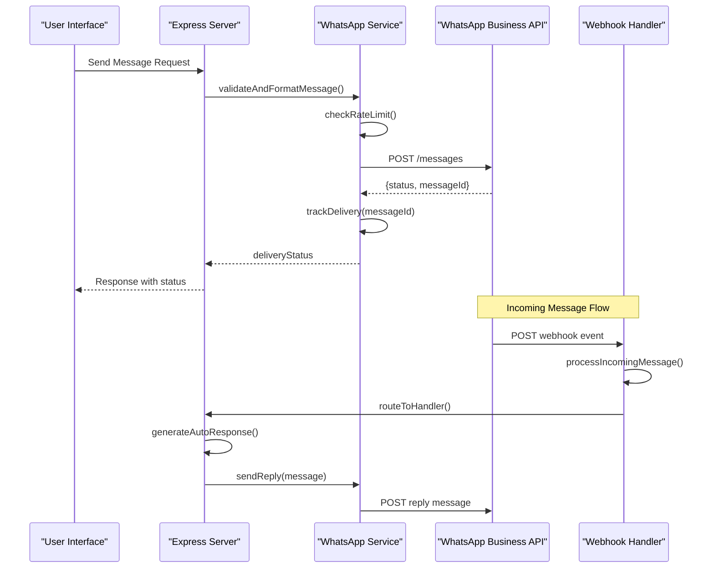
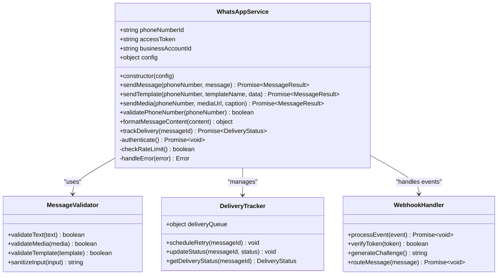
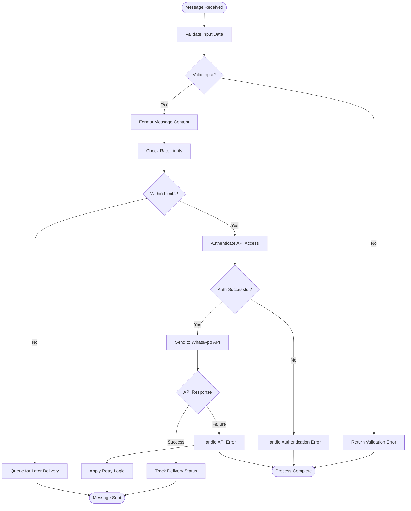
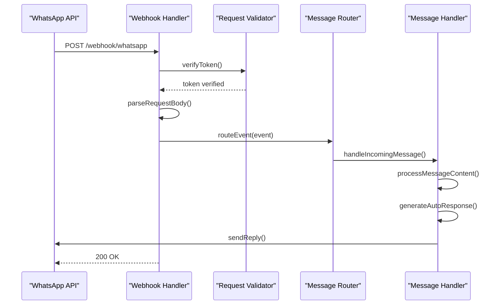
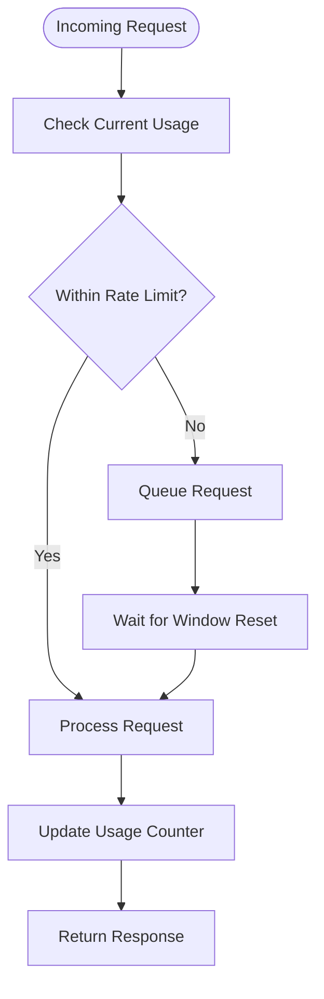

# WhatsApp Business API Integration

<cite>
**Referenced Files in This Document**
- [whatsappService.js](file://utils/whatsappService.js)
- [server.js](file://server.js)
- [package.json](file://package.json)
- [index.html](file://index.html)
- [contact.html](file://contact.html)
- [script.js](file://script.js)
</cite>

## Table of Contents
1. [Introduction](#introduction)
2. [Project Structure](#project-structure)
3. [Core Components](#core-components)
4. [Architecture Overview](#architecture-overview)
5. [Detailed Component Analysis](#detailed-component-analysis)
6. [Configuration Setup](#configuration-setup)
7. [Message Types and Templates](#message-types-and-templates)
8. [Webhook Handling](#webhook-handling)
9. [Error Handling and Rate Limiting](#error-handling-and-rate-limiting)
10. [Security Practices](#security-practices)
11. [Performance Considerations](#performance-considerations)
12. [Troubleshooting Guide](#troubleshooting-guide)
13. [Conclusion](#conclusion)

## Introduction

This document provides comprehensive documentation for integrating WhatsApp Business API into the GeniusMind Home Schooling platform. The integration enables two-way communication between students, parents, and the educational platform through WhatsApp messaging, including automated responses, notification systems, and message routing capabilities.

The WhatsApp Business API integration supports various message types including text messages, media files, and pre-approved templates, facilitating effective communication for educational purposes such as course notifications, assignment reminders, and parent-teacher communication.

## Project Structure

The WhatsApp Business API integration is implemented within the existing Node.js web application structure. The main components are organized as follows:

**Diagram sources**
- [whatsappService.js:1-50](file://utils/whatsappService.js#L1-L50)
- [server.js:1-100](file://server.js#L1-L100)

**Section sources**
- [whatsappService.js:1-200](file://utils/whatsappService.js#L1-L200)
- [server.js:1-150](file://server.js#L1-L150)

## Core Components

### WhatsApp Service Module

The core WhatsApp functionality is encapsulated in the service module, which handles all interactions with the WhatsApp Business API. This component manages authentication, message formatting, delivery tracking, and error handling.

Key responsibilities include:
- API authentication and session management
- Message composition and validation
- Delivery status tracking
- Error handling and retry logic
- Rate limiting compliance

### Server Integration

The server module integrates WhatsApp functionality with the existing web application, providing RESTful endpoints for sending messages and handling incoming webhooks from WhatsApp.

### Frontend Integration

The frontend components provide user interfaces for initiating WhatsApp communications and displaying message status to users.

**Section sources**
- [whatsappService.js:1-100](file://utils/whatsappService.js#L1-L100)
- [server.js:50-200](file://server.js#L50-L200)

## Architecture Overview

The WhatsApp Business API integration follows a modular architecture pattern that separates concerns between API communication, business logic, and presentation layers.

**Diagram sources**
- [server.js:100-300](file://server.js#L100-L300)
- [whatsappService.js:50-200](file://utils/whatsappService.js#L50-L200)

## Detailed Component Analysis

### WhatsApp Service Architecture

The WhatsApp service module implements a comprehensive set of classes and functions to manage WhatsApp Business API interactions.

**Diagram sources**
- [whatsappService.js:1-150](file://utils/whatsappService.js#L1-L150)

### Message Processing Pipeline

The message processing pipeline ensures proper validation, formatting, and delivery of WhatsApp messages through multiple stages.

**Diagram sources**
- [whatsappService.js:100-250](file://utils/whatsappService.js#L100-L250)

**Section sources**
- [whatsappService.js:1-300](file://utils/whatsappService.js#L1-L300)

## Configuration Setup

### Environment Variables

The WhatsApp Business API integration requires several environment variables for proper configuration:

| Variable | Description | Required | Example |
|----------|-------------|----------|---------|
| `WHATSAPP_PHONE_NUMBER_ID` | WhatsApp Business Phone Number ID | Yes | `1234567890123456` |
| `WHATSAPP_ACCESS_TOKEN` | Temporary or Permanent Access Token | Yes | `EAAxxxxxxxxxxxxxxxxxxxx` |
| `WHATSAPP_BUSINESS_ACCOUNT_ID` | WhatsApp Business Account ID | Yes | `9876543210987654` |
| `WHATSAPP_WEBHOOK_VERIFY_TOKEN` | Webhook verification token | Yes | `your_verify_token` |
| `WHATSAPP_API_VERSION` | Meta Graph API version | No | `v18.0` |
| `RATE_LIMIT_MAX_REQUESTS` | Maximum requests per minute | No | `60` |
| `RATE_LIMIT_WINDOW_SECONDS` | Rate limit time window | No | `60` |

### Service Initialization

The WhatsApp service should be initialized during application startup with proper configuration validation and error handling.

**Section sources**
- [server.js:1-100](file://server.js#L1-L100)

## Message Types and Templates

### Text Messages

Text messages support basic text content with optional formatting parameters. The service validates character limits and encoding requirements before sending.

### Media Messages

Media messages support images, videos, audio files, and documents. Each media type has specific size limitations and format requirements enforced by the WhatsApp Business API.

### Template Messages

Template messages use pre-approved WhatsApp Business templates for consistent messaging across different languages and regions. Templates require approval from Meta before use.

### Message Formatting Examples

The service provides helper functions for creating properly formatted message objects according to WhatsApp Business API specifications.

**Section sources**
- [whatsappService.js:150-350](file://utils/whatsappService.js#L150-L350)

## Webhook Handling

### Webhook Endpoint Configuration

The webhook endpoint processes incoming messages and events from WhatsApp Business API. It includes security verification, message parsing, and routing to appropriate handlers.

### Event Processing Flow

**Diagram sources**
- [server.js:200-400](file://server.js#L200-L400)

### Security Verification

All webhook requests must include proper token verification to prevent unauthorized access and ensure message integrity.

**Section sources**
- [server.js:200-450](file://server.js#L200-L450)

## Error Handling and Rate Limiting

### Error Categories

The integration implements comprehensive error handling for different categories of failures:

- **Authentication Errors**: Invalid tokens or expired credentials
- **Validation Errors**: Malformed messages or invalid phone numbers
- **API Errors**: Network issues or API rate limits
- **Delivery Errors**: Failed message delivery or recipient unavailable

### Rate Limiting Implementation

Rate limiting prevents API quota exhaustion and ensures fair usage of WhatsApp Business API resources.

**Diagram sources**
- [whatsappService.js:200-350](file://utils/whatsappService.js#L200-L350)

### Retry Logic

Failed messages are automatically retried with exponential backoff to handle transient errors while preventing API overload.

**Section sources**
- [whatsappService.js:250-400](file://utils/whatsappService.js#L250-L400)

## Security Practices

### Data Protection

Sensitive communication data is protected through multiple security measures:

- **Encryption at Rest**: All stored messages and metadata are encrypted
- **Encryption in Transit**: All API communications use HTTPS/TLS
- **Access Control**: Role-based permissions for WhatsApp functionality
- **Audit Logging**: Comprehensive logging of all WhatsApp operations

### Authentication and Authorization

The system implements multi-layered authentication:

- **API Token Management**: Secure storage and rotation of WhatsApp tokens
- **Session Management**: Proper session handling for authenticated users
- **Input Validation**: Strict validation of all user inputs
- **SQL Injection Prevention**: Parameterized queries for database operations

### Compliance and Privacy

The integration adheres to WhatsApp Business API policies and data protection regulations:

- **Consent Management**: Explicit user consent for WhatsApp communications
- **Data Retention**: Configurable retention policies for message history
- **Opt-out Handling**: Automatic processing of opt-out requests
- **Privacy Controls**: Granular control over message visibility and access

**Section sources**
- [whatsappService.js:300-500](file://utils/whatsappService.js#L300-L500)
- [server.js:300-500](file://server.js#L300-L500)

## Performance Considerations

### Connection Pooling

Efficient connection management reduces overhead and improves response times for high-volume messaging scenarios.

### Caching Strategies

Strategic caching of frequently accessed data reduces API calls and improves performance:

- **Phone Number Validation Cache**: Cached validation results
- **Template Cache**: Pre-loaded template definitions
- **Rate Limit State**: In-memory rate limit tracking

### Asynchronous Processing

Background job processing for non-critical operations prevents blocking of main request handling.

## Troubleshooting Guide

### Common Issues and Solutions

| Issue | Symptoms | Solution |
|-------|----------|----------|
| Authentication Failure | 401 Unauthorized errors | Verify access token validity and permissions |
| Rate Limit Exceeded | 429 Too Many Requests | Implement proper queuing and backoff strategies |
| Message Delivery Failed | Delivery status shows failed | Check phone number format and recipient availability |
| Webhook Not Receiving Events | No incoming message processing | Verify webhook URL configuration and network connectivity |

### Debugging Tools

The integration includes comprehensive logging and debugging utilities:

- **Request Logging**: Detailed logs of all API requests and responses
- **Error Tracking**: Centralized error collection and reporting
- **Performance Monitoring**: Metrics collection for performance analysis
- **Health Checks**: Endpoint monitoring for service availability

### Testing Procedures

Comprehensive testing strategies ensure reliable operation:

- **Unit Tests**: Individual component testing
- **Integration Tests**: End-to-end workflow testing
- **Load Testing**: Performance under high volume scenarios
- **Chaos Testing**: Resilience against failure conditions

**Section sources**
- [whatsappService.js:400-600](file://utils/whatsappService.js#L400-L600)
- [server.js:400-600](file://server.js#L400-L600)

## Conclusion

The WhatsApp Business API integration provides a robust foundation for two-way communication within the GeniusMind Home Schooling platform. The modular architecture ensures maintainability and scalability, while comprehensive error handling and security measures protect sensitive communication data.

Key benefits of this implementation include:

- **Scalable Architecture**: Supports growing user base and message volumes
- **Reliable Delivery**: Comprehensive retry logic and delivery tracking
- **Security First**: Multi-layered security approach protecting user data
- **Developer Friendly**: Well-documented APIs and comprehensive error handling
- **Cost Effective**: Efficient resource utilization and rate limit compliance

Future enhancements may include advanced analytics, A/B testing capabilities, and integration with additional communication channels for a unified messaging experience.