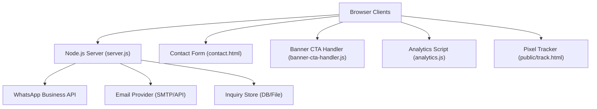
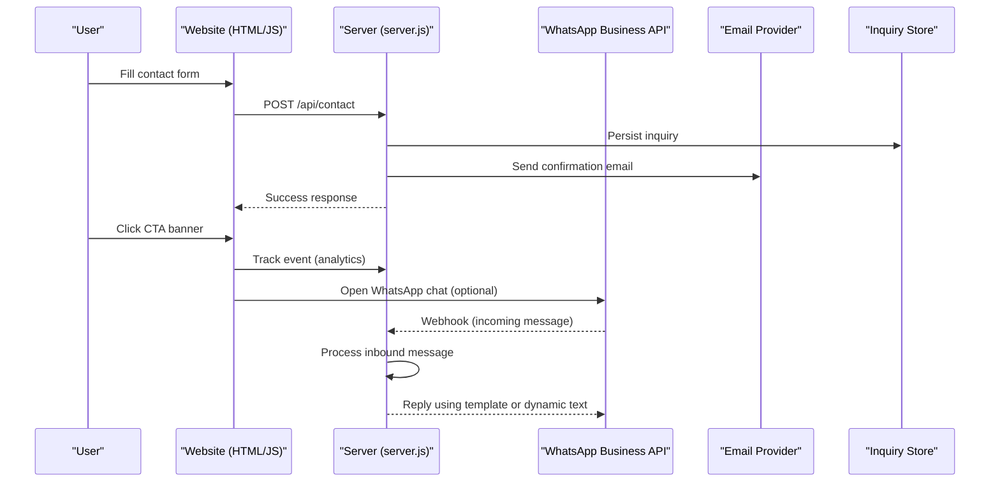
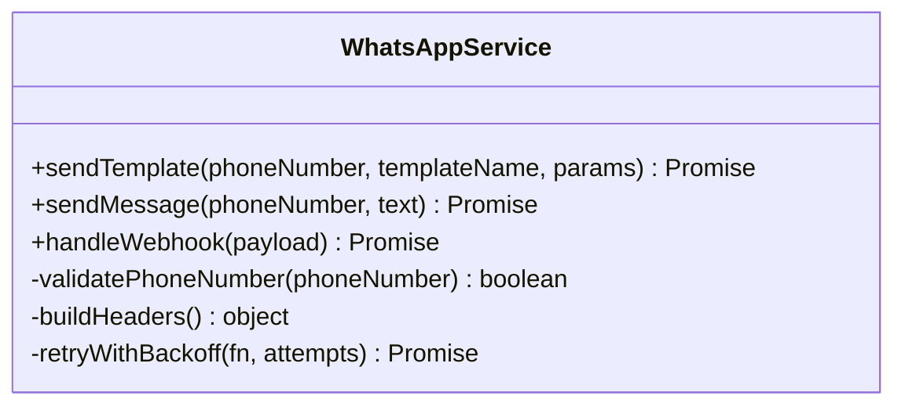
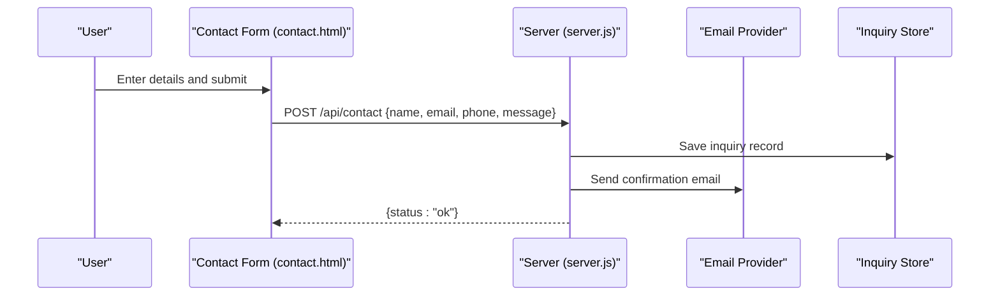
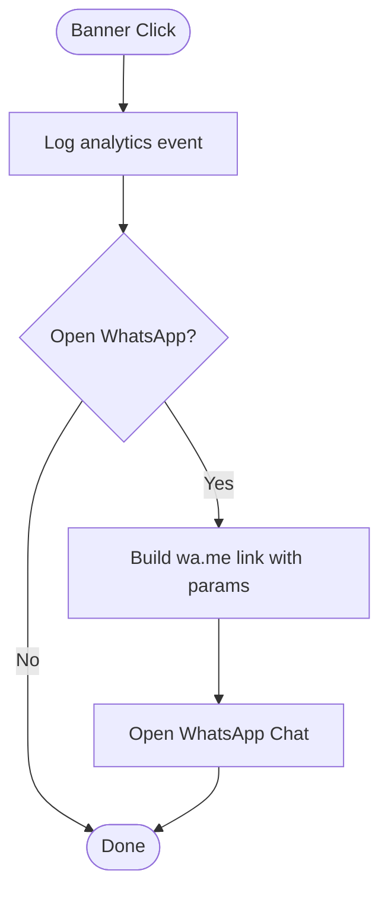
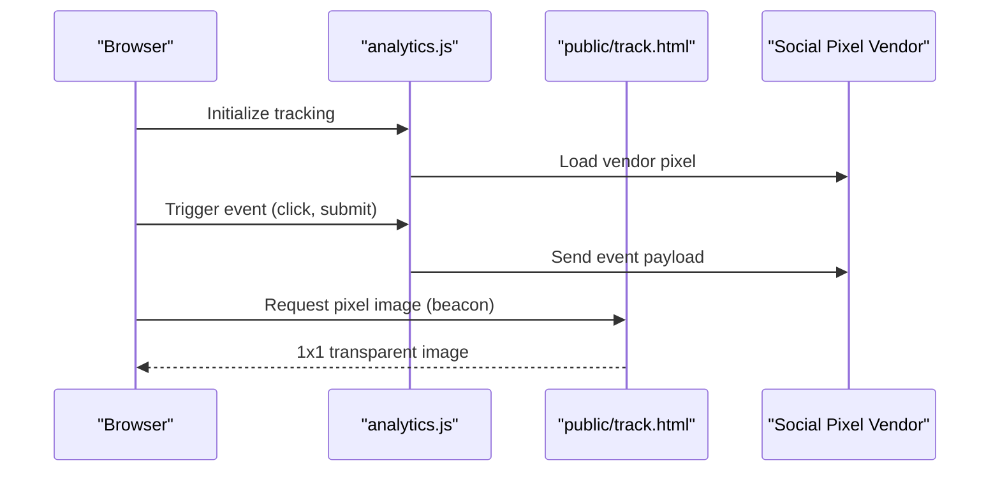
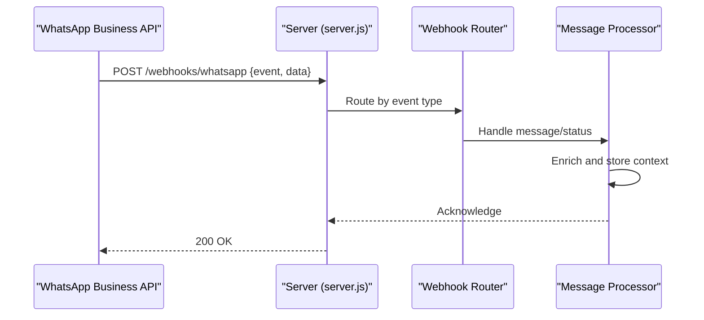
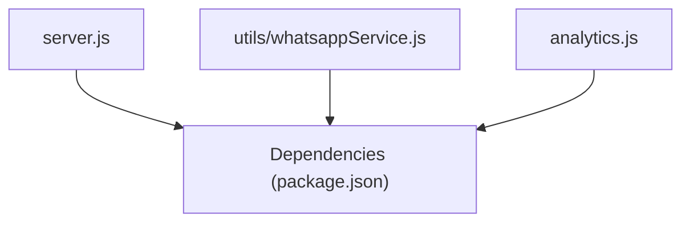

# Communication & Integrations

<cite>
**Referenced Files in This Document**
- [server.js](file://server.js)
- [utils/whatsappService.js](file://utils/whatsappService.js)
- [contact.html](file://contact.html)
- [banner-cta-handler.js](file://banner-cta-handler.js)
- [analytics.js](file://analytics.js)
- [public/track.html](file://public/track.html)
- [package.json](file://package.json)
</cite>

## Table of Contents
1. [Introduction](#introduction)
2. [Project Structure](#project-structure)
3. [Core Components](#core-components)
4. [Architecture Overview](#architecture-overview)
5. [Detailed Component Analysis](#detailed-component-analysis)
6. [Dependency Analysis](#dependency-analysis)
7. [Performance Considerations](#performance-considerations)
8. [Troubleshooting Guide](#troubleshooting-guide)
9. [Conclusion](#conclusion)
10. [Appendices](#appendices)

## Introduction
This document explains the communication and integration features implemented in the project, focusing on:
- WhatsApp Business API integration for outbound messaging and two-way flows
- Contact form processing with email notifications and inquiry tracking
- Call-to-action banner system and user engagement tracking
- Social media integration capabilities
- Configuration examples, webhook handling, and error recovery strategies for external service integrations

The goal is to provide both a high-level overview and detailed technical guidance for developers integrating or extending these features.

## Project Structure
The repository includes a Node.js server, client-side pages, and utilities that implement communication and integration features. Key areas relevant to this documentation are:
- Server entry point for HTTP endpoints and webhooks
- WhatsApp utility module for outbound messaging
- Contact page for form submission and client-side validation
- Banner CTA handler for click events and analytics
- Analytics script and pixel tracker for engagement measurement
- Package manifest for dependencies

**Diagram sources**
- [server.js](file://server.js)
- [utils/whatsappService.js](file://utils/whatsappService.js)
- [contact.html](file://contact.html)
- [banner-cta-handler.js](file://banner-cta-handler.js)
- [analytics.js](file://analytics.js)
- [public/track.html](file://public/track.html)

**Section sources**
- [server.js](file://server.js)
- [utils/whatsappService.js](file://utils/whatsappService.js)
- [contact.html](file://contact.html)
- [banner-cta-handler.js](file://banner-cta-handler.js)
- [analytics.js](file://analytics.js)
- [public/track.html](file://public/track.html)
- [package.json](file://package.json)

## Core Components
- WhatsApp Service: Encapsulates outbound message sending via WhatsApp Business API, including template selection and parameterization.
- Server Endpoints: Exposes routes for contact form submissions, WhatsApp outbound calls, and inbound webhooks from WhatsApp.
- Contact Form UI: Provides client-side validation and submission flow to the server.
- Banner CTA Handler: Captures banner clicks, triggers analytics, and optionally initiates WhatsApp conversations.
- Analytics and Tracking: Tracks user interactions and supports social pixels and conversion events.

**Section sources**
- [utils/whatsappService.js](file://utils/whatsappService.js)
- [server.js](file://server.js)
- [contact.html](file://contact.html)
- [banner-cta-handler.js](file://banner-cta-handler.js)
- [analytics.js](file://analytics.js)

## Architecture Overview
The communication architecture integrates client-side forms and banners with a Node.js server, which orchestrates outbound messaging via WhatsApp and email delivery. Inbound messages from WhatsApp are received through webhooks and routed back to business logic for response handling.

**Diagram sources**
- [server.js](file://server.js)
- [utils/whatsappService.js](file://utils/whatsappService.js)
- [contact.html](file://contact.html)
- [banner-cta-handler.js](file://banner-cta-handler.js)
- [analytics.js](file://analytics.js)

## Detailed Component Analysis

### WhatsApp Business API Integration
This component provides outbound messaging and supports two-way communication via webhooks. It uses predefined templates and parameters to send consistent, approved messages.

Key responsibilities:
- Template-based outbound messaging
- Parameterized content insertion
- Error handling and retry/backoff for transient failures
- Webhook ingestion for incoming messages and status updates

**Diagram sources**
- [utils/whatsappService.js](file://utils/whatsappService.js)

Operational notes:
- Use approved templates for first-time outreach within the 24-hour window constraints.
- For replies within the conversation window, dynamic messages can be sent without templates.
- Ensure phone numbers are formatted per WhatsApp requirements.

**Section sources**
- [utils/whatsappService.js](file://utils/whatsappService.js)

### Contact Form Processing and Email Notifications
The contact form collects user inquiries and triggers backend processing to persist data and send confirmation emails.

Flow:
- Client validates inputs and submits to the server endpoint.
- Server persists the inquiry and sends an email notification.
- Server returns a success or error response to the client.

Configuration considerations:
- Validate required fields on the client and server.
- Sanitize inputs before persistence and email rendering.
- Provide user feedback for success and failure states.

**Diagram sources**
- [contact.html](file://contact.html)
- [server.js](file://server.js)

**Section sources**
- [contact.html](file://contact.html)
- [server.js](file://server.js)

### Inquiry Tracking Mechanisms
Inquiries are stored with metadata such as timestamps and source identifiers. The server exposes endpoints to list or retrieve specific records for admin review.

Tracking attributes typically include:
- Unique identifier
- Name, email, phone, message
- Timestamps for creation and updates
- Source tag (e.g., contact-form, banner-cta)

**Section sources**
- [server.js](file://server.js)

### Call-to-Action Banner System
The banner CTA handler captures clicks, logs analytics events, and optionally opens a WhatsApp conversation link.

Behavior:
- Attach click listeners to banner elements.
- Emit analytics events with context (campaign, position).
- Optionally redirect to WhatsApp with pre-filled text.

**Diagram sources**
- [banner-cta-handler.js](file://banner-cta-handler.js)

**Section sources**
- [banner-cta-handler.js](file://banner-cta-handler.js)

### User Engagement Tracking and Social Media Integration
Engagement tracking is implemented via an analytics script and a lightweight pixel tracker. These components support:
- Page view and interaction events
- Conversion events for key actions (form submit, banner click)
- Social media pixel integration placeholders

**Diagram sources**
- [analytics.js](file://analytics.js)
- [public/track.html](file://public/track.html)

**Section sources**
- [analytics.js](file://analytics.js)
- [public/track.html](file://public/track.html)

### Webhook Handling for Two-Way Communication
Incoming WhatsApp messages and delivery statuses are handled by server endpoints designed to receive webhook payloads. The server should:
- Verify webhook signatures if supported by the provider.
- Parse event types (message, status).
- Route messages to appropriate handlers.
- Respond promptly to avoid retries.

**Diagram sources**
- [server.js](file://server.js)

**Section sources**
- [server.js](file://server.js)

### Configuration Examples
Environment configuration should include:
- WhatsApp credentials and token
- Phone number ID and template namespace
- Email provider settings (SMTP host, port, auth)
- Database or file storage paths for inquiries
- Feature flags for enabling/disabling integrations

Recommended approach:
- Use environment variables for secrets.
- Centralize configuration loading at server startup.
- Validate configuration values and fail fast on missing keys.

**Section sources**
- [server.js](file://server.js)
- [package.json](file://package.json)

### Error Recovery Strategies for External Services
Implement robust error handling for outbound calls and webhooks:
- Retry with exponential backoff for transient errors (network timeouts, rate limits).
- Circuit breaker patterns to prevent cascading failures.
- Dead-letter queues or persistent logs for failed messages.
- Health checks and alerting for critical services.

Best practices:
- Distinguish between permanent and transient errors.
- Log contextual information (phone number, template name, payload hash).
- Provide fallback mechanisms (e.g., log-only mode when external service is down).

**Section sources**
- [utils/whatsappService.js](file://utils/whatsappService.js)
- [server.js](file://server.js)

## Dependency Analysis
External dependencies are declared in the package manifest. Typical categories include:
- HTTP client libraries for API calls
- Email transport libraries
- Validation and sanitization utilities
- Logging and monitoring packages

**Diagram sources**
- [package.json](file://package.json)
- [server.js](file://server.js)
- [utils/whatsappService.js](file://utils/whatsappService.js)
- [analytics.js](file://analytics.js)

**Section sources**
- [package.json](file://package.json)

## Performance Considerations
- Batch operations where possible (e.g., multiple email sends).
- Cache static assets and reduce payload sizes for tracking pixels.
- Use asynchronous processing for non-critical tasks (e.g., logging, analytics).
- Implement rate limiting to respect provider quotas.
- Monitor latency and error rates for external APIs.

[No sources needed since this section provides general guidance]

## Troubleshooting Guide
Common issues and resolutions:
- Invalid phone number format: Ensure E.164 formatting and country codes.
- Template not found or rejected: Verify template names, namespaces, and approval status.
- Email delivery failures: Check SMTP credentials, domain authentication, and spam filters.
- Webhook signature mismatch: Confirm secret configuration and timestamp validation.
- Rate limit exceeded: Implement backoff and queueing; adjust request pacing.

Diagnostic steps:
- Inspect server logs for request/response traces.
- Validate payloads against provider schemas.
- Test endpoints with mock data before production deployment.

**Section sources**
- [utils/whatsappService.js](file://utils/whatsappService.js)
- [server.js](file://server.js)

## Conclusion
The project implements a cohesive set of communication and integration features centered around WhatsApp Business API, contact form processing, and engagement tracking. By following the configuration, webhook handling, and error recovery guidelines outlined here, teams can reliably extend and maintain these capabilities while ensuring a positive user experience.

[No sources needed since this section summarizes without analyzing specific files]

## Appendices

### Quick Start Checklist
- Configure environment variables for WhatsApp and email providers.
- Deploy server and verify health endpoints.
- Submit a test contact form and confirm email receipt.
- Send a test WhatsApp message using a valid template.
- Simulate a webhook event and verify processing.
- Validate analytics events and pixel tracking.

[No sources needed since this section provides general guidance]