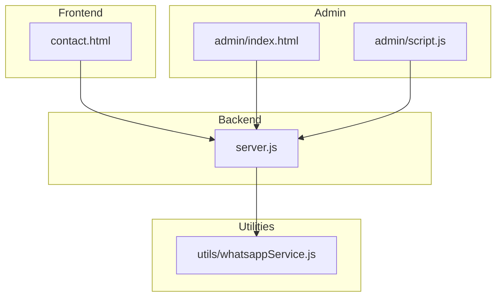
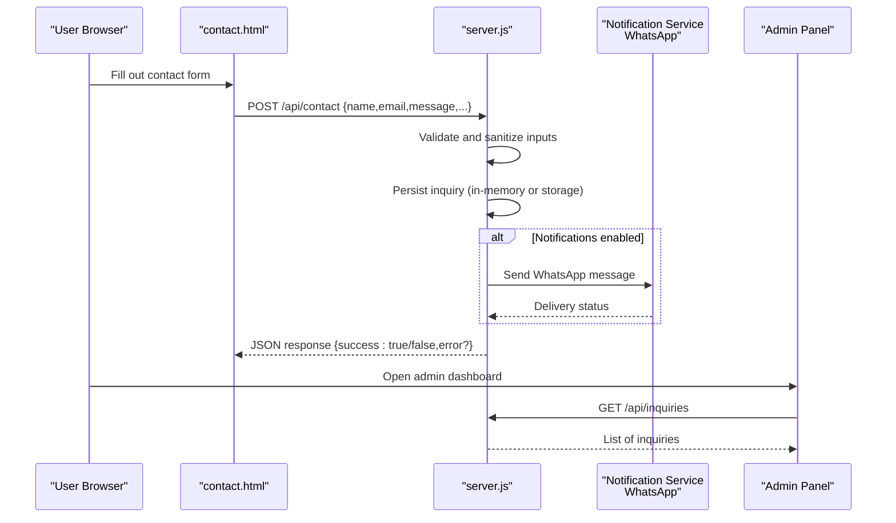
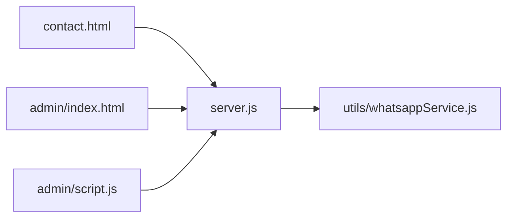

# Contact Form & Inquiry Management

<cite>
**Referenced Files in This Document**
- [contact.html](file://contact.html)
- [server.js](file://server.js)
- [utils/whatsappService.js](file://utils/whatsappService.js)
- [admin/index.html](file://admin/index.html)
- [admin/script.js](file://admin/script.js)
- [package.json](file://package.json)
</cite>

## Table of Contents
1. [Introduction](#introduction)
2. [Project Structure](#project-structure)
3. [Core Components](#core-components)
4. [Architecture Overview](#architecture-overview)
5. [Detailed Component Analysis](#detailed-component-analysis)
6. [Dependency Analysis](#dependency-analysis)
7. [Performance Considerations](#performance-considerations)
8. [Security and Privacy](#security-and-privacy)
9. [Configuration Options](#configuration-options)
10. [Customization Guide](#customization-guide)
11. [Troubleshooting Guide](#troubleshooting-guide)
12. [Conclusion](#conclusion)

## Introduction
This document explains the contact form system and inquiry management features, including how user input flows from the frontend to backend processing and notification systems. It covers form structure, validation rules, submission handling, configuration options for fields and notifications, security measures, and customization examples such as adding new fields and integrating with external CRM systems.

## Project Structure
The contact feature spans a static HTML page, a Node.js server endpoint, optional WhatsApp notifications, and an admin interface for viewing inquiries.

**Diagram sources**
- [contact.html](file://contact.html)
- [server.js](file://server.js)
- [utils/whatsappService.js](file://utils/whatsappService.js)
- [admin/index.html](file://admin/index.html)
- [admin/script.js](file://admin/script.js)

**Section sources**
- [contact.html](file://contact.html)
- [server.js](file://server.js)
- [utils/whatsappService.js](file://utils/whatsappService.js)
- [admin/index.html](file://admin/index.html)
- [admin/script.js](file://admin/script.js)

## Core Components
- Contact form UI: The contact page provides the user-facing form fields and client-side interactions.
- Server endpoint: The Node.js server handles incoming submissions, validates data, persists or routes inquiries, and sends notifications.
- Notification utility: Optional integration to send messages via WhatsApp.
- Admin panel: A simple interface to view submitted inquiries and manage responses.

Key responsibilities:
- Frontend: Collects user input, performs basic validation, and submits via HTTP requests.
- Backend: Validates and sanitizes inputs, stores inquiries (or forwards them), triggers notifications, and returns consistent responses.
- Admin: Reads stored inquiries and supports response workflows.

**Section sources**
- [contact.html](file://contact.html)
- [server.js](file://server.js)
- [utils/whatsappService.js](file://utils/whatsappService.js)
- [admin/index.html](file://admin/index.html)
- [admin/script.js](file://admin/script.js)

## Architecture Overview
End-to-end flow from user submission to notifications and admin visibility.

**Diagram sources**
- [contact.html](file://contact.html)
- [server.js](file://server.js)
- [utils/whatsappService.js](file://utils/whatsappService.js)
- [admin/index.html](file://admin/index.html)
- [admin/script.js](file://admin/script.js)

## Detailed Component Analysis

### Contact Form (Frontend)
- Purpose: Collect user details and message content; perform initial validation; submit to backend.
- Typical fields: Name, Email, Phone (optional), Subject, Message, Consent checkbox.
- Client-side validation: Required fields, email format, minimum length for message.
- Submission behavior: Sends a POST request to the backend endpoint and displays success/error feedback.

Implementation references:
- Form markup and field definitions are defined in the contact page.
- Client-side logic is implemented within the same page’s script section.

**Section sources**
- [contact.html](file://contact.html)

### Server Endpoint (Backend)
- Purpose: Receive submissions, validate/sanitize inputs, persist inquiries, trigger notifications, and respond consistently.
- Endpoints:
  - POST /api/contact: Accepts form payload, processes it, and returns a JSON result.
  - GET /api/inquiries: Returns list of inquiries for admin consumption.
- Validation and sanitization: Enforce required fields, type checks, length limits, and strip dangerous content.
- Persistence: In-memory store for development; replaceable with a database for production.
- Notifications: Optionally call WhatsApp service to alert on new submissions.

Implementation references:
- Route handlers and business logic are implemented in the server file.
- Utility functions for notifications are imported from the WhatsApp service module.

**Section sources**
- [server.js](file://server.js)
- [utils/whatsappService.js](file://utils/whatsappService.js)

### WhatsApp Notification Utility
- Purpose: Provide a reusable function to send a formatted message when a new inquiry arrives.
- Inputs: Recipient phone number, sender name, email, subject, message body.
- Output: Promise resolving with delivery status or rejecting on error.

Implementation references:
- Function definition and API calls are located in the utility module.

**Section sources**
- [utils/whatsappService.js](file://utils/whatsappService.js)

### Admin Panel
- Purpose: View submitted inquiries and support follow-up actions.
- Features:
  - Load inquiries from the backend.
  - Display key fields (name, email, subject, message, timestamp).
  - Optional filters or search (if implemented).
- Data access: Uses GET /api/inquiries to fetch records.

Implementation references:
- Admin UI and data fetching logic are implemented in the admin files.

**Section sources**
- [admin/index.html](file://admin/index.html)
- [admin/script.js](file://admin/script.js)

## Dependency Analysis
High-level dependencies between components and modules.

**Diagram sources**
- [contact.html](file://contact.html)
- [server.js](file://server.js)
- [utils/whatsappService.js](file://utils/whatsappService.js)
- [admin/index.html](file://admin/index.html)
- [admin/script.js](file://admin/script.js)

**Section sources**
- [contact.html](file://contact.html)
- [server.js](file://server.js)
- [utils/whatsappService.js](file://utils/whatsappService.js)
- [admin/index.html](file://admin/index.html)
- [admin/script.js](file://admin/script.js)

## Performance Considerations
- Keep payloads small: Avoid large attachments in the contact form; use file upload endpoints if needed.
- Debounce client-side operations: Prevent duplicate submissions by disabling the submit button after first click.
- Use pagination for admin queries: If storing many inquiries, implement server-side pagination to reduce load.
- Cache static assets: Ensure the contact page and admin assets are cached appropriately by browsers and CDNs.

[No sources needed since this section provides general guidance]

## Security and Privacy
Recommended measures aligned with best practices:
- Input validation and sanitization:
  - Enforce strict types and lengths on the server.
  - Escape or strip HTML tags to prevent XSS.
- Rate limiting and spam protection:
  - Implement rate limiting per IP or per session.
  - Add a hidden honeypot field and/or CAPTCHA to deter bots.
- Authentication and authorization:
  - Protect admin endpoints with authentication.
  - Restrict access to inquiry listing and any write operations.
- Transport security:
  - Serve over HTTPS only.
  - Set secure cookies and CORS policies if applicable.
- Data privacy compliance:
  - Include a consent checkbox for data processing.
  - Provide a privacy notice link on the form.
  - Allow users to request deletion of their data.
- Logging and retention:
  - Log minimal PII; avoid logging sensitive fields like full messages unless necessary.
  - Define retention policies and purge old inquiries automatically.

[No sources needed since this section provides general guidance]

## Configuration Options
Common configuration areas you can adjust:
- Form fields:
  - Add/remove fields in the contact page.
  - Update client-side validation rules accordingly.
- Backend validation:
  - Adjust allowed fields, min/max lengths, and required flags in the server handler.
- Notifications:
  - Toggle WhatsApp notifications on/off.
  - Configure recipient numbers and message templates.
- Admin access:
  - Enable/disable admin endpoints.
  - Integrate authentication middleware.

Where to configure:
- Frontend fields and validation: contact page.
- Backend validation and routing: server file.
- Notification settings: WhatsApp utility module.
- Admin access controls: admin files and server routes.

**Section sources**
- [contact.html](file://contact.html)
- [server.js](file://server.js)
- [utils/whatsappService.js](file://utils/whatsappService.js)
- [admin/index.html](file://admin/index.html)
- [admin/script.js](file://admin/script.js)

## Customization Guide

### Customize Form Layout
- Modify the form structure and styling in the contact page to match your brand.
- Reorder fields, add labels, placeholders, and help text.
- Ensure all changes are reflected in client-side validation and the backend schema.

**Section sources**
- [contact.html](file://contact.html)

### Add New Fields
Steps:
1. Add the new field(s) to the contact page.
2. Update client-side validation to include the new field(s).
3. Extend the server-side validation to accept and sanitize the new field(s).
4. Update admin display to show the new field(s).
5. If notifications should include the new field, update the WhatsApp message template.

References:
- Frontend: contact page.
- Backend: server route handler.
- Admin: admin UI and data fetching.
- Notifications: WhatsApp utility.

**Section sources**
- [contact.html](file://contact.html)
- [server.js](file://server.js)
- [admin/index.html](file://admin/index.html)
- [admin/script.js](file://admin/script.js)
- [utils/whatsappService.js](file://utils/whatsappService.js)

### Integrate with External CRM
Approach:
- After validating and storing the inquiry, call your CRM API to create or update a lead/contact.
- Map form fields to CRM fields.
- Handle errors gracefully and log failures without blocking the user experience.
- Optionally retry failed deliveries using a queue or background job.

Example integration points:
- Server endpoint: Add a CRM adapter call after persistence.
- Error handling: Return success to the client even if CRM fails, but log the failure for later review.

**Section sources**
- [server.js](file://server.js)

## Troubleshooting Guide
Common issues and resolutions:
- Form submission fails:
  - Check browser console for network errors.
  - Verify the server endpoint URL and CORS settings.
  - Inspect server logs for validation errors.
- No notifications received:
  - Confirm WhatsApp credentials and phone number formatting.
  - Review error responses from the notification utility.
- Admin cannot see inquiries:
  - Ensure the admin panel calls the correct endpoint.
  - Verify that the server is persisting inquiries and returning them correctly.

Operational references:
- Client-side submission and error handling: contact page.
- Server validation and response handling: server file.
- Notification utility errors: WhatsApp service module.
- Admin data retrieval: admin files.

**Section sources**
- [contact.html](file://contact.html)
- [server.js](file://server.js)
- [utils/whatsappService.js](file://utils/whatsappService.js)
- [admin/index.html](file://admin/index.html)
- [admin/script.js](file://admin/script.js)

## Conclusion
The contact form system provides a clear path from user input to backend processing, optional notifications, and admin visibility. By following the configuration and customization guidance, you can extend fields, tailor layouts, integrate with CRMs, and harden security and privacy. For production deployments, consider persistent storage, robust authentication, rate limiting, and comprehensive monitoring.

[No sources needed since this section summarizes without analyzing specific files]