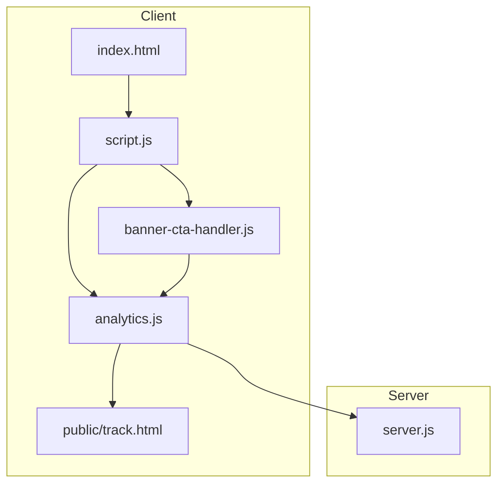
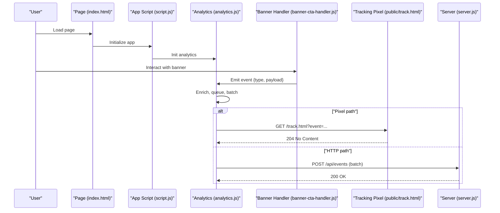
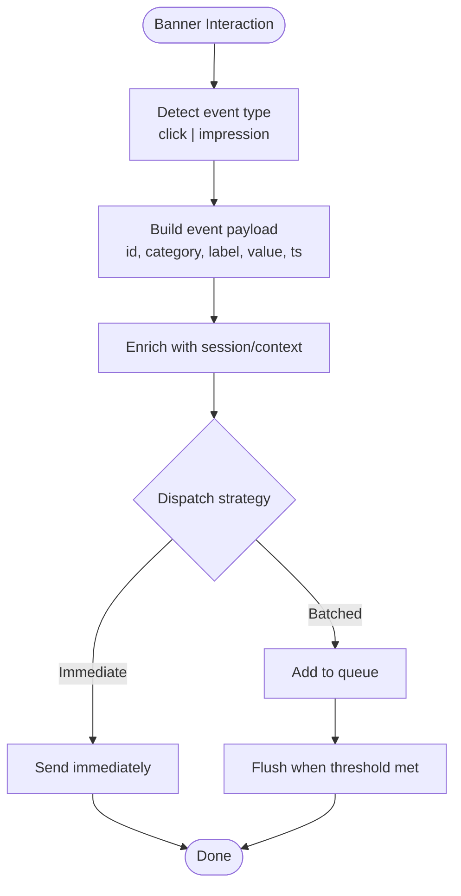
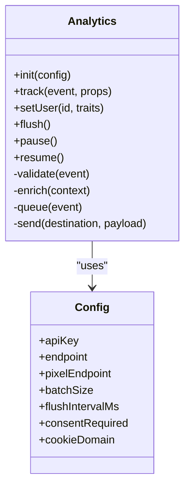
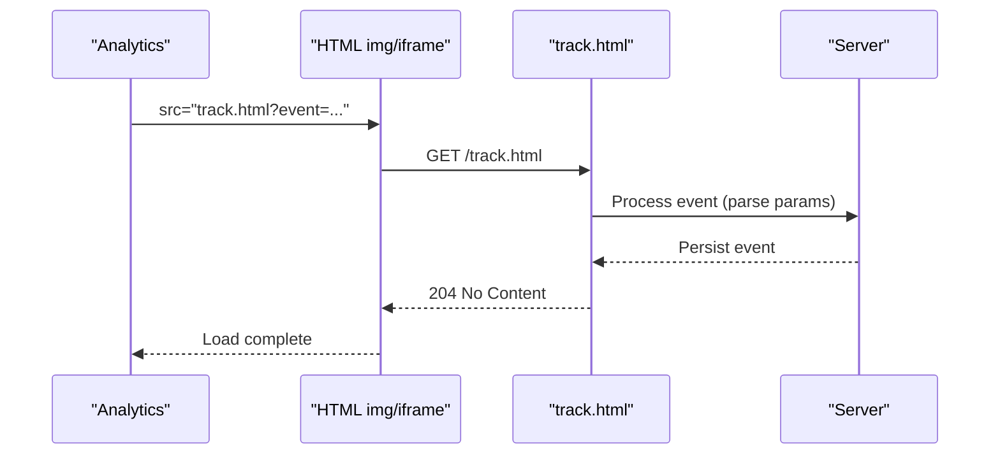
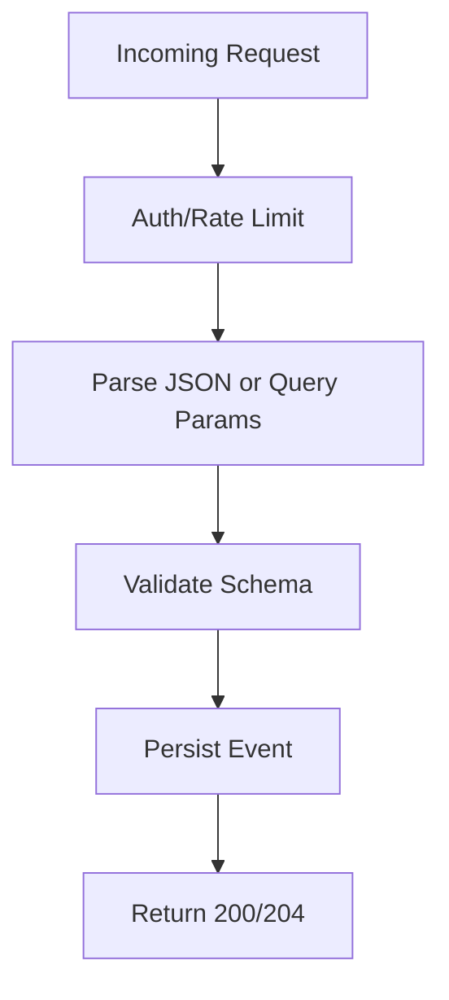
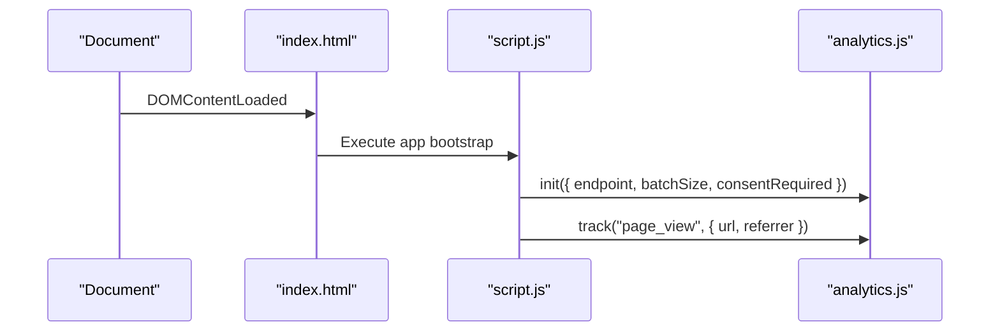
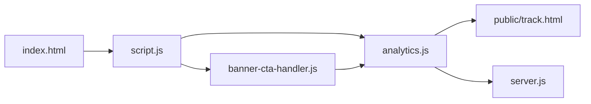

# User Engagement & Analytics Tracking

<cite>
**Referenced Files in This Document**
- [analytics.js](file://analytics.js)
- [banner-cta-handler.js](file://banner-cta-handler.js)
- [track.html](file://public/track.html)
- [server.js](file://server.js)
- [index.html](file://index.html)
- [script.js](file://script.js)
</cite>

## Table of Contents
1. [Introduction](#introduction)
2. [Project Structure](#project-structure)
3. [Core Components](#core-components)
4. [Architecture Overview](#architecture-overview)
5. [Detailed Component Analysis](#detailed-component-analysis)
6. [Dependency Analysis](#dependency-analysis)
7. [Performance Considerations](#performance-considerations)
8. [Troubleshooting Guide](#troubleshooting-guide)
9. [Privacy, Cookies, and GDPR Compliance](#privacy-cookies-and-gdpr-compliance)
10. [Configuration Options](#configuration-options)
11. [Examples: Custom Events, Reports, and Funnels](#examples-custom-events-reports-and-funnels)
12. [Conclusion](#conclusion)

## Introduction
This document explains the user engagement tracking and analytics collection system implemented in the project. It covers the call-to-action banner handler, click tracking, interaction monitoring, tracking pixel usage, event firing mechanisms, and data collection patterns. It also provides configuration guidance for custom events and metrics, integration with analytics platforms, privacy considerations, cookie management, and GDPR compliance measures. Finally, it includes examples for setting up custom tracking events, building engagement reports, and optimizing conversion funnels using collected data.

## Project Structure
The tracking and analytics features are primarily implemented in client-side scripts and a minimal server endpoint:
- Client-side analytics library and utilities
- Banner CTA handler for click and interaction tracking
- A lightweight tracking pixel page
- Server entry point that may expose endpoints for analytics ingestion
- Page-level scripts that initialize or integrate tracking

**Diagram sources**
- [index.html](file://index.html)
- [script.js](file://script.js)
- [analytics.js](file://analytics.js)
- [banner-cta-handler.js](file://banner-cta-handler.js)
- [track.html](file://public/track.html)
- [server.js](file://server.js)

**Section sources**
- [index.html](file://index.html)
- [script.js](file://script.js)
- [analytics.js](file://analytics.js)
- [banner-cta-handler.js](file://banner-cta-handler.js)
- [track.html](file://public/track.html)
- [server.js](file://server.js)

## Core Components
- analytics.js: Centralized analytics library providing event emission, batching, persistence, and optional third-party integrations.
- banner-cta-handler.js: Captures banner interactions (clicks, impressions), enriches events with context, and forwards them to the analytics layer.
- public/track.html: Minimal HTML used as a tracking pixel endpoint for cross-domain or image-based tracking.
- server.js: Backend entry point; may include routes or middleware to receive analytics payloads securely and persist them.
- script.js: Application bootstrap that initializes analytics and binds global handlers.
- index.html: Root page that loads core scripts and components.

Key responsibilities:
- Event model and naming conventions
- Click and impression capture
- Batched and resilient network requests
- Cookie/session handling for identity and deduplication
- Privacy controls and consent gating

**Section sources**
- [analytics.js](file://analytics.js)
- [banner-cta-handler.js](file://banner-cta-handler.js)
- [track.html](file://public/track.html)
- [server.js](file://server.js)
- [script.js](file://script.js)
- [index.html](file://index.html)

## Architecture Overview
The system follows a modular client-server architecture:
- The client initializes analytics on page load.
- UI interactions (e.g., banner clicks) are captured by dedicated handlers.
- Events are normalized, enriched, and queued.
- Batching and retry logic ensure reliable delivery.
- Data is sent via HTTP or a tracking pixel to the server or external analytics platform.
- The server persists events and exposes APIs for reporting.

**Diagram sources**
- [index.html](file://index.html)
- [script.js](file://script.js)
- [analytics.js](file://analytics.js)
- [banner-cta-handler.js](file://banner-cta-handler.js)
- [track.html](file://public/track.html)
- [server.js](file://server.js)

## Detailed Component Analysis

### Call-to-Action Banner Handler
Responsibilities:
- Attach listeners to banner elements.
- Capture click and visibility events.
- Build structured event payloads with contextual metadata.
- Forward events to the analytics layer.

**Diagram sources**
- [banner-cta-handler.js](file://banner-cta-handler.js)
- [analytics.js](file://analytics.js)

**Section sources**
- [banner-cta-handler.js](file://banner-cta-handler.js)
- [analytics.js](file://analytics.js)

### Analytics Library (Event Engine)
Responsibilities:
- Define event schema and validation.
- Provide methods to track events, set properties, and manage sessions.
- Implement batching, retries, and backoff.
- Support multiple destinations (internal server, third-party).
- Respect privacy flags and consent state.

**Diagram sources**
- [analytics.js](file://analytics.js)

**Section sources**
- [analytics.js](file://analytics.js)

### Tracking Pixel Implementation
Purpose:
- Provide a lightweight, cross-origin compatible tracking mechanism using an image or iframe request.
- Useful for email campaigns, ad networks, or environments where JavaScript execution is restricted.

Behavior:
- Accepts query parameters describing the event.
- Returns a minimal response (e.g., 204 No Content) to avoid logging noise.
- Optionally sets short-lived cookies for deduplication if allowed by policy.

**Diagram sources**
- [analytics.js](file://analytics.js)
- [track.html](file://public/track.html)
- [server.js](file://server.js)

**Section sources**
- [track.html](file://public/track.html)
- [analytics.js](file://analytics.js)
- [server.js](file://server.js)

### Server-Side Ingestion
Responsibilities:
- Receive analytics payloads securely.
- Validate and normalize incoming events.
- Persist to storage and expose reporting endpoints.
- Rate-limit and guard against abuse.

**Diagram sources**
- [server.js](file://server.js)

**Section sources**
- [server.js](file://server.js)

### Initialization and Integration
Responsibilities:
- Bootstrap analytics on page load.
- Configure endpoints, batching, and consent behavior.
- Bind global helpers for easy event tracking from any module.

**Diagram sources**
- [index.html](file://index.html)
- [script.js](file://script.js)
- [analytics.js](file://analytics.js)

**Section sources**
- [index.html](file://index.html)
- [script.js](file://script.js)
- [analytics.js](file://analytics.js)

## Dependency Analysis
High-level dependencies among tracking components:

**Diagram sources**
- [index.html](file://index.html)
- [script.js](file://script.js)
- [analytics.js](file://analytics.js)
- [banner-cta-handler.js](file://banner-cta-handler.js)
- [track.html](file://public/track.html)
- [server.js](file://server.js)

**Section sources**
- [index.html](file://index.html)
- [script.js](file://script.js)
- [analytics.js](file://analytics.js)
- [banner-cta-handler.js](file://banner-cta-handler.js)
- [track.html](file://public/track.html)
- [server.js](file://server.js)

## Performance Considerations
- Batch size and flush interval: Tune to balance latency and overhead.
- Debounce rapid interactions (e.g., repeated clicks) to reduce noise.
- Use resource hints (preload/prefetch) for analytics assets only when necessary.
- Avoid heavy computations in event handlers; offload to background queues.
- Prefer HTTPS and keep-alive connections for efficient uploads.
- Monitor payload sizes and compress if supported by the server.

[No sources needed since this section provides general guidance]

## Troubleshooting Guide
Common issues and resolutions:
- Events not appearing: Verify initialization order, consent state, and network connectivity. Check browser dev tools Network tab for failed requests.
- Duplicate events: Ensure idempotency keys or deduplication logic is enabled; review batching and retry behavior.
- Cross-origin restrictions: For pixel tracking, confirm CORS and same-site policies; consider using relative paths or trusted domains.
- Consent denied: If consent is required, ensure the consent flow enables analytics before emitting events.
- Server errors: Inspect server logs for validation failures or rate limiting responses.

**Section sources**
- [analytics.js](file://analytics.js)
- [server.js](file://server.js)

## Privacy, Cookies, and GDPR Compliance
Guidelines:
- Consent gating: Only initialize and emit events after explicit consent when required by law or policy.
- Data minimization: Collect only necessary fields; avoid sensitive personal data.
- Anonymization: Hash or pseudonymize identifiers; avoid storing raw IPs unless necessary.
- Cookie policy: Use strictly necessary cookies for functionality; use analytical cookies only with consent. Set appropriate domain, path, secure, and samesite attributes.
- Retention: Define clear retention periods and purge old events automatically.
- User rights: Provide mechanisms for users to access, correct, or delete their data.
- Transparency: Maintain a privacy notice explaining what is tracked, why, and how long it is retained.

[No sources needed since this section provides general guidance]

## Configuration Options
Recommended configuration keys:
- apiKey: Identifier for your analytics destination.
- endpoint: Primary HTTP endpoint for event ingestion.
- pixelEndpoint: Base URL for tracking pixel requests.
- batchSize: Number of events per batch.
- flushIntervalMs: Time window to flush queued events.
- consentRequired: Boolean flag to enforce consent checks.
- cookieDomain: Domain scope for tracking cookies.
- maxRetries: Retry attempts for failed sends.
- retryBackoffMs: Exponential backoff base delay.

Usage pattern:
- Initialize analytics with configuration at application startup.
- Update settings dynamically based on user consent or environment.
- Provide defaults for development vs production.

**Section sources**
- [analytics.js](file://analytics.js)
- [script.js](file://script.js)

## Examples: Custom Events, Reports, and Funnels

### Setting Up Custom Tracking Events
Steps:
- Define a clear event taxonomy (e.g., action, target, outcome).
- Wrap UI interactions with a single tracking call.
- Include contextual properties (e.g., campaign ID, element ID).
- Validate payloads before sending.

Example references:
- [Custom event setup](file://banner-cta-handler.js)
- [Event emission API](file://analytics.js)

### Creating Engagement Reports
Approach:
- Aggregate events by day, source, and user segment.
- Compute key metrics: unique visitors, event counts, conversion rates.
- Visualize trends over time and compare cohorts.

Data sources:
- [Server-side ingestion](file://server.js)
- [Event schema](file://analytics.js)

### Optimizing Conversion Funnels
Approach:
- Map funnel steps to specific events (e.g., view, click, submit).
- Measure drop-off between steps and identify bottlenecks.
- Run A/B tests on CTAs and landing pages; attribute changes to event deltas.

References:
- [Banner CTA handler](file://banner-cta-handler.js)
- [Analytics library](file://analytics.js)

[No sources needed since this section provides general guidance]

## Conclusion
The tracking system provides a robust foundation for capturing user engagement through a modular analytics library, a dedicated banner CTA handler, and a flexible ingestion pipeline supporting both HTTP and pixel-based tracking. With proper configuration, privacy safeguards, and thoughtful event design, teams can build actionable insights, generate meaningful reports, and optimize conversion funnels effectively.

[No sources needed since this section summarizes without analyzing specific files]