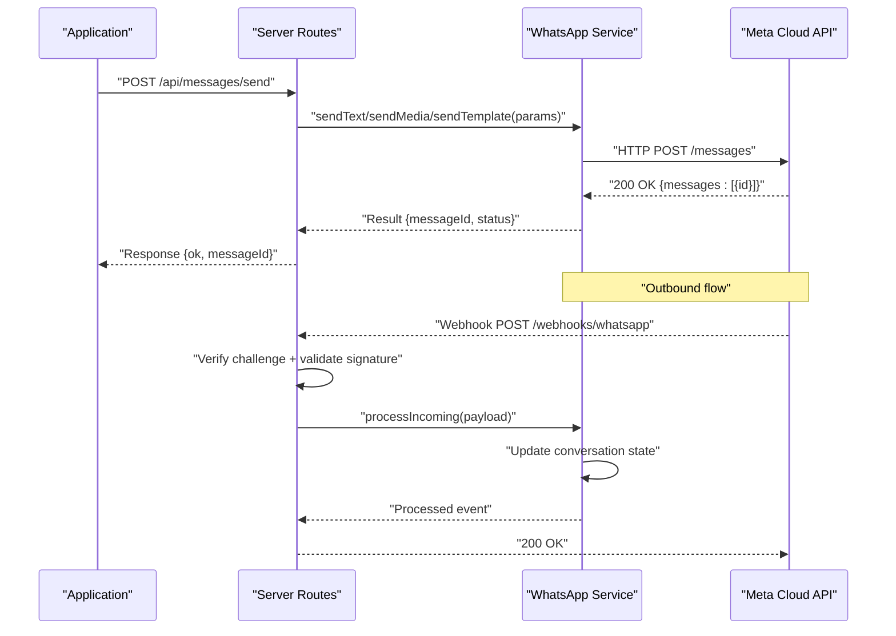
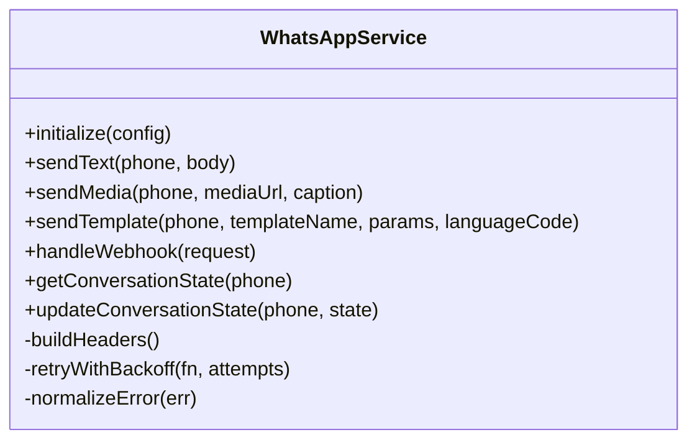
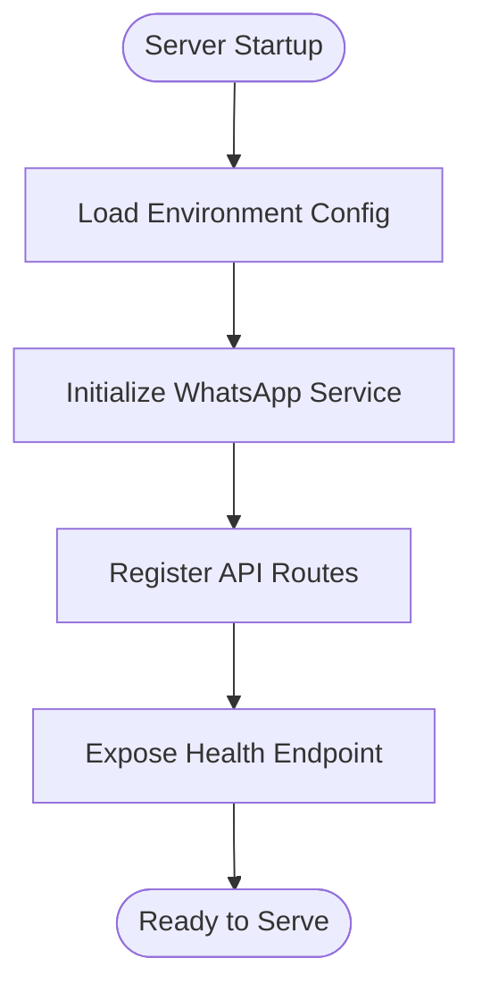
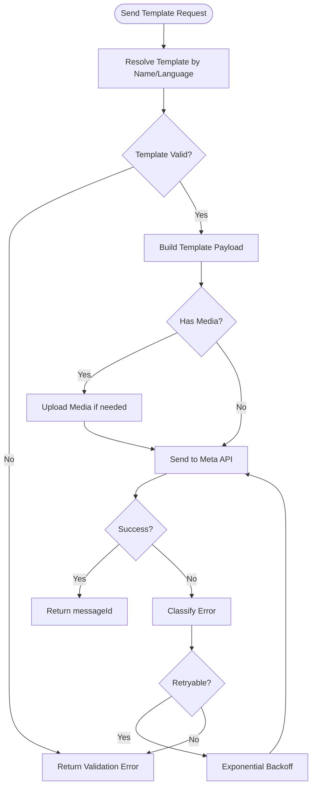
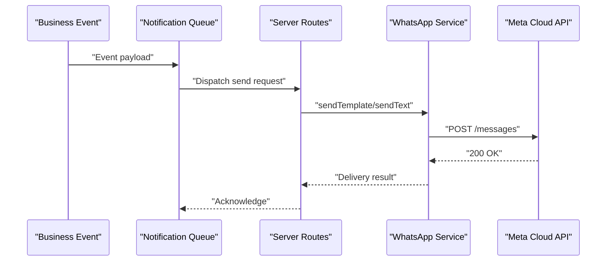
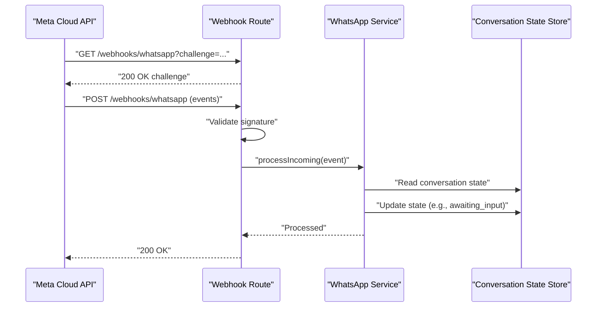
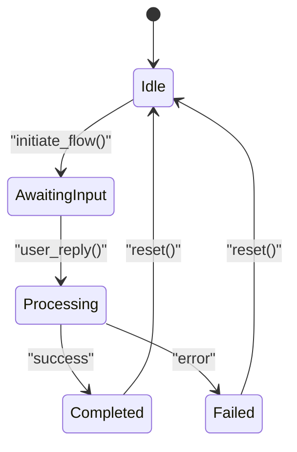
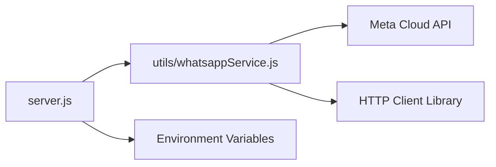

# WhatsApp Business API Integration

<cite>
**Referenced Files in This Document**
- [whatsappService.js](file://utils/whatsappService.js)
- [server.js](file://server.js)
- [package.json](file://package.json)
</cite>

## Table of Contents
1. [Introduction](#introduction)
2. [Project Structure](#project-structure)
3. [Core Components](#core-components)
4. [Architecture Overview](#architecture-overview)
5. [Detailed Component Analysis](#detailed-component-analysis)
6. [Dependency Analysis](#dependency-analysis)
7. [Performance Considerations](#performance-considerations)
8. [Troubleshooting Guide](#troubleshooting-guide)
9. [Conclusion](#conclusion)

## Introduction
This document explains how the WhatsApp Business API is integrated into the application to support two-way messaging, message templates, notifications, and conversation state management. It covers service initialization, authentication setup, endpoint configuration, sending different message types (text, media, templates), handling incoming messages, error handling strategies, rate limiting considerations, retry mechanisms, troubleshooting guidance, and performance optimization tips for high-volume messaging scenarios.

## Project Structure
The WhatsApp integration is implemented as a dedicated service module that encapsulates all WhatsApp-specific logic and is consumed by the server entry point. The key files involved are:
- Service implementation for WhatsApp operations
- Server entry point where routes and middleware are configured
- Package manifest listing dependencies used by the integration

```mermaid
graph TB
Client["Client Apps<br/>Web/Mobile"] --> Server["Server Entry Point<br/>server.js"]
Server --> WAService["WhatsApp Service<br/>utils/whatsappService.js"]
WAService --> MetaAPI["Meta Cloud API"]
Server --> DB["Application Data Store"]
Client <- --> Server
```

**Diagram sources**
- [server.js](file://server.js)
- [whatsappService.js](file://utils/whatsappService.js)

**Section sources**
- [server.js](file://server.js)
- [whatsappService.js](file://utils/whatsappService.js)
- [package.json](file://package.json)

## Core Components
- WhatsApp Service Module
  - Encapsulates authentication, request building, retries, and response parsing for the Meta Cloud API.
  - Provides functions for sending text, media, and template messages; retrieving webhooks; and managing conversation states.
- Server Entry Point
  - Registers HTTP endpoints for outbound messaging and inbound webhook handling.
  - Initializes the WhatsApp service and exposes environment-driven configuration.

Key responsibilities:
- Authentication and token management
- Template resolution and parameterization
- Media upload and attachment handling
- Webhook verification and payload validation
- Conversation state persistence and routing
- Error classification and retry orchestration

**Section sources**
- [whatsappService.js](file://utils/whatsappService.js)
- [server.js](file://server.js)

## Architecture Overview
The integration follows a layered architecture:
- Presentation Layer: Application UIs and clients
- API Layer: Express-like routes for outbound requests and inbound webhooks
- Service Layer: WhatsApp service abstraction over Meta Cloud API
- External System: Meta Cloud API



**Diagram sources**
- [server.js](file://server.js)
- [whatsappService.js](file://utils/whatsappService.js)

## Detailed Component Analysis

### WhatsApp Service Module
Responsibilities:
- Initialize client with credentials and base URL
- Build and sign requests for authentication
- Send text, media, and template messages
- Handle webhooks and update conversation state
- Implement retry and backoff policies
- Normalize errors and responses



**Diagram sources**
- [whatsappService.js](file://utils/whatsappService.js)

Implementation highlights:
- Initialization reads configuration from environment variables and sets up base URLs and headers.
- Message builders construct payloads per Meta Cloud API specifications.
- Retry logic applies exponential backoff with jitter for transient failures.
- Webhook handler validates signatures and parses events to update conversation state.

**Section sources**
- [whatsappService.js](file://utils/whatsappService.js)

### Server Entry Point
Responsibilities:
- Configure middleware (body parsing, security headers)
- Register outbound endpoints (/api/messages/*)
- Register inbound webhook endpoint (/webhooks/whatsapp)
- Initialize WhatsApp service and expose health checks



**Diagram sources**
- [server.js](file://server.js)

Endpoint overview:
- Outbound messaging endpoints accept phone number, message type, and content parameters.
- Inbound webhook endpoint verifies challenges and processes incoming events.
- Health endpoint returns service readiness and dependency status.

**Section sources**
- [server.js](file://server.js)

### Message Template System
Templates are pre-approved message formats used to initiate conversations or send structured content. The service supports:
- Template selection by name and language code
- Parameter substitution for dynamic content
- Header, body, and button component rendering
- Media attachments within templates when supported



**Diagram sources**
- [whatsappService.js](file://utils/whatsappService.js)

**Section sources**
- [whatsappService.js](file://utils/whatsappService.js)

### Notification Workflows
Notifications are triggered by business events and delivered via WhatsApp using appropriate message types:
- Transactional alerts (order updates, shipping notifications)
- Promotional campaigns (opt-in required)
- Reminder and follow-up sequences



[No sources needed since this diagram shows conceptual workflow, not actual code structure]

### Two-Way Communication Patterns
Inbound messages are processed through a webhook endpoint:
- Challenge verification during subscription
- Signature validation for each event
- Parsing of message events and metadata
- Updating conversation state and triggering downstream actions



**Diagram sources**
- [server.js](file://server.js)
- [whatsappService.js](file://utils/whatsappService.js)

**Section sources**
- [server.js](file://server.js)
- [whatsappService.js](file://utils/whatsappService.js)

### Conversation State Management
States track user interactions to enable contextual replies and multi-turn flows:
- idle: No active conversation
- awaiting_input: Waiting for user input
- processing: Internal processing in progress
- completed: Flow finished successfully
- failed: Flow ended with error



[No sources needed since this diagram shows conceptual workflow, not actual code structure]

## Dependency Analysis
External dependencies include the Meta Cloud API and any HTTP client libraries used by the service. The package manifest lists runtime dependencies relevant to the integration.



**Diagram sources**
- [server.js](file://server.js)
- [whatsappService.js](file://utils/whatsappService.js)
- [package.json](file://package.json)

**Section sources**
- [package.json](file://package.json)
- [server.js](file://server.js)
- [whatsappService.js](file://utils/whatsappService.js)

## Performance Considerations
- Connection pooling and keep-alive for HTTP clients
- Batched sends where applicable
- Caching of template definitions and media URLs
- Asynchronous processing with queues for high throughput
- Rate limit awareness and adaptive throttling
- Efficient conversation state storage with minimal locking

[No sources needed since this section provides general guidance]

## Troubleshooting Guide
Common issues and resolutions:
- Authentication failures
  - Verify token validity and scope
  - Ensure correct base URL and versioning
- Webhook verification errors
  - Confirm challenge response matches expected value
  - Validate signature algorithm and secret
- Template delivery failures
  - Check template approval status and language code
  - Validate parameter count and types
- Media upload errors
  - Confirm file size limits and MIME types
  - Retry with backoff on transient network errors
- Rate limiting
  - Monitor 429 responses and implement backoff
  - Distribute load across multiple numbers if necessary
- Conversation state inconsistencies
  - Idempotent processing of webhook events
  - Persist state changes atomically

Operational checks:
- Health endpoint indicates service readiness
- Logs capture request IDs and error codes
- Metrics track success rates and latency percentiles

**Section sources**
- [server.js](file://server.js)
- [whatsappService.js](file://utils/whatsappService.js)

## Conclusion
The WhatsApp Business API integration provides a robust foundation for two-way messaging, template-based notifications, and conversation state management. By following the outlined patterns for initialization, authentication, endpoint configuration, error handling, and performance tuning, teams can reliably scale messaging workflows while maintaining high availability and responsiveness.