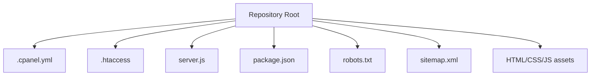
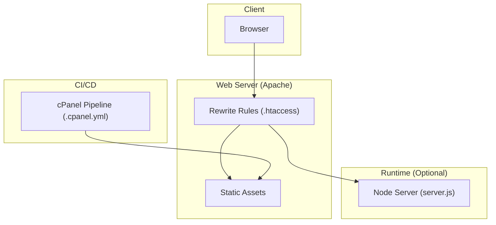
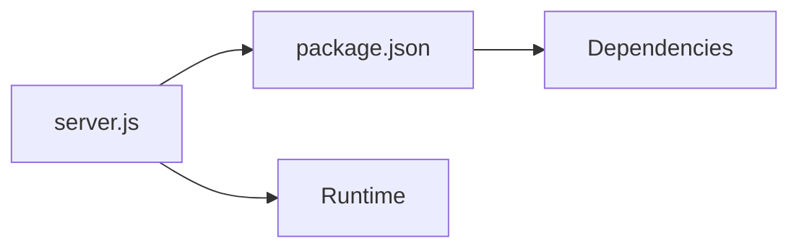

# Deployment & DevOps

<cite>
**Referenced Files in This Document**
- [.cpanel.yml](file://.cpanel.yml)
- [.htaccess](file://.htaccess)
- [server.js](file://server.js)
- [package.json](file://package.json)
- [README.md](file://README.md)
- [robots.txt](file://robots.txt)
- [sitemap.xml](file://sitemap.xml)
</cite>

## Table of Contents
1. [Introduction](#introduction)
2. [Project Structure](#project-structure)
3. [Core Components](#core-components)
4. [Architecture Overview](#architecture-overview)
5. [Detailed Component Analysis](#detailed-component-analysis)
6. [Dependency Analysis](#dependency-analysis)
7. [Performance Considerations](#performance-considerations)
8. [Troubleshooting Guide](#troubleshooting-guide)
9. [Conclusion](#conclusion)
10. [Appendices](#appendices)

## Introduction
This document provides comprehensive deployment and DevOps guidance for the project, focusing on production deployment processes, environment configuration, and maintenance procedures. It covers cPanel deployment configuration, Apache server setup with .htaccess rules, SSL certificate installation, domain configuration, version control practices, development workflow, testing strategies, debugging techniques, backup procedures, update management, monitoring setup, and troubleshooting guides for common deployment issues.

## Project Structure
The repository is a static site with optional Node.js runtime support via server.js and package.json. Key deployment-related files include:
- .cpanel.yml: cPanel automated deployment pipeline configuration
- .htaccess: Apache rewrite and security rules
- server.js: Optional Node.js HTTP server entrypoint
- package.json: Node.js dependencies and scripts
- robots.txt and sitemap.xml: SEO and crawler directives
- README.md: Project overview and usage notes

[No sources needed since this diagram shows conceptual structure]

## Core Components
- cPanel Deployment Pipeline: Automated build and deploy using .cpanel.yml
- Apache Configuration: URL rewriting, caching, and security via .htaccess
- Optional Node Server: Lightweight HTTP server (server.js) and dependency management (package.json)
- SEO and Crawling: robots.txt and sitemap.xml to guide search engines

**Section sources**
- [.cpanel.yml](file://.cpanel.yml)
- [.htaccess](file://.htaccess)
- [server.js](file://server.js)
- [package.json](file://package.json)
- [robots.txt](file://robots.txt)
- [sitemap.xml](file://sitemap.xml)

## Architecture Overview
The typical production architecture uses cPanel to deploy static assets into an Apache web root. The .htaccess file handles routing and performance optimizations. An optional Node.js server can be used for local development or specific runtime needs.

**Diagram sources**
- [.cpanel.yml](file://.cpanel.yml)
- [.htaccess](file://.htaccess)
- [server.js](file://server.js)

## Detailed Component Analysis

### cPanel Deployment Configuration
- Purpose: Automate deployment from Git to cPanel-managed hosting
- Typical responsibilities:
  - Define source branch and target directories
  - Pre/post-deploy hooks for building assets or running scripts
  - Environment variable injection if supported by the host
- Best practices:
  - Keep .cpanel.yml minimal and declarative
  - Use separate branches for staging and production
  - Validate builds locally before pushing

Operational steps:
- Ensure Git integration in cPanel
- Commit changes to the configured branch
- Monitor cPanel’s deployment logs for errors
- Roll back by redeploying a known-good commit

**Section sources**
- [.cpanel.yml](file://.cpanel.yml)

### Apache Server Setup with .htaccess
- Purpose: Configure URL rewriting, caching headers, compression, and security policies
- Common tasks:
  - Redirect HTTP to HTTPS
  - Enforce www/non-www canonical domains
  - Serve SPA-style routes via fallback to index.html when appropriate
  - Enable browser caching and gzip/deflate where supported
  - Restrict access to sensitive paths
- Validation:
  - Test redirects and rewrites across devices
  - Verify cache headers with browser dev tools
  - Confirm no 500 errors due to misconfigured rules

Security considerations:
- Disable directory listing
- Limit allowed methods
- Protect hidden files and directories

**Section sources**
- [.htaccess](file://.htaccess)

### SSL Certificate Installation
- Options:
  - Let’s Encrypt via cPanel AutoSSL
  - Manual upload of purchased certificates
- Steps:
  - Generate CSR if required
  - Install certificate and chain files
  - Force HTTPS redirect in .htaccess
  - Verify certificate validity and expiration dates
- Testing:
  - Use online SSL checkers
  - Confirm HSTS and secure headers if enabled

**Section sources**
- [.htaccess](file://.htaccess)

### Domain Configuration
- Tasks:
  - Add domain/subdomain in cPanel
  - Point DNS records to hosting IP
  - Set default domain and aliases
  - Configure email accounts if needed
- Verification:
  - Check propagation with DNS tools
  - Confirm site accessibility over HTTP/HTTPS

**Section sources**
- [.htaccess](file://.htaccess)

### Version Control Practices
- Branching strategy:
  - main for production
  - develop or feature branches for work-in-progress
- Commit hygiene:
  - Atomic commits with clear messages
  - Avoid committing secrets or large binaries
- Code review:
  - Pull requests with checks
  - Require approvals before merging

**Section sources**
- [README.md](file://README.md)

### Development Workflow
- Local setup:
  - Install dependencies
  - Start optional Node server for local preview
- Build process:
  - Run any asset optimization steps defined in package.json
- Deployment:
  - Push to the configured branch for cPanel to deploy

**Section sources**
- [package.json](file://package.json)
- [server.js](file://server.js)

### Testing Strategies
- Static site validation:
  - Lint HTML/CSS/JS
  - Check broken links and images
- Browser compatibility:
  - Cross-device testing
  - Mobile responsiveness checks
- Performance:
  - PageSpeed insights
  - Lighthouse audits

**Section sources**
- [README.md](file://README.md)

### Debugging Techniques
- Logs:
  - Apache error/access logs in cPanel
  - Node server logs if using server.js
- Tools:
  - Browser developer tools
  - curl and httpie for request inspection
- Common pitfalls:
  - Misconfigured .htaccess causing 500 errors
  - Missing assets due to incorrect paths
  - CORS issues when calling external APIs

**Section sources**
- [.htaccess](file://.htaccess)
- [server.js](file://server.js)

### Backup Procedures
- What to back up:
  - Web root content
  - Database (if applicable)
  - Email data and configurations
  - SSL certificates and keys
- Frequency:
  - Daily incremental, weekly full backups
- Recovery:
  - Test restore procedures periodically
  - Document rollback steps

[No sources needed since this section provides general guidance]

### Update Management
- Dependency updates:
  - Review package.json changes
  - Test upgrades in staging
- Security patches:
  - Subscribe to advisories
  - Apply promptly after validation
- Change control:
  - Maintain changelog
  - Coordinate deployments during low-traffic windows

**Section sources**
- [package.json](file://package.json)

### Monitoring Setup
- Availability:
  - Uptime monitors
- Performance:
  - Real user monitoring (RUM)
  - Synthetic checks
- Error tracking:
  - Centralized logging
  - Alerting thresholds

[No sources needed since this section provides general guidance]

## Dependency Analysis
The project includes a Node.js runtime option with server.js and package.json. Dependencies should be pinned and audited regularly.

**Diagram sources**
- [package.json](file://package.json)
- [server.js](file://server.js)

**Section sources**
- [package.json](file://package.json)
- [server.js](file://server.js)

## Performance Considerations
- Enable browser caching via .htaccess
- Minify and compress assets
- Use CDN for static resources
- Optimize images and fonts
- Reduce unnecessary redirects

[No sources needed since this section provides general guidance]

## Troubleshooting Guide
Common issues and resolutions:
- 500 Internal Server Error:
  - Inspect Apache error logs
  - Validate .htaccess syntax
- Redirect loops:
  - Check HTTPS and www/non-www rules
- Missing assets:
  - Verify paths and permissions
- SSL handshake failures:
  - Confirm certificate chain and expiration
- Slow page loads:
  - Analyze network waterfall
  - Review caching headers

**Section sources**
- [.htaccess](file://.htaccess)

## Conclusion
By following the outlined deployment, configuration, and maintenance procedures, you can reliably operate this project in production. Leverage cPanel automation, enforce HTTPS, maintain clean version control, and implement robust monitoring and backups to ensure stability and performance.

[No sources needed since this section summarizes without analyzing specific files]

## Appendices

### SEO and Crawling Configuration
- robots.txt: Control crawler access
- sitemap.xml: Provide structured URLs for indexing

**Section sources**
- [robots.txt](file://robots.txt)
- [sitemap.xml](file://sitemap.xml)