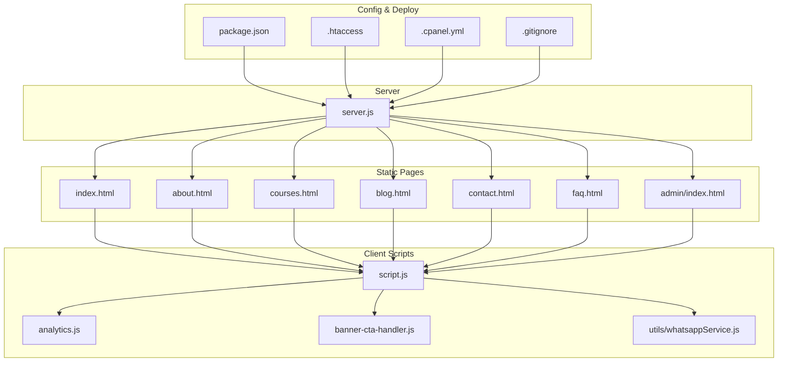
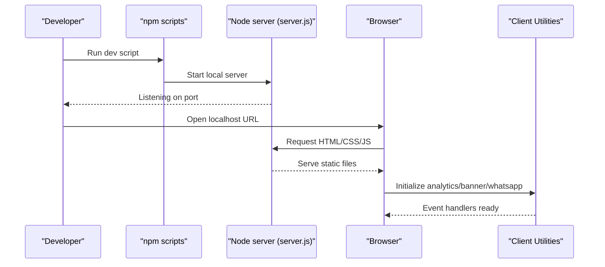
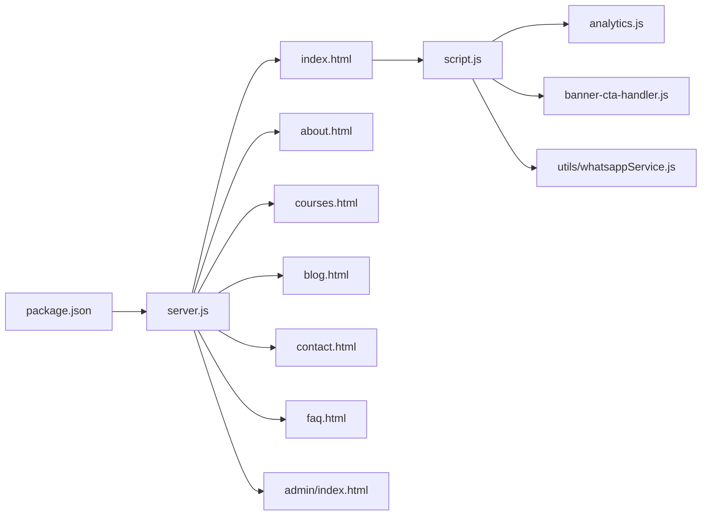

# Development Workflow

<cite>
**Referenced Files in This Document**
- [README.md](file://README.md)
- [package.json](file://package.json)
- [server.js](file://server.js)
- [.gitignore](file://.gitignore)
- [.htaccess](file://.htaccess)
- [.cpanel.yml](file://.cpanel.yml)
- [script.js](file://script.js)
- [analytics.js](file://analytics.js)
- [banner-cta-handler.js](file://banner-cta-handler.js)
- [utils/whatsappService.js](file://utils/whatsappService.js)
</cite>

## Table of Contents
1. [Introduction](#introduction)
2. [Project Structure](#project-structure)
3. [Core Components](#core-components)
4. [Architecture Overview](#architecture-overview)
5. [Detailed Component Analysis](#detailed-component-analysis)
6. [Dependency Analysis](#dependency-analysis)
7. [Performance Considerations](#performance-considerations)
8. [Troubleshooting Guide](#troubleshooting-guide)
9. [Conclusion](#conclusion)
10. [Appendices](#appendices)

## Introduction
This document defines the development workflow for the GeniusMind platform, focusing on version control practices, local development setup, testing strategies, and debugging techniques. It also covers Git branching strategies, commit conventions, code review processes, collaboration guidelines, npm scripts usage, hot reloading configuration, and error tracking. The guidance is tailored to the project’s architecture as reflected by its repository structure and configuration files.

## Project Structure
The repository follows a flat, static-site-oriented layout with a small Node server entry point and modular client-side utilities:
- Root HTML pages define the site routes (e.g., index.html, about.html, courses.html).
- Client-side logic resides in root JavaScript files and feature-specific modules under utils/.
- A minimal server entry point (server.js) serves the application locally or in production.
- Configuration and deployment artifacts include .htaccess, .cpanel.yml, and package.json.

**Diagram sources**
- [server.js](file://server.js)
- [package.json](file://package.json)
- [.htaccess](file://.htaccess)
- [.cpanel.yml](file://.cpanel.yml)
- [script.js](file://script.js)
- [analytics.js](file://analytics.js)
- [banner-cta-handler.js](file://banner-cta-handler.js)
- [utils/whatsappService.js](file://utils/whatsappService.js)

**Section sources**
- [README.md](file://README.md)
- [package.json](file://package.json)
- [server.js](file://server.js)
- [.htaccess](file://.htaccess)
- [.cpanel.yml](file://.cpanel.yml)

## Core Components
- Server entry point: Provides local development and production serving behavior.
- Client scripts: Centralized UI logic and integrations (analytics, banner CTA, WhatsApp service).
- Configuration: Package scripts, server settings, and deployment hints.

Key responsibilities:
- Local development server startup and file serving.
- Client-side initialization and event handling.
- External integrations via utility modules.

**Section sources**
- [server.js](file://server.js)
- [script.js](file://script.js)
- [analytics.js](file://analytics.js)
- [banner-cta-handler.js](file://banner-cta-handler.js)
- [utils/whatsappService.js](file://utils/whatsappService.js)
- [package.json](file://package.json)

## Architecture Overview
At runtime, the Node server serves static assets and HTML pages. Client scripts initialize analytics, handle user interactions, and communicate with external services through utility modules. Deployment can be performed via cPanel using the provided configuration.

**Diagram sources**
- [server.js](file://server.js)
- [package.json](file://package.json)
- [script.js](file://script.js)
- [analytics.js](file://analytics.js)
- [banner-cta-handler.js](file://banner-cta-handler.js)
- [utils/whatsappService.js](file://utils/whatsappService.js)

## Detailed Component Analysis

### Version Control Practices
- Branching strategy:
  - main: Stable, deployable state.
  - develop: Integration branch for features.
  - feature/*: Feature branches derived from develop.
  - fix/*: Hotfixes derived from main or develop.
  - release/*: Preparation for releases.
- Commit conventions:
  - Use imperative, concise messages.
  - Prefix with type: feat, fix, docs, style, refactor, test, chore.
  - Scope optional: e.g., feat(server): add health endpoint.
  - Reference issues where applicable.
- Code review process:
  - Create pull requests against develop or main depending on change type.
  - Require at least one reviewer approval.
  - Ensure CI passes (linting, tests if added later).
  - Squash and merge after approvals.
- Collaboration guidelines:
  - Keep PRs small and focused.
  - Update README and documentation when changing workflows or scripts.
  - Tag relevant teammates for reviews.

[No sources needed since this section provides general guidance]

### Local Development Setup
- Prerequisites:
  - Node.js LTS recommended.
  - npm available.
- Installation:
  - Install dependencies using the package manager defined in package.json.
- Running the app:
  - Use the development script defined in package.json to start the local server.
  - Access the site at the configured local URL.
- Hot reloading:
  - If enabled in package.json scripts, changes will reload automatically during development.
  - Otherwise, restart the server manually after edits.

**Section sources**
- [package.json](file://package.json)
- [server.js](file://server.js)

### Testing Strategies
- Current state:
  - No dedicated test framework is evident in the repository structure.
- Recommended approach:
  - Add a lightweight unit test runner for client utilities (e.g., utils/whatsappService.js).
  - Introduce smoke tests for critical pages and endpoints served by server.js.
  - Define npm test scripts to run checks consistently across environments.
- Manual verification:
  - Validate analytics events and banner interactions in the browser console.
  - Test WhatsApp integration flows end-to-end.

[No sources needed since this section provides general guidance]

### Debugging Techniques
- Browser-based debugging:
  - Use Developer Tools to inspect network requests, console logs, and DOM events.
  - Breakpoints in script.js, analytics.js, banner-cta-handler.js, and utils/whatsappService.js.
- Server-side debugging:
  - Inspect server startup and request handling in server.js.
  - Log environment variables and configuration values used by the server.
- Error tracking:
  - Integrate a client-side error reporter via analytics.js or a dedicated module.
  - Capture unhandled promise rejections and global errors.
  - Forward structured error payloads to your monitoring backend.

**Section sources**
- [script.js](file://script.js)
- [analytics.js](file://analytics.js)
- [banner-cta-handler.js](file://banner-cta-handler.js)
- [utils/whatsappService.js](file://utils/whatsappService.js)
- [server.js](file://server.js)

### Performance Profiling
- Frontend profiling:
  - Use Performance and Memory tabs in browser DevTools.
  - Identify heavy event handlers in script.js and banner-cta-handler.js.
  - Measure impact of analytics.js initialization.
- Network analysis:
  - Check resource loading order and caching headers set by server.js or .htaccess.
- Optimization opportunities:
  - Defer non-critical scripts.
  - Minify and bundle assets if not already done.
  - Leverage browser caching via .htaccess rules.

**Section sources**
- [script.js](file://script.js)
- [analytics.js](file://analytics.js)
- [banner-cta-handler.js](file://banner-cta-handler.js)
- [server.js](file://server.js)
- [.htaccess](file://.htaccess)

## Dependency Analysis
The project has minimal runtime dependencies and relies primarily on static assets and a small Node server. The following diagram highlights key relationships among core files.

**Diagram sources**
- [package.json](file://package.json)
- [server.js](file://server.js)
- [script.js](file://script.js)
- [analytics.js](file://analytics.js)
- [banner-cta-handler.js](file://banner-cta-handler.js)
- [utils/whatsappService.js](file://utils/whatsappService.js)

**Section sources**
- [package.json](file://package.json)
- [server.js](file://server.js)
- [script.js](file://script.js)
- [analytics.js](file://analytics.js)
- [banner-cta-handler.js](file://banner-cta-handler.js)
- [utils/whatsappService.js](file://utils/whatsappService.js)

## Performance Considerations
- Prefer lazy initialization for analytics and third-party integrations.
- Cache static assets aggressively using .htaccess directives.
- Monitor server response times and optimize large responses.
- Profile long tasks in the main thread and offload work to Web Workers if necessary.
- Keep bundle sizes small; avoid unnecessary libraries.

[No sources needed since this section provides general guidance]

## Troubleshooting Guide
Common issues and resolutions:
- Local server does not start:
  - Verify Node.js installation and that required dependencies are installed.
  - Check port conflicts and adjust configuration if needed.
- Assets not loading:
  - Confirm .htaccess rewrite rules and MIME types.
  - Validate paths in HTML and scripts.
- Analytics not firing:
  - Inspect analytics.js initialization and network requests.
  - Ensure consent and tracking flags are correctly set.
- WhatsApp integration failures:
  - Validate phone number formatting and message payload in utils/whatsappService.js.
  - Check CORS and external service availability.

**Section sources**
- [server.js](file://server.js)
- [.htaccess](file://.htaccess)
- [analytics.js](file://analytics.js)
- [utils/whatsappService.js](file://utils/whatsappService.js)

## Conclusion
This workflow establishes clear practices for version control, local development, testing, debugging, and performance optimization aligned with the GeniusMind platform’s current architecture. Adopting these guidelines will improve consistency, collaboration, and reliability across the team.

[No sources needed since this section summarizes without analyzing specific files]

## Appendices

### Git Branching Model
- main: Production-ready code.
- develop: Integration branch for upcoming changes.
- feature/*: New features.
- fix/*: Bug fixes.
- release/*: Release preparation.

[No sources needed since this section provides general guidance]

### Commit Message Template
- Type(scope): Subject
- Body (optional)
- Footer (optional)

[No sources needed since this section provides general guidance]

### Environment Variables
- Define any required environment variables for the server and client integrations.
- Store secrets securely and reference them in server.js and client utilities.

[No sources needed since this section provides general guidance]

### Deployment Notes
- Use .cpanel.yml for automated deployments if supported by your hosting provider.
- Ensure .htaccess rules are correct for routing and caching.
- Validate domain configuration and SSL certificates.

**Section sources**
- [.cpanel.yml](file://.cpanel.yml)
- [.htaccess](file://.htaccess)