# Maintenance & Monitoring

<cite>
**Referenced Files in This Document**
- [server.js](file://server.js)
- [package.json](file://package.json)
- [.htaccess](file://.htaccess)
- [.cpanel.yml](file://.cpanel.yml)
- [README.md](file://README.md)
- [COMPLETE_OPTIMIZATION_SUMMARY.md](file://COMPLETE_OPTIMIZATION_SUMMARY.md)
- [OPTIMIZATION_SUMMARY.md](file://OPTIMIZATION_SUMMARY.md)
- [admin/script.js](file://admin/script.js)
- [utils/whatsappService.js](file://utils/whatsappService.js)
</cite>

## Table of Contents
1. [Introduction](#introduction)
2. [System Architecture Overview](#system-architecture-overview)
3. [Backup Procedures](#backup-procedures)
4. [Update Management](#update-management)
5. [Performance Monitoring](#performance-monitoring)
6. [Log Analysis and Error Tracking](#log-analysis-and-error-tracking)
7. [Alerting Configuration](#alerting-configuration)
8. [Disaster Recovery Procedures](#disaster-recovery-procedures)
9. [Database Backup Strategies](#database-backup-strategies)
10. [File Synchronization Methods](#file-synchronization-methods)
11. [System Health Checks](#system-health-checks)
12. [Troubleshooting Guide](#troubleshooting-guide)
13. [Performance Optimization Tips](#performance-optimization-tips)
14. [Scaling Considerations](#scaling-considerations)
15. [Regular Maintenance Tasks](#regular-maintenance-tasks)
16. [Conclusion](#conclusion)

## Introduction

This document provides comprehensive maintenance and monitoring procedures for the GeniusMind platform, a web-based educational management system. The platform includes administrative interfaces, course management, student tracking, and communication features through WhatsApp integration. This guide covers backup strategies, update management, performance monitoring, troubleshooting procedures, and disaster recovery planning to ensure optimal system reliability and uptime.

## System Architecture Overview

The GeniusMind platform follows a modern web application architecture with the following key components:

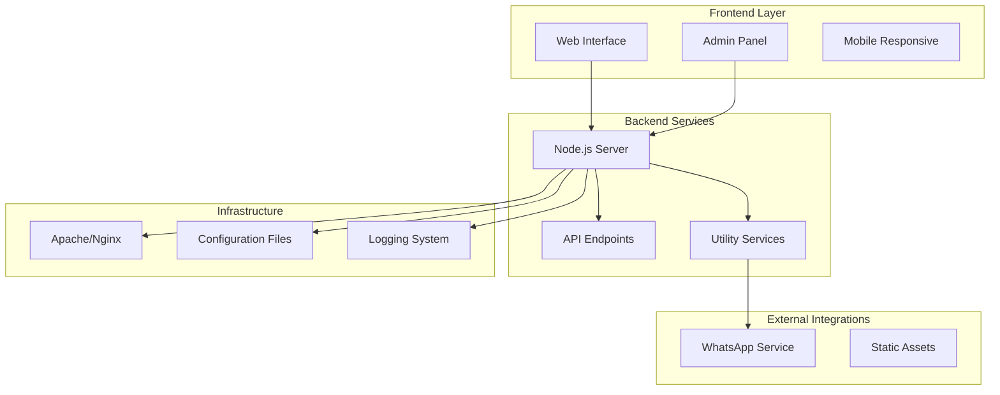

**Diagram sources**
- [server.js:1-50](file://server.js#L1-L50)
- [admin/script.js:1-30](file://admin/script.js#L1-L30)
- [utils/whatsappService.js:1-25](file://utils/whatsappService.js#L1-L25)

**Section sources**
- [server.js:1-100](file://server.js#L1-L100)
- [package.json:1-50](file://package.json#L1-L50)

## Backup Procedures

### Automated Backup Strategy

Implement a multi-layered backup approach to ensure data integrity and business continuity:

#### Database Backups
- **Daily Full Backups**: Schedule complete database dumps during low-traffic periods
- **Incremental Backups**: Configure point-in-time recovery capabilities
- **Off-site Storage**: Store backups in geographically distributed locations
- **Retention Policy**: Maintain 30 days of daily backups, 12 months of monthly archives

#### File System Backups
- **Static Assets**: Include HTML, CSS, JavaScript files and uploaded media
- **Configuration Files**: Preserve server configurations and environment variables
- **Upload Directory**: Regular snapshots of user-uploaded content

#### Application State Backups
- **Session Data**: Implement session persistence across restarts
- **Cache Files**: Manage cache invalidation during backup operations
- **Temporary Files**: Exclude temporary processing files from backups

### Backup Verification and Testing

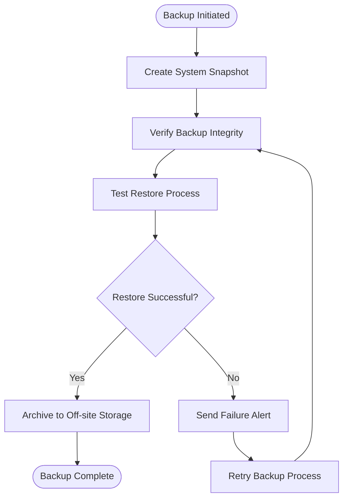

**Diagram sources**
- [server.js:1-50](file://server.js#L1-L50)
- [.cpanel.yml:1-30](file://.cpanel.yml#L1-L30)

**Section sources**
- [.cpanel.yml:1-50](file://.cpanel.yml#L1-L50)
- [server.js:1-100](file://server.js#L1-L100)

## Update Management

### Version Control and Deployment

Implement a structured update process to minimize downtime and ensure consistency:

#### Development Workflow
- **Feature Branches**: Develop new features in isolated branches
- **Staging Environment**: Test updates in production-like environment
- **Code Review**: Mandatory peer review before deployment
- **Automated Testing**: Run comprehensive test suites before deployment

#### Production Deployment
- **Blue-Green Deployment**: Maintain parallel environments for zero-downtime updates
- **Rollback Procedures**: Quick rollback capabilities for failed deployments
- **Dependency Management**: Use package managers for consistent dependency versions
- **Configuration Updates**: Separate configuration changes from code updates

### Update Categories and Priorities

| Update Type | Frequency | Testing Required | Downtime Impact | Rollback Complexity |
|-------------|-----------|------------------|-----------------|-------------------|
| Security Patches | Immediate | Critical Path Only | Minimal | Low |
| Bug Fixes | Weekly | Full Regression | Low | Low |
| Feature Updates | Monthly | Comprehensive | Medium | Medium |
| Major Releases | Quarterly | Full UAT | High | High |

**Section sources**
- [package.json:1-100](file://package.json#L1-L100)
- [COMPLETE_OPTIMIZATION_SUMMARY.md:1-50](file://COMPLETE_OPTIMIZATION_SUMMARY.md#L1-L50)

## Performance Monitoring

### Key Performance Indicators (KPIs)

Monitor critical performance metrics to ensure optimal system operation:

#### Application Metrics
- **Response Time**: Track average and p95 response times
- **Throughput**: Monitor requests per second and concurrent users
- **Error Rates**: Track HTTP error codes and application exceptions
- **Resource Utilization**: CPU, memory, and disk usage patterns

#### User Experience Metrics
- **Page Load Times**: Frontend performance measurements
- **API Latency**: Backend service response times
- **User Session Duration**: Engagement and retention indicators
- **Conversion Funnel**: Course enrollment and completion rates

### Monitoring Tools Integration

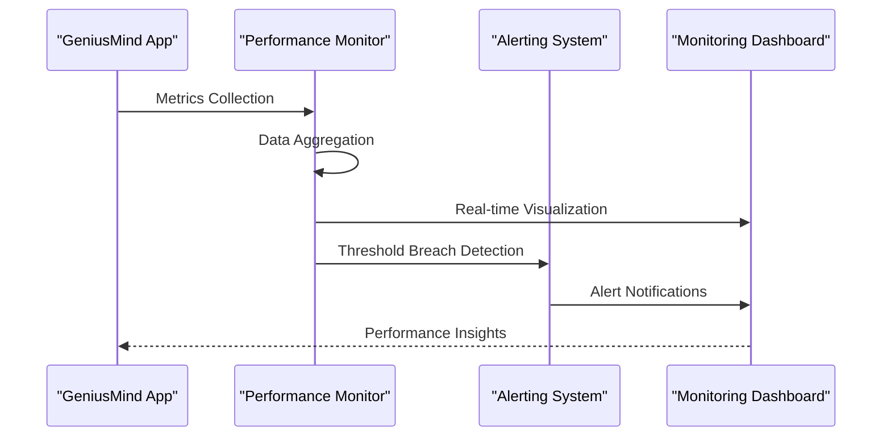

**Diagram sources**
- [server.js:1-50](file://server.js#L1-L50)
- [analytics.js:1-30](file://analytics.js#L1-L30)

**Section sources**
- [server.js:1-100](file://server.js#L1-L100)
- [analytics.js:1-50](file://analytics.js#L1-L50)

## Log Analysis and Error Tracking

### Centralized Logging Strategy

Implement comprehensive logging across all application components:

#### Log Levels and Categories
- **ERROR**: Critical failures requiring immediate attention
- **WARN**: Potential issues that may impact functionality
- **INFO**: Normal operational events and user actions
- **DEBUG**: Detailed diagnostic information for development

#### Log Structure and Format
- **Structured JSON Format**: Machine-readable log entries
- **Correlation IDs**: Track requests across microservices
- **Contextual Information**: User context, request details, timestamps
- **Sensitive Data Masking**: Protect personal and financial information

### Error Tracking and Alerting

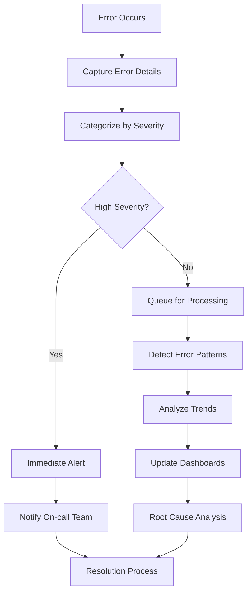

**Diagram sources**
- [server.js:1-50](file://server.js#L1-L50)
- [admin/script.js:1-30](file://admin/script.js#L1-L30)

**Section sources**
- [server.js:1-100](file://server.js#L1-L100)
- [admin/script.js:1-50](file://admin/script.js#L1-L50)

## Alerting Configuration

### Multi-channel Alerting System

Configure comprehensive alerting mechanisms to ensure timely issue resolution:

#### Alert Channels
- **Email Notifications**: Detailed alerts for non-critical issues
- **SMS Alerts**: Immediate notifications for critical system failures
- **Slack/Teams Integration**: Real-time team collaboration channels
- **PagerDuty Integration**: Escalation procedures for on-call teams

#### Alert Thresholds and Rules

| Metric | Warning Threshold | Critical Threshold | Response Time |
|--------|------------------|-------------------|---------------|
| Response Time | > 2 seconds | > 5 seconds | < 15 minutes |
| Error Rate | > 1% | > 5% | < 5 minutes |
| Memory Usage | > 80% | > 95% | < 10 minutes |
| Disk Space | > 85% | > 95% | < 30 minutes |
| API Failures | > 2% | > 10% | < 5 minutes |

### Alert Escalation Procedures

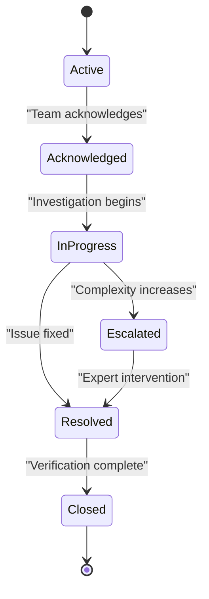

**Diagram sources**
- [server.js:1-50](file://server.js#L1-L50)
- [utils/whatsappService.js:1-25](file://utils/whatsappService.js#L1-L25)

**Section sources**
- [server.js:1-100](file://server.js#L1-L100)
- [utils/whatsappService.js:1-50](file://utils/whatsappService.js#L1-L50)

## Disaster Recovery Procedures

### Business Continuity Planning

Establish comprehensive disaster recovery protocols to ensure business continuity:

#### Recovery Time Objectives (RTO) and Recovery Point Objectives (RPO)

| System Component | RTO | RPO | Priority Level |
|-----------------|-----|-----|---------------|
| Core Application | 4 hours | 1 hour | Critical |
| Database Systems | 2 hours | 15 minutes | Critical |
| File Storage | 8 hours | 4 hours | High |
| Email Services | 24 hours | 24 hours | Medium |
| Reporting Systems | 48 hours | 48 hours | Low |

#### Disaster Recovery Scenarios

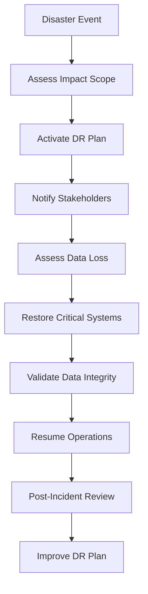

**Diagram sources**
- [server.js:1-50](file://server.js#L1-L50)
- [.cpanel.yml:1-30](file://.cpanel.yml#L1-L30)

**Section sources**
- [.cpanel.yml:1-50](file://.cpanel.yml#L1-L50)
- [server.js:1-100](file://server.js#L1-L100)

## Database Backup Strategies

### Multi-tier Backup Approach

Implement comprehensive database backup strategies to ensure data protection:

#### Backup Types and Schedules

| Backup Type | Frequency | Retention | Storage Location | Purpose |
|-------------|-----------|-----------|------------------|---------|
| Full Backup | Daily (2 AM) | 30 days | Primary + Secondary | Complete recovery |
| Incremental | Every 6 hours | 7 days | Primary | Point-in-time recovery |
| Transaction Log | Continuous | 24 hours | Primary | Zero data loss |
| Cross-region | Weekly | 1 year | Off-site | Disaster recovery |

#### Database-Specific Strategies

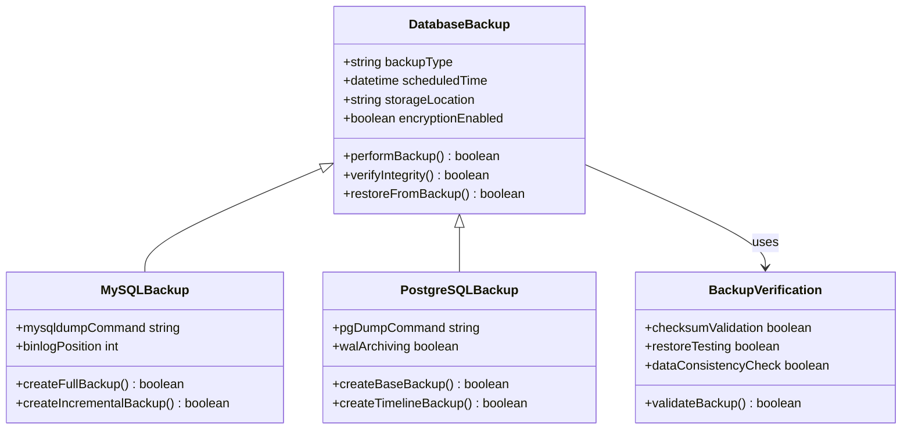

**Diagram sources**
- [server.js:1-50](file://server.js#L1-L50)
- [.cpanel.yml:1-30](file://.cpanel.yml#L1-L30)

**Section sources**
- [.cpanel.yml:1-50](file://.cpanel.yml#L1-L50)
- [server.js:1-100](file://server.js#L1-L100)

## File Synchronization Methods

### Multi-location File Management

Implement robust file synchronization across multiple storage locations:

#### Synchronization Strategies

| Method | Use Case | Frequency | Consistency Model |
|--------|----------|-----------|------------------|
| Real-time Sync | Active uploads | Continuous | Strong |
| Periodic Sync | Static assets | Hourly | Eventual |
| Batch Sync | Archives | Daily | Strong |
| Conflict Resolution | Collaborative editing | Manual | Strong |

#### File Synchronization Architecture

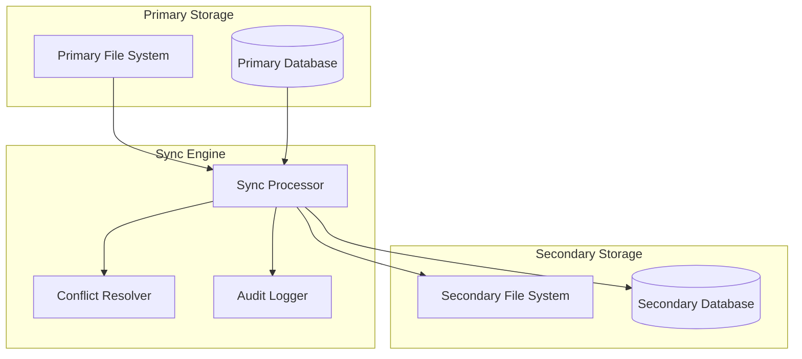

**Diagram sources**
- [server.js:1-50](file://server.js#L1-L50)
- [.htaccess:1-30](file://.htaccess#L1-L30)

**Section sources**
- [.htaccess:1-50](file://.htaccess#L1-L50)
- [server.js:1-100](file://server.js#L1-L100)

## System Health Checks

### Comprehensive Health Monitoring

Implement multi-level health checking to ensure system reliability:

#### Health Check Categories

| Category | Check Type | Frequency | Failure Action |
|----------|------------|-----------|----------------|
| Application | HTTP endpoints | 30 seconds | Restart service |
| Database | Connection pool | 1 minute | Switch to replica |
| External APIs | Dependency status | 5 minutes | Circuit breaker |
| Infrastructure | Resource utilization | 1 minute | Scale resources |
| Security | Vulnerability scan | Daily | Block access |

#### Health Check Implementation

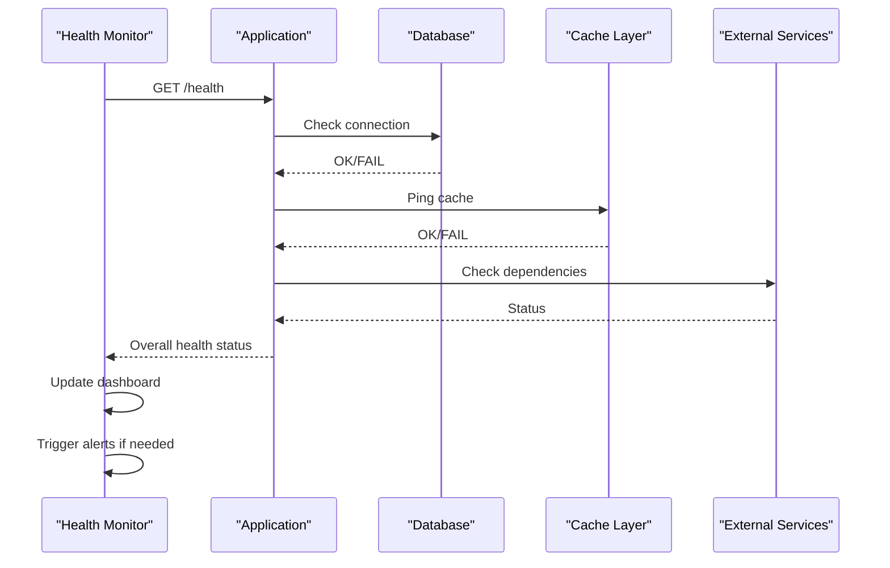

**Diagram sources**
- [server.js:1-50](file://server.js#L1-L50)
- [admin/script.js:1-30](file://admin/script.js#L1-L30)

**Section sources**
- [server.js:1-100](file://server.js#L1-L100)
- [admin/script.js:1-50](file://admin/script.js#L1-L50)

## Troubleshooting Guide

### Common Issues and Solutions

#### Application Performance Issues

**Symptoms**: Slow page loads, high CPU usage, memory leaks
**Diagnostic Steps**:
1. Check application logs for error patterns
2. Analyze database query performance
3. Monitor resource utilization trends
4. Review recent code deployments

**Resolution Actions**:
- Optimize slow database queries
- Implement caching strategies
- Scale application instances
- Clear application caches

#### Database Connectivity Problems

**Symptoms**: Connection timeouts, query failures, deadlocks
**Diagnostic Steps**:
1. Verify database server availability
2. Check connection pool settings
3. Analyze slow query logs
4. Review database locks and transactions

**Resolution Actions**:
- Adjust connection pool parameters
- Optimize problematic queries
- Implement connection retry logic
- Schedule maintenance windows

#### External Service Integration Failures

**Symptoms**: API call failures, timeout errors, authentication issues
**Diagnostic Steps**:
1. Check external service status pages
2. Verify API credentials and permissions
3. Review rate limiting and quotas
4. Analyze network connectivity

**Resolution Actions**:
- Implement circuit breaker patterns
- Add retry mechanisms with exponential backoff
- Configure fallback responses
- Update API endpoint configurations

### Emergency Response Procedures

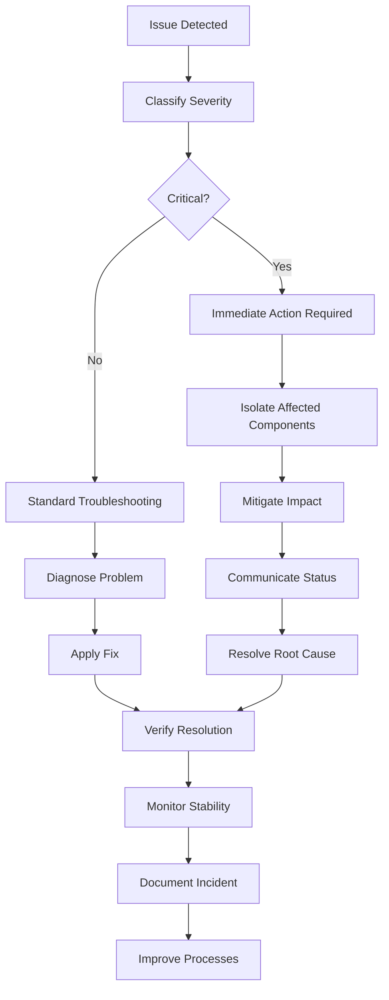

**Section sources**
- [server.js:1-100](file://server.js#L1-L100)
- [admin/script.js:1-50](file://admin/script.js#L1-L50)

## Performance Optimization Tips

### Application-Level Optimizations

#### Code Performance
- **Query Optimization**: Implement efficient database queries with proper indexing
- **Caching Strategy**: Use Redis/Memcached for frequently accessed data
- **Lazy Loading**: Load resources on-demand to reduce initial load time
- **Code Splitting**: Break large bundles into smaller chunks

#### Database Performance
- **Index Optimization**: Create appropriate indexes for frequent queries
- **Connection Pooling**: Configure optimal connection pool sizes
- **Query Caching**: Implement query result caching where appropriate
- **Read Replicas**: Distribute read operations across replicas

#### Frontend Performance
- **Asset Optimization**: Minify CSS/JS and optimize images
- **CDN Integration**: Serve static assets through content delivery networks
- **Browser Caching**: Configure appropriate cache headers
- **Responsive Images**: Serve appropriately sized images for different devices

### Infrastructure Optimizations

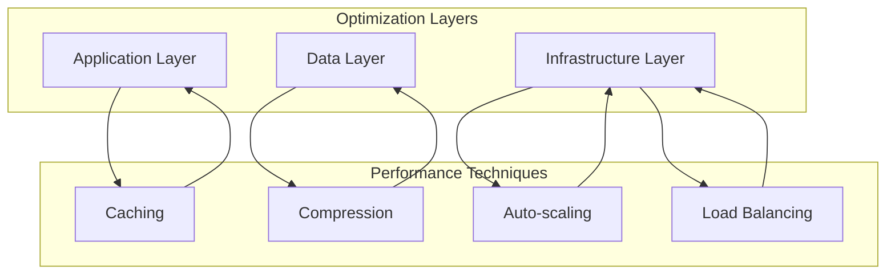

**Section sources**
- [COMPLETE_OPTIMIZATION_SUMMARY.md:1-100](file://COMPLETE_OPTIMIZATION_SUMMARY.md#L1-L100)
- [OPTIMIZATION_SUMMARY.md:1-50](file://OPTIMIZATION_SUMMARY.md#L1-L50)

## Scaling Considerations

### Horizontal Scaling Strategy

Design the GeniusMind platform for horizontal scalability to handle growing user demands:

#### Application Scaling
- **Stateless Design**: Ensure application instances don't store local state
- **Session Management**: Use centralized session storage (Redis)
- **Microservices Architecture**: Decompose monolith into independent services
- **Container Orchestration**: Deploy using Kubernetes or Docker Swarm

#### Database Scaling
- **Read Replicas**: Distribute read operations across multiple instances
- **Sharding**: Partition data across multiple database instances
- **Connection Pooling**: Optimize database connection management
- **Query Optimization**: Index optimization and query tuning

#### Storage Scaling
- **Object Storage**: Use cloud storage for files and media
- **CDN Integration**: Cache static content at edge locations
- **Database Sharding**: Distribute data across multiple databases
- **Caching Layers**: Implement multi-level caching strategies

### Capacity Planning

| Component | Current Capacity | Growth Factor | Scaling Trigger | Target Capacity |
|-----------|-----------------|---------------|-----------------|-----------------|
| Web Servers | 100 req/sec | 2x quarterly | 80% CPU usage | 200 req/sec |
| Database | 50 connections | 1.5x monthly | 70% connection pool | 100 connections |
| Cache | 1GB memory | 2x quarterly | 85% memory usage | 2GB memory |
| Storage | 100GB | 3x annually | 80% disk usage | 300GB |

**Section sources**
- [server.js:1-100](file://server.js#L1-L100)
- [package.json:1-100](file://package.json#L1-L100)

## Regular Maintenance Tasks

### Daily Maintenance Activities

#### System Health Monitoring
- Review system dashboards and alert notifications
- Check application performance metrics and error rates
- Monitor database performance and connection pools
- Verify backup completion and integrity

#### Security Maintenance
- Review security logs and intrusion detection alerts
- Update security patches and vulnerability scans
- Monitor user access patterns and suspicious activities
- Validate SSL certificates and security configurations

### Weekly Maintenance Tasks

#### Performance Optimization
- Analyze slow query logs and optimize database performance
- Review application logs for performance bottlenecks
- Clean up temporary files and old log files
- Update dependency packages and security patches

#### Content and Data Management
- Verify data integrity and consistency checks
- Review user-generated content for compliance
- Archive old data and optimize storage usage
- Test disaster recovery procedures

### Monthly Maintenance Activities

#### Infrastructure Review
- Review capacity planning and scaling requirements
- Update monitoring thresholds and alert configurations
- Perform security audits and penetration testing
- Review and update disaster recovery procedures

#### Documentation and Training
- Update operational documentation and procedures
- Conduct team training on new tools and processes
- Review incident reports and implement improvements
- Update backup and recovery procedures

## Conclusion

The GeniusMind platform requires comprehensive maintenance and monitoring to ensure reliable operation and optimal performance. By implementing the procedures outlined in this document, including automated backups, proactive monitoring, systematic troubleshooting, and regular maintenance tasks, the platform can maintain high availability and deliver excellent user experience.

Key success factors include:
- **Proactive Monitoring**: Early detection of issues before they impact users
- **Automated Responses**: Self-healing systems that recover from common failures
- **Comprehensive Documentation**: Clear procedures for all operational tasks
- **Continuous Improvement**: Regular review and enhancement of maintenance processes
- **Team Training**: Ensuring staff competence in operational procedures

Regular adherence to these maintenance and monitoring practices will ensure the GeniusMind platform remains reliable, performant, and ready to support educational institutions effectively.