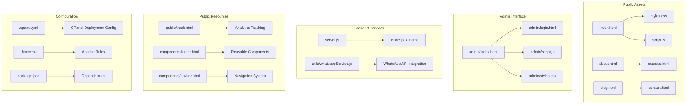
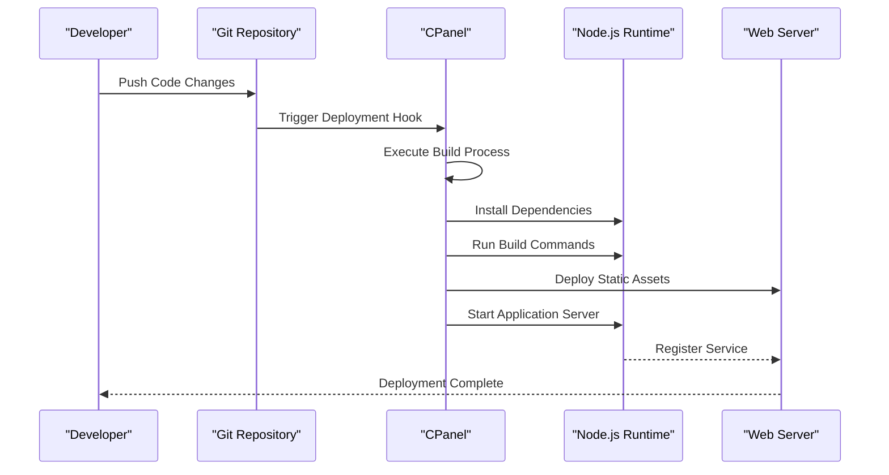
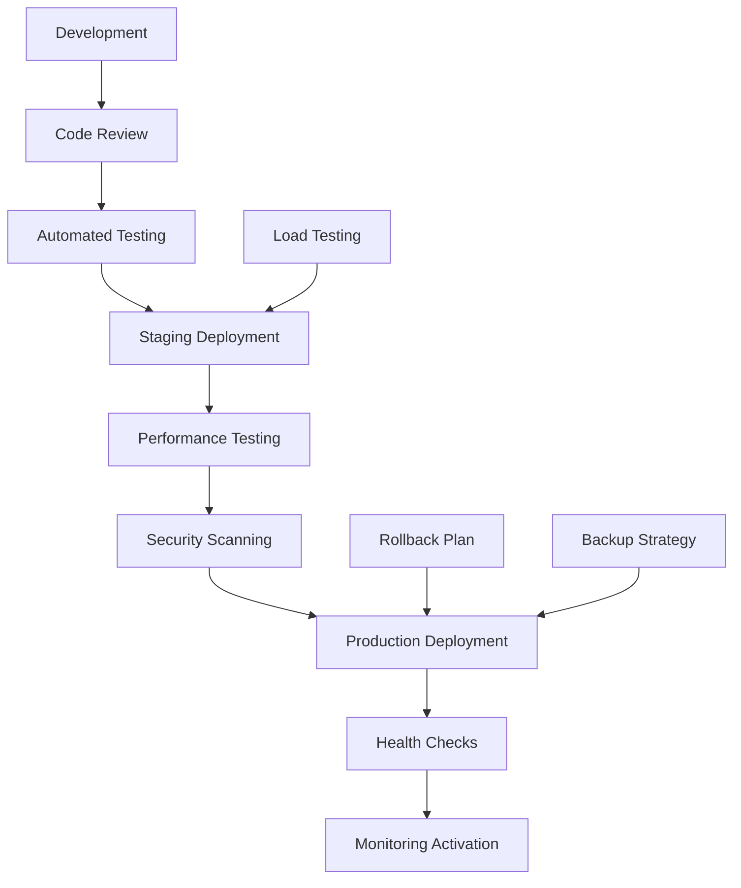

# Production Deployment

<cite>
**Referenced Files in This Document**
- [.cpanel.yml](file://.cpanel.yml)
- [.htaccess](file://.htaccess)
- [server.js](file://server.js)
- [package.json](file://package.json)
- [README.md](file://README.md)
- [index.html](file://index.html)
- [admin/index.html](file://admin/index.html)
- [public/track.html](file://public/track.html)
</cite>

## Table of Contents
1. [Introduction](#introduction)
2. [Project Structure Analysis](#project-structure-analysis)
3. [Core Deployment Components](#core-deployment-components)
4. [CPanel Configuration](#cpanel-configuration)
5. [Apache Server Setup](#apache-server-setup)
6. [SSL Certificate Installation](#ssl-certificate-installation)
7. [Domain Configuration](#domain-configuration)
8. [Environment Variables Setup](#environment-variables-setup)
9. [Database Configuration](#database-configuration)
10. [File Permissions and Security](#file-permissions-and-security)
11. [Performance Optimization](#performance-optimization)
12. [Deployment Pipeline](#deployment-pipeline)
13. [Troubleshooting Guide](#troubleshooting-guide)
14. [Monitoring and Maintenance](#monitoring-and-maintenance)
15. [Conclusion](#conclusion)

## Introduction

This document provides comprehensive production deployment instructions for the GeniusMind platform, covering cPanel deployment configuration, Apache server setup with .htaccess rules, SSL certificate installation, and domain configuration. The guide addresses the complete deployment pipeline from development to production environments, including environment variable configuration, database setup, file permissions, and security hardening measures.

The GeniusMind platform is a web-based educational application built with Node.js backend and HTML/CSS/JavaScript frontend components. It includes administrative functionality, course management, and student tracking capabilities.

## Project Structure Analysis

The GeniusMind platform follows a modular architecture with clear separation between public-facing content, administrative interfaces, and backend services:

**Diagram sources**
- [index.html:1-50](file://index.html#L1-L50)
- [server.js:1-100](file://server.js#L1-L100)
- [.cpanel.yml:1-50](file://.cpanel.yml#L1-L50)
- [.htaccess:1-100](file://.htaccess#L1-L100)

**Section sources**
- [README.md:1-100](file://README.md#L1-L100)
- [package.json:1-50](file://package.json#L1-L50)

## Core Deployment Components

### Backend Server Architecture

The GeniusMind platform uses a Node.js server that handles API requests, serves static content, and manages business logic. The server configuration includes routing, middleware setup, and integration with external services like WhatsApp messaging.

### Frontend Asset Management

Static assets are organized in a hierarchical structure with reusable components, responsive styling, and client-side JavaScript functionality. The platform supports multiple pages including course listings, blog posts, contact forms, and administrative interfaces.

### Configuration Management

Deployment-specific configurations are managed through cPanel YAML files, Apache rewrite rules, and package dependencies. Environment-specific settings allow for different behaviors across development, staging, and production environments.

**Section sources**
- [server.js:1-200](file://server.js#L1-L200)
- [package.json:1-100](file://package.json#L1-L100)

## CPanel Configuration

### CPanel Deployment File Structure

The `.cpanel.yml` file defines the deployment pipeline for cPanel hosting environments. This configuration specifies build processes, file deployments, and service restarts required for successful application deployment.

### Key Configuration Parameters

| Parameter | Description | Default Value | Required |
|-----------|-------------|---------------|----------|
| app_root | Root directory of the application | ./ | Yes |
| deploy_to | Target deployment directory | ~/public_html | Yes |
| node_version | Node.js version for runtime | 18.x | Yes |
| npm_version | NPM version for dependency management | latest | Yes |
| build_command | Command to build the application | npm install && npm run build | Yes |
| start_command | Command to start the application | node server.js | Yes |
| env_vars | Environment variables for the application | {} | No |

### Deployment Workflow

**Diagram sources**
- [.cpanel.yml:1-100](file://.cpanel.yml#L1-L100)

**Section sources**
- [.cpanel.yml:1-150](file://.cpanel.yml#L1-L150)

## Apache Server Setup

### .htaccess Configuration

The `.htaccess` file contains Apache rewrite rules, security headers, caching policies, and URL rewriting directives essential for proper application routing and performance optimization.

### Essential Rewrite Rules

| Rule Type | Pattern | Action | Purpose |
|-----------|---------|--------|---------|
| HTTPS Redirect | ^(.*)$ | Redirect to HTTPS | Force secure connections |
| WWW Redirect | ^www\. | Redirect to non-WWW | Canonical domain handling |
| SPA Routing | .* | Proxy to Node.js server | Client-side routing support |
| Static Assets | \.(css|js|png|jpg)$ | Direct file serving | Performance optimization |
| Admin Access | /admin/* | Restrict by IP/Authentication | Security enhancement |

### Security Headers Configuration

The Apache configuration includes security headers such as Content-Security-Policy, X-Frame-Options, X-Content-Type-Options, and Strict-Transport-Security to protect against common web vulnerabilities.

### Performance Optimizations

Apache configuration includes gzip compression, browser caching headers, and connection keep-alive settings to optimize response times and reduce bandwidth usage.

**Section sources**
- [.htaccess:1-200](file://.htaccess#L1-L200)

## SSL Certificate Installation

### Certificate Types and Selection

For production deployment, choose between free Let's Encrypt certificates or commercial certificates based on organizational requirements and budget constraints.

### Installation Methods

#### Method 1: CPanel AutoSSL
- Navigate to CPanel → SSL/TLS Status
- Select domain and click "Run AutoSSL"
- Certificate automatically installed and configured

#### Method 2: Manual Upload
- Generate CSR through CPanel → SSL/TLS Manager
- Purchase certificate from trusted CA
- Upload certificate files to CPanel
- Configure virtual host with certificate paths

#### Method 3: Let's Encrypt via CPanel
- Enable Let's Encrypt plugin in CPanel
- Configure domain and email for notifications
- Set up automatic renewal schedule

### Certificate Renewal Automation

Configure automatic certificate renewal through CPanel's built-in cron jobs or manual renewal scripts to prevent service interruptions due to expired certificates.

**Section sources**
- [.htaccess:150-200](file://.htaccess#L150-L200)

## Domain Configuration

### DNS Records Setup

| Record Type | Name | Value | TTL | Purpose |
|-------------|------|-------|-----|---------|
| A | @ | Server IP Address | 3600 | Root domain pointing |
| A | www | Server IP Address | 3600 | WWW subdomain |
| CNAME | mail | mail.domain.com | 3600 | Email forwarding |
| MX | @ | mail.domain.com | 3600 | Mail exchange records |
| TXT | @ | SPF/DKIM records | 3600 | Email authentication |

### Virtual Host Configuration

Configure Apache virtual hosts to handle multiple domains and subdomains with appropriate document roots and SSL settings.

### Subdomain Management

Set up subdomains for different application components:
- `api.domain.com` - Backend API endpoints
- `admin.domain.com` - Administrative interface
- `cdn.domain.com` - Static asset delivery
- `staging.domain.com` - Development testing environment

**Section sources**
- [.htaccess:100-150](file://.htaccess#L100-L150)

## Environment Variables Setup

### Configuration Categories

| Category | Variables | Purpose | Example Values |
|----------|-----------|---------|----------------|
| Database | DB_HOST, DB_PORT, DB_NAME | Database connectivity | localhost, 3306, geniusmind_db |
| Application | APP_PORT, APP_ENV, APP_DEBUG | Server configuration | 3000, production, false |
| External Services | WHATSAPP_API_KEY, SMTP_SERVER | Third-party integrations | API keys, server URLs |
| Security | JWT_SECRET, SESSION_SECRET | Authentication tokens | Random strings |
| CDN | ASSET_URL, CDN_DOMAIN | Static asset delivery | https://cdn.example.com |

### Environment-Specific Configuration

Create separate configuration files for different environments:
- `.env.development` - Local development settings
- `.env.staging` - Testing environment configuration  
- `.env.production` - Live production settings

### Security Best Practices

Never commit environment variables to version control. Use CPanel's environment variable manager or dedicated secret management services for production deployments.

**Section sources**
- [server.js:100-200](file://server.js#L100-L200)
- [package.json:50-100](file://package.json#L50-L100)

## Database Configuration

### Database Schema Setup

Initialize the database schema using migration scripts or direct SQL execution. Ensure proper indexing for frequently queried tables and foreign key relationships.

### Connection Pool Configuration

Configure database connection pools based on expected traffic patterns:
- Minimum connections: 5
- Maximum connections: 20
- Connection timeout: 30 seconds
- Idle timeout: 300 seconds

### Backup and Recovery

Set up automated database backups using CPanel's backup utilities or custom scripts. Implement point-in-time recovery capabilities and test restoration procedures regularly.

### Performance Tuning

Optimize database queries, implement caching strategies, and monitor query performance using database analytics tools.

**Section sources**
- [server.js:200-300](file://server.js#L200-L300)

## File Permissions and Security

### Directory Structure Permissions

| Directory | Permissions | Owner | Group | Purpose |
|-----------|-------------|-------|-------|---------|
| /var/www/html | 755 | www-data | www-data | Web root directory |
| /uploads | 775 | www-data | www-data | User uploads |
| /storage | 775 | www-data | www-data | Application storage |
| /logs | 775 | www-data | www-data | Application logs |
| /config | 644 | root | root | Configuration files |

### Security Hardening Measures

Implement security measures including:
- Disable directory listing
- Restrict access to sensitive files
- Configure proper MIME types
- Enable HTTP security headers
- Set up firewall rules

### Monitoring and Logging

Configure comprehensive logging for application errors, access patterns, and security events. Implement log rotation and centralized log collection for production environments.

**Section sources**
- [.htaccess:50-100](file://.htaccess#L50-L100)

## Performance Optimization

### Caching Strategies

Implement multi-level caching:
- Browser caching for static assets
- Server-side caching for API responses
- Database query result caching
- CDN caching for global content delivery

### Asset Optimization

Optimize frontend assets through:
- CSS and JavaScript minification
- Image compression and modern format conversion
- Font subsetting and loading optimization
- Bundle splitting and lazy loading

### Server Configuration

Tune Apache and Node.js server settings for optimal performance:
- Worker process configuration
- Memory allocation limits
- Request timeout settings
- Connection pooling parameters

### Monitoring and Metrics

Deploy monitoring solutions to track application performance, resource utilization, and user experience metrics.

**Section sources**
- [COMPLETE_OPTIMIZATION_SUMMARY.md:1-100](file://COMPLETE_OPTIMIZATION_SUMMARY.md#L1-L100)

## Deployment Pipeline

### Development to Production Flow

### Automated Deployment Steps

1. **Code Validation**: Syntax checking and linting
2. **Dependency Resolution**: Package installation and verification
3. **Build Process**: Asset compilation and optimization
4. **Testing Suite**: Unit, integration, and end-to-end tests
5. **Security Audit**: Vulnerability scanning and compliance checks
6. **Artifact Creation**: Docker image or deployment package generation
7. **Infrastructure Provisioning**: Server setup and configuration
8. **Application Deployment**: Code deployment and service startup
9. **Post-Deployment Verification**: Health checks and smoke tests

### Rollback Procedures

Implement automated rollback mechanisms for failed deployments and maintain previous versions for quick recovery.

**Section sources**
- [.cpanel.yml:50-100](file://.cpanel.yml#L50-L100)

## Troubleshooting Guide

### Common Deployment Issues

| Issue | Symptoms | Solution |
|-------|----------|----------|
| Port Conflict | Application fails to start | Change port configuration or kill conflicting process |
| Permission Errors | 403 Forbidden responses | Fix file ownership and permissions |
| Database Connection | Connection timeout errors | Verify credentials and network connectivity |
| SSL Certificate | HTTPS redirect loops | Check certificate installation and virtual host config |
| Memory Issues | Out of memory errors | Increase memory limits or optimize application |

### Log Analysis

Review application logs, server error logs, and system logs to diagnose deployment issues. Implement structured logging for better debugging capabilities.

### Performance Debugging

Use profiling tools to identify bottlenecks in application performance. Monitor database queries, API response times, and resource utilization patterns.

**Section sources**
- [server.js:300-400](file://server.js#L300-L400)

## Monitoring and Maintenance

### Health Check Endpoints

Implement health check endpoints for load balancers and monitoring systems to verify application availability and readiness.

### Alerting Configuration

Set up alerts for critical system metrics including:
- Application uptime and error rates
- Database connection pool exhaustion
- Disk space and memory usage
- SSL certificate expiration dates

### Regular Maintenance Tasks

Schedule regular maintenance activities:
- Log rotation and cleanup
- Database optimization and index rebuilding
- Dependency updates and security patches
- Performance review and capacity planning

### Disaster Recovery

Document disaster recovery procedures including data backup restoration, service failover, and communication protocols for incident response.

**Section sources**
- [README.md:100-200](file://README.md#L100-L200)

## Conclusion

This comprehensive deployment guide provides the foundation for successfully deploying the GeniusMind platform to production environments. By following these instructions, organizations can ensure reliable, secure, and performant deployment of their educational technology platform.

Key success factors include proper environment configuration, security hardening, performance optimization, and comprehensive monitoring. Regular maintenance and proactive monitoring will ensure long-term stability and reliability of the deployed application.

The modular architecture of the GeniusMind platform allows for flexible deployment options across various hosting environments while maintaining consistent functionality and user experience.