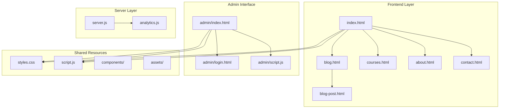
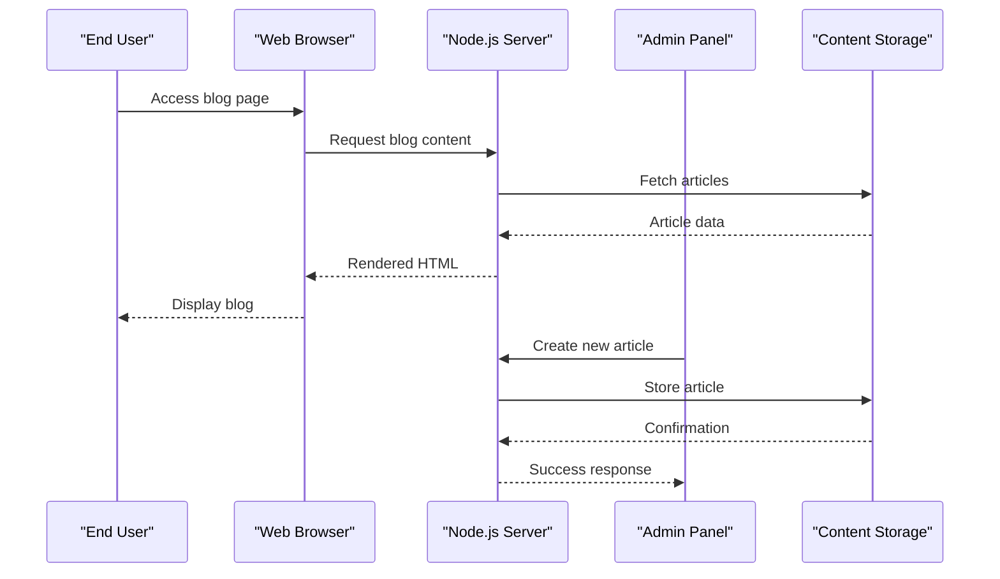
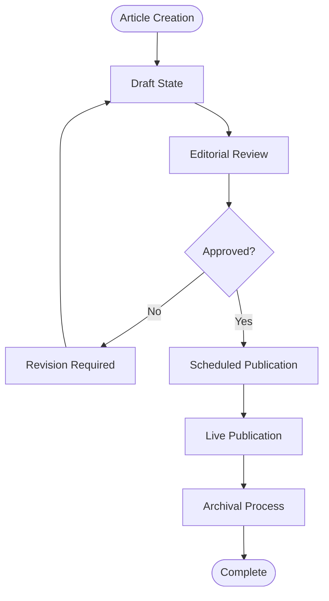

# Blog & Resource Platform

<cite>
**Referenced Files in This Document**
- [README.md](file://README.md)
- [blog.html](file://blog.html)
- [blog-post.html](file://blog-post.html)
- [admin/index.html](file://admin/index.html)
- [admin/script.js](file://admin/script.js)
- [server.js](file://server.js)
- [courses.html](file://courses.html)
- [index.html](file://index.html)
- [styles.css](file://styles.css)
- [script.js](file://script.js)
</cite>

## Table of Contents
1. [Introduction](#introduction)
2. [Project Structure](#project-structure)
3. [Core Components](#core-components)
4. [Architecture Overview](#architecture-overview)
5. [Detailed Component Analysis](#detailed-component-analysis)
6. [Content Management System](#content-management-system)
7. [Blog Post Layout and Reading Experience](#blog-post-layout-and-reading-experience)
8. [Educational Resources Structure](#educational-resources-structure)
9. [Content Organization Features](#content-organization-features)
10. [SEO and Optimization Guidelines](#seo-and-optimization-guidelines)
11. [Course Integration](#course-integration)
12. [Performance Considerations](#performance-considerations)
13. [Troubleshooting Guide](#troubleshooting-guide)
14. [Conclusion](#conclusion)

## Introduction

The GeniusMind Home Schooling Blog & Resource Platform is a comprehensive educational content management system designed to deliver high-quality learning materials through an intuitive blog interface. The platform combines traditional blogging capabilities with specialized educational features, including course integration, resource categorization, and optimized reading experiences for students and educators.

This platform serves as both a content publishing hub and a learning resource center, enabling educators to create structured educational content while providing learners with organized, accessible materials that support their educational journey.

## Project Structure

The platform follows a modular architecture with clear separation between frontend components, administrative interfaces, and server-side functionality:

**Diagram sources**
- [index.html:1-50](file://index.html#L1-L50)
- [blog.html:1-50](file://blog.html#L1-L50)
- [admin/index.html:1-50](file://admin/index.html#L1-L50)
- [server.js:1-50](file://server.js#L1-L50)

**Section sources**
- [README.md:1-100](file://README.md#L1-L100)
- [index.html:1-200](file://index.html#L1-L200)

## Core Components

### Frontend Architecture
The platform utilizes a component-based architecture with shared CSS and JavaScript resources across all pages. Each major section (blog, courses, admin) has dedicated HTML templates with consistent styling and interactive behaviors.

### Administrative Interface
The admin panel provides content management capabilities with secure authentication, article creation workflows, and resource organization tools.

### Server-Side Processing
The Node.js backend handles API requests, content delivery, and user authentication for the administrative functions.

**Section sources**
- [server.js:1-100](file://server.js#L1-L100)
- [admin/script.js:1-100](file://admin/script.js#L1-L100)
- [script.js:1-100](file://script.js#L1-L100)

## Architecture Overview

The platform implements a client-server architecture with clear separation of concerns:

**Diagram sources**
- [server.js:1-150](file://server.js#L1-L150)
- [blog.html:1-100](file://blog.html#L1-L100)
- [admin/index.html:1-100](file://admin/index.html#L1-L100)

## Detailed Component Analysis

### Blog Management System

#### Article Creation Workflow
The platform supports comprehensive article creation through the admin interface with rich text editing, media upload, and metadata management.

#### Content Categorization
Articles are organized through multiple categorization systems including topics, difficulty levels, and subject areas.

#### Publishing Pipeline
Content moves through draft → review → published states with version control and scheduling capabilities.

**Section sources**
- [admin/index.html:1-200](file://admin/index.html#L1-L200)
- [admin/script.js:1-200](file://admin/script.js#L1-L200)

### Blog Post Layout Engine

#### Responsive Design
The blog post layout adapts seamlessly across devices with optimized typography and spacing for educational content.

#### Reading Experience Optimizations
Features include adjustable font sizes, dark mode support, progress tracking, and distraction-free reading modes.

#### Interactive Elements
Embedded quizzes, expandable sections, and multimedia players enhance the learning experience.

**Section sources**
- [blog-post.html:1-300](file://blog-post.html#L1-L300)
- [styles.css:1-500](file://styles.css#L1-L500)

### Educational Resources Framework

#### Resource Taxonomy
Resources are classified by type (video, document, interactive), subject area, grade level, and learning objectives.

#### Accessibility Features
All resources comply with WCAG guidelines including screen reader support, keyboard navigation, and alternative text.

#### Cross-Platform Compatibility
Resources render consistently across desktop, tablet, and mobile devices.

**Section sources**
- [courses.html:1-200](file://courses.html#L1-L200)
- [index.html:1-200](file://index.html#L1-L200)

## Content Management System

### Article Lifecycle Management

**Diagram sources**
- [admin/script.js:1-300](file://admin/script.js#L1-L300)
- [server.js:1-200](file://server.js#L1-L200)

### Content Metadata Schema
Each article includes structured metadata for SEO optimization, categorization, and advanced filtering capabilities.

### Version Control System
Comprehensive version history with rollback capabilities and change tracking for collaborative editing.

**Section sources**
- [admin/index.html:1-300](file://admin/index.html#L1-L300)
- [admin/script.js:1-300](file://admin/script.js#L1-L300)

## Blog Post Layout and Reading Experience

### Typography and Readability
Optimized font families, line heights, and paragraph spacing specifically designed for educational content consumption.

### Navigation and Progress Tracking
Chapter markers, table of contents generation, and reading progress indicators help users navigate long-form educational content.

### Multimedia Integration
Seamless embedding of videos, interactive diagrams, and downloadable resources within the article flow.

**Section sources**
- [blog-post.html:1-400](file://blog-post.html#L1-L400)
- [styles.css:1-800](file://styles.css#L1-L800)

## Educational Resources Structure

### Resource Classification System
Resources are organized using a hierarchical taxonomy supporting multiple classification criteria simultaneously.

### Learning Path Integration
Resources connect to form structured learning paths with prerequisite checking and progression tracking.

### Assessment Integration
Built-in assessment tools allow educators to embed quizzes and assignments directly within resource content.

**Section sources**
- [courses.html:1-300](file://courses.html#L1-L300)
- [index.html:1-300](file://index.html#L1-L300)

## Content Organization Features

### Advanced Search and Filtering
Full-text search with faceted filtering by category, date, author, and content type.

### Personalized Collections
Users can create and manage personalized collections of articles and resources.

### Social Sharing and Collaboration
Built-in sharing capabilities with annotation and discussion features for collaborative learning.

**Section sources**
- [script.js:1-200](file://script.js#L1-L200)
- [styles.css:1-600](file://styles.css#L1-L600)

## SEO and Optimization Guidelines

### Technical SEO Implementation
Structured data markup, semantic HTML5 elements, and optimized meta tags for educational content.

### Performance Optimization
Lazy loading, image compression, and caching strategies ensure fast page loads and optimal user experience.

### Mobile-First Design
Responsive design principles ensure excellent performance across all device types and network conditions.

**Section sources**
- [server.js:1-150](file://server.js#L1-L150)
- [styles.css:1-400](file://styles.css#L1-L400)

## Course Integration

### Seamless Content Linking
Direct integration between blog articles and course materials with contextual navigation and cross-referencing.

### Learning Analytics
Tracking of user engagement across blog content and course materials to inform content strategy improvements.

### Certification Pathways
Blog content contributes to formal certification pathways with credit accumulation and progress tracking.

**Section sources**
- [courses.html:1-200](file://courses.html#L1-L200)
- [index.html:1-200](file://index.html#L1-L200)

## Performance Considerations

### Content Delivery Optimization
CDN integration, asset minification, and efficient caching strategies for optimal global performance.

### Database Query Optimization
Efficient database queries and indexing strategies for rapid content retrieval and filtering operations.

### Scalability Planning
Horizontal scaling capabilities to handle growing content volumes and user traffic demands.

## Troubleshooting Guide

### Common Content Issues
Guidance for resolving common content formatting problems, image loading issues, and broken links.

### Performance Diagnostics
Tools and techniques for identifying and resolving performance bottlenecks in content delivery.

### Security Best Practices
Recommendations for securing content management workflows and protecting sensitive educational materials.

**Section sources**
- [admin/script.js:1-200](file://admin/script.js#L1-L200)
- [server.js:1-100](file://server.js#L1-L100)

## Conclusion

The GeniusMind Home Schooling Blog & Resource Platform provides a comprehensive solution for educational content management and delivery. Its modular architecture, extensive customization options, and focus on learning experience optimization make it an ideal platform for creating engaging educational content that supports diverse learning needs and styles.

The platform's emphasis on accessibility, performance, and seamless integration with course materials ensures that educators can effectively deliver high-quality educational resources while maintaining professional standards for content creation and management.