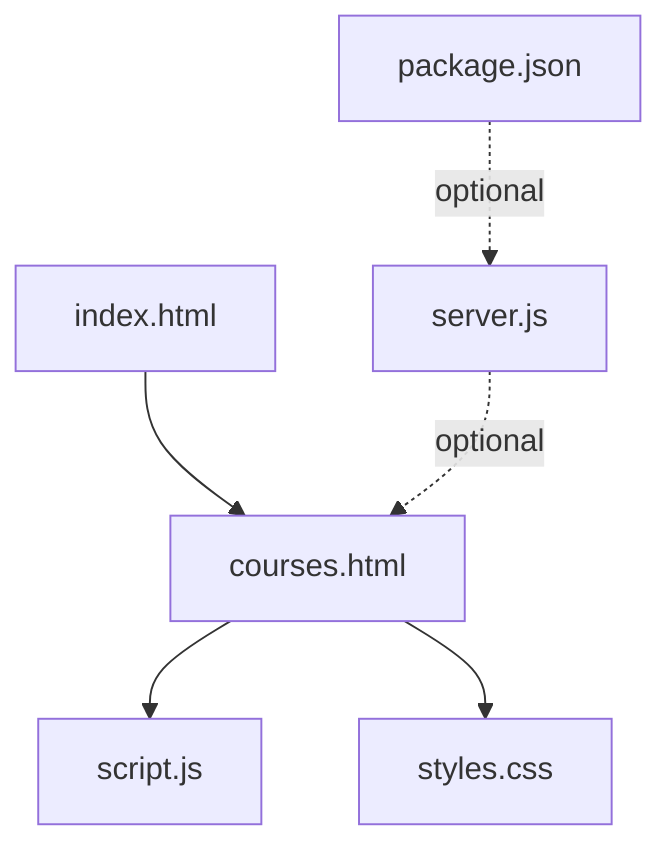
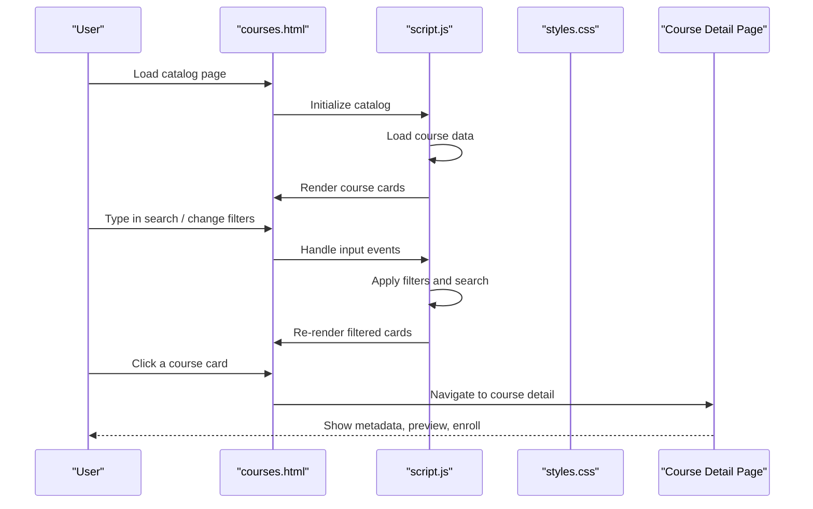
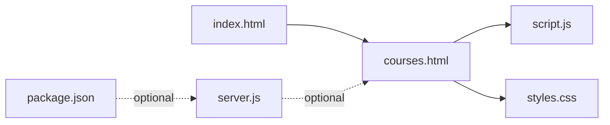

# Course Catalog System

<cite>
**Referenced Files in This Document**
- [courses.html](file://courses.html)
- [script.js](file://script.js)
- [styles.css](file://styles.css)
- [index.html](file://index.html)
- [server.js](file://server.js)
- [package.json](file://package.json)
</cite>

## Table of Contents
1. [Introduction](#introduction)
2. [Project Structure](#project-structure)
3. [Core Components](#core-components)
4. [Architecture Overview](#architecture-overview)
5. [Detailed Component Analysis](#detailed-component-analysis)
6. [Dependency Analysis](#dependency-analysis)
7. [Performance Considerations](#performance-considerations)
8. [Troubleshooting Guide](#troubleshooting-guide)
9. [Conclusion](#conclusion)
10. [Appendices](#appendices)

## Introduction
This document explains the course catalog system, focusing on how courses are listed, filtered, searched, and displayed on individual pages. It covers the user interface for browsing courses, the filtering and search mechanisms, metadata presentation, enrollment workflows, interactive features such as previews or sample lessons, responsive design patterns for course cards and detail pages, data structures used to represent courses, and guidance for adding new courses to the catalog.

## Project Structure
The course catalog is implemented primarily through a dedicated page for listing courses, shared UI components (navbar and footer), global scripts and styles, and optional server-side logic. The key files involved are:
- courses.html: Main catalog page with layout, filters, search input, and container for course cards.
- script.js: Client-side logic for rendering courses, handling search and filter interactions, and managing dynamic UI updates.
- styles.css: Styling for the catalog grid, course cards, filters, and responsive behavior.
- index.html: Home page that may link into the catalog and share common UI elements.
- server.js and package.json: Optional backend configuration and dependencies if server-side rendering or API endpoints are used.

**Diagram sources**
- [courses.html](file://courses.html)
- [script.js](file://script.js)
- [styles.css](file://styles.css)
- [index.html](file://index.html)
- [server.js](file://server.js)
- [package.json](file://package.json)

**Section sources**
- [courses.html](file://courses.html)
- [script.js](file://script.js)
- [styles.css](file://styles.css)
- [index.html](file://index.html)
- [server.js](file://server.js)
- [package.json](file://package.json)

## Core Components
- Course Listing Page: Provides a grid of course cards, a search input, and filter controls (e.g., category, level).
- Filtering Mechanism: Applies client-side filters based on selected criteria and updates the visible set of courses.
- Search Functionality: Filters courses by keywords against title, description, tags, or other searchable fields.
- Individual Course Page: Displays detailed metadata, curriculum, instructor info, enrollment options, and interactive elements like previews or sample lessons.
- Data Model: A structured representation of each course including identifiers, titles, descriptions, categories, levels, pricing, duration, media assets, and enrollment links.
- Responsive Design: CSS grid/flexbox layouts and breakpoints ensure cards and detail pages adapt across devices.

Implementation highlights:
- Dynamic rendering of course cards from a data source (in-memory array or fetched JSON).
- Event listeners for search input and filter changes.
- Conditional rendering based on active filters and search terms.
- Accessibility considerations such as semantic HTML and keyboard navigation.

**Section sources**
- [courses.html](file://courses.html)
- [script.js](file://script.js)
- [styles.css](file://styles.css)

## Architecture Overview
The catalog follows a simple client-centric architecture:
- The browser loads courses.html, which includes script.js and styles.css.
- script.js initializes the catalog by loading course data and rendering the initial set of cards.
- User interactions (search, filter) trigger re-rendering of the card list without full page reloads.
- Clicking a course navigates to an individual course page (or opens a modal/preview) where detailed metadata and enrollment actions are presented.

**Diagram sources**
- [courses.html](file://courses.html)
- [script.js](file://script.js)
- [styles.css](file://styles.css)

## Detailed Component Analysis

### Course Listing Interface
- Layout: A responsive grid of course cards, each showing thumbnail, title, short description, category, level, price, and call-to-action buttons.
- Controls: A search input at the top and filter dropdowns or chips for categories and difficulty levels.
- Empty State: When no courses match filters/search, display a friendly message and reset suggestions.

Responsive patterns:
- Grid columns adjust via CSS media queries to show more cards on wider screens and fewer on mobile.
- Cards stack vertically on small viewports and expand horizontally on larger ones.
- Touch-friendly tap targets for buttons and links.

**Section sources**
- [courses.html](file://courses.html)
- [styles.css](file://styles.css)

### Filtering Mechanisms
- Category Filter: Limits results to courses within selected categories.
- Level Filter: Restricts results by difficulty (e.g., Beginner, Intermediate, Advanced).
- Combined Filters: Multiple filters can be applied simultaneously; results update live.

Behavior:
- On filter change, script.js recomputes the subset of courses matching all active filters.
- Active filters are visually highlighted for clarity.
- Reset option clears all filters and restores the full list.

**Section sources**
- [script.js](file://script.js)
- [styles.css](file://styles.css)

### Search Functionality
- Keyword Matching: Searches across title, description, tags, and possibly instructor name.
- Debounced Input: Reduces re-renders by delaying execution until typing pauses.
- Case-insensitive and partial matches improve usability.

Edge cases:
- Special characters and accents handled gracefully.
- No-results state guides users to adjust filters or clear search.

**Section sources**
- [script.js](file://script.js)

### Individual Course Page Layout
- Header: Title, subtitle, thumbnail/banner, and quick stats (duration, level, rating).
- Metadata Section: Instructor bio, prerequisites, learning outcomes, format (video/live/self-paced), language, certificate availability.
- Curriculum Outline: Module list with expandable details.
- Interactive Features: Preview video or sample lesson, downloadable resources, FAQ.
- Enrollment Actions: Primary “Enroll Now” button, secondary “Add to Wishlist,” and contact/support links.
- Social Proof: Reviews, testimonials, completion statistics.

Accessibility:
- Semantic headings and landmarks.
- Keyboard navigable sections and focus management for modals/previews.

**Section sources**
- [courses.html](file://courses.html)
- [script.js](file://script.js)
- [styles.css](file://styles.css)

### Course Data Structures
A typical course object includes:
- id: Unique identifier
- title: Display name
- description: Short summary
- longDescription: Full content for detail page
- category: e.g., Programming, Math, Languages
- level: Beginner, Intermediate, Advanced
- price: Numeric value or free indicator
- currency: ISO code if applicable
- duration: Human-readable string or minutes
- thumbnailUrl: Image path or URL
- bannerUrl: Larger image for detail page
- instructor: Name and optional avatar
- tags: Array of searchable keywords
- modules: Ordered list of lessons/modules
- previewUrl: Sample lesson or trailer link
- enrollmentUrl: Link to checkout or registration
- createdAt, updatedAt: Timestamps for sorting or freshness

Rendering:
- List view uses concise fields (title, description, category, level, price).
- Detail view expands to longDescription, modules, instructor, and enrollment actions.

**Section sources**
- [script.js](file://script.js)

### Enrollment Workflows
- Direct Enrollment: Clicking “Enroll Now” navigates to an external payment or registration page.
- In-App Flow: If integrated, the flow may include login check, cart addition, and checkout steps.
- Post-Enrollment: Redirect to course dashboard or welcome email confirmation.

Error Handling:
- Network failures during enrollment redirect show retry prompts.
- Invalid or expired enrollment links present helpful messages.

**Section sources**
- [script.js](file://script.js)

### Interactive Features
- Course Previews: Embedded videos or sample lessons accessible from the card or detail page.
- Expandable Curriculum: Accordion-style module lists reveal lesson titles and durations.
- Quick Filters: Chip-based filters allow toggling multiple categories quickly.

**Section sources**
- [script.js](file://script.js)
- [styles.css](file://styles.css)

### Responsive Design Patterns
- CSS Grid/Flexbox: Used to build adaptive card grids and flexible headers.
- Breakpoints: Adjust column counts and typography sizes for readability.
- Touch Targets: Ensure minimum tap area sizes for mobile users.
- Performance: Lazy-load images and defer heavy assets to improve load times.

**Section sources**
- [styles.css](file://styles.css)

### Adding New Courses to the Catalog
Steps:
1. Add a new course object following the documented structure.
2. Insert it into the dataset used by script.js (either in-memory array or JSON file).
3. Ensure required fields are populated (id, title, description, category, level, thumbnailUrl, enrollmentUrl).
4. Test filters and search to confirm visibility.
5. Update any static references if needed (e.g., featured courses on index.html).

Validation:
- Verify unique ids and valid URLs for thumbnails and enrollment links.
- Confirm consistent category and level values to avoid broken filters.

**Section sources**
- [script.js](file://script.js)

## Dependency Analysis
Client-side dependencies:
- courses.html depends on script.js for interactivity and styles.css for visual presentation.
- index.html may link to courses.html and share common components.

Optional server-side integration:
- server.js could serve static assets or provide API endpoints for fetching course data.
- package.json defines Node.js dependencies if server-side functionality is used.

**Diagram sources**
- [courses.html](file://courses.html)
- [script.js](file://script.js)
- [styles.css](file://styles.css)
- [index.html](file://index.html)
- [server.js](file://server.js)
- [package.json](file://package.json)

**Section sources**
- [courses.html](file://courses.html)
- [script.js](file://script.js)
- [styles.css](file://styles.css)
- [index.html](file://index.html)
- [server.js](file://server.js)
- [package.json](file://package.json)

## Performance Considerations
- Minimize DOM operations by batching updates when applying multiple filters.
- Use debouncing for search input to reduce re-renders.
- Lazy-load images and defer non-critical scripts.
- Cache frequently accessed data locally if appropriate.
- Optimize images and use modern formats to reduce payload size.

[No sources needed since this section provides general guidance]

## Troubleshooting Guide
Common issues and resolutions:
- No courses appear after filtering:
  - Check that filter values match course category and level fields exactly.
  - Ensure the dataset contains entries with those attributes.
- Search returns no results:
  - Verify that searchable fields (title, description, tags) contain expected text.
  - Confirm case-insensitive matching is enabled.
- Enrollment link not working:
  - Validate enrollmentUrl formatting and accessibility.
  - Test redirects and error states.
- Images not loading:
  - Confirm thumbnailUrl paths are correct and accessible.
  - Check browser console for network errors.

**Section sources**
- [script.js](file://script.js)
- [styles.css](file://styles.css)

## Conclusion
The course catalog system provides a clean, responsive interface for discovering and enrolling in courses. It leverages client-side filtering and search for fast interactions, presents rich metadata on individual pages, and supports interactive features like previews. By adhering to the documented data structure and responsive patterns, new courses can be added efficiently while maintaining consistency and performance.

[No sources needed since this section summarizes without analyzing specific files]

## Appendices

### Example Course Data Structure
- id: string
- title: string
- description: string
- longDescription: string
- category: string
- level: string
- price: number
- currency: string
- duration: string
- thumbnailUrl: string
- bannerUrl: string
- instructor: string
- tags: string[]
- modules: array of { title, duration }
- previewUrl: string
- enrollmentUrl: string
- createdAt: string
- updatedAt: string

**Section sources**
- [script.js](file://script.js)