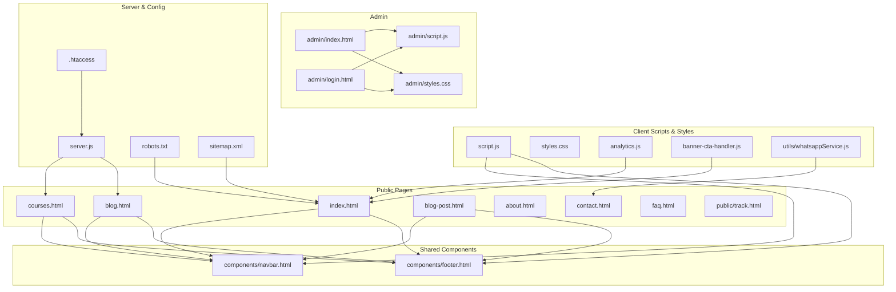
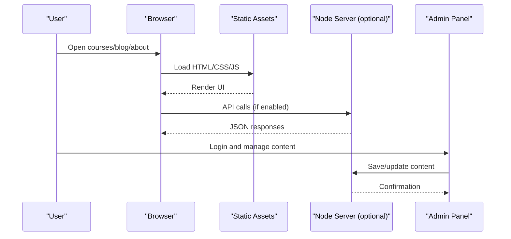
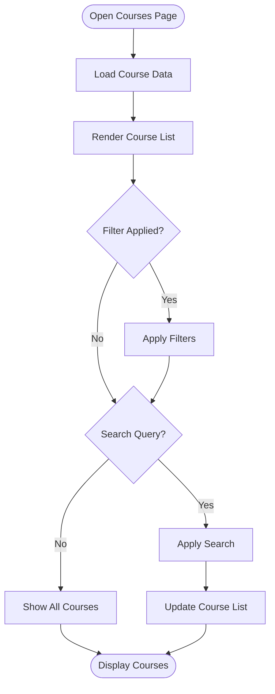
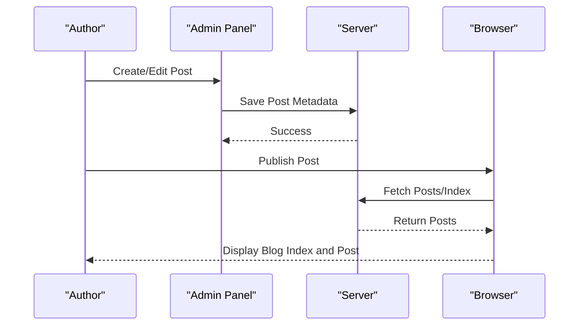
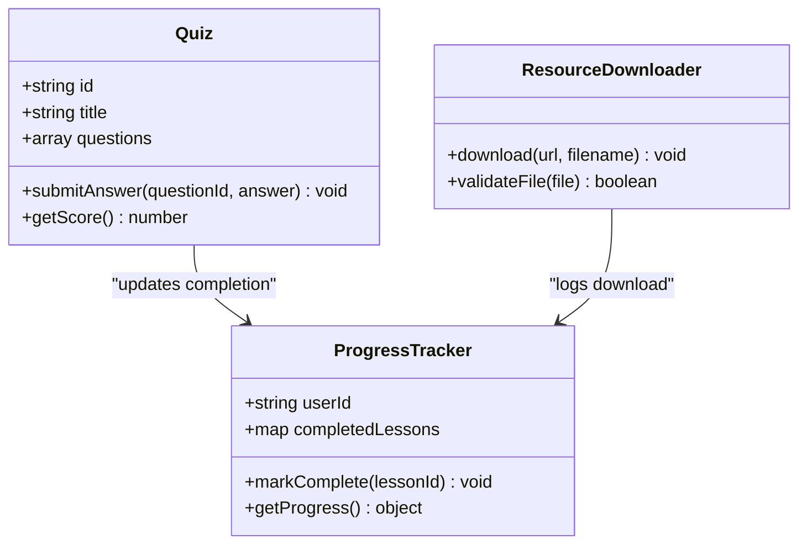
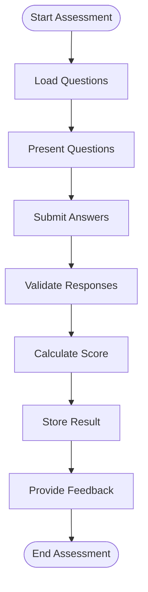
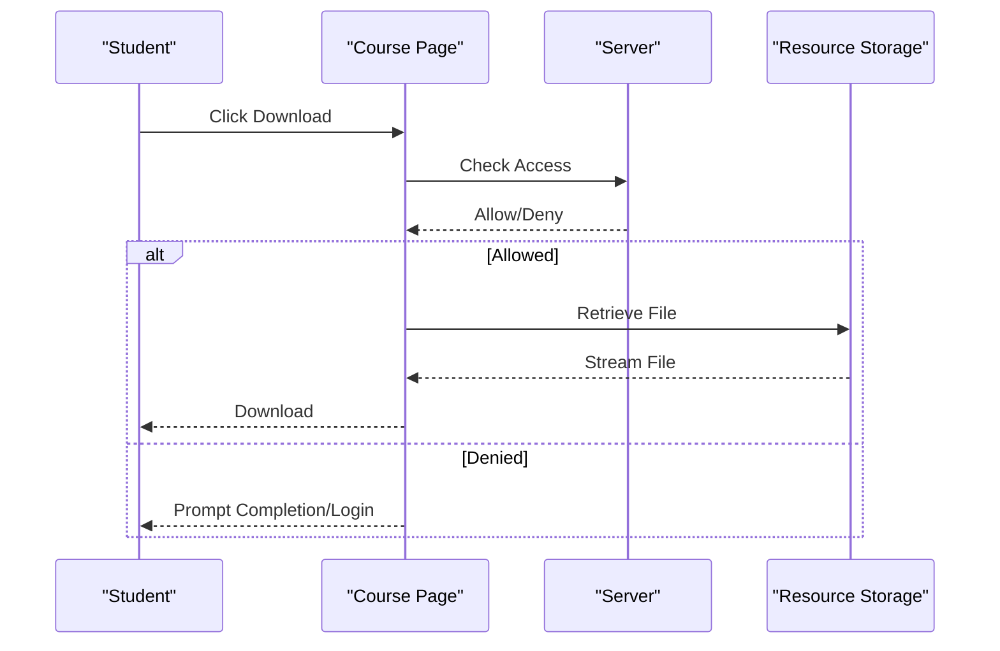
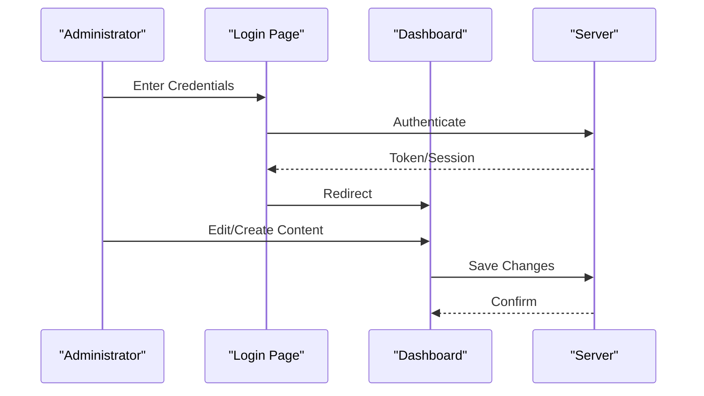
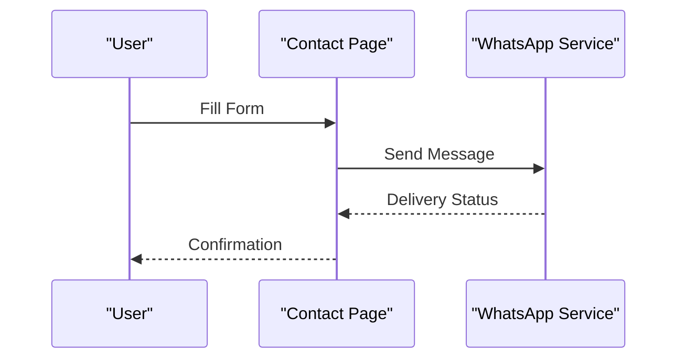
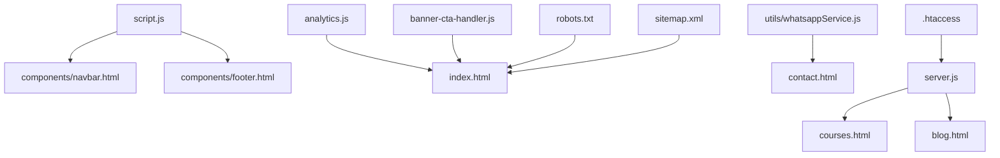

# Educational Content Management

<cite>
**Referenced Files in This Document**
- [README.md](file://README.md)
- [index.html](file://index.html)
- [courses.html](file://courses.html)
- [blog.html](file://blog.html)
- [blog-post.html](file://blog-post.html)
- [about.html](file://about.html)
- [contact.html](file://contact.html)
- [faq.html](file://faq.html)
- [admin/index.html](file://admin/index.html)
- [admin/login.html](file://admin/login.html)
- [admin/script.js](file://admin/script.js)
- [admin/styles.css](file://admin/styles.css)
- [components/navbar.html](file://components/navbar.html)
- [components/footer.html](file://components/footer.html)
- [server.js](file://server.js)
- [script.js](file://script.js)
- [styles.css](file://styles.css)
- [analytics.js](file://analytics.js)
- [banner-cta-handler.js](file://banner-cta-handler.js)
- [utils/whatsappService.js](file://utils/whatsappService.js)
- [public/track.html](file://public/track.html)
- [.htaccess](file://.htaccess)
- [robots.txt](file://robots.txt)
- [sitemap.xml](file://sitemap.xml)
</cite>

## Table of Contents
1. [Introduction](#introduction)
2. [Project Structure](#project-structure)
3. [Core Components](#core-components)
4. [Architecture Overview](#architecture-overview)
5. [Detailed Component Analysis](#detailed-component-analysis)
6. [Dependency Analysis](#dependency-analysis)
7. [Performance Considerations](#performance-considerations)
8. [Troubleshooting Guide](#troubleshooting-guide)
9. [Conclusion](#conclusion)
10. [Appendices](#appendices)

## Introduction
This document describes the educational content management system implemented as a static site with an admin interface and optional server-side support. It covers:
- Course catalog features: listing, filtering, search, and individual course pages
- Blog platform: article management, category organization, and publishing workflows
- Interactive learning features, assessments, and resource downloads
- Content creation guidelines, SEO optimization, and accessibility compliance

The system is designed for ease of use by educators and administrators while providing a robust structure for scalable content delivery.

## Project Structure
The repository follows a clear separation between public-facing pages, shared components, administrative tools, utilities, and configuration files. The main entry points are HTML pages that compose reusable navigation and footer fragments. A Node.js server file is present to support backend operations if needed.

**Diagram sources**
- [index.html](file://index.html)
- [courses.html](file://courses.html)
- [blog.html](file://blog.html)
- [blog-post.html](file://blog-post.html)
- [about.html](file://about.html)
- [contact.html](file://contact.html)
- [faq.html](file://faq.html)
- [public/track.html](file://public/track.html)
- [components/navbar.html](file://components/navbar.html)
- [components/footer.html](file://components/footer.html)
- [admin/index.html](file://admin/index.html)
- [admin/login.html](file://admin/login.html)
- [admin/script.js](file://admin/script.js)
- [admin/styles.css](file://admin/styles.css)
- [script.js](file://script.js)
- [styles.css](file://styles.css)
- [analytics.js](file://analytics.js)
- [banner-cta-handler.js](file://banner-cta-handler.js)
- [utils/whatsappService.js](file://utils/whatsappService.js)
- [server.js](file://server.js)
- [.htaccess](file://.htaccess)
- [robots.txt](file://robots.txt)
- [sitemap.xml](file://sitemap.xml)

**Section sources**
- [README.md](file://README.md)
- [index.html](file://index.html)
- [courses.html](file://courses.html)
- [blog.html](file://blog.html)
- [blog-post.html](file://blog-post.html)
- [about.html](file://about.html)
- [contact.html](file://contact.html)
- [faq.html](file://faq.html)
- [admin/index.html](file://admin/index.html)
- [admin/login.html](file://admin/login.html)
- [admin/script.js](file://admin/script.js)
- [admin/styles.css](file://admin/styles.css)
- [components/navbar.html](file://components/navbar.html)
- [components/footer.html](file://components/footer.html)
- [server.js](file://server.js)
- [script.js](file://script.js)
- [styles.css](file://styles.css)
- [analytics.js](file://analytics.js)
- [banner-cta-handler.js](file://banner-cta-handler.js)
- [utils/whatsappService.js](file://utils/whatsappService.js)
- [public/track.html](file://public/track.html)
- [.htaccess](file://.htaccess)
- [robots.txt](file://robots.txt)
- [sitemap.xml](file://sitemap.xml)

## Core Components
- Public Pages: Landing page, courses catalog, blog index, single post view, about/contact/faq pages, and a tracking page.
- Shared Components: Reusable navigation and footer included across pages.
- Admin Interface: Login and dashboard for content management.
- Client-Side Logic: Global scripts for interactivity, analytics, banner CTA handling, and WhatsApp integration.
- Server and Configuration: Optional Node.js server, URL rewriting rules, robots, and sitemap.

Key responsibilities:
- Courses: Listing, filtering, search, and detail views.
- Blog: Article listing, categories, and post rendering.
- Admin: Authentication and content editing workflows.
- Accessibility and SEO: Semantic markup, metadata, and structured data.

**Section sources**
- [courses.html](file://courses.html)
- [blog.html](file://blog.html)
- [blog-post.html](file://blog-post.html)
- [admin/index.html](file://admin/index.html)
- [admin/login.html](file://admin/login.html)
- [components/navbar.html](file://components/navbar.html)
- [components/footer.html](file://components/footer.html)
- [script.js](file://script.js)
- [analytics.js](file://analytics.js)
- [banner-cta-handler.js](file://banner-cta-handler.js)
- [utils/whatsappService.js](file://utils/whatsappService.js)
- [server.js](file://server.js)
- [.htaccess](file://.htaccess)
- [robots.txt](file://robots.txt)
- [sitemap.xml](file://sitemap.xml)

## Architecture Overview
The system is primarily client-rendered with optional server assistance. Public pages load shared components and client scripts. The admin panel provides content authoring and management. The server can serve dynamic endpoints or proxy requests when enabled.

**Diagram sources**
- [courses.html](file://courses.html)
- [blog.html](file://blog.html)
- [blog-post.html](file://blog-post.html)
- [admin/index.html](file://admin/index.html)
- [admin/login.html](file://admin/login.html)
- [server.js](file://server.js)

## Detailed Component Analysis

### Course Catalog
The course catalog supports listing, filtering, search, and individual course pages. Filtering and search are typically implemented via client-side logic that manipulates DOM elements based on user input. Individual course pages provide detailed information and resources.

Implementation notes:
- Filtering and search operate on course attributes such as title, description, tags, and difficulty.
- Individual course pages link from list items and include details, prerequisites, and downloadable resources.

**Section sources**
- [courses.html](file://courses.html)
- [script.js](file://script.js)

### Blog Platform
The blog platform includes an index page for articles and a single post view. Categories and tags help organize content. Publishing workflows involve creating posts, assigning categories, and updating the index.

Content workflow:
- Create post with title, slug, body, category, and tags.
- Update blog index to reflect new content.
- Provide share links and related posts.

**Section sources**
- [blog.html](file://blog.html)
- [blog-post.html](file://blog-post.html)
- [admin/index.html](file://admin/index.html)
- [admin/login.html](file://admin/login.html)
- [server.js](file://server.js)

### Interactive Learning Features
Interactive elements include quizzes, progress tracking, and downloadable resources. Tracking can be handled via lightweight endpoints or client-side storage.

Notes:
- Quizzes validate answers and update progress.
- Downloads are gated by lesson completion where applicable.
- Tracking integrates with analytics for insights.

**Section sources**
- [public/track.html](file://public/track.html)
- [script.js](file://script.js)
- [analytics.js](file://analytics.js)

### Assessment Tools
Assessments include form-based quizzes and auto-grading. Results can be stored locally or sent to the server for persistence.

**Section sources**
- [script.js](file://script.js)
- [server.js](file://server.js)

### Resource Download System
Resources are organized by course and lesson. Downloads may require authentication or completion checks.

**Section sources**
- [courses.html](file://courses.html)
- [server.js](file://server.js)

### Admin Interface
The admin panel provides login and dashboard functionality for managing courses and blog posts.

**Section sources**
- [admin/login.html](file://admin/login.html)
- [admin/index.html](file://admin/index.html)
- [admin/script.js](file://admin/script.js)
- [admin/styles.css](file://admin/styles.css)
- [server.js](file://server.js)

### Contact and Support Integration
Contact forms and WhatsApp integration facilitate communication with learners and support teams.

**Section sources**
- [contact.html](file://contact.html)
- [utils/whatsappService.js](file://utils/whatsappService.js)

## Dependency Analysis
The system has minimal external dependencies. Client scripts handle interactivity, analytics, and integrations. The server file supports optional backend operations. Configuration files manage routing and indexing.

**Diagram sources**
- [script.js](file://script.js)
- [components/navbar.html](file://components/navbar.html)
- [components/footer.html](file://components/footer.html)
- [analytics.js](file://analytics.js)
- [banner-cta-handler.js](file://banner-cta-handler.js)
- [utils/whatsappService.js](file://utils/whatsappService.js)
- [contact.html](file://contact.html)
- [server.js](file://server.js)
- [courses.html](file://courses.html)
- [blog.html](file://blog.html)
- [.htaccess](file://.htaccess)
- [robots.txt](file://robots.txt)
- [sitemap.xml](file://sitemap.xml)

**Section sources**
- [script.js](file://script.js)
- [analytics.js](file://analytics.js)
- [banner-cta-handler.js](file://banner-cta-handler.js)
- [utils/whatsappService.js](file://utils/whatsappService.js)
- [server.js](file://server.js)
- [.htaccess](file://.htaccess)
- [robots.txt](file://robots.txt)
- [sitemap.xml](file://sitemap.xml)

## Performance Considerations
- Minimize DOM updates during filtering and search; batch operations where possible.
- Use lazy loading for images and heavy assets.
- Cache frequently accessed data client-side to reduce server load.
- Compress static assets and leverage browser caching headers.
- Keep JavaScript modular and avoid blocking the main thread.

[No sources needed since this section provides general guidance]

## Troubleshooting Guide
Common issues and resolutions:
- Filtering/search not working: Verify event listeners and data attributes on course items.
- Blog posts not appearing: Ensure index updates after publishing and correct slugs.
- Admin login failures: Check credentials and server authentication endpoints.
- Downloads blocked: Confirm access control logic and file permissions.
- Analytics not tracking: Validate script inclusion and consent settings.

**Section sources**
- [courses.html](file://courses.html)
- [blog.html](file://blog.html)
- [admin/login.html](file://admin/login.html)
- [admin/index.html](file://admin/index.html)
- [server.js](file://server.js)
- [analytics.js](file://analytics.js)

## Conclusion
The educational content management system provides a solid foundation for delivering courses and blog content with interactive learning features and assessment tools. Its modular structure supports scalability and maintainability. By following the content creation guidelines, SEO practices, and accessibility standards outlined here, teams can deliver high-quality educational experiences.

[No sources needed since this section summarizes without analyzing specific files]

## Appendices

### Content Creation Guidelines
- Use descriptive titles and concise summaries for courses and posts.
- Organize content with clear categories and tags.
- Include learning objectives, prerequisites, and outcomes.
- Add multimedia resources with captions and transcripts.
- Maintain consistent formatting and branding.

[No sources needed since this section provides general guidance]

### SEO Optimization for Educational Materials
- Implement meta titles and descriptions per page.
- Use semantic headings and structured data where appropriate.
- Optimize images with alt text and compression.
- Generate and submit sitemaps; ensure robots directives allow crawling.
- Internal linking between related courses and posts.

**Section sources**
- [robots.txt](file://robots.txt)
- [sitemap.xml](file://sitemap.xml)

### Accessibility Compliance Standards
- Ensure keyboard navigability and focus indicators.
- Provide alt text for images and labels for form controls.
- Maintain sufficient color contrast and readable fonts.
- Use ARIA attributes where necessary.
- Test with screen readers and accessibility tools.

[No sources needed since this section provides general guidance]