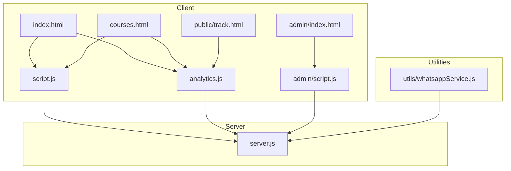
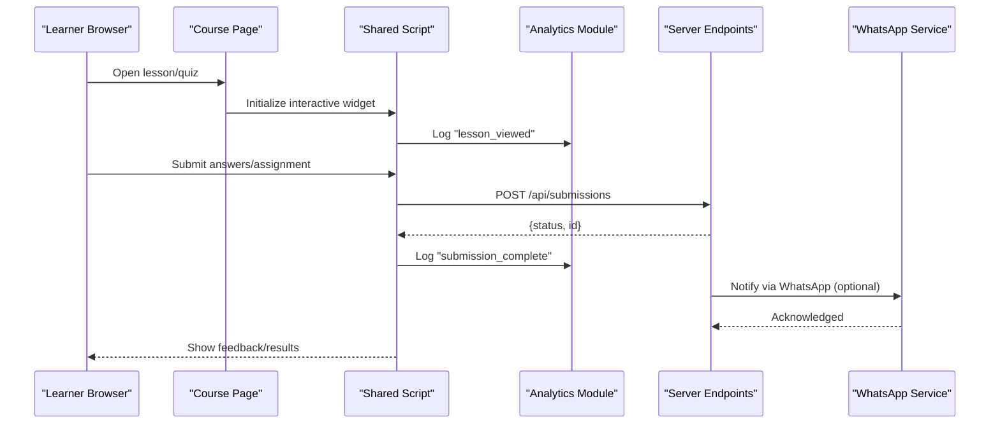
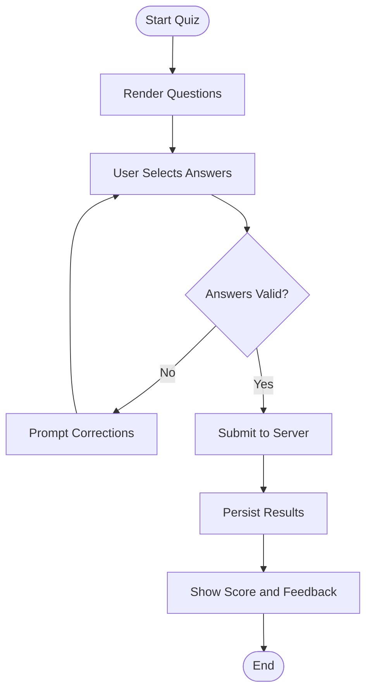
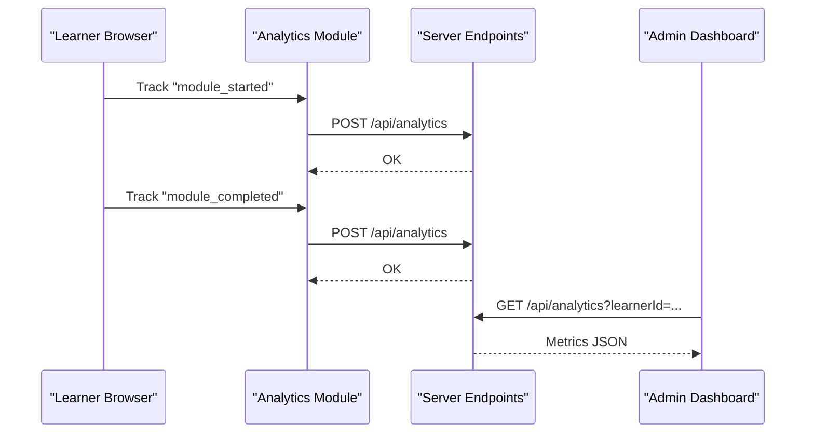
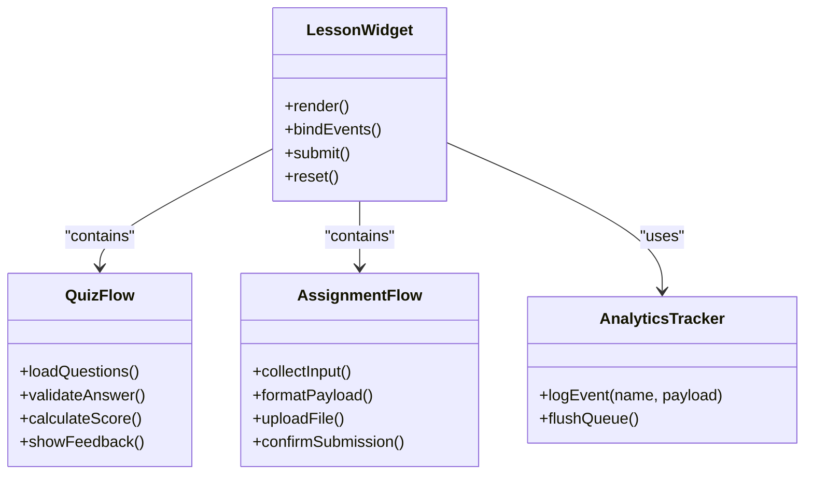
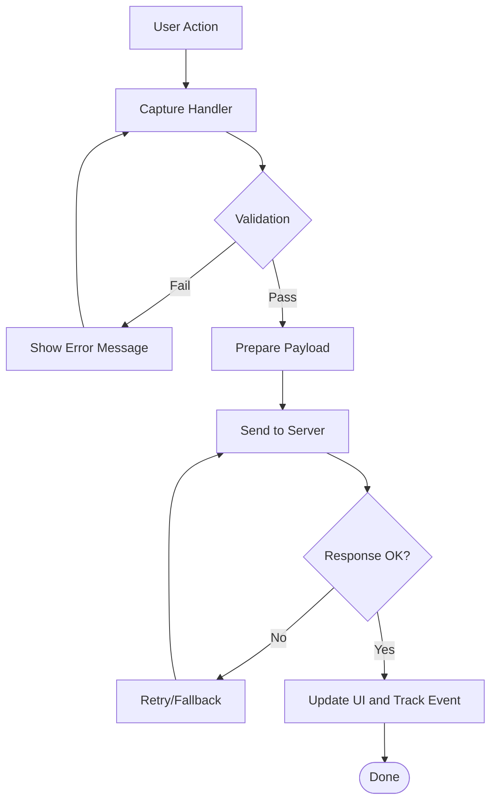
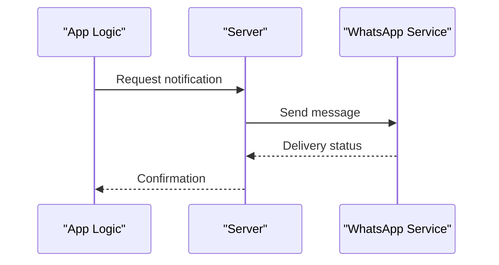
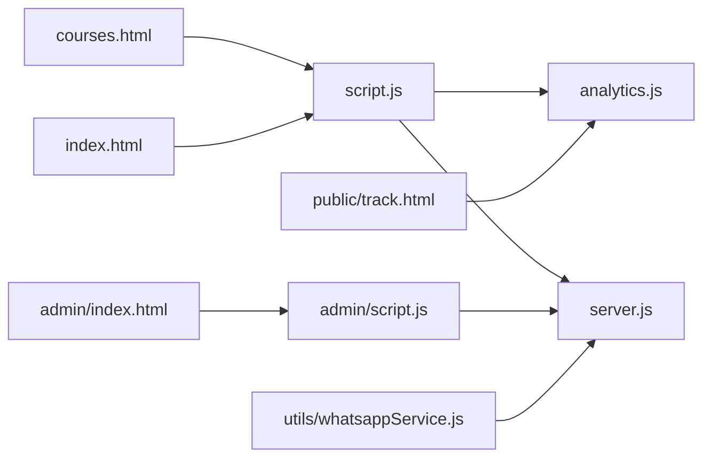

# Interactive Learning Features

<cite>
**Referenced Files in This Document**
- [index.html](file://index.html)
- [courses.html](file://courses.html)
- [script.js](file://script.js)
- [analytics.js](file://analytics.js)
- [server.js](file://server.js)
- [admin/index.html](file://admin/index.html)
- [admin/script.js](file://admin/script.js)
- [public/track.html](file://public/track.html)
- [utils/whatsappService.js](file://utils/whatsappService.js)
- [README.md](file://README.md)
</cite>

## Table of Contents
1. [Introduction](#introduction)
2. [Project Structure](#project-structure)
3. [Core Components](#core-components)
4. [Architecture Overview](#architecture-overview)
5. [Detailed Component Analysis](#detailed-component-analysis)
6. [Dependency Analysis](#dependency-analysis)
7. [Performance Considerations](#performance-considerations)
8. [Troubleshooting Guide](#troubleshooting-guide)
9. [Conclusion](#conclusion)
10. [Appendices](#appendices)

## Introduction
This document explains the interactive learning features of the educational platform, focusing on assessment tools, progress tracking, and interactive elements that enhance the learning experience. It details how user interactions are captured and processed across quizzes, assignment submissions, and analytics, and describes the integration between course content and interactive components. Guidance is provided for educators to create engaging experiences and for developers to add or customize interactive components. Accessibility and mobile responsiveness considerations are included to ensure inclusive and responsive learning.

## Project Structure
The project is a static-site-based web application with a Node server for backend services. Interactive learning features span client-side pages, shared scripts, admin interfaces, and lightweight server endpoints. Key areas include:
- Course catalog and content pages
- Admin dashboard for managing assessments and learners
- Analytics and tracking utilities
- Server endpoints for data persistence and integrations

**Diagram sources**
- [index.html](file://index.html)
- [courses.html](file://courses.html)
- [script.js](file://script.js)
- [analytics.js](file://analytics.js)
- [admin/index.html](file://admin/index.html)
- [admin/script.js](file://admin/script.js)
- [public/track.html](file://public/track.html)
- [server.js](file://server.js)
- [utils/whatsappService.js](file://utils/whatsappService.js)

**Section sources**
- [README.md](file://README.md)

## Core Components
- Course Catalog and Content Pages: Provide entry points to lessons and interactive modules.
- Shared Client Scripts: Handle UI interactions, form submissions, quiz flows, and event capture.
- Analytics and Tracking: Record learner actions, time-on-task, and completion events.
- Admin Dashboard: Manage assessments, view learner progress, and export reports.
- Server Endpoints: Persist assignments, quiz results, and analytics; integrate with external services (e.g., messaging).

Key responsibilities:
- Capture user interactions (clicks, selections, submissions)
- Validate inputs and provide immediate feedback
- Persist outcomes to the server
- Update dashboards and visualizations
- Support accessibility and mobile-friendly UX

**Section sources**
- [index.html](file://index.html)
- [courses.html](file://courses.html)
- [script.js](file://script.js)
- [analytics.js](file://analytics.js)
- [admin/index.html](file://admin/index.html)
- [admin/script.js](file://admin/script.js)
- [public/track.html](file://public/track.html)
- [server.js](file://server.js)
- [utils/whatsappService.js](file://utils/whatsappService.js)

## Architecture Overview
The system follows a client-server architecture with clear separation of concerns:
- Frontend pages render content and interactive widgets
- Shared scripts manage interaction logic and analytics
- Admin interface supports educator workflows
- Server provides APIs for persistence and integrations

**Diagram sources**
- [courses.html](file://courses.html)
- [script.js](file://script.js)
- [analytics.js](file://analytics.js)
- [server.js](file://server.js)
- [utils/whatsappService.js](file://utils/whatsappService.js)

## Detailed Component Analysis

### Assessment Tools (Quizzes and Assignments)
- Quiz Flow
  - Learner selects answers and submits
  - Client validates responses and calculates score
  - Results are persisted and tracked
  - Immediate feedback is shown to the learner
- Assignment Submission
  - Learner uploads or enters assignment content
  - Client performs basic validation and formatting
  - Data is sent to the server for storage
  - Educators can review submissions in the admin dashboard

Implementation guidance:
- Use semantic HTML forms with accessible labels and error messages
- Debounce heavy computations and batch analytics events
- Provide keyboard navigation and screen reader support
- Ensure mobile-friendly layouts and touch targets

**Section sources**
- [courses.html](file://courses.html)
- [script.js](file://script.js)
- [analytics.js](file://analytics.js)
- [server.js](file://server.js)

### Progress Tracking Mechanisms
- Event Capture
  - Tracks page views, time spent, and module completions
  - Aggregates per-learner metrics for dashboards
- Persistence and Reporting
  - Stores events on the server
  - Exposes endpoints for admin queries and exports
- Real-time Updates
  - Optional polling or lightweight updates for live dashboards

Implementation guidance:
- Normalize event schemas and timestamps
- Deduplicate repeated events and handle offline retries
- Respect privacy settings and consent where applicable

**Section sources**
- [analytics.js](file://analytics.js)
- [server.js](file://server.js)
- [admin/index.html](file://admin/index.html)
- [admin/script.js](file://admin/script.js)

### Interactive Elements Integration
- Embedding Widgets
  - Lessons embed interactive components via shared scripts
  - Configuration objects define behavior and content
- State Management
  - Local state for temporary interactions
  - Sync with server upon submission or checkpoint
- Educator Controls
  - Admin interface allows creating/editing quizzes and assignments
  - Preview mode helps validate before publishing

Implementation guidance:
- Keep widgets modular and configurable
- Use progressive enhancement so core content works without JS
- Provide fallbacks for older browsers and low bandwidth

**Section sources**
- [script.js](file://script.js)
- [courses.html](file://courses.html)
- [admin/index.html](file://admin/index.html)
- [admin/script.js](file://admin/script.js)

### User Interaction Capture and Processing
- Input Handling
  - Centralized listeners for clicks, changes, and form submissions
  - Validation rules enforced before sending data
- Feedback Loop
  - Immediate UI feedback for errors and success states
  - Accessible announcements for assistive technologies
- Error Resilience
  - Network retry and graceful degradation
  - Clear error messages and recovery steps

**Section sources**
- [script.js](file://script.js)
- [analytics.js](file://analytics.js)
- [server.js](file://server.js)

### Integrations and Notifications
- Messaging Integration
  - Optional notifications via WhatsApp service for key milestones
- External Services
  - Extensible design to integrate additional tools (e.g., LMS, email)

**Section sources**
- [utils/whatsappService.js](file://utils/whatsappService.js)
- [server.js](file://server.js)

## Dependency Analysis
High-level dependencies among interactive components:

**Diagram sources**
- [index.html](file://index.html)
- [courses.html](file://courses.html)
- [script.js](file://script.js)
- [analytics.js](file://analytics.js)
- [admin/index.html](file://admin/index.html)
- [admin/script.js](file://admin/script.js)
- [public/track.html](file://public/track.html)
- [server.js](file://server.js)
- [utils/whatsappService.js](file://utils/whatsappService.js)

**Section sources**
- [script.js](file://script.js)
- [analytics.js](file://analytics.js)
- [server.js](file://server.js)
- [admin/script.js](file://admin/script.js)

## Performance Considerations
- Minimize DOM thrash by batching updates and using efficient selectors
- Debounce frequent events (scroll, input) and throttle analytics flushes
- Lazy-load heavy interactive modules when not immediately needed
- Cache static assets and use compression on the server
- Optimize images and media within lessons for mobile networks

[No sources needed since this section provides general guidance]

## Troubleshooting Guide
Common issues and resolutions:
- Submissions fail silently
  - Check network requests and server response codes
  - Verify CORS and authentication if applicable
- Analytics not recorded
  - Confirm event payloads and endpoint availability
  - Inspect browser console for errors
- Admin dashboard shows stale data
  - Refresh or re-query endpoints
  - Validate caching headers and invalidation strategies
- Mobile layout issues
  - Test viewport meta tags and responsive breakpoints
  - Ensure touch targets meet minimum size guidelines

**Section sources**
- [script.js](file://script.js)
- [analytics.js](file://analytics.js)
- [server.js](file://server.js)
- [admin/script.js](file://admin/script.js)

## Conclusion
The platform’s interactive learning features combine accessible front-end components, robust analytics, and a simple server layer to deliver engaging assessments and progress tracking. By following the implementation guidance—especially around accessibility, mobile responsiveness, and modular design—educators can craft effective learning experiences, and developers can extend the system with new interactive components confidently.

[No sources needed since this section summarizes without analyzing specific files]

## Appendices

### Implementation Guidance: Adding New Interactive Components
- Create a reusable widget module with clear configuration options
- Integrate with the shared script for event handling and analytics
- Add admin controls to configure and preview the component
- Ensure keyboard and screen reader compatibility
- Test on mobile devices and various browsers

**Section sources**
- [script.js](file://script.js)
- [admin/index.html](file://admin/index.html)
- [admin/script.js](file://admin/script.js)

### Accessibility Checklist
- Semantic HTML structure and proper heading hierarchy
- Labels and aria attributes for all interactive controls
- Focus management and visible focus indicators
- Color contrast and text alternatives for media
- Keyboard-only navigation and skip links

[No sources needed since this section provides general guidance]

### Mobile Responsiveness Checklist
- Fluid layouts and flexible grids
- Adequate touch target sizes
- Optimized media and reduced payload on slow connections
- Orientation-aware behaviors and safe area insets

[No sources needed since this section provides general guidance]