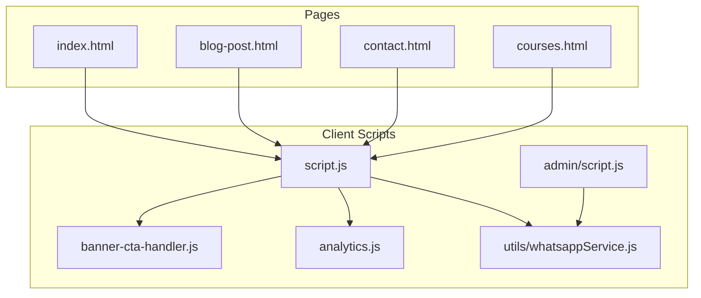
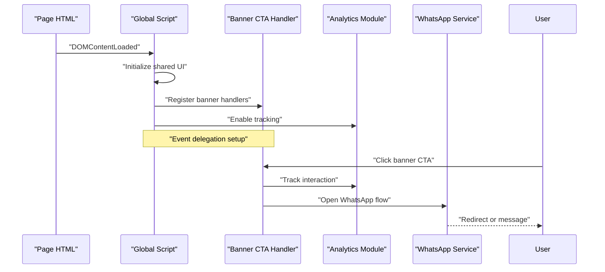
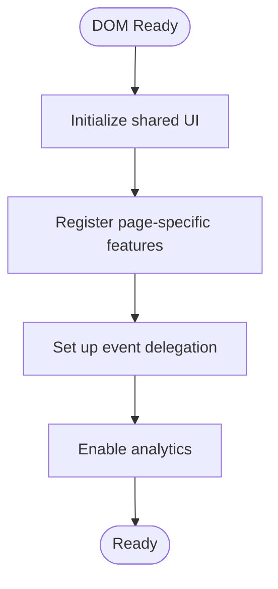
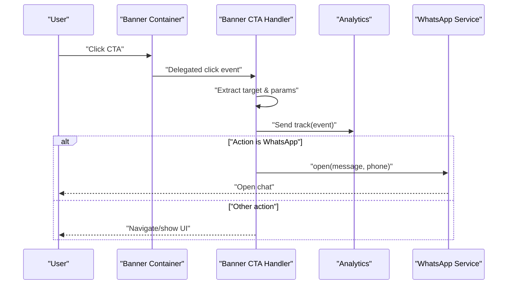
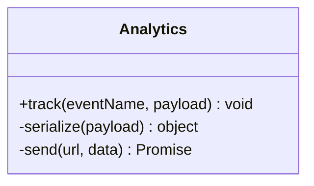
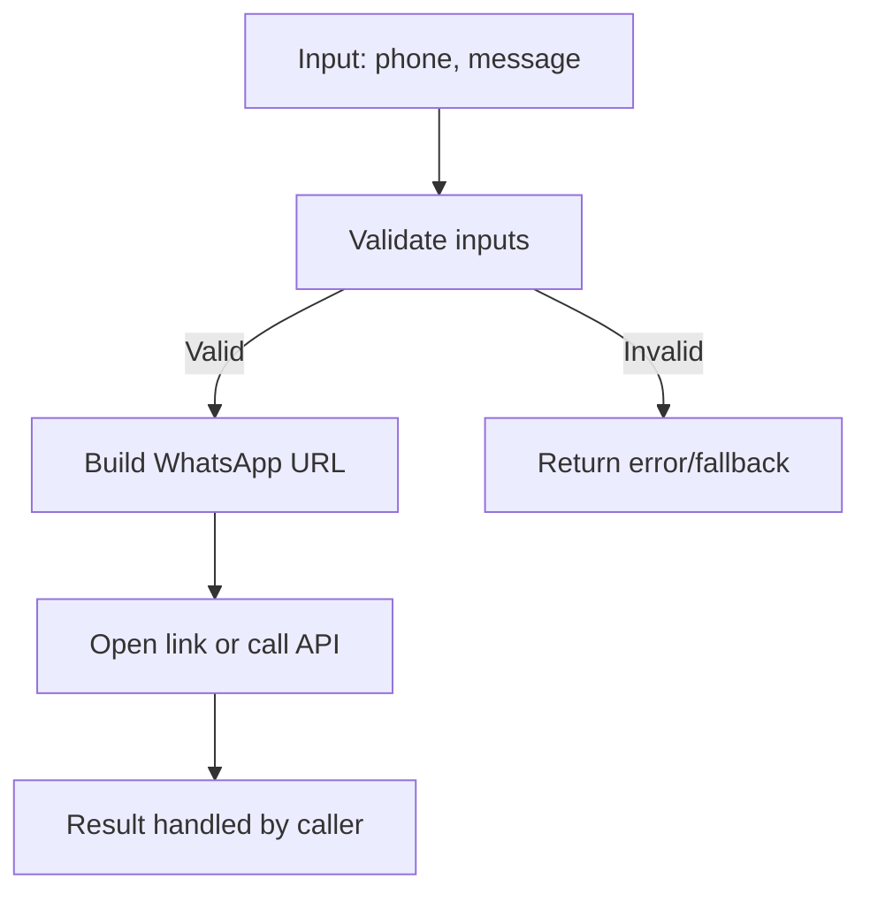
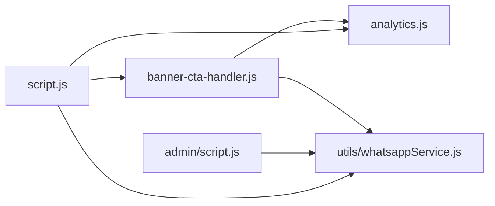

# Client-Side JavaScript Architecture

<cite>
**Referenced Files in This Document**
- [script.js](file://script.js)
- [banner-cta-handler.js](file://banner-cta-handler.js)
- [analytics.js](file://analytics.js)
- [whatsappService.js](file://utils/whatsappService.js)
- [admin/script.js](file://admin/script.js)
- [index.html](file://index.html)
- [blog-post.html](file://blog-post.html)
- [contact.html](file://contact.html)
- [courses.html](file://courses.html)
</cite>

## Table of Contents
1. [Introduction](#introduction)
2. [Project Structure](#project-structure)
3. [Core Components](#core-components)
4. [Architecture Overview](#architecture-overview)
5. [Detailed Component Analysis](#detailed-component-analysis)
6. [Dependency Analysis](#dependency-analysis)
7. [Performance Considerations](#performance-considerations)
8. [Troubleshooting Guide](#troubleshooting-guide)
9. [Conclusion](#conclusion)

## Introduction
This document explains the client-side JavaScript architecture and event handling patterns used across the site. It focuses on modular organization, DOM manipulation strategies, event delegation, banner CTA handling, analytics tracking, global utilities, asynchronous operations, error handling, external API integrations, and performance considerations such as lazy loading, memory management, and browser compatibility testing.

## Project Structure
The client-side code is organized into feature-oriented modules:
- Global application logic and shared behaviors
- Banner call-to-action (CTA) handler
- Analytics tracking module
- Utility services (e.g., WhatsApp integration)
- Admin-specific scripts

[No sources needed since this diagram shows conceptual workflow, not actual code structure]

## Core Components
- Global application script: Initializes page behavior, sets up navigation, and wires up features.
- Banner CTA handler: Manages click interactions on banners, triggers actions, and records events.
- Analytics tracker: Provides a consistent interface for sending user interactions to analytics endpoints.
- WhatsApp service: Encapsulates outbound messaging via WhatsApp links or APIs.
- Admin script: Handles admin-only UI interactions and data submission flows.

Key responsibilities:
- Centralized event wiring using event delegation where appropriate
- Consistent analytics instrumentation
- Robust error handling and fallbacks
- Clear separation between UI logic and business/service logic

**Section sources**
- [script.js](file://script.js)
- [banner-cta-handler.js](file://banner-cta-handler.js)
- [analytics.js](file://analytics.js)
- [whatsappService.js](file://utils/whatsappService.js)
- [admin/script.js](file://admin/script.js)

## Architecture Overview
The client-side follows a modular pattern with clear boundaries:
- Pages include shared scripts and feature-specific scripts
- The global script bootstraps common behaviors
- Feature modules expose public functions and are invoked by the global script
- Services encapsulate external integrations and network calls

**Diagram sources**
- [script.js](file://script.js)
- [banner-cta-handler.js](file://banner-cta-handler.js)
- [analytics.js](file://analytics.js)
- [whatsappService.js](file://utils/whatsappService.js)

## Detailed Component Analysis

### Global Application Script
Responsibilities:
- Bootstraps common UI behaviors (navigation, toggles, modals)
- Wires up feature modules after DOM readiness
- Applies event delegation for dynamic content
- Exposes a small set of global utilities for reuse

Patterns:
- Single initialization entry point
- Lazy registration of features per page
- Centralized error logging and fallbacks

**Section sources**
- [script.js](file://script.js)

### Banner CTA Handler
Responsibilities:
- Listens for clicks on banner elements
- Validates context and parameters
- Tracks interactions via analytics
- Performs action (e.g., open WhatsApp, navigate, show modal)

Patterns:
- Event delegation from a stable parent container
- Parameter extraction from data attributes
- Guarded execution with try/catch and user-friendly fallbacks

**Diagram sources**
- [banner-cta-handler.js](file://banner-cta-handler.js)
- [analytics.js](file://analytics.js)
- [whatsappService.js](file://utils/whatsappService.js)

**Section sources**
- [banner-cta-handler.js](file://banner-cta-handler.js)

### Analytics Tracking Module
Responsibilities:
- Provide a unified interface for tracking events
- Serialize payloads consistently
- Send requests asynchronously
- Handle failures gracefully without breaking UX

Patterns:
- Singleton-like facade exposing track(eventName, payload)
- Debounced or throttled calls for high-frequency events
- Fallback to console logging when network fails

**Diagram sources**
- [analytics.js](file://analytics.js)

**Section sources**
- [analytics.js](file://analytics.js)

### WhatsApp Service
Responsibilities:
- Build WhatsApp URLs or messages
- Optionally integrate with an external API if available
- Provide safe defaults for missing configuration

Patterns:
- Pure function composition for URL building
- Optional async path for server-mediated delivery
- Defensive checks for required fields

**Diagram sources**
- [whatsappService.js](file://utils/whatsappService.js)

**Section sources**
- [whatsappService.js](file://utils/whatsappService.js)

### Admin Script
Responsibilities:
- Admin-only UI interactions (e.g., forms, previews)
- Submission flows with validation and feedback
- Integration with backend endpoints

Patterns:
- Separate namespace to avoid conflicts
- Explicit permission checks before enabling features
- Robust form handling with progress indicators

**Section sources**
- [admin/script.js](file://admin/script.js)

### Page Integration Examples
- Index page includes global script and optional feature modules
- Blog post page may enable rich media behaviors
- Contact page integrates WhatsApp service for quick messaging
- Courses page may use lazy-loaded components

**Section sources**
- [index.html](file://index.html)
- [blog-post.html](file://blog-post.html)
- [contact.html](file://contact.html)
- [courses.html](file://courses.html)

## Dependency Analysis
High-level relationships among client modules:

**Diagram sources**
- [script.js](file://script.js)
- [banner-cta-handler.js](file://banner-cta-handler.js)
- [analytics.js](file://analytics.js)
- [whatsappService.js](file://utils/whatsappService.js)
- [admin/script.js](file://admin/script.js)

**Section sources**
- [script.js](file://script.js)
- [banner-cta-handler.js](file://banner-cta-handler.js)
- [analytics.js](file://analytics.js)
- [whatsappService.js](file://utils/whatsappService.js)
- [admin/script.js](file://admin/script.js)

## Performance Considerations
- Lazy loading
  - Load heavy modules only when needed (e.g., analytics, rich blog features)
  - Use dynamic imports or conditional script inclusion based on page context
- Memory management
  - Remove event listeners when detaching components
  - Avoid retaining references to large DOM nodes or images
  - Reuse utility instances instead of recreating them per interaction
- Browser compatibility
  - Test on modern browsers and provide graceful degradation for older ones
  - Polyfill only what is necessary; prefer progressive enhancement
- Network efficiency
  - Batch analytics events and debounce frequent interactions
  - Cache static assets aggressively; leverage CDN where possible
- Rendering performance
  - Prefer event delegation to minimize listener count
  - Batch DOM updates and avoid layout thrashing

[No sources needed since this section provides general guidance]

## Troubleshooting Guide
Common issues and resolutions:
- Click handlers not firing
  - Ensure event delegation targets exist at runtime
  - Verify selectors match dynamically added elements
- Analytics not recording
  - Check network tab for failed POST requests
  - Validate payload schema and endpoint availability
- WhatsApp link not opening
  - Confirm phone number format and message encoding
  - Provide fallback navigation if mobile detection fails
- Admin features unavailable
  - Verify admin-only guards and permissions
  - Inspect console for errors during initialization

**Section sources**
- [banner-cta-handler.js](file://banner-cta-handler.js)
- [analytics.js](file://analytics.js)
- [whatsappService.js](file://utils/whatsappService.js)
- [admin/script.js](file://admin/script.js)

## Conclusion
The client-side architecture emphasizes modularity, clear separation of concerns, and robust event handling. By leveraging event delegation, centralized analytics, and dedicated services, the application remains maintainable and performant. Following the recommended practices for lazy loading, memory hygiene, and cross-browser testing will further improve reliability and user experience.