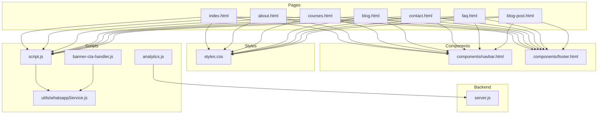
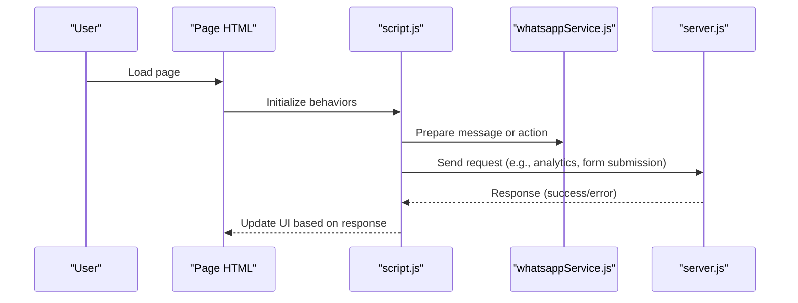
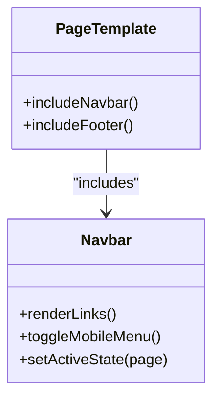
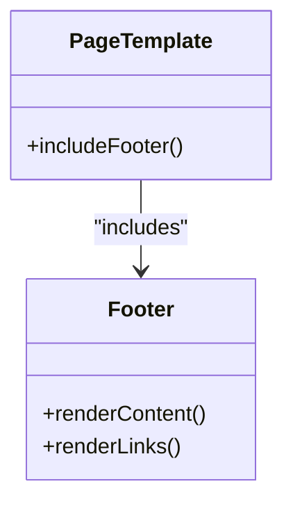
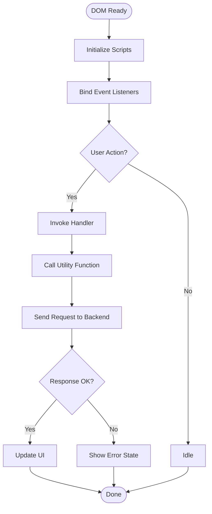
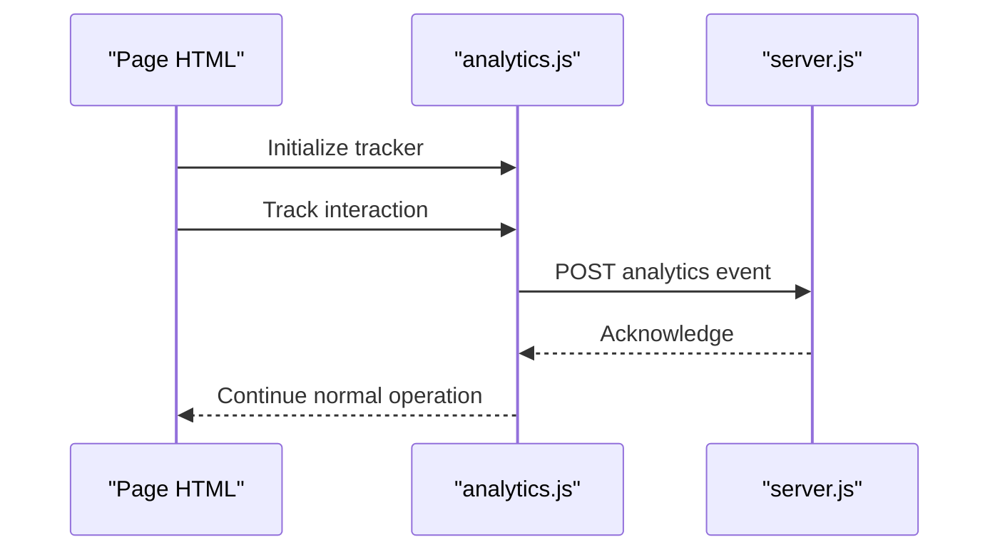
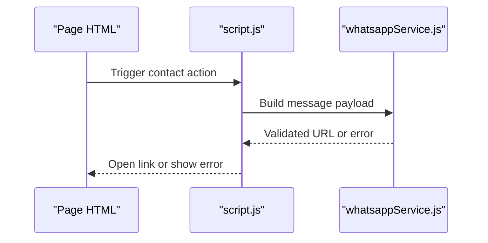
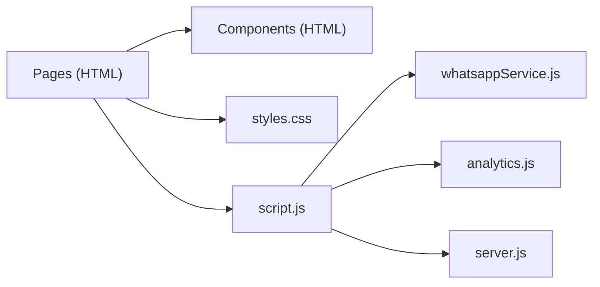

# Frontend Architecture

<cite>
**Referenced Files in This Document**
- [index.html](file://index.html)
- [about.html](file://about.html)
- [courses.html](file://courses.html)
- [blog.html](file://blog.html)
- [contact.html](file://contact.html)
- [faq.html](file://faq.html)
- [blog-post.html](file://blog-post.html)
- [navbar.html](file://components/navbar.html)
- [footer.html](file://components/footer.html)
- [styles.css](file://styles.css)
- [script.js](file://script.js)
- [analytics.js](file://analytics.js)
- [banner-cta-handler.js](file://banner-cta-handler.js)
- [whatsappService.js](file://utils/whatsappService.js)
- [server.js](file://server.js)
</cite>

## Table of Contents
1. [Introduction](#introduction)
2. [Project Structure](#project-structure)
3. [Core Components](#core-components)
4. [Architecture Overview](#architecture-overview)
5. [Detailed Component Analysis](#detailed-component-analysis)
6. [Dependency Analysis](#dependency-analysis)
7. [Performance Considerations](#performance-considerations)
8. [Troubleshooting Guide](#troubleshooting-guide)
9. [Conclusion](#conclusion)

## Introduction
This document describes the frontend architecture of the project with a focus on:
- Modular HTML component system using reusable navbar and footer components
- Responsive design patterns following a mobile-first approach
- CSS organization and styling architecture
- Client-side JavaScript event handling and integration points
- Component inclusion patterns, asset management strategy, and cross-browser compatibility considerations
- Diagrams illustrating component relationships and data flow between UI elements and backend services

The goal is to provide both high-level architectural insights and practical guidance for developers working on the frontend.

## Project Structure
The frontend is organized into clear layers:
- Pages at the root level (HTML documents)
- Shared components under components/
- Global styles under styles.css
- Client-side scripts under script.js and feature-specific modules
- Utilities under utils/
- Backend server entry point under server.js

**Diagram sources**
- [index.html](file://index.html)
- [about.html](file://about.html)
- [courses.html](file://courses.html)
- [blog.html](file://blog.html)
- [contact.html](file://contact.html)
- [faq.html](file://faq.html)
- [blog-post.html](file://blog-post.html)
- [navbar.html](file://components/navbar.html)
- [footer.html](file://components/footer.html)
- [styles.css](file://styles.css)
- [script.js](file://script.js)
- [analytics.js](file://analytics.js)
- [banner-cta-handler.js](file://banner-cta-handler.js)
- [whatsappService.js](file://utils/whatsappService.js)
- [server.js](file://server.js)

**Section sources**
- [index.html](file://index.html)
- [about.html](file://about.html)
- [courses.html](file://courses.html)
- [blog.html](file://blog.html)
- [contact.html](file://contact.html)
- [faq.html](file://faq.html)
- [blog-post.html](file://blog-post.html)
- [navbar.html](file://components/navbar.html)
- [footer.html](file://components/footer.html)
- [styles.css](file://styles.css)
- [script.js](file://script.js)
- [analytics.js](file://analytics.js)
- [banner-cta-handler.js](file://banner-cta-handler.js)
- [whatsappService.js](file://utils/whatsappService.js)
- [server.js](file://server.js)

## Core Components
Reusable components are defined as standalone HTML fragments and included across pages:
- Navbar component: Provides navigation links, branding, and responsive toggles
- Footer component: Contains site-wide footer content and links

Component inclusion pattern:
- Each page references the shared navbar and footer fragments
- The main application script initializes behaviors after DOM ready
- Styles are centralized in a single stylesheet with modular sections

Key responsibilities:
- Navbar: Navigation structure, active state indication, mobile menu toggle
- Footer: Consistent bottom content across all pages
- Page templates: Compose layout by including components and adding page-specific content

**Section sources**
- [navbar.html](file://components/navbar.html)
- [footer.html](file://components/footer.html)
- [index.html](file://index.html)
- [about.html](file://about.html)
- [courses.html](file://courses.html)
- [blog.html](file://blog.html)
- [contact.html](file://contact.html)
- [faq.html](file://faq.html)
- [blog-post.html](file://blog-post.html)
- [script.js](file://script.js)

## Architecture Overview
The frontend follows a simple but effective architecture:
- Static HTML pages compose layouts from reusable components
- Centralized CSS provides consistent styling and responsive behavior
- Client-side JavaScript handles interactivity and integrates with backend services via HTTP requests
- Analytics and utility modules extend functionality without coupling to specific pages

**Diagram sources**
- [script.js](file://script.js)
- [whatsappService.js](file://utils/whatsappService.js)
- [server.js](file://server.js)

## Detailed Component Analysis

### Navbar Component
Responsibilities:
- Render navigation links and brand logo
- Provide mobile-friendly toggle behavior
- Indicate active page context

Integration:
- Included in each page template
- Controlled by global script for mobile toggle and active states

**Diagram sources**
- [navbar.html](file://components/navbar.html)
- [index.html](file://index.html)
- [about.html](file://about.html)
- [courses.html](file://courses.html)
- [blog.html](file://blog.html)
- [contact.html](file://contact.html)
- [faq.html](file://faq.html)
- [blog-post.html](file://blog-post.html)

**Section sources**
- [navbar.html](file://components/navbar.html)
- [index.html](file://index.html)
- [about.html](file://about.html)
- [courses.html](file://courses.html)
- [blog.html](file://blog.html)
- [contact.html](file://contact.html)
- [faq.html](file://faq.html)
- [blog-post.html](file://blog-post.html)

### Footer Component
Responsibilities:
- Display site-wide footer content
- Provide consistent link structure
- Support accessibility attributes

Integration:
- Included in each page template
- Styled centrally for consistency

**Diagram sources**
- [footer.html](file://components/footer.html)
- [index.html](file://index.html)
- [about.html](file://about.html)
- [courses.html](file://courses.html)
- [blog.html](file://blog.html)
- [contact.html](file://contact.html)
- [faq.html](file://faq.html)
- [blog-post.html](file://blog-post.html)

**Section sources**
- [footer.html](file://components/footer.html)
- [index.html](file://index.html)
- [about.html](file://about.html)
- [courses.html](file://courses.html)
- [blog.html](file://blog.html)
- [contact.html](file://contact.html)
- [faq.html](file://faq.html)
- [blog-post.html](file://blog-post.html)

### Styling Architecture (CSS)
Organization:
- Single global stylesheet with logical sections
- Mobile-first media queries for responsive breakpoints
- Utility classes for spacing, typography, and common patterns
- Component-specific rules scoped to navbar and footer

Responsive patterns:
- Base styles target small screens
- Progressive enhancements for tablets and desktops
- Flexible grids and fluid typography

Accessibility:
- Semantic markup support
- Focus states and contrast considerations
- ARIA attributes where applicable

**Section sources**
- [styles.css](file://styles.css)
- [navbar.html](file://components/navbar.html)
- [footer.html](file://components/footer.html)

### Client-Side JavaScript Event Handling
Responsibilities:
- Initialize behaviors after DOM ready
- Handle user interactions (clicks, form submissions, toggles)
- Integrate with utilities and backend services
- Manage analytics tracking

Event flow:
- Page load triggers initialization
- User actions dispatch handlers
- Handlers call utility functions or send requests
- Responses update UI or trigger next steps

**Diagram sources**
- [script.js](file://script.js)
- [banner-cta-handler.js](file://banner-cta-handler.js)
- [whatsappService.js](file://utils/whatsappService.js)
- [server.js](file://server.js)

**Section sources**
- [script.js](file://script.js)
- [banner-cta-handler.js](file://banner-cta-handler.js)
- [whatsappService.js](file://utils/whatsappService.js)
- [server.js](file://server.js)

### Analytics Integration
Responsibilities:
- Track page views and user interactions
- Send events to backend or third-party endpoints
- Respect privacy settings and consent

Flow:
- Analytics module initializes on page load
- Interactions trigger event payloads
- Requests sent to backend or analytics service
- Errors handled gracefully without breaking UX

**Diagram sources**
- [analytics.js](file://analytics.js)
- [server.js](file://server.js)

**Section sources**
- [analytics.js](file://analytics.js)
- [server.js](file://server.js)

### WhatsApp Service Utility
Responsibilities:
- Construct messages and deep links
- Validate inputs before sending
- Provide fallbacks for unsupported environments

Usage:
- Called by page scripts when users initiate contact
- Encapsulates formatting and encoding logic
- Returns success/failure status for UI feedback

**Diagram sources**
- [whatsappService.js](file://utils/whatsappService.js)
- [script.js](file://script.js)

**Section sources**
- [whatsappService.js](file://utils/whatsappService.js)
- [script.js](file://script.js)

## Dependency Analysis
Frontend dependencies are minimal and explicit:
- Pages depend on shared components and global styles
- Scripts depend on utilities and backend endpoints
- No heavy frameworks; vanilla JS ensures broad compatibility

**Diagram sources**
- [index.html](file://index.html)
- [navbar.html](file://components/navbar.html)
- [footer.html](file://components/footer.html)
- [styles.css](file://styles.css)
- [script.js](file://script.js)
- [whatsappService.js](file://utils/whatsappService.js)
- [analytics.js](file://analytics.js)
- [server.js](file://server.js)

**Section sources**
- [index.html](file://index.html)
- [navbar.html](file://components/navbar.html)
- [footer.html](file://components/footer.html)
- [styles.css](file://styles.css)
- [script.js](file://script.js)
- [whatsappService.js](file://utils/whatsappService.js)
- [analytics.js](file://analytics.js)
- [server.js](file://server.js)

## Performance Considerations
- Keep component fragments lightweight to reduce duplication
- Use efficient selectors and avoid excessive reflows in scripts
- Defer non-critical scripts to improve initial load time
- Minimize network requests by consolidating assets where possible
- Leverage browser caching for static assets and stylesheets

[No sources needed since this section provides general guidance]

## Troubleshooting Guide
Common issues and resolutions:
- Navbar not rendering: Verify component inclusion paths and ensure DOM readiness before binding events
- Mobile menu not toggling: Check event listeners and ensure correct element IDs/classes exist
- Form submissions failing: Inspect network requests and validate backend endpoint availability
- Analytics not firing: Confirm initialization order and check for blocked requests due to permissions

Operational checks:
- Ensure all required scripts are loaded in the correct order
- Validate that utility functions return expected values before use
- Test cross-browser behavior for key interactions

**Section sources**
- [script.js](file://script.js)
- [whatsappService.js](file://utils/whatsappService.js)
- [analytics.js](file://analytics.js)
- [server.js](file://server.js)

## Conclusion
The frontend architecture emphasizes simplicity, reusability, and maintainability:
- Reusable HTML components standardize navigation and footer across pages
- Centralized CSS supports responsive, mobile-first design
- Vanilla JavaScript manages interactions and integrates cleanly with backend services
- Clear separation of concerns facilitates debugging and future enhancements

Adhering to these patterns will help keep the codebase scalable and accessible across devices and browsers.