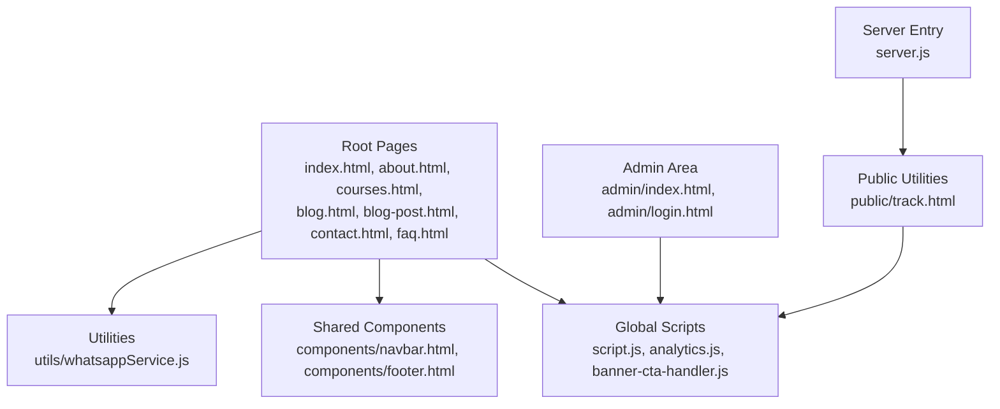
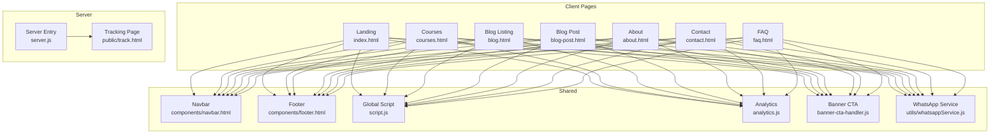
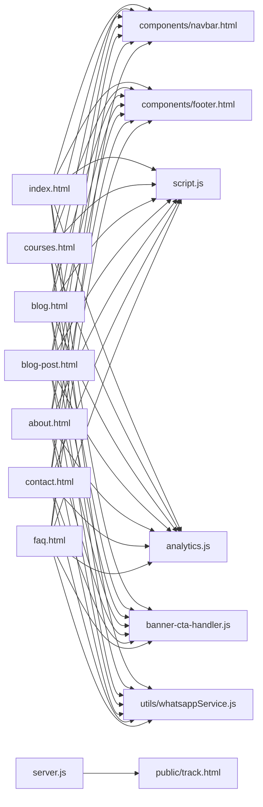

# Main Application Structure

<cite>
**Referenced Files in This Document**
- [index.html](file://index.html)
- [about.html](file://about.html)
- [courses.html](file://courses.html)
- [blog.html](file://blog.html)
- [blog-post.html](file://blog-post.html)
- [contact.html](file://contact.html)
- [faq.html](file://faq.html)
- [admin/index.html](file://admin/index.html)
- [admin/login.html](file://admin/login.html)
- [public/track.html](file://public/track.html)
- [components/navbar.html](file://components/navbar.html)
- [components/footer.html](file://components/footer.html)
- [script.js](file://script.js)
- [analytics.js](file://analytics.js)
- [banner-cta-handler.js](file://banner-cta-handler.js)
- [utils/whatsappService.js](file://utils/whatsappService.js)
- [server.js](file://server.js)
</cite>

## Table of Contents
1. [Introduction](#introduction)
2. [Project Structure](#project-structure)
3. [Core Components](#core-components)
4. [Architecture Overview](#architecture-overview)
5. [Detailed Component Analysis](#detailed-component-analysis)
6. [Dependency Analysis](#dependency-analysis)
7. [Performance Considerations](#performance-considerations)
8. [Troubleshooting Guide](#troubleshooting-guide)
9. [Conclusion](#conclusion)

## Introduction
This document explains the main application structure of the educational platform with a focus on HTML page hierarchy and routing patterns. It covers semantic markup organization, page-specific JavaScript initialization, navigation flow across sections, URL structure, meta tag management for SEO, and how each page supports specific user journeys from landing to course enrollment. It also highlights shared functionality patterns and page-specific configurations.

## Project Structure
The project is organized as a static site with a small server-side component for tracking and admin access. Pages are individual HTML files that share common UI fragments (navbar and footer) and global scripts. The public-facing pages live at the repository root, while administrative and utility routes are under dedicated directories.

**Diagram sources**
- [index.html](file://index.html)
- [about.html](file://about.html)
- [courses.html](file://courses.html)
- [blog.html](file://blog.html)
- [blog-post.html](file://blog-post.html)
- [contact.html](file://contact.html)
- [faq.html](file://faq.html)
- [admin/index.html](file://admin/index.html)
- [admin/login.html](file://admin/login.html)
- [public/track.html](file://public/track.html)
- [components/navbar.html](file://components/navbar.html)
- [components/footer.html](file://components/footer.html)
- [script.js](file://script.js)
- [analytics.js](file://analytics.js)
- [banner-cta-handler.js](file://banner-cta-handler.js)
- [utils/whatsappService.js](file://utils/whatsappService.js)
- [server.js](file://server.js)

**Section sources**
- [index.html](file://index.html)
- [about.html](file://about.html)
- [courses.html](file://courses.html)
- [blog.html](file://blog.html)
- [blog-post.html](file://blog-post.html)
- [contact.html](file://contact.html)
- [faq.html](file://faq.html)
- [admin/index.html](file://admin/index.html)
- [admin/login.html](file://admin/login.html)
- [public/track.html](file://public/track.html)
- [components/navbar.html](file://components/navbar.html)
- [components/footer.html](file://components/footer.html)
- [script.js](file://script.js)
- [analytics.js](file://analytics.js)
- [banner-cta-handler.js](file://banner-cta-handler.js)
- [utils/whatsappService.js](file://utils/whatsappService.js)
- [server.js](file://server.js)

## Core Components
- Shared UI Fragments: Navbar and footer are included via separate HTML fragments to keep consistent navigation and branding across all pages.
- Global Scripts: Centralized behavior such as navigation toggles, scroll effects, and event wiring lives in global scripts. Page-specific logic is initialized within each page’s script block or module.
- Utility Services: Lightweight utilities like WhatsApp integration are encapsulated for reuse across pages.
- Tracking Endpoint: A minimal server entry serves a tracking page used by external integrations.

Key responsibilities:
- Navigation consistency and accessibility through shared navbar and footer.
- SEO metadata per page (title, description, canonical, Open Graph).
- User journey flows: Landing → Explore Courses → Course Details → Enrollment.
- Blog discovery and reading flow: Blog listing → Post detail.
- Contact and FAQ support pages.

**Section sources**
- [components/navbar.html](file://components/navbar.html)
- [components/footer.html](file://components/footer.html)
- [script.js](file://script.js)
- [analytics.js](file://analytics.js)
- [banner-cta-handler.js](file://banner-cta-handler.js)
- [utils/whatsappService.js](file://utils/whatsappService.js)
- [server.js](file://server.js)

## Architecture Overview
The application follows a flat HTML architecture with shared components and global scripts. Routing is primarily handled by the file system; there is no client-side router. Each page is self-contained but reuses shared assets and behaviors.

**Diagram sources**
- [index.html](file://index.html)
- [courses.html](file://courses.html)
- [blog.html](file://blog.html)
- [blog-post.html](file://blog-post.html)
- [about.html](file://about.html)
- [contact.html](file://contact.html)
- [faq.html](file://faq.html)
- [components/navbar.html](file://components/navbar.html)
- [components/footer.html](file://components/footer.html)
- [script.js](file://script.js)
- [analytics.js](file://analytics.js)
- [banner-cta-handler.js](file://banner-cta-handler.js)
- [utils/whatsappService.js](file://utils/whatsappService.js)
- [server.js](file://server.js)
- [public/track.html](file://public/track.html)

## Detailed Component Analysis

### Landing Page (index.html)
Purpose:
- Primary entry point for users.
- Introduces platform value proposition and guides users toward courses and contact.

Semantic Markup Organization:
- Uses standard HTML5 elements for header, main, section, article, aside, and footer to convey content structure.
- Includes shared navbar and footer fragments for consistent navigation and branding.

SEO Meta Tags:
- Title and description tailored to the landing experience.
- Canonical link pointing to the homepage.
- Open Graph tags for social sharing previews.

JavaScript Initialization:
- Initializes global behaviors (e.g., mobile menu toggle, scroll animations).
- Attaches handlers for hero CTAs and promotional banners.

Navigation Flow:
- Prominent links to courses, blog, about, and contact.
- Calls-to-action route users to course listings or enrollment steps.

Page-Specific Configuration:
- Hero messaging and featured course highlights configured inline or via data attributes.

**Section sources**
- [index.html](file://index.html)
- [components/navbar.html](file://components/navbar.html)
- [components/footer.html](file://components/footer.html)
- [script.js](file://script.js)
- [banner-cta-handler.js](file://banner-cta-handler.js)

### Courses Page (courses.html)
Purpose:
- Browse available courses and initiate enrollment.

Semantic Markup Organization:
- Sectioned layout with cards representing courses.
- Uses lists and articles to semantically group course entries.

SEO Meta Tags:
- Title and description optimized for course discovery.
- Canonical link to the courses page.
- Open Graph tags for rich previews.

JavaScript Initialization:
- Filters or sorting interactions if present.
- Event delegation for “Enroll” actions.

Navigation Flow:
- Links to individual course details (if applicable) and direct enrollment paths.
- Back to home and other top-level sections.

Page-Specific Configuration:
- Course list data may be embedded or loaded dynamically.
- Enrollment buttons can trigger modal flows or external forms.

**Section sources**
- [courses.html](file://courses.html)
- [components/navbar.html](file://components/navbar.html)
- [components/footer.html](file://components/footer.html)
- [script.js](file://script.js)
- [banner-cta-handler.js](file://banner-cta-handler.js)

### Blog Listing (blog.html)
Purpose:
- Discover blog posts and navigate to full articles.

Semantic Markup Organization:
- Article-based layout for post previews.
- Proper heading hierarchy and descriptive links.

SEO Meta Tags:
- Title and description focused on blog content.
- Canonical link to the blog index.
- Open Graph tags for social sharing.

JavaScript Initialization:
- Optional search or category filters.
- Lazy loading for images if implemented.

Navigation Flow:
- Clicking a post preview navigates to the corresponding post page.
- Links back to home and courses.

Page-Specific Configuration:
- Post listing configuration and pagination settings.

**Section sources**
- [blog.html](file://blog.html)
- [components/navbar.html](file://components/navbar.html)
- [components/footer.html](file://components/footer.html)
- [script.js](file://script.js)
- [banner-cta-handler.js](file://banner-cta-handler.js)

### Blog Post (blog-post.html)
Purpose:
- Display a single blog post with rich content and related links.

Semantic Markup Organization:
- Article element with headings, paragraphs, lists, and media.
- Author and date metadata where applicable.

SEO Meta Tags:
- Unique title and description per post.
- Canonical link to the post URL.
- Open Graph tags including image and type.

JavaScript Initialization:
- Table of contents generation if needed.
- Social share buttons and reading time calculations.

Navigation Flow:
- Back to blog listing.
- Related posts or calls to action (e.g., enroll in a course).

Page-Specific Configuration:
- Post content and metadata defined per post.

**Section sources**
- [blog-post.html](file://blog-post.html)
- [components/navbar.html](file://components/navbar.html)
- [components/footer.html](file://components/footer.html)
- [script.js](file://script.js)
- [banner-cta-handler.js](file://banner-cta-handler.js)

### About Page (about.html)
Purpose:
- Provide information about the platform, mission, and team.

Semantic Markup Organization:
- Sections for story, values, and team members.
- Use of figure and figcaption for images.

SEO Meta Tags:
- Title and description aligned with brand identity.
- Canonical link to the about page.
- Open Graph tags for social previews.

JavaScript Initialization:
- Scroll-based reveals or interactive timelines if present.

Navigation Flow:
- Links to courses and contact for next steps.

Page-Specific Configuration:
- Team profiles and milestones.

**Section sources**
- [about.html](file://about.html)
- [components/navbar.html](file://components/navbar.html)
- [components/footer.html](file://components/footer.html)
- [script.js](file://script.js)
- [banner-cta-handler.js](file://banner-cta-handler.js)

### Contact Page (contact.html)
Purpose:
- Enable users to reach out via form or messaging channels.

Semantic Markup Organization:
- Form with labeled inputs and fieldsets.
- Address and contact details in address elements.

SEO Meta Tags:
- Title and description for contact intent.
- Canonical link to the contact page.
- Open Graph tags for social previews.

JavaScript Initialization:
- Client-side validation and submission handling.
- Integration with WhatsApp service for quick contact.

Navigation Flow:
- Direct links to courses and blog.

Page-Specific Configuration:
- Contact endpoints and messaging preferences.

**Section sources**
- [contact.html](file://contact.html)
- [components/navbar.html](file://components/navbar.html)
- [components/footer.html](file://components/footer.html)
- [script.js](file://script.js)
- [utils/whatsappService.js](file://utils/whatsappService.js)
- [banner-cta-handler.js](file://banner-cta-handler.js)

### FAQ Page (faq.html)
Purpose:
- Answer common questions to reduce friction in user journeys.

Semantic Markup Organization:
- Definition lists or collapsible sections for Q&A.
- Clear headings and accessible controls.

SEO Meta Tags:
- Title and description targeting FAQ queries.
- Canonical link to the FAQ page.
- Open Graph tags for social previews.

JavaScript Initialization:
- Accordion behavior for expand/collapse.

Navigation Flow:
- Links to courses and contact for further assistance.

Page-Specific Configuration:
- Question sets and answers.

**Section sources**
- [faq.html](file://faq.html)
- [components/navbar.html](file://components/navbar.html)
- [components/footer.html](file://components/footer.html)
- [script.js](file://script.js)
- [banner-cta-handler.js](file://banner-cta-handler.js)

### Admin Area (admin/index.html, admin/login.html)
Purpose:
- Administrative interface for managing platform content and settings.

Semantic Markup Organization:
- Minimal, functional layouts focused on tasks.
- Forms and tables for CRUD operations.

SEO Meta Tags:
- Restricted indexing via robots.txt or meta directives.
- No social sharing metadata.

JavaScript Initialization:
- Authentication checks and session management.
- Admin-only features guarded by permissions.

Navigation Flow:
- Login → Dashboard → Content Management.

Page-Specific Configuration:
- Admin credentials and feature flags.

**Section sources**
- [admin/index.html](file://admin/index.html)
- [admin/login.html](file://admin/login.html)
- [script.js](file://script.js)

### Public Tracking (public/track.html)
Purpose:
- Lightweight endpoint for tracking events or redirects.

Semantic Markup Organization:
- Minimal HTML with necessary scripts.

SEO Meta Tags:
- Typically not indexed; may include noindex.

JavaScript Initialization:
- Handles tracking payloads and responses.

Navigation Flow:
- Accessed programmatically by external services.

Page-Specific Configuration:
- Tracking parameters and response formats.

**Section sources**
- [public/track.html](file://public/track.html)
- [server.js](file://server.js)

### Shared Components
- Navbar: Provides consistent navigation across all pages with links to key sections and responsive behavior.
- Footer: Displays branding, legal links, and secondary navigation.

**Section sources**
- [components/navbar.html](file://components/navbar.html)
- [components/footer.html](file://components/footer.html)

### Global Scripts
- script.js: Initializes global behaviors, event listeners, and reusable utilities.
- analytics.js: Integrates analytics and measurement tools.
- banner-cta-handler.js: Manages promotional banners and call-to-action interactions.

**Section sources**
- [script.js](file://script.js)
- [analytics.js](file://analytics.js)
- [banner-cta-handler.js](file://banner-cta-handler.js)

### Utilities
- utils/whatsappService.js: Encapsulates WhatsApp messaging functionality for quick contact flows.

**Section sources**
- [utils/whatsappService.js](file://utils/whatsappService.js)

### Server Entry
- server.js: Serves the tracking page and any backend endpoints required by the platform.

**Section sources**
- [server.js](file://server.js)

## Dependency Analysis
The dependency graph shows how pages depend on shared components and scripts, and how the server provides a minimal backend for tracking.

**Diagram sources**
- [index.html](file://index.html)
- [courses.html](file://courses.html)
- [blog.html](file://blog.html)
- [blog-post.html](file://blog-post.html)
- [about.html](file://about.html)
- [contact.html](file://contact.html)
- [faq.html](file://faq.html)
- [components/navbar.html](file://components/navbar.html)
- [components/footer.html](file://components/footer.html)
- [script.js](file://script.js)
- [analytics.js](file://analytics.js)
- [banner-cta-handler.js](file://banner-cta-handler.js)
- [utils/whatsappService.js](file://utils/whatsappService.js)
- [server.js](file://server.js)
- [public/track.html](file://public/track.html)

**Section sources**
- [index.html](file://index.html)
- [courses.html](file://courses.html)
- [blog.html](file://blog.html)
- [blog-post.html](file://blog-post.html)
- [about.html](file://about.html)
- [contact.html](file://contact.html)
- [faq.html](file://faq.html)
- [components/navbar.html](file://components/navbar.html)
- [components/footer.html](file://components/footer.html)
- [script.js](file://script.js)
- [analytics.js](file://analytics.js)
- [banner-cta-handler.js](file://banner-cta-handler.js)
- [utils/whatsappService.js](file://utils/whatsappService.js)
- [server.js](file://server.js)
- [public/track.html](file://public/track.html)

## Performance Considerations
- Keep shared components lightweight and avoid heavy DOM manipulations during initial render.
- Defer non-critical scripts and load analytics after primary content.
- Use lazy loading for images and media on listing pages.
- Minimize network requests by bundling small utilities and caching static assets.
[No sources needed since this section provides general guidance]

## Troubleshooting Guide
Common issues and resolutions:
- Broken navigation links: Verify relative paths in navbar and ensure shared components are correctly included.
- Missing SEO metadata: Confirm each page has unique title, description, canonical, and Open Graph tags.
- Analytics not firing: Check analytics initialization order and consent requirements.
- WhatsApp integration failures: Validate phone number formatting and message templates in the utility service.
- Tracking endpoint errors: Ensure server is running and track.html responds appropriately.

**Section sources**
- [components/navbar.html](file://components/navbar.html)
- [analytics.js](file://analytics.js)
- [utils/whatsappService.js](file://utils/whatsappService.js)
- [server.js](file://server.js)
- [public/track.html](file://public/track.html)

## Conclusion
The platform uses a clear, maintainable HTML-first architecture with shared components and global scripts. Each page is purpose-built for a specific user journey, with strong SEO foundations and consistent navigation. The minimal server supports tracking needs without complicating the frontend. By following the patterns outlined here, new pages can be added quickly while preserving performance, accessibility, and SEO quality.