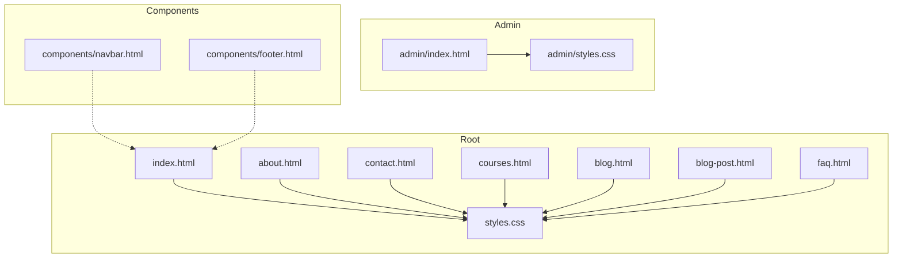
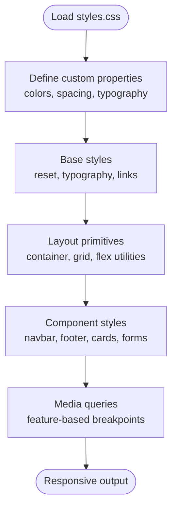
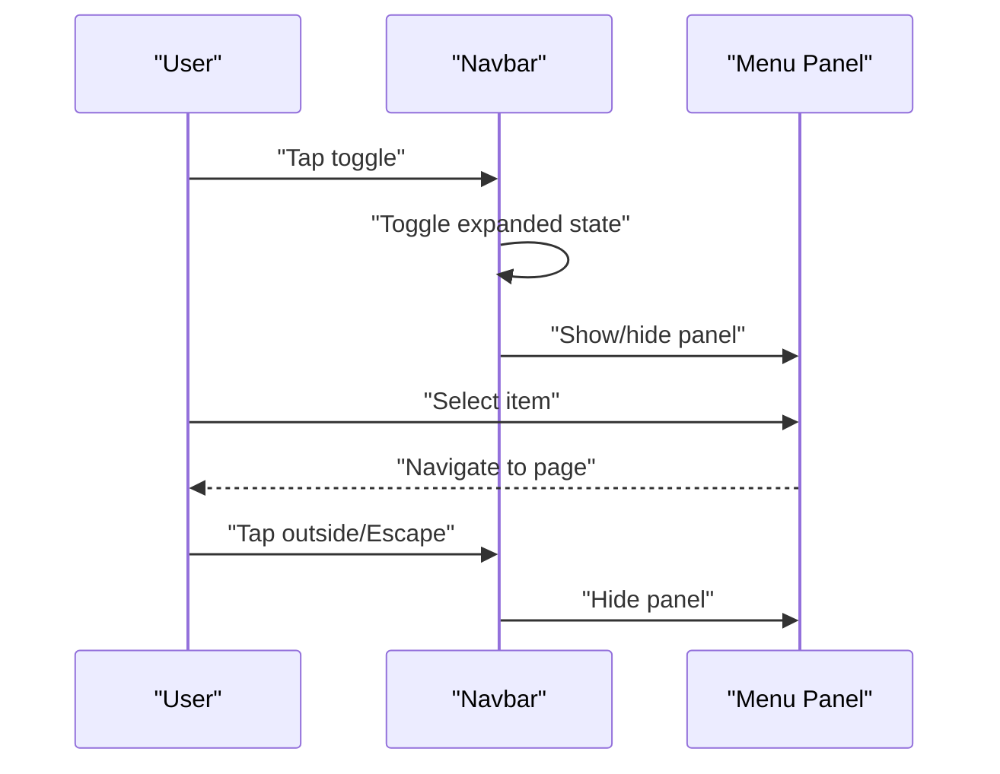
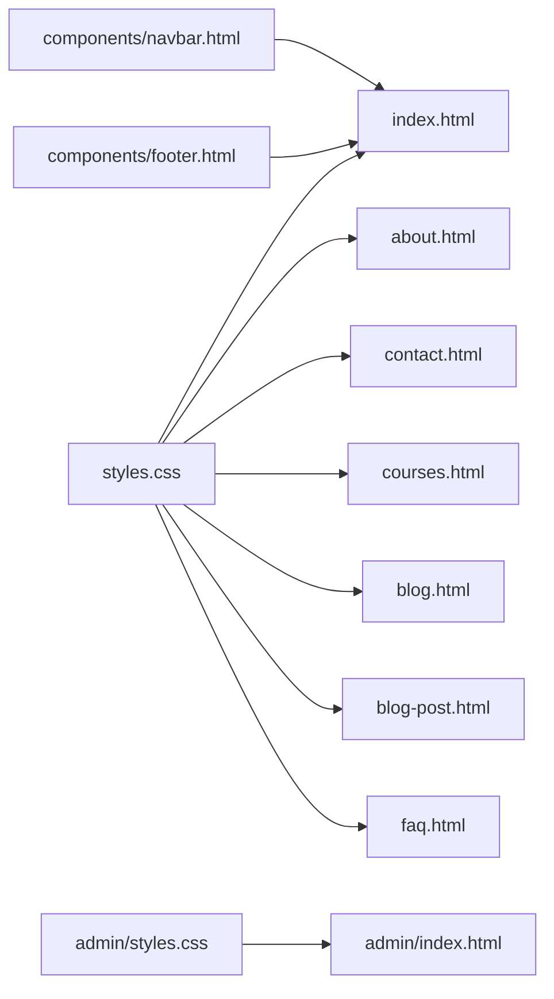

# Responsive Design System

<cite>
**Referenced Files in This Document**
- [styles.css](file://styles.css)
- [index.html](file://index.html)
- [about.html](file://about.html)
- [contact.html](file://contact.html)
- [courses.html](file://courses.html)
- [blog.html](file://blog.html)
- [blog-post.html](file://blog-post.html)
- [faq.html](file://faq.html)
- [admin/index.html](file://admin/index.html)
- [admin/styles.css](file://admin/styles.css)
- [components/navbar.html](file://components/navbar.html)
- [components/footer.html](file://components/footer.html)
</cite>

## Table of Contents
1. [Introduction](#introduction)
2. [Project Structure](#project-structure)
3. [Core Components](#core-components)
4. [Architecture Overview](#architecture-overview)
5. [Detailed Component Analysis](#detailed-component-analysis)
6. [Dependency Analysis](#dependency-analysis)
7. [Performance Considerations](#performance-considerations)
8. [Troubleshooting Guide](#troubleshooting-guide)
9. [Conclusion](#conclusion)

## Introduction
This document describes the responsive design system and CSS architecture used across the site. It explains the mobile-first approach, layout strategies using CSS Grid and Flexbox, media query breakpoints, custom properties (CSS variables), naming conventions, component-specific styles, cross-browser considerations, and performance optimization techniques such as minification and asset loading strategies. The goal is to provide a clear reference for developers and designers to maintain consistency, improve accessibility, and optimize performance on all devices.

## Project Structure
The project follows a flat structure with shared global styles and page-level HTML files. A small admin area has its own stylesheet. Reusable UI fragments are stored in components and included into pages via server-side includes or client-side injection.

**Diagram sources**
- [index.html:1-50](file://index.html#L1-L50)
- [about.html:1-50](file://about.html#L1-L50)
- [contact.html:1-50](file://contact.html#L1-L50)
- [courses.html:1-50](file://courses.html#L1-L50)
- [blog.html:1-50](file://blog.html#L1-L50)
- [blog-post.html:1-50](file://blog-post.html#L1-L50)
- [faq.html:1-50](file://faq.html#L1-L50)
- [styles.css:1-100](file://styles.css#L1-L100)
- [admin/index.html:1-50](file://admin/index.html#L1-L50)
- [admin/styles.css:1-50](file://admin/styles.css#L1-L50)
- [components/navbar.html:1-50](file://components/navbar.html#L1-L50)
- [components/footer.html:1-50](file://components/footer.html#L1-L50)

**Section sources**
- [index.html:1-50](file://index.html#L1-L50)
- [styles.css:1-100](file://styles.css#L1-L100)
- [admin/index.html:1-50](file://admin/index.html#L1-L50)
- [admin/styles.css:1-50](file://admin/styles.css#L1-L50)
- [components/navbar.html:1-50](file://components/navbar.html#L1-L50)
- [components/footer.html:1-50](file://components/footer.html#L1-L50)

## Core Components
- Global styles and reset: Base typography, color tokens, spacing scale, and box-sizing normalization.
- Layout primitives: Container widths, grid-based sections, and flex utilities for alignment.
- Navigation: Mobile-first navbar with collapsible menu behavior.
- Footer: Simple stacked layout that adapts to wider screens.
- Page templates: Shared patterns for hero, cards, lists, forms, and content blocks.

Key responsibilities:
- Centralize design tokens in custom properties for consistent theming.
- Provide reusable layout classes to reduce duplication.
- Keep component styles scoped and predictable across pages.

**Section sources**
- [styles.css:1-100](file://styles.css#L1-L100)
- [components/navbar.html:1-50](file://components/navbar.html#L1-L50)
- [components/footer.html:1-50](file://components/footer.html#L1-L50)

## Architecture Overview
The CSS architecture follows a mobile-first strategy:
- Base styles define defaults for small screens.
- Progressive enhancements add complexity at larger breakpoints.
- Custom properties encapsulate theme values and spacing scales.
- Layouts use CSS Grid for two-dimensional structures and Flexbox for one-dimensional arrangements.
- Media queries are organized by feature rather than device, improving maintainability.

[No sources needed since this diagram shows conceptual workflow, not actual code structure]

## Detailed Component Analysis

### Global Styles and Custom Properties
- Custom properties include color palette, typography scale, spacing units, border radius, shadows, and z-index layers.
- Base rules set font families, line heights, link states, and image responsiveness.
- Utility classes provide quick access to common behaviors like text alignment, spacing, and visibility toggles.

Implementation notes:
- Group related variables under semantic prefixes for clarity.
- Use relative units (rem, em) for scalable typography and spacing.
- Apply box-sizing globally to simplify sizing calculations.

**Section sources**
- [styles.css:1-100](file://styles.css#L1-L100)

### Layout Primitives: Grid and Flexbox
- CSS Grid is used for multi-column layouts, card grids, and complex page regions.
- Flexbox is used for navigation bars, inline elements, and simple row/column alignments.
- Container constraints ensure readability and prevent overly wide content.

Patterns:
- Define a base grid with minimal columns; expand at larger breakpoints.
- Use gap for spacing between items instead of margins.
- Prefer auto-fit/auto-fill with minmax() for fluid card grids.

**Section sources**
- [styles.css:1-100](file://styles.css#L1-L100)

### Navigation Component
- Mobile-first navbar collapses into a hamburger menu on small screens.
- At larger breakpoints, the menu expands horizontally.
- Focus states and keyboard navigation support accessibility.

Behavior flow:
- Toggle button controls an expanded state class.
- Overlay or slide-in panel presents menu items on narrow viewports.
- Click outside or press Escape closes the menu.

**Diagram sources**
- [components/navbar.html:1-50](file://components/navbar.html#L1-L50)
- [styles.css:1-100](file://styles.css#L1-L100)

**Section sources**
- [components/navbar.html:1-50](file://components/navbar.html#L1-L50)
- [styles.css:1-100](file://styles.css#L1-L100)

### Footer Component
- Stacked layout on mobile; switches to multi-column on larger screens.
- Uses Flexbox for alignment and Grid for grouping sections.
- Links and contact details remain accessible and readable.

**Section sources**
- [components/footer.html:1-50](file://components/footer.html#L1-L50)
- [styles.css:1-100](file://styles.css#L1-L100)

### Page Templates
- Hero sections: Full-width background with centered content; adjust padding and font sizes per breakpoint.
- Cards: Grid-based layout with consistent aspect ratios and hover states.
- Forms: Stacked inputs on mobile; side-by-side labels and fields on desktop.
- Content blocks: Readable max-width, generous line length, and clear hierarchy.

**Section sources**
- [index.html:1-50](file://index.html#L1-L50)
- [about.html:1-50](file://about.html#L1-L50)
- [contact.html:1-50](file://contact.html#L1-L50)
- [courses.html:1-50](file://courses.html#L1-L50)
- [blog.html:1-50](file://blog.html#L1-L50)
- [blog-post.html:1-50](file://blog-post.html#L1-L50)
- [faq.html:1-50](file://faq.html#L1-L50)
- [styles.css:1-100](file://styles.css#L1-L100)

### Admin Styles
- Separate stylesheet for admin interface with distinct layout and density.
- Tables and dashboards optimized for productivity.
- Consistent spacing and typography aligned with global tokens where appropriate.

**Section sources**
- [admin/index.html:1-50](file://admin/index.html#L1-L50)
- [admin/styles.css:1-50](file://admin/styles.css#L1-L50)

## Dependency Analysis
- All pages depend on the global stylesheet for consistent appearance.
- Admin pages depend on their own stylesheet for specialized UI.
- Components are included into pages, ensuring reuse without duplication.

**Diagram sources**
- [styles.css:1-100](file://styles.css#L1-L100)
- [index.html:1-50](file://index.html#L1-L50)
- [about.html:1-50](file://about.html#L1-L50)
- [contact.html:1-50](file://contact.html#L1-L50)
- [courses.html:1-50](file://courses.html#L1-L50)
- [blog.html:1-50](file://blog.html#L1-L50)
- [blog-post.html:1-50](file://blog-post.html#L1-L50)
- [faq.html:1-50](file://faq.html#L1-L50)
- [admin/index.html:1-50](file://admin/index.html#L1-L50)
- [admin/styles.css:1-50](file://admin/styles.css#L1-L50)
- [components/navbar.html:1-50](file://components/navbar.html#L1-L50)
- [components/footer.html:1-50](file://components/footer.html#L1-L50)

**Section sources**
- [styles.css:1-100](file://styles.css#L1-L100)
- [admin/styles.css:1-50](file://admin/styles.css#L1-L50)
- [components/navbar.html:1-50](file://components/navbar.html#L1-L50)
- [components/footer.html:1-50](file://components/footer.html#L1-L50)

## Performance Considerations
- Minify CSS to reduce payload size and improve load times.
- Defer non-critical assets and lazy-load images to prioritize above-the-fold content.
- Use modern image formats and responsive images with srcset/sizes.
- Avoid heavy animations on low-power devices; respect prefers-reduced-motion.
- Leverage browser caching and HTTP/2 multiplexing for static assets.
- Audit unused CSS and remove dead rules to keep stylesheets lean.

[No sources needed since this section provides general guidance]

## Troubleshooting Guide
Common issues and resolutions:
- Overlapping content on small screens: Verify container widths and grid gaps; ensure proper stacking context.
- Touch targets too small: Increase tap target sizes and spacing for interactive elements.
- Horizontal scrollbars: Check overflow settings and ensure images and containers fit within viewport width.
- Inconsistent spacing: Rely on spacing tokens and avoid ad-hoc margin/padding values.
- Accessibility regressions: Confirm focus indicators, contrast ratios, and keyboard navigation.

**Section sources**
- [styles.css:1-100](file://styles.css#L1-L100)

## Conclusion
The responsive design system centers on a mobile-first philosophy, leveraging CSS Grid and Flexbox for robust layouts, and custom properties for consistent theming. By organizing media queries around features and maintaining clear naming conventions, the system remains scalable and maintainable. Adhering to performance best practices ensures fast, accessible experiences across devices and browsers.

[No sources needed since this section summarizes without analyzing specific files]