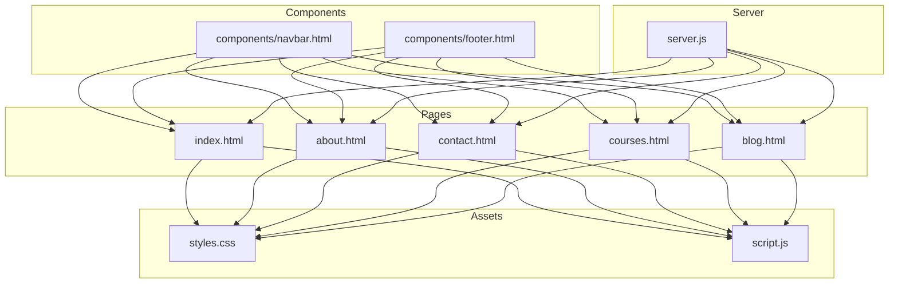
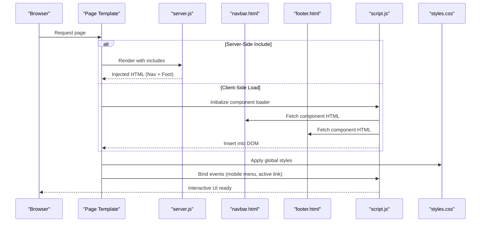
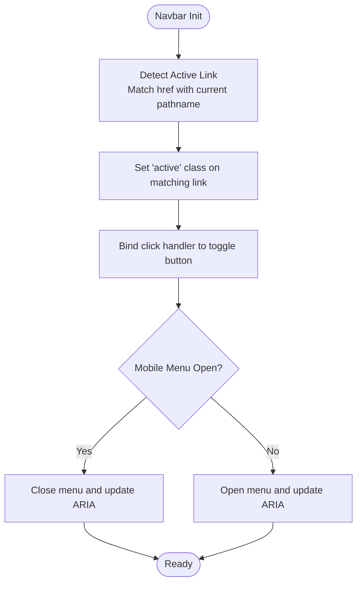
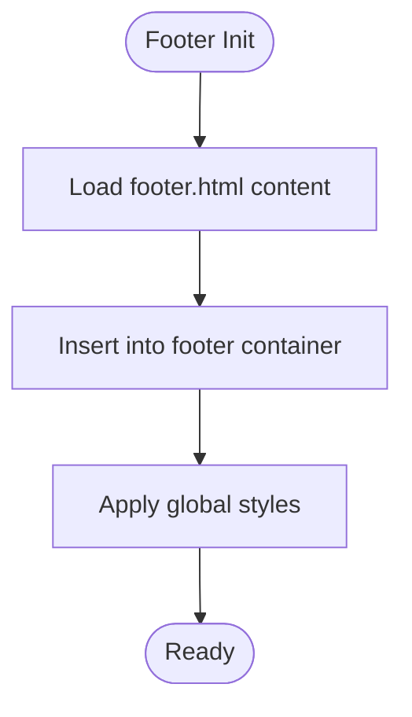
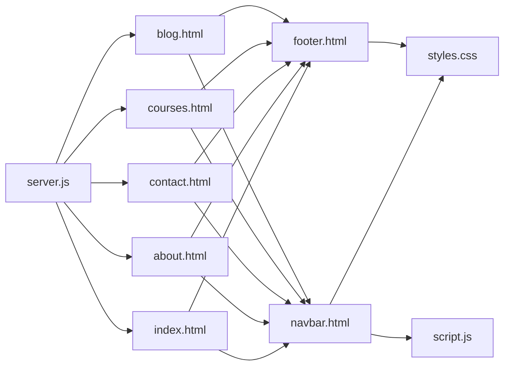

# Reusable Components

<cite>
**Referenced Files in This Document**
- [navbar.html](file://components/navbar.html)
- [footer.html](file://components/footer.html)
- [index.html](file://index.html)
- [about.html](file://about.html)
- [contact.html](file://contact.html)
- [courses.html](file://courses.html)
- [blog.html](file://blog.html)
- [script.js](file://script.js)
- [styles.css](file://styles.css)
- [server.js](file://server.js)
</cite>

## Table of Contents
1. [Introduction](#introduction)
2. [Project Structure](#project-structure)
3. [Core Components](#core-components)
4. [Architecture Overview](#architecture-overview)
5. [Detailed Component Analysis](#detailed-component-analysis)
6. [Dependency Analysis](#dependency-analysis)
7. [Performance Considerations](#performance-considerations)
8. [Troubleshooting Guide](#troubleshooting-guide)
9. [Conclusion](#conclusion)

## Introduction
This document explains the reusable component system focused on the navbar and footer components. It covers their HTML structure, CSS styling, JavaScript interactivity, and how they are included into main pages using server-side includes or client-side loading mechanisms. It also documents configuration options for customization, responsive behavior across screen sizes, and patterns for state management and event handling.

## Project Structure
The project organizes shared UI pieces under a dedicated components directory and references them from page templates. The root-level scripts and styles provide global behavior and appearance that components rely on.

**Diagram sources**
- [navbar.html](file://components/navbar.html)
- [footer.html](file://components/footer.html)
- [index.html](file://index.html)
- [about.html](file://about.html)
- [contact.html](file://contact.html)
- [courses.html](file://courses.html)
- [blog.html](file://blog.html)
- [styles.css](file://styles.css)
- [script.js](file://script.js)
- [server.js](file://server.js)

**Section sources**
- [navbar.html](file://components/navbar.html)
- [footer.html](file://components/footer.html)
- [index.html](file://index.html)
- [about.html](file://about.html)
- [contact.html](file://contact.html)
- [courses.html](file://courses.html)
- [blog.html](file://blog.html)
- [styles.css](file://styles.css)
- [script.js](file://script.js)
- [server.js](file://server.js)

## Core Components
This section summarizes the responsibilities and integration points of the two primary reusable components:

- Navbar
  - Provides top navigation with links to key sections/pages.
  - Includes mobile toggle behavior (hamburger menu).
  - Highlights the active link based on current URL.
  - Can be included via server-side include or client-side fetch.

- Footer
  - Displays site-wide information such as copyright, quick links, and contact details.
  - Maintains consistent branding and layout across all pages.
  - Can be included via server-side include or client-side fetch.

Integration patterns:
- Server-side includes: Pages request content through the server, which injects the component HTML before sending it to the browser.
- Client-side loading: Pages load component HTML at runtime using JavaScript and insert it into the DOM.

Configuration options:
- Active link detection can be configured by matching the current pathname against link hrefs.
- Mobile menu behavior can be toggled via data attributes or CSS classes.
- Footer content can be customized per site instance by editing the component file.

Responsive behavior:
- On small screens, the navbar collapses into a hamburger menu; on larger screens, it displays horizontally.
- Footer stacks its columns vertically on narrow viewports and arranges them in multiple columns on wider viewports.

State management and events:
- Navbar maintains an open/closed state for the mobile menu.
- Click handlers manage toggling the mobile menu and updating ARIA attributes for accessibility.
- Active link highlighting updates when the page loads or when navigation occurs.

**Section sources**
- [navbar.html](file://components/navbar.html)
- [footer.html](file://components/footer.html)
- [script.js](file://script.js)
- [styles.css](file://styles.css)

## Architecture Overview
The component architecture separates concerns between presentation (HTML/CSS), behavior (JavaScript), and delivery (server-side vs client-side). Pages remain thin and delegate common UI to reusable components.

**Diagram sources**
- [server.js](file://server.js)
- [navbar.html](file://components/navbar.html)
- [footer.html](file://components/footer.html)
- [script.js](file://script.js)
- [styles.css](file://styles.css)

## Detailed Component Analysis

### Navbar Component
Responsibilities:
- Renders navigation links.
- Handles mobile menu toggle.
- Highlights the active link based on the current URL.

HTML structure:
- Semantic nav element with a list of links.
- A button or control for toggling the mobile menu.
- A container for collapsible links on small screens.

CSS styling:
- Horizontal layout on large screens.
- Collapsible vertical layout on small screens.
- Focus states for keyboard accessibility.
- Transitions for smooth open/close animations.

JavaScript interactivity:
- Toggle handler for mobile menu open/close.
- Updates aria-expanded and related attributes for accessibility.
- Active link detection by comparing link hrefs with window.location.pathname.

Component inclusion patterns:
- Server-side include: The server renders the navbar into each page template before sending HTML to the browser.
- Client-side loading: The page requests navbar.html via fetch and inserts it into a designated container.

Configuration options:
- Data attributes to customize behavior (e.g., enabling/disabling active link detection).
- CSS custom properties for colors, spacing, and typography if needed.

Responsive behavior:
- Breakpoint-based switching between horizontal and collapsed layouts.
- Touch-friendly tap targets for mobile users.

Event handling patterns:
- Event delegation for dynamic link interactions.
- Keyboard support for opening/closing the menu.

**Diagram sources**
- [navbar.html](file://components/navbar.html)
- [script.js](file://script.js)
- [styles.css](file://styles.css)

**Section sources**
- [navbar.html](file://components/navbar.html)
- [script.js](file://script.js)
- [styles.css](file://styles.css)

### Footer Component
Responsibilities:
- Displays site-wide information such as copyright, quick links, and contact details.
- Ensures consistent branding and layout across all pages.

HTML structure:
- Semantic footer element with sections for links, contact info, and legal text.
- Organized lists and paragraphs for semantic clarity.

CSS styling:
- Multi-column layout on wide screens.
- Stacked layout on narrow screens.
- Consistent spacing and alignment.

JavaScript interactivity:
- Minimal; may handle external link behaviors or analytics hooks if required.

Component inclusion patterns:
- Server-side include: The server injects the footer into each page template.
- Client-side loading: The page fetches footer.html and appends it to the DOM.

Configuration options:
- Editable content within the component file for site-specific text and links.
- Optional data attributes to enable/disable specific sections.

Responsive behavior:
- Columns collapse into a single column on small screens.
- Links remain accessible and readable across devices.

**Diagram sources**
- [footer.html](file://components/footer.html)
- [styles.css](file://styles.css)

**Section sources**
- [footer.html](file://components/footer.html)
- [styles.css](file://styles.css)

### Integration Examples
How components are integrated into main pages:
- Server-side include:
  - Pages reference the server endpoint or template engine directive to render navbar and footer during server processing.
  - Example flow: index.html requests the page; server.js renders and includes components before responding.

- Client-side loading:
  - Pages include a script that fetches navbar.html and footer.html and inserts them into designated containers.
  - After insertion, the script binds event listeners for interactivity.

Concrete examples:
- index.html integrates both components via either server-side includes or client-side fetch.
- about.html, contact.html, courses.html, and blog.html follow the same pattern to ensure consistency.

**Section sources**
- [index.html](file://index.html)
- [about.html](file://about.html)
- [contact.html](file://contact.html)
- [courses.html](file://courses.html)
- [blog.html](file://blog.html)
- [server.js](file://server.js)
- [script.js](file://script.js)

## Dependency Analysis
The components depend on global styles and scripts. Pages depend on components for consistent UI. The server orchestrates server-side includes.

**Diagram sources**
- [navbar.html](file://components/navbar.html)
- [footer.html](file://components/footer.html)
- [index.html](file://index.html)
- [about.html](file://about.html)
- [contact.html](file://contact.html)
- [courses.html](file://courses.html)
- [blog.html](file://blog.html)
- [styles.css](file://styles.css)
- [script.js](file://script.js)
- [server.js](file://server.js)

**Section sources**
- [navbar.html](file://components/navbar.html)
- [footer.html](file://components/footer.html)
- [index.html](file://index.html)
- [about.html](file://about.html)
- [contact.html](file://contact.html)
- [courses.html](file://courses.html)
- [blog.html](file://blog.html)
- [styles.css](file://styles.css)
- [script.js](file://script.js)
- [server.js](file://server.js)

## Performance Considerations
- Prefer server-side includes for initial page load to reduce client-side network requests and improve Time to First Byte.
- If using client-side loading, cache fetched component HTML to avoid repeated network calls.
- Minimize reflows by inserting complete component HTML in one operation rather than incremental updates.
- Use CSS media queries efficiently to avoid heavy layout recalculations on resize.
- Debounce or throttle resize listeners if used for dynamic adjustments.

[No sources needed since this section provides general guidance]

## Troubleshooting Guide
Common issues and resolutions:
- Component not appearing:
  - Verify server-side include routes are correctly configured in the server.
  - Ensure client-side fetch paths point to the correct component files.
- Mobile menu not toggling:
  - Confirm event listeners are bound after component injection.
  - Check ARIA attributes are updated consistently.
- Active link not highlighted:
  - Validate that link hrefs match the current pathname exactly.
  - Ensure active link detection runs after the DOM is ready.
- Styles not applied:
  - Confirm global styles are loaded before component rendering.
  - Check for specificity conflicts in CSS.

**Section sources**
- [server.js](file://server.js)
- [script.js](file://script.js)
- [styles.css](file://styles.css)

## Conclusion
The reusable component system centralizes navigation and footer logic, ensuring consistent user experience across all pages. By supporting both server-side includes and client-side loading, the system balances performance and flexibility. Clear configuration options and robust event handling make the components easy to customize and maintain. Responsive design ensures usability across devices, while structured error handling and troubleshooting guidance aid developers in diagnosing issues quickly.