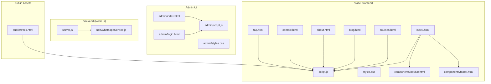
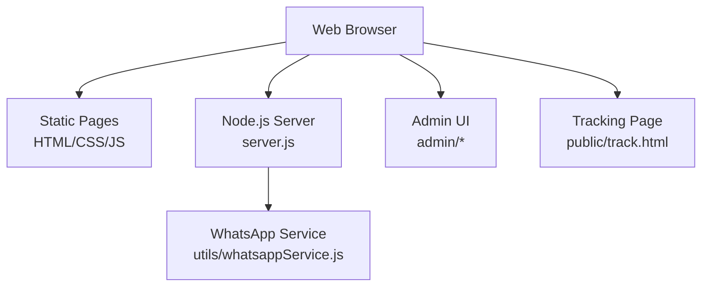
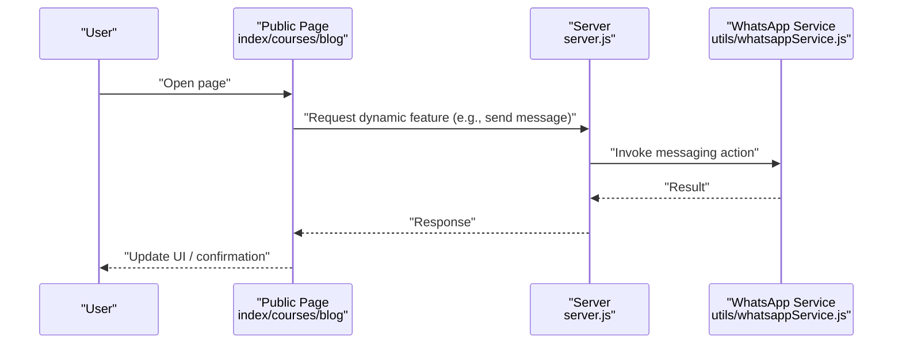
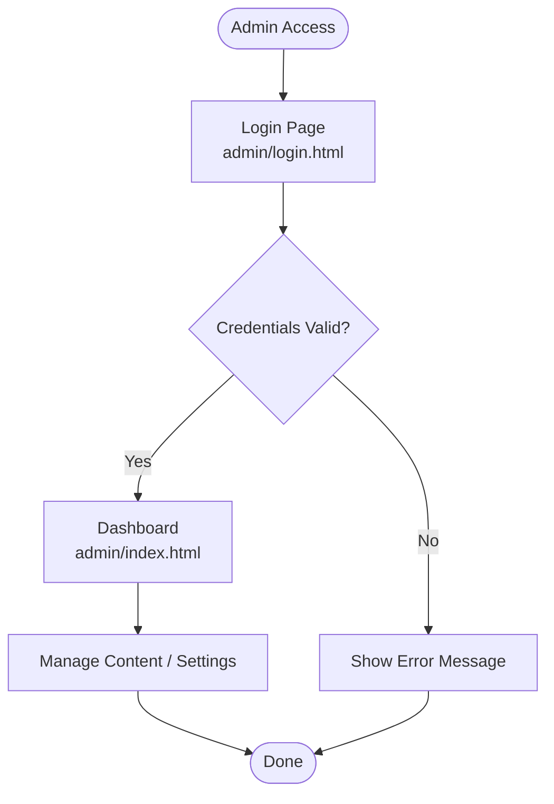
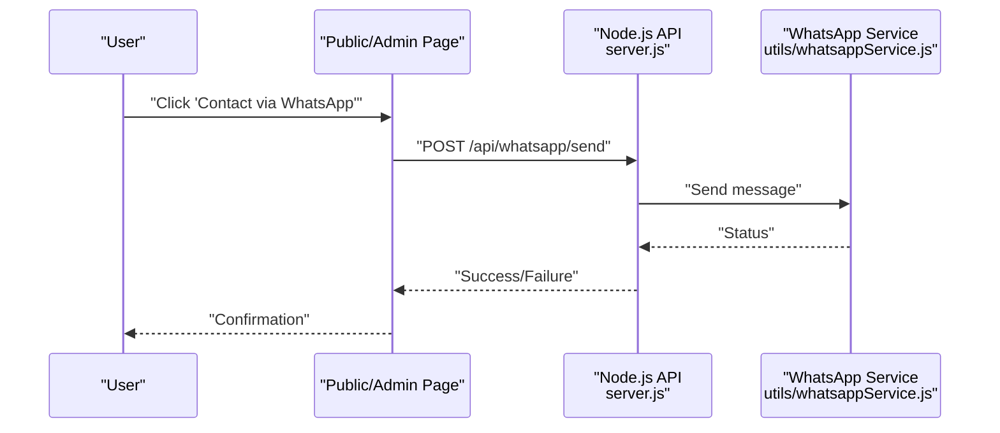
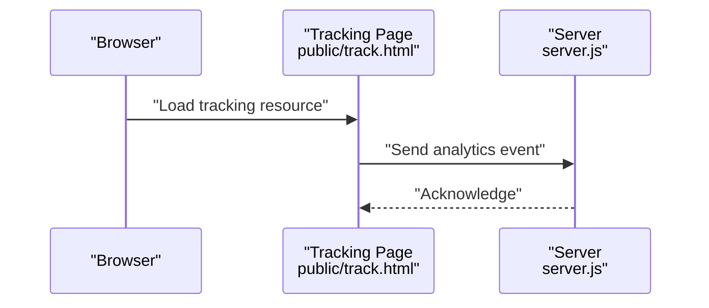
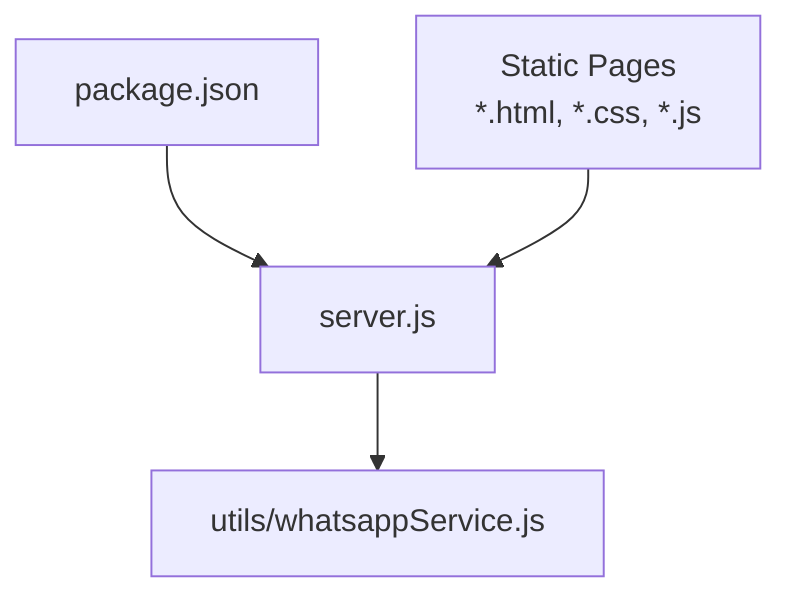

# Project Overview

<cite>
**Referenced Files in This Document**
- [README.md](file://README.md)
- [package.json](file://package.json)
- [server.js](file://server.js)
- [index.html](file://index.html)
- [courses.html](file://courses.html)
- [blog.html](file://blog.html)
- [about.html](file://about.html)
- [contact.html](file://contact.html)
- [faq.html](file://faq.html)
- [script.js](file://script.js)
- [styles.css](file://styles.css)
- [navbar.html](file://components/navbar.html)
- [footer.html](file://components/footer.html)
- [admin/index.html](file://admin/index.html)
- [admin/login.html](file://admin/login.html)
- [admin/script.js](file://admin/script.js)
- [admin/styles.css](file://admin/styles.css)
- [utils/whatsappService.js](file://utils/whatsappService.js)
- [public/track.html](file://public/track.html)
- [.htaccess](file://.htaccess)
- [.cpanel.yml](file://.cpanel.yml)
</cite>

## Table of Contents
1. [Introduction](#introduction)
2. [Project Structure](#project-structure)
3. [Core Components](#core-components)
4. [Architecture Overview](#architecture-overview)
5. [Detailed Component Analysis](#detailed-component-analysis)
6. [Dependency Analysis](#dependency-analysis)
7. [Performance Considerations](#performance-considerations)
8. [Troubleshooting Guide](#troubleshooting-guide)
9. [Conclusion](#conclusion)

## Introduction
GeniusMind Home Schooling is an educational platform designed to deliver structured home schooling resources to parents and students. It provides a modern, accessible experience for browsing courses, reading blog content, contacting the team, and managing learning materials through a dedicated administrative interface. The system combines a static HTML/CSS/JavaScript frontend with a lightweight Node.js backend service to serve dynamic features such as WhatsApp integration and tracking endpoints.

Key benefits for home education:
- Centralized course catalog and resources
- Blog platform for updates and learning tips
- Direct communication via WhatsApp
- Administrative tools for content management
- Fast, SEO-friendly static pages with optional server-side enhancements

Target audience:
- Parents seeking structured home schooling materials
- Students engaging with curated lessons and resources
- Administrators managing content and user interactions

## Project Structure
The repository follows a clear separation between static assets, reusable components, admin UI, utilities, and the Node.js server entry point. Static pages are served directly by the web server or Node.js, while dynamic behavior is implemented in client scripts and the backend.

**Diagram sources**
- [index.html:1-200](file://index.html#L1-L200)
- [courses.html:1-200](file://courses.html#L1-L200)
- [blog.html:1-200](file://blog.html#L1-L200)
- [about.html:1-200](file://about.html#L1-L200)
- [contact.html:1-200](file://contact.html#L1-L200)
- [faq.html:1-200](file://faq.html#L1-L200)
- [script.js:1-200](file://script.js#L1-L200)
- [styles.css:1-200](file://styles.css#L1-L200)
- [navbar.html:1-200](file://components/navbar.html#L1-L200)
- [footer.html:1-200](file://components/footer.html#L1-L200)
- [admin/index.html:1-200](file://admin/index.html#L1-L200)
- [admin/login.html:1-200](file://admin/login.html#L1-L200)
- [admin/script.js:1-200](file://admin/script.js#L1-L200)
- [admin/styles.css:1-200](file://admin/styles.css#L1-L200)
- [server.js:1-200](file://server.js#L1-L200)
- [utils/whatsappService.js:1-200](file://utils/whatsappService.js#L1-L200)
- [public/track.html:1-200](file://public/track.html#L1-L200)

**Section sources**
- [README.md:1-200](file://README.md#L1-L200)
- [package.json:1-200](file://package.json#L1-L200)
- [server.js:1-200](file://server.js#L1-L200)
- [index.html:1-200](file://index.html#L1-L200)
- [courses.html:1-200](file://courses.html#L1-L200)
- [blog.html:1-200](file://blog.html#L1-L200)
- [about.html:1-200](file://about.html#L1-L200)
- [contact.html:1-200](file://contact.html#L1-L200)
- [faq.html:1-200](file://faq.html#L1-L200)
- [script.js:1-200](file://script.js#L1-L200)
- [styles.css:1-200](file://styles.css#L1-L200)
- [navbar.html:1-200](file://components/navbar.html#L1-L200)
- [footer.html:1-200](file://components/footer.html#L1-L200)
- [admin/index.html:1-200](file://admin/index.html#L1-L200)
- [admin/login.html:1-200](file://admin/login.html#L1-L200)
- [admin/script.js:1-200](file://admin/script.js#L1-L200)
- [admin/styles.css:1-200](file://admin/styles.css#L1-L200)
- [utils/whatsappService.js:1-200](file://utils/whatsappService.js#L1-L200)
- [public/track.html:1-200](file://public/track.html#L1-L200)

## Core Components
- Public Pages: index, courses, blog, about, contact, faq provide navigation, content display, and interactive behaviors via shared scripts and styles.
- Reusable Components: navbar and footer are included across pages to maintain consistent layout and navigation.
- Admin Interface: login and dashboard pages enable administrators to manage content and settings.
- Backend Service: Node.js server exposes routes and integrates with WhatsApp messaging utility.
- Utilities: WhatsApp service encapsulates messaging logic used by the backend.
- Tracking Page: public tracking endpoint supports analytics or engagement metrics.

High-level technology stack:
- Frontend: HTML, CSS, JavaScript
- Backend: Node.js
- Deployment helpers: .htaccess for Apache configuration, .cpanel.yml for cPanel deployment automation

**Section sources**
- [index.html:1-200](file://index.html#L1-L200)
- [courses.html:1-200](file://courses.html#L1-L200)
- [blog.html:1-200](file://blog.html#L1-L200)
- [about.html:1-200](file://about.html#L1-L200)
- [contact.html:1-200](file://contact.html#L1-L200)
- [faq.html:1-200](file://faq.html#L1-L200)
- [navbar.html:1-200](file://components/navbar.html#L1-L200)
- [footer.html:1-200](file://components/footer.html#L1-L200)
- [admin/index.html:1-200](file://admin/index.html#L1-L200)
- [admin/login.html:1-200](file://admin/login.html#L1-L200)
- [admin/script.js:1-200](file://admin/script.js#L1-L200)
- [admin/styles.css:1-200](file://admin/styles.css#L1-L200)
- [server.js:1-200](file://server.js#L1-L200)
- [utils/whatsappService.js:1-200](file://utils/whatsappService.js#L1-L200)
- [public/track.html:1-200](file://public/track.html#L1-L200)
- [.htaccess:1-200](file://.htaccess#L1-L200)
- [.cpanel.yml:1-200](file://.cpanel.yml#L1-L200)

## Architecture Overview
The platform uses a hybrid architecture:
- Static pages are served directly by the web server or Node.js for fast load times and SEO benefits.
- Dynamic functionality (WhatsApp integration, tracking) is handled by the Node.js backend.
- Client-side scripts enhance interactivity without requiring full page reloads.

**Diagram sources**
- [server.js:1-200](file://server.js#L1-L200)
- [utils/whatsappService.js:1-200](file://utils/whatsappService.js#L1-L200)
- [index.html:1-200](file://index.html#L1-L200)
- [courses.html:1-200](file://courses.html#L1-L200)
- [blog.html:1-200](file://blog.html#L1-L200)
- [admin/index.html:1-200](file://admin/index.html#L1-L200)
- [admin/login.html:1-200](file://admin/login.html#L1-L200)
- [public/track.html:1-200](file://public/track.html#L1-L200)

## Detailed Component Analysis

### Public Pages and Shared Scripts
- Purpose: Deliver course listings, blog posts, informational pages, and contact forms.
- Behavior: Shared script.js handles common interactions; styles.css defines responsive design; navbar.html and footer.html ensure consistent navigation and branding.
- Integration: Optional calls to backend endpoints for dynamic features like WhatsApp messaging or tracking.

**Diagram sources**
- [index.html:1-200](file://index.html#L1-L200)
- [courses.html:1-200](file://courses.html#L1-L200)
- [blog.html:1-200](file://blog.html#L1-L200)
- [script.js:1-200](file://script.js#L1-L200)
- [server.js:1-200](file://server.js#L1-L200)
- [utils/whatsappService.js:1-200](file://utils/whatsappService.js#L1-L200)

**Section sources**
- [index.html:1-200](file://index.html#L1-L200)
- [courses.html:1-200](file://courses.html#L1-L200)
- [blog.html:1-200](file://blog.html#L1-L200)
- [about.html:1-200](file://about.html#L1-L200)
- [contact.html:1-200](file://contact.html#L1-L200)
- [faq.html:1-200](file://faq.html#L1-L200)
- [script.js:1-200](file://script.js#L1-L200)
- [styles.css:1-200](file://styles.css#L1-L200)
- [navbar.html:1-200](file://components/navbar.html#L1-L200)
- [footer.html:1-200](file://components/footer.html#L1-L200)

### Admin Interface
- Purpose: Provide administrators with a secure area to manage content and settings.
- Features: Login flow, dashboard access, and management actions driven by admin/script.js and styled by admin/styles.css.
- Security considerations: Ensure authentication checks on both frontend and backend before exposing sensitive operations.

**Diagram sources**
- [admin/login.html:1-200](file://admin/login.html#L1-L200)
- [admin/index.html:1-200](file://admin/index.html#L1-L200)
- [admin/script.js:1-200](file://admin/script.js#L1-L200)
- [admin/styles.css:1-200](file://admin/styles.css#L1-L200)

**Section sources**
- [admin/index.html:1-200](file://admin/index.html#L1-L200)
- [admin/login.html:1-200](file://admin/login.html#L1-L200)
- [admin/script.js:1-200](file://admin/script.js#L1-L200)
- [admin/styles.css:1-200](file://admin/styles.css#L1-L200)

### WhatsApp Integration
- Purpose: Enable direct communication with users via WhatsApp from the platform.
- Implementation: Backend routes call utils/whatsappService.js to perform messaging actions; frontend triggers requests from public pages or admin flows.

**Diagram sources**
- [server.js:1-200](file://server.js#L1-L200)
- [utils/whatsappService.js:1-200](file://utils/whatsappService.js#L1-L200)
- [index.html:1-200](file://index.html#L1-L200)
- [contact.html:1-200](file://contact.html#L1-L200)

**Section sources**
- [server.js:1-200](file://server.js#L1-L200)
- [utils/whatsappService.js:1-200](file://utils/whatsappService.js#L1-L200)
- [index.html:1-200](file://index.html#L1-L200)
- [contact.html:1-200](file://contact.html#L1-L200)

### Tracking and Analytics
- Purpose: Capture engagement signals and basic usage data via a dedicated tracking page.
- Usage: Public pages may invoke tracking endpoints to log visits or interactions.

**Diagram sources**
- [public/track.html:1-200](file://public/track.html#L1-L200)
- [server.js:1-200](file://server.js#L1-L200)

**Section sources**
- [public/track.html:1-200](file://public/track.html#L1-L200)
- [server.js:1-200](file://server.js#L1-L200)

## Dependency Analysis
The project’s runtime dependencies are declared in package.json. The Node.js server imports core modules and application utilities to handle routing and WhatsApp integration. Static assets do not require Node dependencies but rely on browser APIs.

**Diagram sources**
- [package.json:1-200](file://package.json#L1-L200)
- [server.js:1-200](file://server.js#L1-L200)
- [utils/whatsappService.js:1-200](file://utils/whatsappService.js#L1-L200)

**Section sources**
- [package.json:1-200](file://package.json#L1-L200)
- [server.js:1-200](file://server.js#L1-L200)

## Performance Considerations
- Serve static assets directly where possible to reduce server load and improve latency.
- Minimize client-side script execution time; defer non-critical JS and leverage caching headers.
- Use efficient selectors and avoid heavy DOM manipulation in shared scripts.
- Keep images optimized and use appropriate formats/sizes for mobile devices.
- Implement HTTP caching strategies via server configuration (.htaccess) for static files.

[No sources needed since this section provides general guidance]

## Troubleshooting Guide
Common issues and resolutions:
- WhatsApp messages failing: Verify backend route availability and WhatsApp service credentials; check server logs for errors.
- Admin login failures: Confirm authentication logic and session handling; ensure secure storage of credentials and HTTPS enforcement.
- Static assets not loading: Validate paths and .htaccess rewrite rules; confirm file permissions and MIME types.
- Tracking events not recorded: Inspect network requests from the browser console; verify server endpoint responses.

Operational references:
- Server entry point and routes: [server.js](file://server.js)
- WhatsApp utility functions: [utils/whatsappService.js](file://utils/whatsappService.js)
- Admin login and dashboard: [admin/login.html](file://admin/login.html), [admin/index.html](file://admin/index.html)
- Apache configuration hints: [.htaccess](file://.htaccess)
- cPanel deployment config: [.cpanel.yml](file://.cpanel.yml)

**Section sources**
- [server.js:1-200](file://server.js#L1-L200)
- [utils/whatsappService.js:1-200](file://utils/whatsappService.js#L1-L200)
- [admin/login.html:1-200](file://admin/login.html#L1-L200)
- [admin/index.html:1-200](file://admin/index.html#L1-L200)
- [.htaccess:1-200](file://.htaccess#L1-L200)
- [.cpanel.yml:1-200](file://.cpanel.yml#L1-L200)

## Conclusion
GeniusMind Home Schooling delivers a streamlined, parent- and student-friendly platform for home education. Its hybrid architecture balances performance and flexibility: static pages for speed and SEO, plus a Node.js backend for dynamic features like WhatsApp integration and tracking. With a clear structure, reusable components, and an administrative interface, the platform scales well for growing educational content and user needs.

[No sources needed since this section summarizes without analyzing specific files]